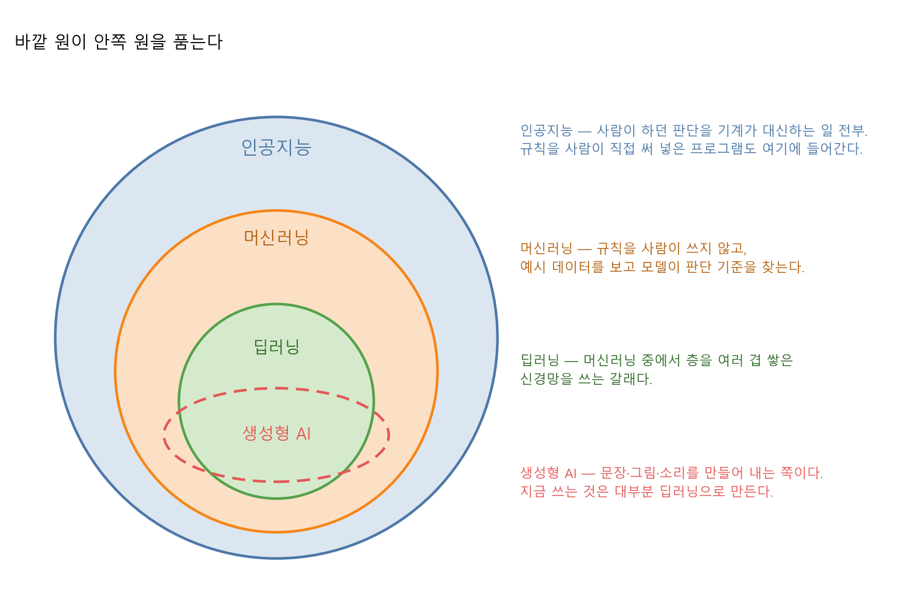
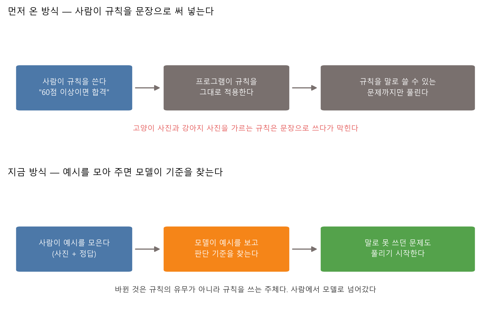
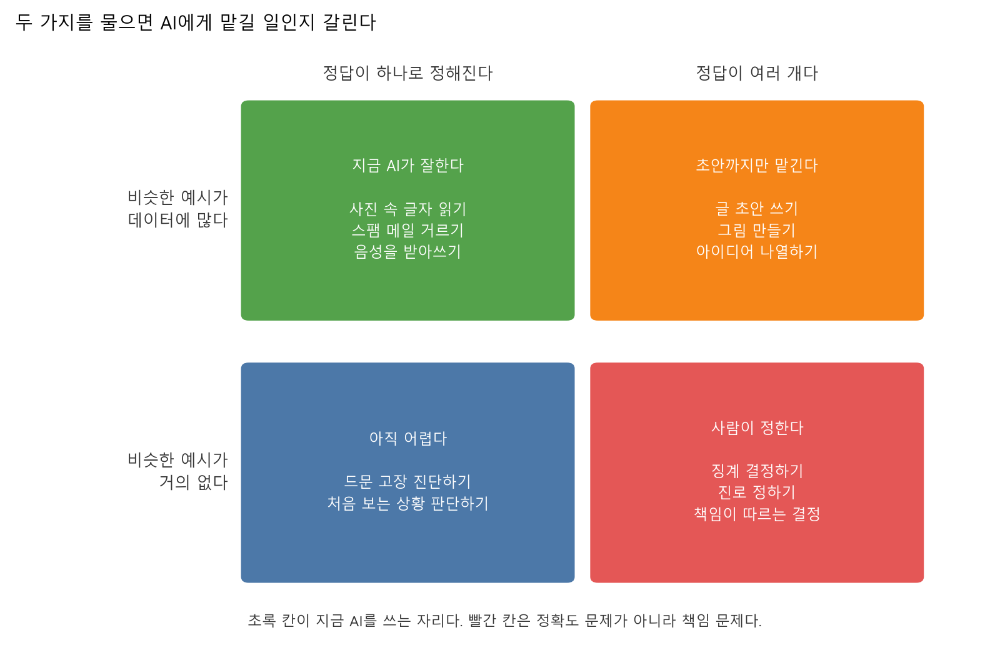

# 제1장 AI와 딥러닝은 무엇인가 — 이미 쓰고 있는 도구에 이름 붙이기

---

## [전반부] 이론 강의
---

### 학습 목표

- 인공지능·머신러닝·딥러닝·생성형 AI의 포함 관계를 그림으로 그려 설명한다
- 규칙을 사람이 쓰는 방식과 모델이 데이터에서 찾는 방식의 차이를 자기 말로 말한다
- 어떤 일을 AI에게 맡길지 두 가지 기준으로 따진다
- 이미지 분류기를 직접 만들고, 그 모델이 틀리는 조건을 찾아낸다
- 대화형 AI의 답에서 그대로 써도 되는 부분과 확인이 필요한 부분을 갈라낸다

이 수업을 듣는 학생 대부분은 이미 AI를 쓴다. 그래서 첫 시간의 목적은 AI를 소개하는 데 있지 않다. 이미 쓰고 있는 도구가 어떤 종류의 물건인지 이름을 정확히 붙이는 데 있다. 이름이 정확해야 "이건 AI가 잘하는 일인가"를 따질 수 있다.

오늘은 수식도 코드도 쓰지 않는다. 노트북에 파이썬이 아직 없어도 된다. 개발환경은 다음 주에 만든다.

---

### 1. 인공지능이라는 말이 가리키는 범위

인공지능, 머신러닝, 딥러닝, 생성형 AI. 네 낱말이 뉴스에서 자주 섞여 나온다. 넷은 나란한 관계가 아니다. 하나가 다른 하나를 품는다.



**그림 1.1** 바깥 원이 안쪽 원을 품는다. 딥러닝은 머신러닝의 한 갈래이고, 머신러닝은 인공지능의 한 갈래다

#### 1-1. 규칙을 써 넣은 프로그램도 인공지능이다

가장 자주 하는 오해부터 정리한다. **인공지능이 곧 딥러닝은 아니다.**

사람이 조건문을 직접 써 넣은 프로그램도 인공지능에 들어간다.

```python
if score >= 60:
    result = "합격"
else:
    result = "불합격"
```

이 코드는 사람이 하던 판정을 기계가 대신한다. 학습도, 데이터도, 신경망도 없다. 그래도 인공지능이라고 부르던 시절이 있었고, 지금도 그 자리에 있다. 세금 계산, 엘리베이터 배차, 신호등 제어처럼 기준이 분명한 일은 지금도 이 방식이 더 낫다.

○ **이 방식이 강한 이유**

  - 기준이 한 줄로 적혀 있다. 왜 그렇게 판정했는지 그대로 읽어 주면 된다
  - 데이터가 한 건도 없어도 돌아간다
  - 같은 입력에는 항상 같은 답이 나온다

○ **이 방식이 막히는 지점**

  - 기준을 문장으로 쓸 수 없을 때 막힌다
  - 고양이 사진과 강아지 사진을 가르는 규칙을 써 보면 금방 안다. 귀가 뾰족하면 고양이라고 쓰면 뾰족한 귀의 강아지에서 틀린다

**표 1.1** 네 낱말의 관계

| 낱말 | 무엇을 가리키는가 | 예 |
|---|---|---|
| 인공지능 | 사람이 하던 판단을 기계가 대신하는 일 전부 | 규칙을 써 넣은 판정 프로그램, 아래 셋 전부 |
| 머신러닝 | 규칙을 사람이 쓰지 않고, 예시 데이터에서 모델이 찾는 방식 | 스팸 분류기, 추천 목록 |
| 딥러닝 | 머신러닝 중에서 층을 여러 겹 쌓은 신경망을 쓰는 갈래 | 이미지 분류, 음성 인식 |
| 생성형 AI | 문장·그림·소리를 만들어 내는 쪽. 지금 쓰는 것은 대부분 딥러닝으로 만든다 | ChatGPT, Claude, Gemini, 이미지 생성 도구 |

---

### 2. 머신러닝 — 규칙을 쓰지 않고 예시로 가르친다

머신러닝은 순서를 바꾼다. 사람은 규칙 대신 **예시**를 준다. 예시에는 입력과 정답이 함께 들어 있다. 모델은 그 둘의 관계를 보고 판단 기준을 스스로 만든다.



**그림 1.2** 두 방식의 차이. 규칙이 사라진 것이 아니라, 규칙을 쓰는 주체가 사람에서 모델로 바뀐다

여기서 오해를 하나 더 정리한다. 머신러닝은 규칙 없이 판단하는 방법이 아니다. 모델도 결국 어떤 기준을 만든다. 다만 그 기준을 사람이 문장으로 쓰지 않고, 데이터를 보며 찾을 뿐이다. 4장에서는 모델이 찾은 기준을 숫자로 꺼내 본다.

오늘 실습 1.1이 이 절의 확인 절차다. 학생은 규칙을 한 줄도 쓰지 않는다. 사진 몇 장을 클래스별로 모아 주기만 한다. 그러고 나면 분류기가 만들어진다.

○ **예시로 가르칠 때 사람이 하는 일**

  - 무엇과 무엇을 가를지 정한다. 이것이 클래스다
  - 각 클래스의 예시를 모은다. 예시가 한쪽으로 치우치면 모델도 치우친다
  - 만들어진 모델을 시험한다. 처음 보는 입력에서도 맞히는지 본다

○ **자주 하는 실수**

  - 예시를 한 조건에서만 모은다. 밝은 책상 위에서만 찍고 어두운 곳에서 시험하면 틀린다
  - 클래스별 예시 수가 크게 다르다. 많은 쪽으로 답이 쏠린다
  - 학습에 쓴 사진으로 성능을 잰다. 답을 보고 시험을 치는 것과 같다

○ **체크 질문**

  - 학교 장학금 선발을 규칙 기반으로 짜면 어디까지 되고, 어디서 막히는가
  - 반대로 머신러닝으로 짜면 무엇이 위험한가

---

### 3. 딥러닝은 머신러닝의 어디에 있는가

딥러닝은 머신러닝 안의 한 갈래다. 층을 여러 겹 쌓은 신경망을 쓴다. "깊다(deep)"는 말이 층이 여럿이라는 뜻이다.

층이 여럿이면 무엇이 달라지는가. 사람이 **무엇을 볼지 골라 주지 않아도 된다**는 점이 달라진다.

○ **딥러닝 이전의 방식**

  - 사람이 먼저 "무엇을 볼지"를 정해 숫자로 만들었다. 이것을 특징이라고 부른다
  - 사진에서 고양이를 찾으려면 사람이 귀 각도, 수염 개수, 색 분포 같은 것을 직접 계산해 넣었다
  - 이 작업이 성능을 좌우했고, 분야마다 다시 해야 했다

○ **딥러닝의 방식**

  - 픽셀값을 그대로 넣는다. 어떤 특징을 볼지도 층이 스스로 만든다
  - 앞쪽 층은 선과 모서리 같은 단순한 것을, 뒤쪽 층은 그것을 조합한 모양을 다룬다
  - 대신 예시가 많이 필요하고, 왜 그렇게 판단했는지 꺼내 보기가 어렵다

○ **여기서 붙는 조건**

  - 딥러닝이 언제나 낫지는 않다. 표로 된 데이터에서는 더 단순한 방법이 나을 때가 있다
  - 예시가 적으면 딥러닝은 힘을 못 쓴다. 4장에서 쓰는 방법이 오히려 안전하다

9장에서 이미지 분류기를 직접 돌린다. 그때 층이 무엇을 하는지 그림으로 확인한다.

---

### 4. 생성형 AI는 무엇이 다른가

지금까지 말한 모델은 대부분 **고르는** 일을 했다. 스팸인가 아닌가, 고양이인가 강아지인가. 답의 후보가 정해져 있고 그중 하나를 고른다.

생성형 AI는 **만드는** 일을 한다. 후보 목록이 없다. 문장을 처음부터 한 조각씩 만들어 낸다.

○ **어떻게 만드는가**

  - 언어모델은 앞에 나온 말을 보고, 다음에 올 말의 확률을 매긴다[^google-llm]
  - Google의 교육 자료는 "When I hear rain on my roof, I ______" 라는 문장을 놓고, 빈칸에 들어갈 말마다 확률이 다르게 매겨지는 표를 보여준다[^google-llm]
  - 이 과정을 한 조각씩 반복하면 문장이 된다

○ **여기서 나오는 성질**

  - 같은 질문에도 답이 매번 조금씩 달라진다. 확률에서 골라 쓰기 때문이다
  - 그럴듯한 말과 사실인 말을 구분하지 않는다. 확률이 높은 쪽을 이어 붙일 뿐이다
  - 그래서 없는 논문 제목, 없는 통계, 없는 인물이 매끄러운 문장으로 나온다. 이것을 환각이라고 부른다

Google의 머신러닝 교육 자료는 머신러닝 시스템을 네 가지로 나누는데, 생성형 AI도 그중 하나로 넣는다. 나머지 셋은 지도학습, 비지도학습, 강화학습이다[^google-ml]. 생성형 AI가 머신러닝 바깥의 다른 무엇이 아니라는 뜻이다.

오늘 실습 1.2가 이 절의 확인 절차다. 같은 질문을 두 가지 방식으로 물어 답이 어떻게 달라지는지 본다. 환각을 본격적으로 다루는 것은 11장이다.

---

### 5. 지금 AI가 잘하는 일과 못하는 일

"AI가 어디까지 할 수 있느냐"는 질문에는 한 줄로 답할 수 없다. 대신 두 가지를 물으면 대부분 갈린다.

○ **첫째, 비슷한 예시가 데이터에 많이 있는가**

  - 모델은 본 것을 바탕으로 판단한다. 비슷한 예시가 많으면 잘 맞힌다
  - 처음 보는 종류의 상황에서는 근거가 없다

○ **둘째, 정답이 하나로 정해지는가**

  - 사진 속 글자를 읽는 일은 정답이 하나다. 맞았는지 틀렸는지 채점할 수 있다
  - 좋은 글을 쓰는 일은 정답이 여러 개다. 무엇이 맞는지 채점할 기준이 없다



**그림 1.3** 두 질문으로 나눈 네 칸. 왼쪽 위가 지금 AI를 쓰는 자리다

**표 1.2** 네 칸을 어떻게 읽는가

| 칸 | 조건 | 어떻게 쓰는가 |
|---|---|---|
| 지금 AI가 잘한다 | 예시가 많고 정답이 하나 | 그대로 맡긴다. 사람은 표본만 점검한다 |
| 초안까지만 맡긴다 | 예시는 많은데 정답이 여러 개 | AI가 초안을 내고 사람이 고른다 |
| 아직 어렵다 | 예시가 적고 정답은 하나 | 예시를 더 모으거나, 규칙 기반으로 되돌린다 |
| 사람이 정한다 | 예시가 적고 정답도 여러 개 | AI에게 맡기지 않는다 |

오른쪽 아래 칸에는 조건이 하나 더 붙는다. 이 칸의 문제는 모델 성능이 좋아진다고 옮겨 가지 않는다. 징계 결정, 채용 탈락, 진로 상담 같은 일에는 **결과를 책임질 사람**이 필요하다. 정확도가 아무리 올라도 책임은 모델에게 넘어가지 않는다.

○ **자주 하는 오해**

  - "AI가 사람보다 정확하다"는 말은 어떤 시험에서 그랬다는 뜻이다. 그 시험이 내 문제와 같은지 먼저 본다
  - "AI가 못한다"는 말도 마찬가지다. 못하는 조건이 무엇인지 확인하지 않으면 반대 방향으로 똑같이 틀린다

○ **체크 질문**

  - 내 전공에서 하는 일 하나를 골라 네 칸 중 어디에 들어가는지 정해 본다
  - 그 판단이 바뀌려면 무엇이 달라져야 하는가

---

### 6. 이 수업에서 무엇을 배우는가

앞으로 15주 동안 하는 일은 다섯 구간으로 나뉜다.

**표 1.3** 학기 흐름

| 구간 | 주차 | 하는 일 |
|---|---|---|
| 진입 | 1–2주 | AI 지도 그리기, 개발환경과 AI 코딩 도구 세팅 |
| 기초 | 3–7주 | 데이터, 머신러닝, 신경망, 학습, 과적합 |
| 중간 | 8주 | 미니 프로젝트로 처음부터 끝까지 한 바퀴 |
| 응용 | 9–13주 | 이미지, 텍스트, 생성형 AI, 코딩 에이전트, 데모 앱 |
| 완성 | 14–15주 | 기말 프로젝트 제작과 발표 |

앞으로 직접 만들 것을 한 줄씩 미리 적어 둔다.

○ **4장** — 점이 흩어진 그림에 내가 선을 하나 긋고, 모델이 찾은 선과 정확도를 겨룬다. 모델이 찾은 선을 식으로 꺼내 본다

○ **5장** — 선 하나로는 나눌 수 없는 데이터를 만난다. 은닉층을 넣으면 풀리는 것을 눈으로 확인한다

○ **9장** — 작은 이미지 분류기를 돌리고, 틀린 이미지를 모아 왜 틀렸는지 본다

오늘 실습 1.1에서 만드는 분류기는 이 셋의 축소판이다. 오늘은 브라우저가 대신 해 주는 부분을, 앞으로는 한 겹씩 벗겨서 직접 만든다.

○ **이 수업이 요구하는 것**

  - 매주 실습을 실행한다. 결과 파일을 LMS에 올린다
  - AI 코딩 도구를 쓴다. 다만 실행해 보지 않은 코드를 제출하지 않는다
  - 수치를 인용할 때 출처를 적는다

---

### 7. 직접 움직여 보는 웹 자료

수업에서 다 보여줄 수 없는 것은 아래 자료로 보충한다. 모두 무료이고, 아래 설명은 각 페이지를 열어 확인한 내용이다.

| 자료 | 무엇을 볼 수 있는가 | 주소 |
|---|---|---|
| Google Teachable Machine | 모으기·학습시키기·내보내기 세 단계로 모델을 만든다. 이미지·사운드·자세 세 종류를 고를 수 있다. 화면이 한국어로 나온다 | https://teachablemachine.withgoogle.com/ |
| Quick, Draw! | 제시어를 낙서로 그리면 모델이 무엇인지 맞힌다. 모델이 못 맞히는 그림을 찾아보는 데 쓴다 | https://quickdraw.withgoogle.com/ |
| Google 머신러닝 단기집중과정(한국어), 머신러닝이란 | 머신러닝 시스템을 지도학습·비지도학습·강화학습·생성형 AI 네 가지로 나눠 설명한다 | https://developers.google.com/machine-learning/intro-to-ml/what-is-ml?hl=ko |
| Google 머신러닝 리소스(한국어), 대규모 언어 모델 소개 | 언어모델이 다음에 올 말의 확률을 매기는 과정을 예문 하나로 보여준다 | https://developers.google.com/machine-learning/resources/intro-llms?hl=ko |

○ Teachable Machine은 오늘 실습 1.1에서 그대로 쓴다. 홈페이지에는 "전문지식이나 코딩 능력이 필요하지 않습니다"라고 적혀 있다[^tm-home]

○ Quick, Draw!는 수업이 끝난 뒤 혼자 해 보기 좋다. 모델이 못 맞히는 그림을 찾으면, 그림 1.3의 왼쪽 아래 칸이 무슨 뜻인지 손으로 알게 된다

---

## [후반부] 실습
---

두 가지를 한다. 첫 번째는 코드 없이 이미지 분류기를 만들어 보는 실습이고, 두 번째는 같은 질문을 두 방식으로 물어 대화형 AI의 답을 비교하는 실습이다. 둘 다 브라우저에서만 한다.

#### 실행 환경

이번 주는 설치가 없다. 다음 두 가지만 있으면 된다.

- 데스크톱 브라우저. Teachable Machine은 지원하지 않는 브라우저에서 열면 "visit this site on desktop in Chrome or Safari"라고 안내한다
- 웹캠이 달린 노트북. 웹캠이 없으면 사진 파일을 올려도 된다

파이썬, VS Code, GitHub는 다음 주에 깐다. 오늘은 아무것도 설치하지 않는다.

○ **개인정보 주의**

  - 얼굴을 찍기 싫으면 손이나 물건을 찍는다. 실습 목적은 얼굴 인식이 아니다
  - 대화형 AI에게 이름·학번·연락처를 적어 넣지 않는다

---

### 실습 1.1: 코드 없이 이미지 분류기 만들기

#### 실습 목표

- 규칙을 한 줄도 쓰지 않고 분류기를 만든다
- 예시를 모으는 일이 곧 가르치는 일이라는 것을 손으로 확인한다
- 만들어진 모델이 **틀리는 조건**을 스스로 찾아낸다

#### 준비물

브라우저와 웹캠. 로그인하지 않는다. 설치하지 않는다.

찍을 대상 두세 가지를 먼저 정한다. 서로 눈에 띄게 달라야 한다.

- 물건: 펜 / 지우개 / 텀블러
- 손 모양: 주먹 / 보 / 브이
- 자세: 정면 / 고개를 왼쪽으로 / 고개를 오른쪽으로

#### 하는 순서

1. `https://teachablemachine.withgoogle.com/` 에 접속한다. **시작하기**를 누른다
2. **새 프로젝트** 화면에서 **이미지 프로젝트**를 고른다. 옆에 오디오 프로젝트와 포즈 프로젝트도 있지만 오늘은 이미지만 쓴다
3. 화면 왼쪽에 `Class 1`, `Class 2` 두 칸이 이미 놓여 있다. 클래스 이름 옆 연필 표시를 눌러 이름을 자기 것으로 바꾼다(예: `펜`, `지우개`)
4. `Class 1` 칸의 **웹캠** 단추를 누른다. 브라우저가 카메라 사용을 물으면 허용한다
5. **길게 눌러서 녹화하기** 단추를 누른 채로 대상을 카메라에 비춘다. 각도와 위치를 조금씩 바꿔 가며 몇 초 찍는다
6. `Class 2`에도 같은 방식으로 다른 대상을 찍는다. 클래스를 더 만들려면 아래 **클래스 추가**를 누른다
7. 가운데 **학습** 칸의 **모델 학습시키기**를 누른다. 학습이 끝날 때까지 탭을 닫지 않는다
8. 오른쪽 **미리보기** 칸이 켜진다. 카메라에 대상을 다시 비춰 어느 클래스로 판단하는지 확인한다

○ 학습을 누르기 전에 미리보기 칸을 보면 "여기에서 모델을 미리 확인하려면 먼저 왼쪽에서 모델을 학습시켜야 합니다"라고 적혀 있다. 순서가 강제된다

○ 가운데 **고급**을 펼치면 에포크, 배치 크기, 학습률 세 값이 보인다. 기본값은 각각 50, 16, 0.001이다. 오늘은 건드리지 않는다. 이 세 값이 무엇인지는 6장에서 다룬다

#### 데이터가 어디로 가는가

Teachable Machine FAQ는 이렇게 답한다. 프로젝트를 Google Drive에 저장하지 않는 한 샘플은 어떤 서버로도 전송되지 않고, 학습은 브라우저 탭 안에서 진행된다[^tm-faq]. 탭을 닫으면서 저장을 하지 않으면 브라우저에도 서버에도 아무것도 남지 않는다[^tm-faq].

즉 오늘 찍은 사진은 내 노트북을 벗어나지 않는다. 다만 **화면 캡처는 LMS에 올라간다**. 캡처 화면에 남에게 보이면 곤란한 것이 들어가지 않도록 한 번 확인한다.

#### 화면에서 확인할 것

○ **두 클래스의 예시 수가 비슷한가** — 한쪽만 오래 찍으면 사진 수가 크게 벌어진다. 많은 쪽으로 답이 쏠린다. 녹화 시간을 비슷하게 맞춘다

○ **학습에 걸린 시간과 사진을 모은 시간을 견줘 본다** — 이 방식에서 시간이 드는 쪽은 학습이 아니라 예시를 모으는 일이다

○ **미리보기가 무엇이라고 하는가** — 대상을 비출 때마다 판단이 바뀐다. 손을 조금 움직이면 답도 흔들리는 구간이 있다

#### 기록표 — 언제 맞히고 언제 틀리는가

아래 표를 수업 중에 채운다. 모델을 일부러 틀리게 만드는 것이 목적이다.

**표 1.4** 실습 1.1 기록표

| 시도 | 바꾼 조건 | 실제 무엇을 비췄나 | 모델이 고른 클래스 | 맞았나 |
|---|---|---|---|:---:|
| 1 | 학습할 때와 같은 조건 | | | |
| 2 | 배경을 바꿨다 | | | |
| 3 | 조명을 어둡게 했다 | | | |
| 4 | 카메라에서 멀리 떨어졌다 | | | |
| 5 | 학습하지 않은 물건을 비췄다 | | | |

○ 5번 줄을 반드시 채운다. 학습하지 않은 물건을 비추면 모델은 "모르겠다"고 하지 않는다. 아는 클래스 중 하나를 고른다. 이 성질이 앞으로 계속 문제가 된다

#### 결과 읽기

○ **1번이 맞았다면** — 학습할 때와 같은 조건이라서 맞은 것이다. 이 줄만 보고 모델이 잘한다고 판단하면 안 된다

○ **2번이나 3번에서 틀렸다면** — 모델이 물건만 본 것이 아니라 배경과 밝기까지 함께 봤다는 뜻이다. 학습할 때 찍은 조건이 하나뿐이면, 모델은 물건과 배경을 갈라서 보지 못한다

○ **4번에서 틀렸다면** — 크기 문제다. 가까이서만 찍었다면 멀리 있는 같은 물건을 다른 것으로 본다

○ **2번부터 4번까지 다 맞았다면** — 예시를 여러 조건에서 골고루 찍었다는 뜻이다. 조건을 더 세게 바꿔 어디서 무너지는지 찾는다

○ **5번은 성질 문제다** — 후보가 두 개뿐인 모델에게 세 번째 것을 주면, 둘 중 하나로 답한다. 모델이 답했다고 해서 그 답에 근거가 있는 것은 아니다

○ **그래서 예시를 어떻게 모아야 하는가** — 실제로 쓸 조건을 골고루 넣어야 한다. 밝은 곳과 어두운 곳, 가까이와 멀리, 배경 여러 가지를 섞는다

#### 해 보기

1. 2번에서 틀린 조건을 골라 그 조건의 사진을 추가로 찍고 다시 학습시킨다. 같은 시험을 다시 해서 결과가 바뀌는지 본다
2. 한 클래스만 사진을 아주 많이(다른 클래스의 세 배쯤) 찍고 학습시킨다. 답이 어느 쪽으로 쏠리는지 본다
3. 두 클래스를 일부러 비슷하게 정한다(예: `검은 펜` / `파란 펜`). 미리보기 판단이 얼마나 흔들리는지 본다

○ 3번이 4장의 예고편이다. 두 그룹이 섞이는 구간에서는 어떤 기준을 써도 틀리는 예가 남는다

#### 제출할 화면

미리보기 칸에 판단 결과가 나온 화면을 캡처한다. 왼쪽 클래스 칸이 함께 보이면 좋다. 파일 이름은 `week01-실습1-teachable.png`로 저장한다.

---

### 실습 1.2: 같은 질문, 두 가지 방식

#### 실습 목표

- 묻는 방식을 바꾸면 답이 달라진다는 것을 자기 눈으로 본다
- 대화형 AI의 답에서 그대로 써도 되는 부분과 확인해야 하는 부분을 갈라낸다

#### 준비물

ChatGPT, Claude, Gemini 중 하나. 무료 계정으로 충분하다. 셋 중 어느 것을 써도 된다.

#### 하는 순서

1. 주제를 하나 고른다. 아래 예를 그대로 써도 되고, 자기 전공이나 관심사로 바꿔도 된다
2. **방식 A**로 묻는다. 한 줄짜리 질문만 던진다

   ```
   딥러닝이 뭐야?
   ```

3. 답을 그대로 둔 채, **방식 B**로 다시 묻는다. 조건을 붙인다

   ```
   딥러닝을 처음 배우는 대학교 2학년에게 설명해 줘.
   - 다섯 문장 이내로 쓴다
   - 일상에서 겪는 예를 하나 든다
   - 수식을 쓰지 않는다
   - 확실하지 않은 내용은 "확인이 필요하다"라고 표시한다
   ```

4. 두 답을 나란히 놓고 아래 표를 채운다
5. 답에 숫자·연도·논문 제목·인물 이름이 나오면 **그중 하나를 골라 실제로 검색해 본다**

#### 기록표 — 두 답을 갈라 적는다

**표 1.5** 실습 1.2 기록표

| 항목 | 방식 A(한 줄 질문) | 방식 B(조건을 붙인 질문) |
|---|---|---|
| 답의 길이 | | |
| 예를 들었나 | | |
| 어려운 용어가 몇 개 나왔나 | | |
| 그대로 써도 되는 부분 | | |
| 확인이 필요한 부분 | | |

**표 1.6** 확인이 필요한 부분 기록

| 답에 나온 내용 | 왜 확인이 필요한가 | 검색해 보니 어땠나 |
|---|---|---|
| | | |
| | | |

○ "확인이 필요한 부분"에 무엇을 적어야 할지 막히면 다음을 찾는다. 숫자, 연도, 사람 이름, 논문이나 책 제목, 출처 없이 "보통", "대부분", "일반적으로"로 시작하는 단정

#### 결과 읽기

○ **길이와 구성이 달라진다** — 조건을 붙이면 답의 모양이 조건을 따라간다. 모델이 더 똑똑해진 것이 아니라, 무엇을 만들지 더 좁게 정해 준 것이다

○ **"모른다"는 말이 나왔는지 센다** — 방식 A와 방식 B에서 몇 번 나왔는지 세어 비교한다. 언어모델은 다음에 올 말의 확률을 따라갈 뿐, 자기가 아는지 모르는지를 따로 재지 않는다. 4절에서 말한 성질이다

○ **검색해 보기 전에는 알 수 없다** — 답만 읽어서는 맞는 내용과 틀린 내용이 똑같이 매끄럽게 보인다. 표 1.6에 적은 항목을 하나라도 직접 검색해 확인한다

○ **그래서 어떻게 쓰는가** — AI의 답을 출발점으로 쓰고, 숫자와 출처는 직접 확인한다. 그림 1.3의 오른쪽 위 칸, "초안까지만 맡긴다"가 이 자리다

#### 해 보기

1. 방식 B의 조건 중 하나만 빼고 다시 묻는다. 어느 조건이 답을 가장 많이 바꾸는가
2. 같은 질문을 다른 AI 도구에 넣어 본다. 답이 얼마나 다른가
3. 방식 A의 답을 붙여 넣고 "이 설명에서 확인이 필요한 부분을 표시해 줘"라고 물어본다. AI가 짚어 준 것과 내가 짚은 것이 같은가

○ 3번은 11장에서 다시 한다. 그때는 AI가 지어낸 출처를 실제 데이터베이스와 대조한다

#### 제출할 화면

방식 A와 방식 B의 답이 함께 보이는 화면을 캡처한다. 한 화면에 안 들어가면 두 번 캡처해 하나로 이어 붙인다. 파일 이름은 `week01-실습2-ai-compare.png`로 저장한다.

○ 캡처에 이름·학번·연락처가 들어가지 않았는지 올리기 전에 확인한다

---

### 책임 있는 AI 체크

두 실습 모두 AI가 만든 결과를 다룬다. 올리기 전에 아래를 확인한다.

**표 1.7** 제출 전 점검

| 점검 항목 | 확인 질문 |
|---|---|
| 과장 표시 | 두 답변에서 "모든", "항상", "완벽히" 같은 단정을 표시했는가 |
| 출처 확인 | 표 1.6에 적은 항목을 하나 이상 실제로 검색해 확인했는가 |
| 실패 기록 | 모델이 틀린 화면을 감추지 않고 표 1.4에 적었는가 |
| 데이터 위치 | Teachable Machine에 올린 사진이 어디에 남는지 확인했는가 |
| 개인정보 | 캡처 두 장에 이름·학번·연락처가 들어가지 않았는가 |

---

### 과제 (LMS 제출)

수업 시간에 실습을 실행했는지만 확인한다. 따로 보고서를 쓰지 않는다.

#### 제출물

두 실습에서 만든 화면 캡처 두 장을 LMS에 올린다.

1. `week01-실습1-teachable.png` — Teachable Machine 미리보기 화면
2. `week01-실습2-ai-compare.png` — 대화형 AI 두 답변 비교 화면

#### 평가 기준

- 두 파일을 올리면 완료로 인정한다. 모델이 잘 맞혔는지는 채점하지 않는다
- 모델이 틀린 화면을 올려도 인정한다. 오히려 틀린 조건을 찾은 쪽이 실습 목표에 맞다

#### 마감

- 실습 수업일 포함 7일 이내

---

### 핵심 정리

| 개념 | 한 줄 정리 |
|---|---|
| 인공지능 | 사람이 하던 판단을 기계가 대신하는 일 전부. 규칙을 써 넣은 프로그램도 들어간다 |
| 머신러닝 | 규칙을 사람이 쓰지 않고, 예시 데이터를 보고 모델이 기준을 찾는다 |
| 딥러닝 | 머신러닝 중 층을 여러 겹 쌓은 신경망을 쓰는 갈래. 무엇을 볼지도 층이 만든다 |
| 생성형 AI | 고르는 대신 만든다. 다음에 올 말의 확률을 이어 붙인다 |
| 환각 | 그럴듯한 문장과 사실인 문장을 모델이 구분하지 않아서 생긴다 |
| AI에게 맡길 일 | 비슷한 예시가 많은가, 정답이 하나로 정해지는가 두 가지로 따진다 |
| 책임 | 정확도가 올라도 책임은 모델에게 넘어가지 않는다 |

다음 장에서는 이 도구들을 내 노트북에 들여온다. VS Code와 파이썬을 깔고, 파일 하나를 끝까지 실행한다.

---

[^tm-home]: Google, "Teachable Machine" 홈페이지. https://teachablemachine.withgoogle.com/ (2026년 8월 24일 확인)
[^tm-faq]: Google, "FAQ", Teachable Machine. https://teachablemachine.withgoogle.com/faq (2026년 8월 24일 확인)
[^google-ml]: Google, "머신러닝이란 무엇인가요?", 머신러닝 소개. https://developers.google.com/machine-learning/intro-to-ml/what-is-ml?hl=ko (2026년 8월 24일 확인)
[^google-llm]: Google, "대규모 언어 모델 소개", 머신러닝 리소스. https://developers.google.com/machine-learning/resources/intro-llms?hl=ko (2026년 8월 24일 확인)
