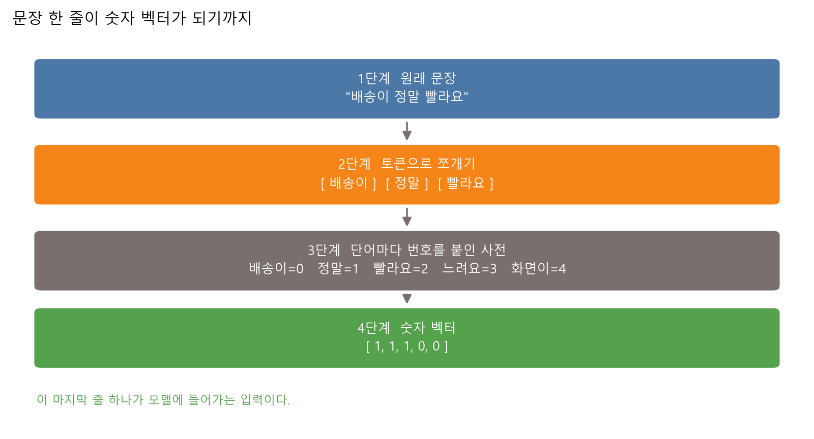
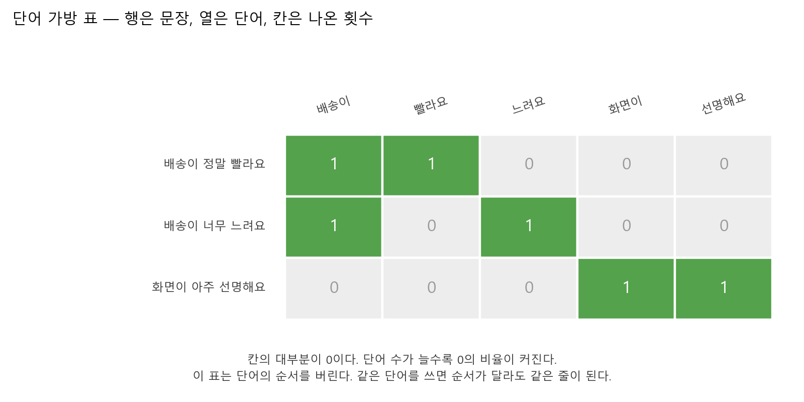
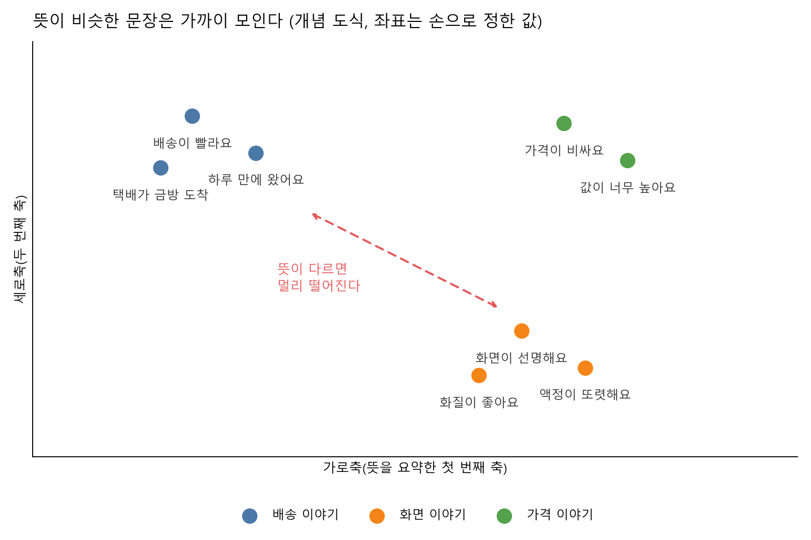
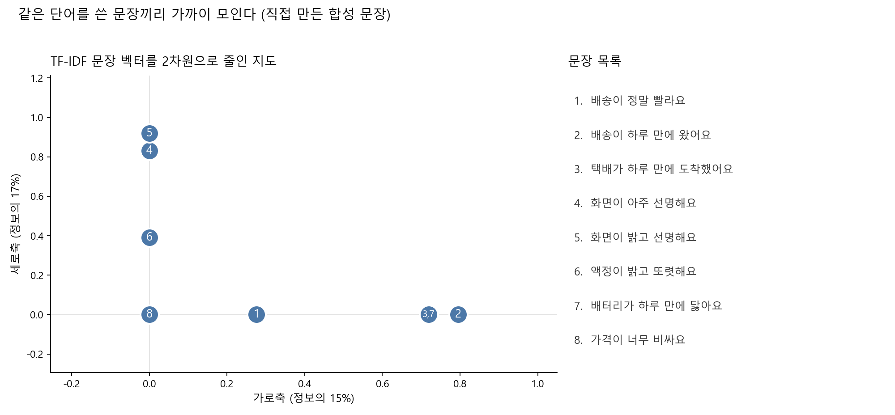
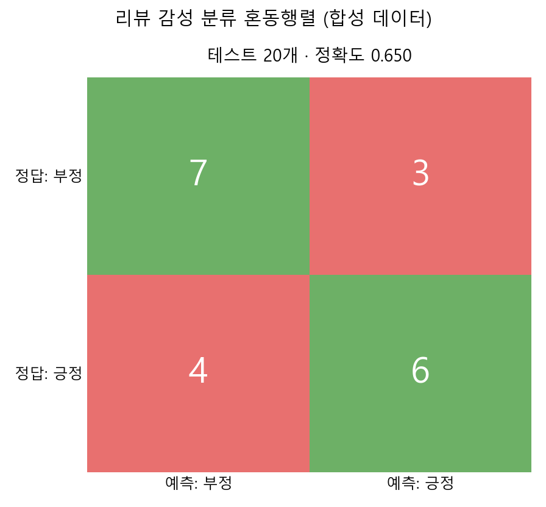
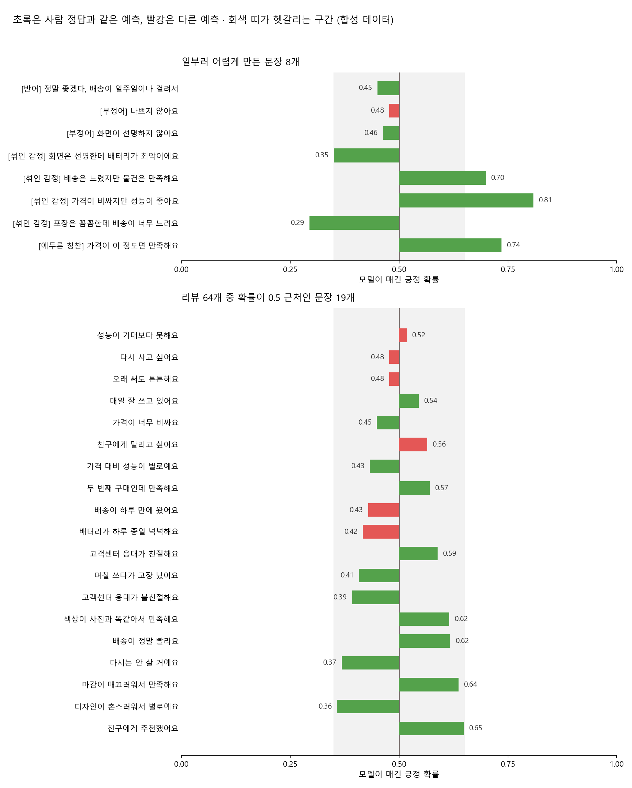
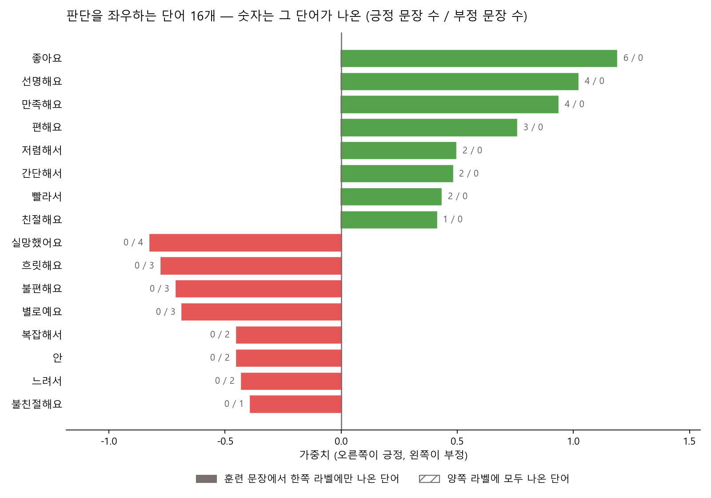

# 제10장 텍스트와 임베딩 — 문장을 숫자로 바꾸기

---

## [전반부] 이론 강의
---

### 학습 목표

- 컴퓨터가 글자를 직접 다루지 못하는 이유를 설명한다
- 문장을 토큰으로 쪼개고, 한국어에서 이 작업이 왜 까다로운지 말한다
- 단어 가방 표의 행과 열을 읽고, 이 표가 무엇을 버리는지 설명한다
- 뜻이 같은 두 문장의 유사도가 0이 되는 경우를 직접 만든다
- 감성 분류기의 혼동행렬과 단어 가중치를 읽고, 학습 문장이 치우치면 무엇이 달라지는지 확인한다

지난 장에서 이미지 한 장을 숫자 64개로 펴서 모델에 넣었다. 이번 장은 같은 질문을 문장에 던진다. 모델은 덧셈과 곱셈만 한다. 그러니 "배송이 정말 빨라요"라는 글자 줄도 어딘가에서 숫자 줄로 바뀌어야 한다. 그 변환 과정을 단계마다 표로 찍어 확인한다.

---

### 1. 컴퓨터는 글자를 모른다

컴퓨터가 글자를 아예 저장하지 못하는 것은 아니다. 파일 안에서 '가'는 44032번, '나'는 45208번 같은 번호로 저장된다. 문제는 그 번호에 뜻이 없다는 것이다.

번호끼리 빼 보면 금방 드러난다. '가'와 '나'의 번호 차이는 1176이고, '가'와 '개'의 번호 차이는 28이다. 그렇다고 '가'가 '나'보다 '개'에 42배 더 가까운 낱말인 것은 아니다. 글자 번호는 자리를 정하려고 붙인 것이지 뜻을 재려고 붙인 것이 아니다.

모델에 넣을 숫자는 다른 성질을 가져야 한다. 뜻이 비슷한 두 문장은 숫자도 비슷해야 하고, 뜻이 먼 두 문장은 숫자도 멀어야 한다. 이 성질을 만들어 내는 일이 이번 장의 전부다.



**그림 10.1** 문장 → 토큰 → 사전 → 벡터. 마지막 줄 `[1, 1, 1, 0, 0]`이 모델에 들어간다

이 네 단계는 실습 10.1에서 그대로 실행한다. 그림은 개념을 보여주기 위해 손으로 만든 도식이고, 실제 숫자는 실습 로그에서 확인한다.

---

### 2. 토큰으로 쪼개기

#### 2-1. 토큰이 무엇인가

**토큰(token)**은 문장을 자를 때 나오는 조각 하나다. 어디서 자를지는 사람이 정한다. 자르는 규칙에 따라 토큰의 개수도 종류도 달라진다.

이 수업에서 쓰는 규칙은 두 줄이 전부다.

1. 문장부호를 공백으로 바꾼다
2. 공백으로 자른다

"배송이 정말 빨라요"를 이 규칙으로 자르면 `배송이 | 정말 | 빨라요` 세 조각이 나온다. 실제로 실습 10.1의 1단계가 이 결과를 그대로 찍는다.

토큰을 다 모으면 **사전(vocabulary)**이 된다. 사전은 서로 다른 토큰에 번호를 붙인 목록이다. 실습 10.1에서 문장 8개를 자르면 서로 다른 단어 19개가 나온다. 이 19개가 그 실습의 사전이고, 곧 벡터의 길이가 된다.

#### 2-2. 한국어가 까다로운 이유

영어는 공백으로 자르면 대체로 낱말이 나온다. `the delivery was fast`를 자르면 `the`, `delivery`, `was`, `fast`가 된다. 다음 문장에 `delivery`가 또 나오면 같은 단어로 잡힌다.

한국어는 낱말 뒤에 조사와 어미가 붙는다. 공백으로만 자르면 그것들이 붙은 채로 남는다. 그래서 "배송이", "배송은", "배송도"가 서로 다른 단어 세 개로 잡힌다. 사람이 보기에는 같은 "배송"인데 표에서는 열이 세 개로 갈린다. 실습 10.2에서 이 현상이 눈에 보이는 손해로 나타난다. 훈련 문장에 "화면이"가 있어도 "화면은"이라고 쓴 새 문장에서는 모델이 그 단어를 모른다고 답한다.

이 문제를 줄이려면 **형태소 분석기**를 쓴다. "배송이"를 "배송 + 이"로 쪼개 주는 프로그램이다. 이번 수업에서는 설치하지 않는다. 설치와 설정에 시간이 들고, 무엇보다 조사가 붙은 채로 두었을 때 무엇이 망가지는지를 먼저 보는 편이 낫기 때문이다. 망가지는 지점을 본 다음에야 형태소 분석기가 무엇을 해결하는지 알 수 있다.

---

### 3. 단어 가방과 그 한계

**단어 가방(bag of words)**은 문장을 벡터로 바꾸는 가장 단순한 방법이다. 사전의 단어마다 열을 하나씩 만들고, 문장에 그 단어가 몇 번 나왔는지 칸에 적는다.



**그림 10.2** 행은 문장, 열은 단어, 칸은 나온 횟수. 초록 칸이 1, 회색 칸이 0이다

이름이 "가방"인 이유는 단어를 가방에 쏟아 담기 때문이다. 담고 나면 순서가 사라진다. "나는 밥을 먹었다"와 "밥을 나는 먹었다"는 토큰 세 개가 똑같으니 표에서 같은 줄이 된다. 이 둘은 뜻도 같으니 잃은 것이 없다.

손해는 순서가 뜻을 바꾸는 자리에서 난다. 영어 `dog bites man`과 `man bites dog`는 토큰 세 개가 같은데 뜻이 정반대다. 단어 가방은 이 둘을 구분하지 못한다. 한국어는 조사가 역할을 표시해서 이 문제를 덜 겪는다. 대신 2절에서 본 대로 조사마다 열이 갈리는 값을 치른다.

버려지는 것이 순서만은 아니다.

○ **표가 거의 0으로 채워진다**
  - 실습 10.1에서 문장 8개로 만든 표는 8행 19열이다. 칸이 152개인데 그중 125개가 0이다. 82.2%가 0이다
  - 문장이 늘면 사전이 커지고, 사전이 커지면 한 문장이 쓰는 단어의 비율은 더 작아진다. 0의 비율은 문장을 모을수록 올라간다

○ **단어가 안 겹치면 아무 관계도 없다고 본다**
  - "배송이 정말 빨라요"와 "택배가 하루 만에 도착했어요"는 사람이 보면 같은 이야기다
  - 그런데 두 문장은 겹치는 단어가 하나도 없다. 단어 가방에서 두 줄은 서로 다른 칸에만 1이 찍힌다
  - 실습 10.1에서 이 짝의 유사도를 재면 0.00이 나온다

두 번째 한계가 이 장의 핵심이다. 단어 가방은 **글자가 같은지**만 본다. 뜻이 같은지는 보지 못한다.

TF-IDF는 이 표를 조금 다듬는다. 여러 문장에 흔히 나오는 단어의 무게를 낮추고, 몇 문장에만 나오는 단어의 무게를 높인다. "하루"처럼 여기저기 끼는 단어가 유사도를 부풀리는 일을 줄인다. 다만 단어가 겹쳐야 닮았다고 본다는 성질 자체는 그대로다. 겹치는 단어가 없으면 TF-IDF에서도 유사도는 0이다.

---

### 4. 임베딩이 무엇을 바꾸는가

**임베딩(embedding)**은 단어나 문장을 짧은 실수 벡터로 바꾸는 방법이다. 목표는 하나다. 뜻이 가까운 것끼리 벡터도 가깝게 놓는 것이다.

Google 머신러닝 단기집중과정은 임베딩을 "희소 데이터의 저차원 표현"으로 정의한다.[^google-emb] 이 한 줄에 두 가지가 들어 있다.

○ **저차원** — 열의 개수를 줄인다
  - 단어 가방은 사전에 단어가 10만 개면 열도 10만 개다
  - 임베딩은 같은 단어를 100개 안팎의 숫자로 나타낸다. 열이 1000분의 1로 줄어든다

○ **희소하지 않다** — 칸이 0으로 차 있지 않다
  - 단어 가방의 한 줄은 대부분 0이고 몇 칸만 1이다
  - 임베딩의 한 줄은 모든 칸에 실수가 들어 있다. 0.31, -0.07 같은 값이 100개 늘어선다

칸마다 실수가 들어 있으면 무엇이 달라지는가. 겹치는 단어가 하나도 없어도 두 벡터가 가까울 수 있다. "택배"와 "배송"의 벡터를 가깝게 만들어 두면, 그 단어로 만든 문장 벡터도 가까워진다.



**그림 10.3** 임베딩이 노리는 그림 — 배송 이야기끼리, 화면 이야기끼리 모인다. 좌표는 설명을 위해 손으로 정한 값이다

○ **이 수업에서 하는 것**
  - 실습 10.1의 4단계에서 `TruncatedSVD`로 TF-IDF 벡터 19차원을 2차원까지 줄인다
  - 차원을 줄인다는 점에서 임베딩과 방향이 같다. 줄인 두 축에 문장을 찍으면 평면 위의 점이 된다

○ **이 수업에서 하지 않는 것**
  - word2vec처럼 큰 말뭉치로 단어 벡터를 따로 학습하지 않는다. 모델을 내려받지도 않는다
  - `TruncatedSVD`는 우리가 가진 문장 8개 안의 단어 겹침만 보고 축을 정한다. 밖에서 배운 지식이 없다
  - 그래서 겹치는 단어가 없는 두 문장은 차원을 줄인 뒤에도 여전히 멀다. 실습 10.1에서 유사도 0인 짝은 2차원으로 줄여도 0인 채로 남는다

정리하면 이렇다. 차원을 줄이는 것만으로는 뜻이 생기지 않는다. 뜻은 "어떤 단어들이 같은 자리에 자주 나타나는가"를 많은 문장에서 관찰해야 생긴다. 그 관찰을 대규모로 한 결과가 임베딩이고, 11장의 언어모델은 그 위에서 움직인다.

---

### 5. 텍스트 분류와 감성 분석

**텍스트 분류(text classification)**는 문장을 넣으면 이름을 하나 돌려주는 문제다. 4장에서 다룬 분류와 같은 틀이고, 입력이 표 대신 문장일 뿐이다.

○ **어디에 쓰는가**
  - 메일이 스팸인가 정상인가
  - 문의 글이 배송 문제인가 결제 문제인가
  - 리뷰가 칭찬인가 불만인가

세 번째를 따로 **감성 분석(sentiment analysis)**이라고 부른다. Google 텍스트 분류 가이드는 감성 분석을 "콘텐츠가 표현하는 의견의 유형을 파악"하는 일로 정의한다.[^google-text]

만드는 순서는 4장과 같다.

1. 문장마다 정답 라벨을 붙인다. 긍정은 1, 부정은 0
2. 문장을 단어 가방 벡터로 바꾼다
3. 로지스틱 회귀를 학습시킨다
4. 처음 보는 문장으로 정확도를 잰다

학습이 끝나면 단어마다 숫자 하나가 붙는다. 이것을 **가중치(weight)**라고 부른다. 가중치가 크면 그 단어가 있을 때 긍정 쪽으로 밀고, 작으면 부정 쪽으로 민다. 모델의 판단은 문장에 든 단어들의 가중치를 더한 값 하나로 정해진다.

이 구조 덕분에 모델을 열어 볼 수 있다. 왜 이 문장을 긍정이라고 했는지 물으면, 어떤 단어가 얼마를 보탰는지 숫자로 답할 수 있다. 실습 10.2에서 문장마다 이 계산을 풀어서 찍는다.

동시에 이 구조가 한계이기도 하다. 모델은 단어를 더할 뿐 순서를 읽지 않는다. "나쁘지 않아요"에서 "않아요"가 "나쁘지"를 뒤집는다는 것을 알지 못한다.

---

### 6. 학습 문장이 치우치면 생기는 일

모델은 훈련 문장 밖의 세상을 모른다. 어떤 단어가 긍정 단어인지 부정 단어인지도 훈련 문장에서만 배운다. 여기서 문제가 생긴다.

실습 10.2의 훈련 문장 44개에는 서로 다른 단어 89개가 나온다. 그중 72개(80.9%)는 긍정 문장이나 부정 문장 **한쪽에만** 나온다. 양쪽에 모두 나온 단어는 17개뿐이다.

한쪽에만 나온 단어는 그 라벨 쪽으로 강하게 밀린다. 반대쪽 증거가 하나도 없으니 모델이 망설일 이유가 없다. 실제로 가중치 상위 10개와 하위 10개, 모두 20개가 전부 한쪽에만 나온 단어다.

○ **"정말"이 긍정 단어가 된 과정**
  - "정말"은 강조하는 말이다. 긍정에도 붙고 부정에도 붙는다
  - 그런데 실습 10.2의 훈련 문장에서는 "배송이 정말 빨라요" 한 문장에만 나왔다. 긍정 1회, 부정 0회다
  - 모델은 "정말"에 +0.38을 줬다. 문장을 하나 더 봤을 뿐인데 긍정 단어가 되었다

이것을 **데이터 편향**이라고 부른다. 데이터가 틀린 것이 아니라, 데이터가 세상의 일부만 담고 있는데 모델이 그것을 전부로 취급하는 상황이다.

○ **어떻게 알아채는가**
  - 단어마다 긍정 문장에 몇 번, 부정 문장에 몇 번 나왔는지 센다
  - 한쪽이 0인 단어가 가중치 상위에 몰려 있으면 의심한다
  - 그 단어를 사람이 읽어 본다. "실망했어요"가 부정 쪽에 몰린 것은 자연스럽고, "정말"이 긍정 쪽에 몰린 것은 우연이다

○ **AI에게 학습 문장을 만들게 할 때**
  - 생성형 AI에게 "긍정 리뷰 30개를 써 줘"라고 하면 비슷한 문장이 쏟아진다
  - 긍정 문장에는 "만족", 부정 문장에는 "실망"만 반복해서 나올 수 있다
  - 만들어진 문장을 그냥 쓰지 말고, 위의 단어 횟수 세기를 먼저 돌려 본다

---

### 7. 직접 움직여 보는 웹 자료

수업에서 다 보여줄 수 없는 그림은 아래 자료로 보충한다. 모두 무료이고, 아래 설명은 각 페이지를 열어 확인한 내용이다.

| 자료 | 무엇을 볼 수 있는가 | 주소 |
|---|---|---|
| Google 머신러닝 단기집중과정(한국어), 임베딩 | 음식 5,000종 추천 예시로 원-핫 인코딩이 왜 무거운지 설명하고, 임베딩을 저차원 표현으로 정의한다. 음식 항목의 원-핫 벡터 그림 두 장이 있다 | https://developers.google.com/machine-learning/crash-course/embeddings?hl=ko |
| Google 머신러닝 단기집중과정(한국어), 어휘와 원-핫 인코딩 | 카테고리 N개를 요소 N개짜리 벡터로 바꾸는 과정을 그림 세 장으로 나눠 보여준다. 실습 10.1의 단어 가방 표와 같은 구조다 | https://developers.google.com/machine-learning/crash-course/categorical-data/one-hot-encoding?hl=ko |
| Google 텍스트 분류 가이드(한국어) | 스팸 필터링 그림으로 주제 분류를 소개하고, 감정 분석을 정의한다. 데이터 수집부터 배포까지 7단계 워크플로우 그림이 있다 | https://developers.google.com/machine-learning/guides/text-classification?hl=ko |
| scikit-learn, Classification of text documents using sparse features | 뉴스 문서 2,034개를 TF-IDF로 바꿔 분류한다. 혼동행렬 그림과 클래스별 상위 단어 가중치 그림을 나란히 보여준다 | https://scikit-learn.org/stable/auto_examples/text/plot_document_classification_20newsgroups.html |

○ 마지막 자료의 단어 가중치 그림은 실습 10.2와 짝이 된다. 그 예제에서는 "caltech"라는 단어가 상위 특성으로 올라오는데, 뜻과는 무관하게 메일 주소 메타데이터에서 새어 들어온 것이다. 6절에서 다룬 편향이 실제 데이터에서 어떻게 나타나는지 보여주는 사례다

○ scikit-learn 예제 그림은 BSD 라이선스로 공개돼 있다. 발표 자료에 넣을 때는 출처를 적는다

---

## [후반부] 실습
---

두 가지를 한다. 첫 번째는 문장이 숫자로 바뀌는 과정을 단계마다 찍어 보는 실습이고, 두 번째는 리뷰 분류기를 만들어 놓고 그 모델을 헷갈리게 만드는 실습이다.

#### 실행 환경

```bash
cd practice/chapter10
python -m pip install -r ../requirements.txt
```

필요한 패키지는 numpy, pandas, matplotlib, scikit-learn이다. GPU는 필요 없다. 두 실습 모두 노트북에서 몇 초 안에 끝난다. 인터넷에서 데이터나 모델을 내려받지 않는다.

두 실습의 문장은 모두 **수업용으로 직접 쓴 합성 문장**이다. 실제 쇼핑몰 리뷰를 긁어오지 않았다. 개인정보가 들어갈 자리가 없다.

---

### 실습 10.1: 문장이 숫자로 바뀌는 과정

#### 실습 목표

- 토큰, 사전, 벡터가 각각 무엇인지 출력으로 확인한다
- 단어 가방 표에서 0인 칸이 몇 %인지 센다
- 뜻이 같은데 유사도가 0이 되는 짝을 직접 찾는다

#### 데이터

합성 한국어 문장 8개다. 두 가지를 일부러 섞어 뒀다.

- 같은 단어를 공유하는 짝 — 문장1 "배송이 정말 빨라요"와 문장2 "배송이 하루 만에 왔어요"
- 뜻은 같은데 단어가 하나도 안 겹치는 짝 — 문장1과 문장3 "택배가 하루 만에 도착했어요"

#### 실행 명령

```bash
cd practice/chapter10/code
python 10-1-text-to-numbers.py
```

#### 핵심 코드

파일 맨 위에 학생이 바꿀 목록이 있다.

```python
MY_SENTENCES = [
    "배송이 정말 빨라요",
    "배송이 하루 만에 왔어요",
    "택배가 하루 만에 도착했어요",
    ...
]

# 사람이 보기에 뜻이 거의 같은 짝을 번호로 적는다.
MEANING_PAIRS = [(1, 3), (4, 6)]
```

문장을 자르는 규칙은 두 줄이다.

```python
def tokenize(text: str) -> list[str]:
    cleaned = re.sub(r"[^\w\s]", " ", text)   # 문장부호를 공백으로
    return [token for token in cleaned.split() if token]   # 공백으로 자르기
```

_전체 코드는 `practice/chapter10/code/10-1-text-to-numbers.py` 참고_

#### 실행 결과

1단계에서 문장이 토큰으로 갈린다.

```text
문장1  배송이 정말 빨라요
       -> 3개 토큰: 배송이 | 정말 | 빨라요
문장3  택배가 하루 만에 도착했어요
       -> 4개 토큰: 택배가 | 하루 | 만에 | 도착했어요
```

2단계에서 단어 가방 표가 나온다.

```text
문장 8개에서 서로 다른 단어 19개가 나왔다.
표의 크기: 8행 x 19열 = 칸 152개
그중 0인 칸: 125개 (82.2%)

두 문장 이상에 나온 단어는 6개다. 그 부분만 떼어 보면 이렇다.
     만에  밝고  배송이  선명해요  하루  화면이
문장1   0   0    1     0   0    0
문장2   1   0    1     0   1    0
문장3   1   0    0     0   1    0
문장4   0   0    0     1   0    1
문장5   0   1    0     1   0    1
문장6   0   1    0     0   0    0
문장7   1   0    0     0   1    0
문장8   0   0    0     0   0    0
```

_출처: `practice/chapter10/results/10-1-text-to-numbers.log`_

3단계에서 TF-IDF로 잰 유사도가 나온다.

```text
전체 28개 짝 가운데 유사도가 정확히 0인 짝이 22개다.

사람이 보기에 뜻이 같은 짝을 컴퓨터는 어떻게 보는가
  문장1: 배송이 정말 빨라요
  문장3: 택배가 하루 만에 도착했어요
  -> 컴퓨터가 잰 유사도: 0.00

  문장4: 화면이 아주 선명해요
  문장6: 액정이 밝고 또렷해요
  -> 컴퓨터가 잰 유사도: 0.00
```

_출처: `practice/chapter10/results/10-1-text-to-numbers.log`_

**표 10.1** 유사도가 높은 짝과 0인 짝

| 문장 짝 | 겹치는 단어 | 유사도 |
|---|---|---:|
| 문장4 "화면이 아주 선명해요" – 문장5 "화면이 밝고 선명해요" | 화면이, 선명해요 | 0.62 |
| 문장2 "배송이 하루 만에 왔어요" – 문장3 "택배가 하루 만에 도착했어요" | 하루, 만에 | 0.36 |
| 문장2 "배송이 하루 만에 왔어요" – 문장7 "배터리가 하루 만에 닳아요" | 하루, 만에 | 0.36 |
| 문장1 "배송이 정말 빨라요" – 문장3 "택배가 하루 만에 도착했어요" | 없음 | 0.00 |
| 문장4 "화면이 아주 선명해요" – 문장6 "액정이 밝고 또렷해요" | 없음 | 0.00 |

4단계에서 19차원을 2차원으로 줄인다.

```text
TF-IDF 벡터의 원래 차원: 19차원
두 축이 담아낸 정보의 비율: 가로축 14.8%, 세로축 17.3%, 합계 32.2%

2차원으로 줄인 뒤 완전히 같은 자리에 놓인 문장
  문장3, 문장7  ->  좌표 (0.719, 0.000)
```

_출처: `practice/chapter10/results/10-1-text-to-numbers.log`_



**그림 10.4** 같은 단어를 쓴 문장끼리 모인다. 점 안의 숫자가 문장 번호이고, "3,7"은 두 문장이 같은 자리에 겹쳤다는 뜻이다

#### 결과 읽기

○ **표의 82.2%가 0이다**
  - 문장 8개, 단어 19개짜리 작은 표인데도 칸의 대부분이 비어 있다
  - 문장이 늘면 사전도 함께 커진다. 열은 계속 늘어나는데 한 문장이 채우는 칸은 그 문장의 단어 수 그대로다. 그래서 0의 비율은 올라간다

○ **28개 짝 중 22개가 유사도 0이다**
  - 8개 문장에서 만들 수 있는 짝은 28개다. 그중 22개는 겹치는 단어가 하나도 없었다
  - 사람이 읽으면 배송 이야기 셋(문장1~3)과 화면 이야기 셋(문장4~6)이 묶인다. 이 묶음 안의 짝 6개 중 0보다 큰 값을 받은 것은 4개다
  - 그러면서 뜻이 전혀 다른 문장2 "배송이 하루 만에 왔어요"와 문장7 "배터리가 하루 만에 닳아요"에 0.36을 줬다. 같은 이야기인 문장2와 문장3에 준 값과 똑같다. "하루 만에"를 공유한다는 이유 하나 때문이다

○ **뜻이 같은 두 짝이 모두 0이다**
  - 문장1과 문장3은 둘 다 배송이 빨랐다는 이야기다. 유사도는 0.00이다
  - 문장4와 문장6은 둘 다 화면이 잘 보인다는 이야기다. 역시 0.00이다
  - "택배"와 "배송"이 같은 것을 가리킨다는 사실을 이 방법은 어디에서도 배우지 못한다. 4절의 임베딩이 겨냥하는 지점이 여기다

○ **문장3과 문장7이 한 점에 겹쳤다**
  - 문장3 "택배가 하루 만에 도착했어요"와 문장7 "배터리가 하루 만에 닳아요"는 뜻이 반대다
  - 그런데 2차원으로 줄인 좌표가 (0.719, 0.000)으로 똑같다. 두 문장이 공유하는 "하루", "만에"만 두 축에 남고, 뜻을 가르는 "도착했어요"와 "닳아요"는 남은 32.2% 밖으로 밀려났다
  - 차원을 줄이면 무언가는 버려진다. 무엇이 버려지는지는 골라서 정할 수 없다

○ **두 축이 담은 정보가 32.2%다**
  - 14.8과 17.3을 더하면 32.1이다. 합계가 32.2인 것은 각 축의 값을 소수점 첫째 자리로 반올림해 찍었기 때문이다. 합계는 반올림하기 전 값을 더한 것이다
  - 19차원을 2차원으로 줄였으니 나머지는 사라졌다. 그림은 원래 거리를 그대로 보여주지 않는다
  - 평면 위에서 가까워 보인다고 실제로 가까운 것은 아니다. 정확한 거리는 3단계의 유사도 표에서 읽는다

#### 해 보기

`MY_SENTENCES`를 자기 문장으로 바꿔 다시 실행한다.

1. 뜻이 같은데 단어가 하나도 안 겹치는 짝을 하나 만들어 넣는다. `MEANING_PAIRS`에 그 번호를 적는다
2. 실행해서 그 짝의 유사도가 0인지 확인한다
3. 두 문장 중 한쪽 단어 하나를 다른 쪽과 같게 고친다. 유사도가 0에서 얼마로 올라가는가
4. 문장을 12개로 늘리면 0인 칸의 비율이 82.2%에서 어느 쪽으로 움직이는가

○ 확인할 것은 **단어 하나가 겹치는 순간 유사도가 0에서 튀어 오른다**는 점이다. 조금씩 닮아 가는 것이 아니라 0이거나 아니거나로 갈린다

---

### 실습 10.2: 리뷰 긍정/부정 분류기와 헷갈리는 문장

#### 실습 목표

- 리뷰 분류기를 만들고 정확도와 혼동행렬을 읽는다
- 반어, 부정어, 섞인 감정이 든 문장을 넣어 모델이 어디서 흔들리는지 확인한다
- 단어마다 붙은 가중치를 꺼내, 판단을 좌우하는 단어를 눈으로 본다

#### 데이터

합성 리뷰 64개다. 긍정 32개와 부정 32개로 수를 맞췄다. 같은 물건 이야기를 양쪽에 넣어, 감정을 나타내는 단어에서만 두 무리가 갈리도록 만들었다.

```text
("배송이 정말 빨라요", 1)      ("배송이 너무 느려요", 0)
("화면이 아주 선명해요", 1)     ("화면이 어둡고 흐릿해요", 0)
("가격이 저렴해서 만족해요", 1)  ("가격이 너무 비싸요", 0)
```

#### 실행 명령

```bash
cd practice/chapter10/code
python 10-2-sentiment.py
```

#### 핵심 코드

파일 맨 위에 학생이 바꿀 목록이 있다. 모델을 헷갈리게 만들 문장과 사람이 매긴 정답을 함께 적는다.

```python
MY_TRICKY_SENTENCES = [
    ("정말 좋겠다, 배송이 일주일이나 걸려서", 0, "반어"),
    ("나쁘지 않아요", 1, "부정어"),
    ("화면은 선명한데 배터리가 최악이에요", 0, "섞인 감정"),
    ...
]
```

문장을 벡터로 바꿔 학습시키는 부분은 세 줄이다.

```python
vectorizer = CountVectorizer(
    tokenizer=tokenize, token_pattern=None, lowercase=False, binary=True,
)
x_train = vectorizer.fit_transform(train_text)
model = LogisticRegression(max_iter=1000, random_state=RANDOM_SEED).fit(x_train, y_train)
```

단어마다 붙은 가중치를 꺼내는 부분은 한 줄이다.

```python
weights = model.coef_[0]          # 사전의 단어 순서대로 숫자 하나씩
```

_전체 코드는 `practice/chapter10/code/10-2-sentiment.py` 참고_

#### 실행 결과

```text
리뷰 64개 = 긍정 32개 + 부정 32개
훈련 44개, 테스트 20개(테스트 안의 긍정 10개)
훈련 문장 44개에서 서로 다른 단어 89개가 나왔다.

기준선(무조건 많은 쪽으로 찍기) 테스트 정확도: 0.500
훈련 데이터 정확도: 1.000
테스트 데이터 정확도: 0.650

--- 테스트 데이터 혼동행렬 ---
               예측:부정  예측:긍정
  정답:부정         7         3
  정답:긍정         4         6
```

_출처: `practice/chapter10/results/10-2-sentiment.log`_



**그림 10.5** 테스트 20개 중 13개를 맞혔다. 놓친 방향이 양쪽으로 갈렸다

일부러 어렵게 만든 문장 8개의 결과다.

**표 10.2** 헷갈리게 만든 문장과 모델의 답

| 유형 | 문장 | 사람 정답 | 모델 예측 | 긍정 확률 |
|---|---|---|---|---:|
| 반어 | 정말 좋겠다, 배송이 일주일이나 걸려서 | 부정 | 부정 | 0.45 |
| 부정어 | 나쁘지 않아요 | 긍정 | 부정 | 0.48 |
| 부정어 | 화면이 선명하지 않아요 | 부정 | 부정 | 0.46 |
| 섞인 감정 | 화면은 선명한데 배터리가 최악이에요 | 부정 | 부정 | 0.35 |
| 섞인 감정 | 배송은 느렸지만 물건은 만족해요 | 긍정 | 긍정 | 0.70 |
| 섞인 감정 | 가격이 비싸지만 성능이 좋아요 | 긍정 | 긍정 | 0.81 |
| 섞인 감정 | 포장은 꼼꼼한데 배송이 너무 느려요 | 부정 | 부정 | 0.29 |
| 에두른 칭찬 | 가격이 이 정도면 만족해요 | 긍정 | 긍정 | 0.74 |

_출처: `practice/chapter10/results/confusing_sentences.csv`_



**그림 10.6** 막대가 짧을수록 모델이 0.5 근처에서 겨우 결정했다는 뜻이다. 회색 띠가 0.35~0.65 구간이다

단어마다 붙은 가중치는 이렇게 나왔다.

```text
훈련 문장에 나온 단어 89개 중 한쪽 라벨에만 나온 단어: 72개 (80.9%)

--- 긍정 쪽으로 가장 세게 미는 단어 10개 ---
  단어   가중치  긍정문장수  부정문장수 한쪽에만
 좋아요 1.185      6      0    예
선명해요 1.018      4      0    예
만족해요 0.933      4      0    예
 편해요 0.754      3      0    예

--- 부정 쪽으로 가장 세게 미는 단어 10개 ---
   단어    가중치  긍정문장수  부정문장수 한쪽에만
실망했어요 -0.823      0      4    예
 흐릿해요 -0.775      0      3    예
 불편해요 -0.710      0      3    예
 별로예요 -0.684      0      3    예

가중치 상위 10개와 하위 10개, 모두 20개 중 한쪽 라벨에만 나온 단어: 20개
```

_출처: `practice/chapter10/results/10-2-sentiment.log`_



**그림 10.7** 막대 오른쪽 숫자는 그 단어가 나온 (긍정 문장 수 / 부정 문장 수)다. 16개 모두 한쪽이 0이다

#### 결과 읽기

○ **훈련 1.000, 테스트 0.650**
  - 훈련 문장 44개는 하나도 안 틀렸다. 처음 보는 문장 20개에서는 7개를 틀렸다
  - 단어 89개짜리 사전으로 문장 44개를 외운 것에 가깝다. 7장에서 다룬 과적합이 텍스트에서 나타난 모습이다
  - 기준선 0.500과 비교하면 0.15만큼 앞섰다. 데이터에서 무언가를 배우기는 했다

○ **어려운 문장을 맞혀도 이유는 맞지 않았다**
  - 반어 문장 "정말 좋겠다, 배송이 일주일이나 걸려서"를 부정이라고 답했다. 정답이다
  - 그런데 근거를 열어 보면 이렇다

```text
[반어] 정말 좋겠다, 배송이 일주일이나 걸려서
    아는 단어 3개: 정말(+0.38), 일주일이나(-0.29), 배송이(-0.20)
    모르는 단어 2개: 좋겠다, 걸려서
    -> 긍정 확률 0.45  (사람 정답 부정)
```

_출처: `practice/chapter10/results/10-2-sentiment.log`_

  - 모델이 반어를 알아챈 것이 아니다. 아는 단어 세 개의 가중치를 더했더니 0.5를 조금 못 넘었을 뿐이다
  - 반어의 핵심인 "좋겠다"와 "걸려서"는 훈련 문장에 없어서 계산에 끼지도 못했다

○ **"나쁘지 않아요"에서 아는 단어가 0개다**
  - 토큰 "나쁘지"와 "않아요" 둘 다 훈련 문장에 없다. 모델이 참고할 단어가 하나도 없었다
  - 그래서 확률이 0.48, 사실상 동전 던지기다. 사람이 매긴 정답은 긍정인데 부정이라고 답했다
  - 부정어가 앞말을 뒤집는다는 규칙은 단어를 더하는 방식으로는 표현되지 않는다

○ **조사가 바뀌자 아는 단어가 사라졌다**
  - "화면은 선명한데 배터리가 최악이에요"에서 모르는 단어는 "화면은", "선명한데"였다
  - 훈련 문장에는 "화면이"와 "선명해요"가 있다. 사람이 보기에 같은 말인데 모델에게는 처음 보는 단어다
  - 2절에서 다룬 한국어 토큰 문제가 손해로 드러난 지점이다

○ **판단을 좌우하는 단어가 전부 한쪽에만 나왔다**
  - 가중치 상위·하위 20개가 모두 한쪽 라벨에만 나온 단어다
  - "좋아요"가 긍정 문장 6개에만 나와 +1.185를 받았다. 이건 납득할 만하다
  - "정말"이 긍정 문장 1개에만 나와 +0.38을 받았다. 이건 우연이다. 부정 리뷰에도 "정말 별로예요"처럼 얼마든지 쓰인다
  - 훈련 문장을 어떻게 모으느냐가 어떤 단어를 감정 단어로 만들지 정한다

#### 해 보기

`MY_TRICKY_SENTENCES`에 자기 문장을 넣고 다시 실행한다.

1. 모델이 확실히 틀리는 문장을 세 개 만든다. 목표는 확률을 0.5 반대편으로 넘기는 것이다
2. 긍정 단어와 부정 단어를 한 문장에 같이 넣고, 어느 쪽이 이기는지 본다
3. 훈련 문장에 있는 단어의 조사만 바꿔("화면이" → "화면은") 넣고, 모르는 단어 수가 어떻게 변하는지 본다
4. `REVIEWS`에 "정말"이 들어간 부정 문장을 하나 추가하고 다시 실행한다. "정말"의 가중치가 어디로 움직이는가

○ 4번이 6절의 편향을 직접 확인하는 방법이다. 문장 하나를 더했을 뿐인데 단어 하나의 성격이 바뀐다

---

### 과제 (LMS 제출)

수업 시간에 실습을 실행했는지만 확인한다. 따로 보고서를 쓰지 않는다.

#### 제출물

두 실습을 실행하면 만들어지는 그림 파일 두 장을 LMS에 올린다.

1. `practice/chapter10/results/sentence_map.png`
2. `practice/chapter10/results/confusing_sentences.png`

#### 평가 기준

- 두 파일을 올리면 완료로 인정한다. 정확도가 얼마인지는 채점하지 않는다
- `MY_SENTENCES`나 `MY_TRICKY_SENTENCES`를 바꿨다면 바뀐 그림이 올라온다. 기본값 그대로여도 인정한다

#### 마감

- 실습 수업일 포함 7일 이내

---

### 핵심 정리

| 개념 | 한 줄 정리 |
|---|---|
| 토큰 | 문장을 자른 조각. 어디서 자를지는 사람이 정한다 |
| 한국어 토큰 | 조사와 어미가 붙어 남는다. "화면이"와 "화면은"이 다른 단어가 된다 |
| 단어 가방 | 행은 문장, 열은 단어, 칸은 횟수. 순서를 버리고, 칸의 대부분이 0이다 |
| 유사도 0 | 겹치는 단어가 없으면 뜻이 같아도 0이다. 임베딩이 겨냥하는 지점이다 |
| 임베딩 | 희소 데이터의 저차원 표현. 뜻이 가까우면 벡터도 가깝게 놓는다 |
| 가중치 | 단어마다 붙은 숫자 하나. 문장의 판단은 그 숫자들의 합이다 |
| 데이터 편향 | 한쪽 라벨에만 나온 단어가 판단을 좌우한다. 데이터가 세상의 일부만 담는다 |

다음 장에서는 다음 단어를 예측하는 방식으로 문장을 만들어 내는 모델을 다룬다. 그럴듯한 문장이 왜 틀린 내용을 담을 수 있는지가 드러난다.

---

[^google-emb]: Google, "임베딩", 머신러닝 단기집중과정. https://developers.google.com/machine-learning/crash-course/embeddings?hl=ko (2026년 8월 24일 확인)

[^google-text]: Google, "텍스트 분류", 머신러닝 가이드. https://developers.google.com/machine-learning/guides/text-classification?hl=ko (2026년 8월 24일 확인)
