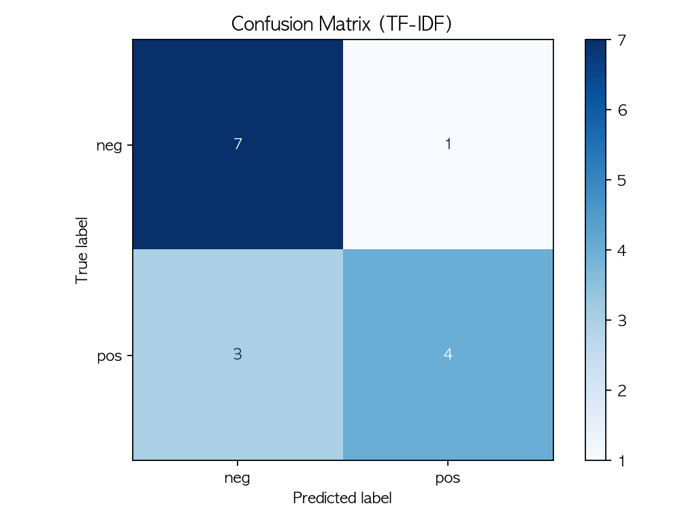

# 10강. 텍스트와 임베딩: 문장을 숫자로 바꾸기

## Part A — 강의 (1교시, 90분)

### 강의 목표

이번 강의의 목표는 **컴퓨터가 텍스트를 직접 이해하지 못한다**는 사실에서 출발해, 문장을 숫자로 바꾸는 과정을 이해하는 것이다. 9주차에서 다룬 이미지는 픽셀이라는 숫자 배열로 이미 존재한다. 그러나 텍스트는 문자열이다. 모델에게 문장을 넣으려면 숫자로 바꾸는 변환 단계가 반드시 필요하다.

학생은 이번 시간 후 다음을 할 수 있어야 한다.

1. 컴퓨터가 텍스트를 직접 처리하지 못하는 이유를 설명한다.
2. 토큰화가 무엇인지 설명하고, 같은 문장이 방식에 따라 다르게 나뉘는 예를 든다.
3. Bag-of-Words와 TF-IDF의 차이를 자기 말로 설명한다.
4. 임베딩의 직관을 설명한다. 비슷한 뜻의 단어가 가까운 벡터가 된다.
5. 감성 분류기를 실행하고 정확도와 혼동행렬을 해석한다.
6. 모델이 헷갈린 문장을 찾고 왜 헷갈렸는지 추측한다.
7. 텍스트 데이터의 편향이 모델 결과에 어떤 영향을 주는지 설명한다.

이번 강의의 실습은 텍스트 감성 분류기다. 짧은 리뷰 문장을 긍정과 부정으로 나누는 모델을 만든다. 4주차에서 2차원 점을 A그룹과 B그룹으로 나누었던 것과 같은 분류 문제다. 다만 입력이 점의 좌표가 아니라 문장이라는 점이 다르다.

### 핵심 개념

| 용어 | 뜻 |
|---|---|
| 토큰(token) | 텍스트를 나눈 조각. 단어, 형태소, 서브워드 등이 토큰이 될 수 있다 |
| 토큰화(tokenization) | 문장을 토큰 단위로 나누는 작업 |
| 벡터화(vectorization) | 토큰 목록을 숫자 배열(벡터)로 바꾸는 작업 |
| Bag-of-Words (BoW) | 각 단어가 문장에 몇 번 나왔는지 세어 벡터를 만드는 방법. 단어 순서를 무시한다 |
| TF-IDF | 단어의 빈도(TF)와 희귀도(IDF)를 곱해 벡터를 만드는 방법. 여러 문장에 자주 나오는 단어의 가중치를 낮춘다 |
| 임베딩(embedding) | 단어나 문장을 의미를 반영한 밀집 벡터로 바꾸는 방법. 비슷한 뜻의 단어가 가까운 벡터가 된다 |
| 감성 분석(sentiment analysis) | 텍스트가 긍정인지 부정인지 분류하는 작업 |
| 데이터 편향(data bias) | 훈련 데이터에 특정 표현이나 주제가 편중되어 모델이 한쪽으로 치우친 판단을 하는 현상 |

### 10.1 컴퓨터는 글자를 모른다

컴퓨터에게 숫자는 자연스러운 입력이다. 이미지를 생각해 보면, 이미지는 픽셀 값이라는 0~255 사이의 숫자 배열로 이미 존재한다. 모델은 이 숫자 배열을 바로 입력으로 받을 수 있다.

그러나 텍스트는 다르다. 예를 들어 "Great food and excellent service"라는 문장은 컴퓨터에게 그냥 문자 코드의 나열일 뿐이다. 컴퓨터는 이 문장이 긍정적인 의미인지, 부정적인 의미인지 알 수 없다.

따라서 텍스트를 모델에 넣으려면 **숫자로 바꾸는 변환 단계**가 필요하다. 이 변환은 보통 두 단계로 이루어진다.

1. **토큰화**: 문장을 조각(토큰)으로 나눈다.
2. **벡터화**: 토큰 목록을 숫자 배열(벡터)로 바꾼다.

이 두 단계를 거치면 문장이 숫자가 된다. 모델은 이 숫자를 입력으로 받아 분류, 감성 분석 같은 작업을 수행한다.

| 비교 | 이미지 | 텍스트 |
|---|---|---|
| 원래 형태 | 픽셀 값 (숫자 배열) | 문자열 |
| 모델 입력 전 변환 | 거의 불필요 (정규화 정도) | 토큰화 + 벡터화 필요 |
| 정보 손실 위험 | 해상도 축소 시 손실 | 변환 과정에서 순서, 맥락, 뉘앙스 손실 |

### 10.2 토큰화: 문장을 조각으로 나누기

**토큰화(tokenization)**는 문장을 더 작은 조각으로 나누는 작업이다. 나눈 각 조각을 **토큰(token)**이라고 부른다.

같은 문장이라도 어떤 방식으로 나누느냐에 따라 토큰이 달라진다.

| 방식 | 입력 | 결과 |
|---|---|---|
| 띄어쓰기 기준 | "I loved it" | ["I", "loved", "it"] |
| 소문자 변환 + 띄어쓰기 | "I loved it" | ["i", "loved", "it"] |
| 서브워드 | "unhelpful" | ["un", "help", "ful"] |

영어는 띄어쓰기로 단어를 나누기 비교적 쉽다. 그러나 한국어는 띄어쓰기만으로 나누면 문제가 생긴다.

- "맛있었고" → 하나의 토큰? 아니면 "맛있" + "었" + "고"?
- "방문하고 싶지 않다" → "방문", "하고", "싶지", "않다"? 아니면 다른 단위?

이번 실습에서는 scikit-learn의 CountVectorizer를 사용한다. 이 도구는 기본적으로 영어 텍스트를 공백과 구두점 기준으로 나누고, 모두 소문자로 바꾼다. 간단하지만, 한국어나 복잡한 표현을 다루기에는 한계가 있다.

토큰화 방식의 선택이 왜 중요한지 정리하면 다음과 같다.

- 토큰화 방식에 따라 모델이 보는 입력이 달라진다.
- 입력이 달라지면 학습 결과도 달라진다.
- 잘못된 토큰화는 의미를 잃어버리게 만든다.

### 10.3 벡터화: 단어 조각을 숫자로 바꾸기

토큰화로 문장을 조각으로 나눈 뒤에는 그 조각을 숫자로 바꿔야 한다. 이 과정을 **벡터화(vectorization)**라고 한다.

이번 실습에서는 두 가지 벡터화 방법을 비교한다.

#### Bag-of-Words (BoW)

BoW는 가장 단순한 벡터화 방법이다. 전체 데이터에 등장하는 모든 단어의 목록(어휘 사전)을 만든다. 그리고 각 문장에서 각 단어가 몇 번 나왔는지 세어 벡터를 만든다.

예를 들어 어휘 사전이 ["food", "good", "bad", "great"]이고 문장이 "great food"라면, 벡터는 [1, 0, 0, 1]이 된다.

BoW의 특징은 다음과 같다.

- 계산이 단순하고 이해하기 쉽다.
- **단어의 순서를 무시한다.** "good not bad"와 "bad not good"이 같은 벡터가 된다.
- 모든 단어를 같은 중요도로 취급한다. 자주 나오는 "the", "and" 같은 단어도 같은 가중치를 받는다.

#### TF-IDF

TF-IDF는 BoW의 한계를 일부 보완한다. 두 가지를 곱해서 가중치를 정한다.

- **TF (Term Frequency)**: 한 문장 안에서 그 단어가 몇 번 나왔는지. 자주 나오면 값이 크다.
- **IDF (Inverse Document Frequency)**: 전체 문장들 중 그 단어가 몇 개의 문장에 나왔는지의 역수. 많은 문장에 나오는 단어일수록 값이 작다.

TF-IDF = TF x IDF이므로, 한 문장에 자주 나오지만 다른 문장에는 잘 안 나오는 단어의 가중치가 높아진다. "the"처럼 모든 문장에 나오는 단어는 IDF가 낮아서 가중치가 줄어든다.

| 비교 | Bag-of-Words | TF-IDF |
|---|---|---|
| 벡터 값 | 단어 등장 횟수 | TF x IDF 가중치 |
| 흔한 단어 처리 | 그대로 세어 넣는다 | 가중치를 낮춘다 |
| 장점 | 단순하고 빠르다 | 흔한 단어의 영향을 줄인다 |
| 한계 | 순서 무시, 흔한 단어 과대 반영 | 순서 무시, 의미 유사성 반영 불가 |

### 10.4 임베딩의 직관

BoW와 TF-IDF는 단어의 의미를 반영하지 못한다. "좋다"와 "훌륭하다"는 비슷한 뜻이지만, BoW에서는 완전히 다른 위치에 놓인다.

**임베딩(embedding)**은 단어를 의미가 반영된 밀집 벡터(dense vector)로 바꾸는 방법이다. 임베딩의 핵심 직관은 다음과 같다.

> 비슷한 뜻의 단어는 가까운 벡터가 된다.

예를 들어 "good", "great", "excellent"은 모두 긍정적인 의미이므로 벡터 공간에서 서로 가까이 놓인다. "terrible", "awful", "horrible"은 부정적인 의미이므로 이들끼리 가까이 놓인다.

임베딩과 BoW/TF-IDF의 차이를 정리하면 다음과 같다.

| 비교 | BoW / TF-IDF | 임베딩 |
|---|---|---|
| 벡터의 종류 | 희소 벡터 (대부분 0) | 밀집 벡터 (0이 아닌 값이 많음) |
| 벡터의 길이 | 어휘 사전 크기 (수백~수만) | 고정 길이 (보통 50~300) |
| 의미 반영 | 없음 | 있음 |
| 학습 방법 | 단어 등장 횟수만 셈 | 대량의 텍스트에서 단어가 함께 쓰이는 패턴을 학습 |

이번 실습에서는 임베딩을 직접 학습하지는 않는다. 대신 BoW와 TF-IDF로 텍스트를 벡터로 바꾸고, 이 방법의 한계를 확인한다. 임베딩은 다음 단계에서 다룰 수 있는 주제로 남겨 둔다.

### 10.5 감성 분석: 문장이 긍정인지 부정인지

**감성 분석(sentiment analysis)**은 텍스트 분류의 대표적인 사례다. 문장이 긍정적인 의미인지, 부정적인 의미인지 분류한다.

감성 분석의 전체 흐름은 다음과 같다.

1. 텍스트 데이터를 준비한다 (리뷰, 댓글, 문장 등).
2. 각 텍스트에 긍정/부정 라벨을 붙인다.
3. 토큰화와 벡터화로 텍스트를 숫자로 바꾼다.
4. 분류 모델(예: 로지스틱 회귀)을 학습시킨다.
5. 테스트 데이터에서 성능을 평가한다.
6. 모델이 틀린 문장을 분석한다.

이 흐름은 4주차에서 배운 머신러닝 흐름과 같다. 다만 입력이 숫자가 아니라 텍스트이므로, 3번(토큰화 + 벡터화) 단계가 추가된다.

감성 분석이 실제로 쓰이는 사례를 들면 다음과 같다.

- 상품 리뷰의 긍정/부정 자동 분류
- 소셜 미디어에서 여론 파악
- 고객 불만 자동 감지
- 뉴스 기사의 논조 분석

### 핵심 정리

- 컴퓨터는 텍스트를 직접 처리하지 못한다. 숫자로 바꿔야 한다.
- 토큰화는 문장을 조각으로 나누는 작업이다. 방식에 따라 결과가 달라진다.
- BoW는 단어가 몇 번 나왔는지 세어 벡터를 만든다. 순서를 무시한다.
- TF-IDF는 흔한 단어의 가중치를 낮추어 BoW를 보완한다.
- 임베딩은 비슷한 뜻의 단어를 가까운 벡터로 만든다. BoW/TF-IDF보다 의미를 잘 반영한다.
- 감성 분석은 텍스트를 긍정/부정으로 분류하는 대표적인 텍스트 분류 작업이다.

---

## Part B — 실습 (2교시, 90분)

### 실습 목표

이번 실습의 목표는 텍스트 감성 분류기를 직접 실행하고, 모델이 헷갈린 문장을 분석하고, AI를 활용해 학습용 문장을 생성한 뒤 그 편향을 점검하는 것이다.

학생은 이번 실습 후 다음을 할 수 있어야 한다.

1. 텍스트 감성 분류기를 실행하고 결과 파일을 확인한다.
2. BoW와 TF-IDF의 정확도 차이를 해석한다.
3. 모델이 헷갈린 문장을 보고 왜 헷갈렸는지 추측한다.
4. AI가 생성한 학습용 문장에 편향이 있는지 점검한다.

### 실습 절차

#### 10.6 텍스트 감성 분류기 만들기

이번 실습의 전체 코드는 다음 위치에 있다.

```text
practice/chapter10/code/10-1-text-classifier.py
```

실습 코드는 다음 순서로 실행된다.

1. 영어 리뷰 문장 50개를 코드 안에 직접 정의한다 (합성 데이터).
2. 각 문장에 긍정(1) 또는 부정(0) 라벨을 붙인다.
3. 데이터를 훈련 데이터와 테스트 데이터로 나눈다.
4. CountVectorizer(BoW)로 벡터화한 뒤 로지스틱 회귀 분류기를 학습시킨다.
5. TfidfVectorizer(TF-IDF)로 벡터화한 뒤 동일한 분류기를 학습시킨다.
6. 두 모델의 테스트 정확도와 혼동행렬을 비교한다.
7. 더 나은 모델에서 헷갈린 문장 5개를 찾아 출력한다.
8. 혼동행렬 그림과 헷갈린 문장 CSV를 저장한다.

실행 명령은 다음과 같다.

```bash
python3 scripts/run_and_capture.py 10
```

실행 후 다음 파일이 생성되었다.

| 파일 | 역할 |
|---|---|
| `practice/chapter10/results/10-1-text-classifier.log` | 실행 로그 |
| `practice/chapter10/results/10-1-text-classifier.evidence.json` | 실행 증거 JSON |
| `practice/chapter10/results/confusion_matrix.png` | 혼동행렬 그림 |
| `practice/chapter10/results/confused_sentences.csv` | 헷갈린 문장 표 |

##### 데이터 구성

이번 실습의 데이터는 코드 안에 직접 작성한 합성 리뷰 50개다.

```text
전체 리뷰 수: 50
  긍정: 23개
  부정: 27개
훈련 데이터 수: 35
테스트 데이터 수: 15
```

50개 중 40개는 명확한 긍정 또는 부정 문장이고, 10개는 일부러 애매하게 작성했다. 예를 들어 "Not bad but not great either"는 긍정도 부정도 아닌 중간 지대에 있다. 이런 문장이 모델을 헷갈리게 만든다.

이 수치는 `practice/chapter10/results/10-1-text-classifier.log`에서 확인한 실제 실행 결과다.

##### BoW와 TF-IDF 비교

두 벡터화 방법으로 각각 분류기를 학습시킨 결과는 다음과 같다.

```text
CountVectorizer (BoW)  정확도: 0.667
TfidfVectorizer (TF-IDF) 정확도: 0.733
```

TF-IDF가 BoW보다 정확도가 약간 높았다. 이 차이의 원인을 추측하면, TF-IDF는 "and", "the" 같이 여러 문장에 공통으로 나오는 단어의 가중치를 낮추어, 감성을 구분하는 데 더 유용한 단어에 집중했기 때문일 수 있다.

다만 데이터가 50개뿐이므로 이 정확도 차이만으로 "TF-IDF가 항상 낫다"고 단정할 수는 없다.

##### 혼동행렬

TF-IDF 모델의 혼동행렬은 다음과 같다.

```text
[[7 1]
 [3 4]]
```

이 표를 해석하면 다음과 같다.

| 실제 정답 | 모델 예측 | 개수 | 해석 |
|---|---|---:|---|
| 부정 | 부정 | 7 | 부정을 맞힘 |
| 부정 | 긍정 | 1 | 부정을 긍정으로 잘못 예측 |
| 긍정 | 부정 | 3 | 긍정을 부정으로 잘못 예측 |
| 긍정 | 긍정 | 4 | 긍정을 맞힘 |

테스트 데이터 15개 중 11개를 맞히고 4개를 틀렸다. 틀린 방향을 보면 긍정을 부정으로 잘못 예측한 경우가 3개, 부정을 긍정으로 잘못 예측한 경우가 1개다. 즉, 이 모델은 긍정 문장을 부정으로 놓치는 방향의 오류가 더 많다.



#### 10.7 모델이 헷갈린 문장 분석

모델이 헷갈린 문장은 실행 로그에서 확인할 수 있다. 헷갈린 문장이란 모델이 실제로 틀린 문장과, 맞히기는 했지만 확신이 낮았던 문장을 포함한다.

| 순번 | 문장 | 실제 | 예측 | 긍정 확률 | 구분 |
|---:|---|---|---|---:|---|
| 1 | "I will definitely come back again soon" | 긍정 | 부정 | 0.398 | 틀림 |
| 2 | "I expected more but it was still decent" | 긍정 | 부정 | 0.363 | 틀림 |
| 3 | "Nothing good about this place at all" | 부정 | 긍정 | 0.552 | 틀림 |
| 4 | "The view was breathtaking and beautiful" | 긍정 | 부정 | 0.414 | 틀림 |
| 5 | "A total disaster from beginning to end" | 부정 | 부정 | 0.498 | 확신 낮음 |

이 표는 `practice/chapter10/results/confused_sentences.csv`에서 가져온 것이다.

헷갈린 문장을 하나씩 보면 다음 패턴을 발견할 수 있다.

- **"I will definitely come back again soon"**: 긍정 문장인데 부정으로 예측했다. "come back again"이 훈련 데이터에서 부정 문맥("never come back here again")과 비슷한 단어를 공유하기 때문일 수 있다. BoW와 TF-IDF는 순서를 무시하므로, "never come back"과 "come back again"을 구분하지 못한다.

- **"I expected more but it was still decent"**: "expected more"는 불만을 암시하고, "still decent"은 긍정을 암시한다. 이런 혼합 문장에서 모델은 한쪽으로 치우친 판단을 할 수 있다.

- **"Nothing good about this place at all"**: 부정 문장인데 긍정으로 예측했다. "good"이라는 단어가 들어 있어서 모델이 긍정으로 판단했을 수 있다. 부정어 "nothing"의 역할을 BoW/TF-IDF는 반영하지 못한다.

- **"The view was breathtaking and beautiful"**: 긍정 문장인데 부정으로 예측했다. "breathtaking"과 "beautiful"이 훈련 데이터에 없거나 적게 나왔을 수 있다. 모델이 본 적 없는 단어는 판단에 쓸 수 없다.

- **"A total disaster from beginning to end"**: 부정으로 맞히기는 했지만 긍정 확률이 0.498로 거의 반반이었다. 모델이 이 문장을 확신하지 못했다는 뜻이다.

이 분석에서 중요한 점은 다음과 같다.

- BoW와 TF-IDF는 단어 순서를 무시하므로 부정어("not", "never", "nothing")와 긍정어의 조합을 이해하지 못한다.
- 훈련 데이터에 없는 단어는 모델이 판단에 사용할 수 없다.
- 데이터가 50개뿐이므로 모델이 충분한 패턴을 배우기 어렵다.

### AI 활용 가이드

#### 10.8 AI에게 학습용 문장을 생성하게 하고 편향을 분석하기

이번 장에서는 두 가지 AI 활용 활동을 한다.

**활동 1: AI에게 학습용 리뷰 문장 생성 요청**

다음 프롬프트를 사용한다.

```text
영어로 짧은 상품 리뷰 문장을 20개 만들어줘.
긍정 10개, 부정 10개로 나눠서 만들어줘.
각 문장은 한 줄로, 15단어 이내로 써줘.
```

AI가 만든 문장을 받은 뒤에는 다음을 점검한다.

| 점검 항목 | 확인 질문 |
|---|---|
| 표현 다양성 | AI가 만든 긍정 문장이 비슷한 패턴("amazing", "great", "love")을 반복하는가 |
| 주제 편향 | 음식, 서비스, 제품 중 특정 주제에 편중되었는가 |
| 인구통계 편향 | 특정 성별, 연령대, 문화권에 치우친 표현이 있는가 |
| 강도 편향 | 부정 문장이 너무 극단적이거나, 긍정 문장이 너무 가벼운가 |
| 실제 리뷰와의 차이 | 실제 온라인 리뷰와 비교했을 때 자연스러운가 |

AI가 만든 문장은 실제 리뷰 데이터와 다를 수 있다. 실제 리뷰에는 오탈자, 약어, 감정적 표현, 맥락 의존 표현이 있지만, AI가 만든 문장은 문법적으로 깔끔하고 일정한 패턴을 따르는 경향이 있다. 이런 차이가 모델 학습에 영향을 줄 수 있다.

**활동 2: AI에게 결과 해석 요청**

다음 프롬프트를 사용한다.

```text
다음 텍스트 감성 분류 결과를 학부 2학년이 이해할 수 있게 설명해줘.
정확도만 보고 모델이 좋다고 단정하지 말고,
혼동행렬과 헷갈린 문장을 함께 해석해줘.

데이터: 합성 리뷰 50개 (긍정 23, 부정 27)
BoW 정확도: 0.667
TF-IDF 정확도: 0.733
TF-IDF 혼동행렬:
[[7 1]
 [3 4]]

헷갈린 문장:
1. "I will definitely come back again soon" (긍정→부정 예측)
2. "I expected more but it was still decent" (긍정→부정 예측)
3. "Nothing good about this place at all" (부정→긍정 예측)
4. "The view was breathtaking and beautiful" (긍정→부정 예측)
```

AI 답변을 받은 뒤에는 다음 표를 채운다.

| 확인 항목 | 내 판단 |
|---|---|
| AI가 BoW와 TF-IDF의 차이를 설명했는가 |  |
| AI가 정확도 0.733을 과장하지 않았는가 |  |
| AI가 혼동행렬의 네 숫자를 올바르게 해석했는가 |  |
| AI가 긍정→부정 오류가 더 많다는 점을 언급했는가 |  |
| AI가 데이터가 50개뿐이라는 한계를 함께 설명했는가 |  |
| AI가 BoW/TF-IDF의 순서 무시 한계를 언급했는가 |  |

### 결과 해석

이번 실습의 결과를 해석할 때 중요한 점은 다음과 같다.

- TF-IDF 정확도 0.733은 테스트 데이터 15개 중 11개를 맞힌 수준이다. BoW(0.667)보다 약간 나았다.
- 그러나 데이터가 50개뿐이므로 이 수치를 과대평가하면 안 된다. 테스트 데이터 1개를 더 맞히거나 틀리면 정확도가 크게 변한다.
- 혼동행렬을 보면 긍정 문장을 부정으로 잘못 예측한 경우(3개)가 부정을 긍정으로 잘못 예측한 경우(1개)보다 많았다.
- 헷갈린 문장을 보면, 부정어와 긍정어가 함께 쓰인 문장이나 훈련 데이터에 없는 단어가 포함된 문장에서 오류가 생겼다.
- BoW와 TF-IDF는 단어 순서를 무시하므로 "not good"과 "good"을 구분하지 못한다. 이 한계는 임베딩 기반 모델에서 일부 완화된다.

### 책임 있는 AI 체크

텍스트를 다루는 모델은 데이터 편향에 특히 취약하다. 이번 장의 책임 있는 AI 체크는 다음과 같다.

| 점검 항목 | 확인 질문 |
|---|---|
| 데이터 편향 | 훈련 데이터에 특정 표현(예: 음식 리뷰만)이 편중되어 있지 않은가 |
| 감성 분류 한계 | 반어("정말 대단하시네요"), 비꼼, 맥락 의존 표현을 이 모델이 구분할 수 있는가 |
| AI 생성 데이터 편향 | AI가 만든 학습용 문장이 특정 방향(예: 극단적 긍정/부정)으로 편향되어 있지 않은가 |
| 소수 표현 누락 | 특정 방언, 비표준 표현, 이모지를 모델이 처리할 수 있는가 |
| 합성 데이터 표시 | 이 실습의 데이터가 합성 데이터라는 사실을 결과에 명시했는가 |

학생은 제출물에 다음 문장을 반드시 포함한다.

```text
이 실습의 데이터는 50개의 합성 리뷰다.
BoW와 TF-IDF는 단어 순서를 무시하므로 부정어와 긍정어의 조합을 구분하지 못한다.
데이터에 특정 표현이 편중되면 모델도 그 편향을 학습한다.
AI가 생성한 학습용 문장도 특정 패턴으로 편향될 수 있으므로 점검이 필요하다.
```

### 제출물

이번 주 제출물은 다음과 같다.

| 제출물 | 설명 |
|---|---|
| 실행 로그 또는 화면 | 코드가 실제로 실행되었음을 보여준다 |
| 혼동행렬 그림 | 어떤 오류가 많은지 보여준다 |
| 헷갈린 문장 5개 분석 | 모델이 왜 헷갈렸는지 추측하고 설명한다 |
| AI 생성 문장의 편향 분석 메모 | AI가 만든 문장에 편향이 있는지 점검한다 |
| AI 답변 검증표 | AI 해석이 실행 결과와 맞는지 확인한다 |
| 5문장 설명 | "텍스트 데이터의 편향이 모델에 어떤 영향을 주는가"를 자기 말로 쓴다 |

## 핵심 정리

- 컴퓨터는 텍스트를 직접 처리하지 못한다. 토큰화와 벡터화로 숫자 배열로 바꿔야 한다.
- BoW는 단어가 몇 번 나왔는지 세어 벡터를 만든다. 단순하지만 순서를 무시한다.
- TF-IDF는 흔한 단어의 가중치를 낮추어 BoW를 보완한다.
- 임베딩은 비슷한 뜻의 단어를 가까운 벡터로 만든다.
- 감성 분석은 텍스트를 긍정/부정으로 분류하는 대표적인 텍스트 분류 작업이다.
- BoW/TF-IDF는 "not good"과 "good"을 구분하지 못한다. 이 한계를 인식해야 한다.
- 텍스트 데이터의 편향은 모델의 판단에 그대로 반영된다. AI가 생성한 데이터도 편향될 수 있다.
