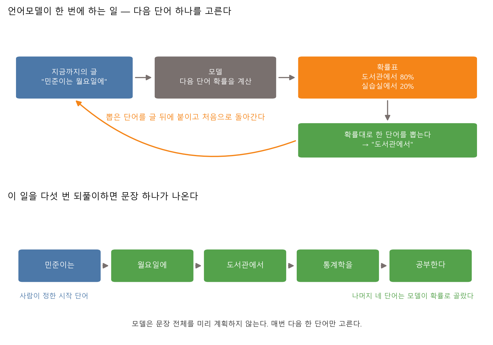
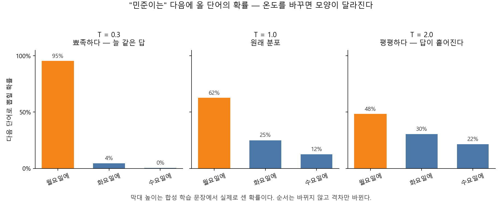
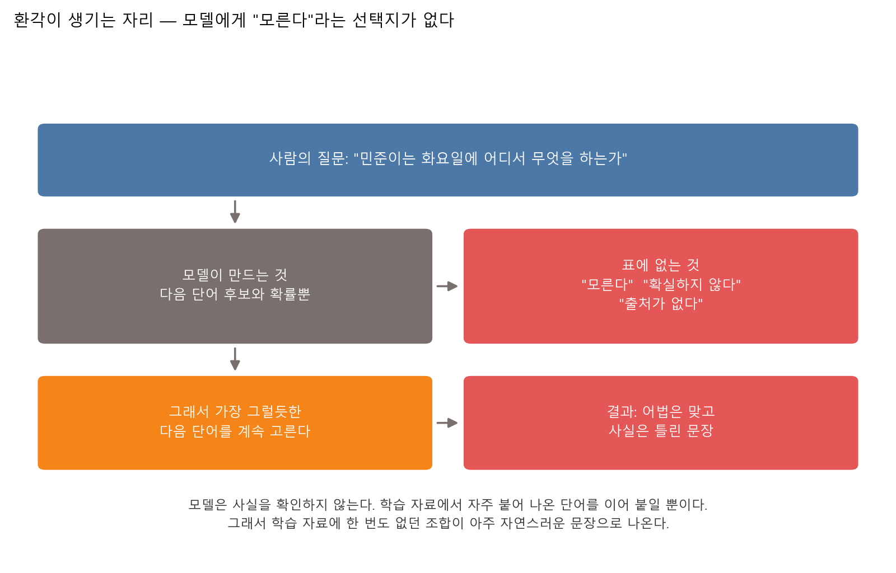
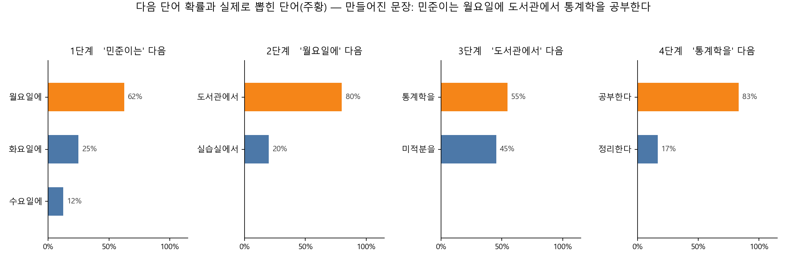
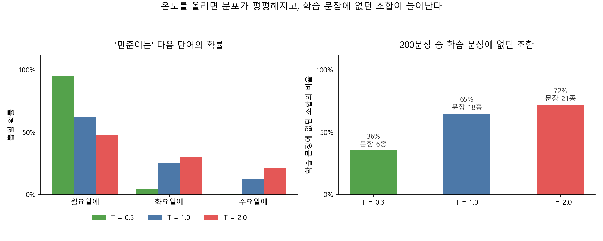

# 제11장 생성형 AI의 원리와 폐해 — 환각, 편향, 출처 검증

---

## [전반부] 이론 강의
---

### 학습 목표

- 언어모델이 한 번에 하는 일이 "다음 단어 하나 고르기"임을 설명한다
- 단어 빈도표를 확률표로 바꾸고, 확률대로 단어를 이어 붙여 문장을 만든다
- 온도를 바꾸면 확률 분포 모양이 어떻게 달라지는지 그림으로 읽는다
- 환각이 왜 기계적으로 생기는지, 어느 자리에서 생기는지 짚어 설명한다
- AI 답변을 확인됨·불확실·틀림·판단 보류로 나누고 근거 주소를 적는다

10장에서는 이미 있는 문장을 분류했다. 이번 장에서는 문장을 만드는 쪽으로 넘어간다. 만드는 절차를 직접 구현하면, AI가 그럴듯한 거짓말을 하는 일이 고장이 아니라 절차의 당연한 결과라는 것이 드러난다.

○ **이 장에서 하지 않는 것을 먼저 밝힌다**
  - 외부 AI 서비스를 코드로 부르지 않는다. API 키가 필요한 코드를 쓰지 않는다
  - 실제 GPT 계열 모델을 학습시키지 않는다. `torch`도 `tensorflow`도 쓰지 않는다
  - 이 장의 목표는 **문장을 만드는 절차를 손으로 확인하는 것**이다. numpy로 만든 아주 작은 언어모델을 쓴다
  - 실습에 쓰는 문장은 전부 **코드 안에 적어 둔 합성 한국어 문장**이다. 실제 사람도, 실제 기록도 아니다

---

### 1. 언어모델은 무엇을 하는가

언어모델(language model)은 글을 이해하는 프로그램이 아니다. 하는 일은 하나다.

```
지금까지의 글을 받아서, 다음에 올 단어의 확률을 매긴다
```

그게 전부다. 문장 전체를 미리 계획하지 않는다. 결론을 정해 놓고 거기까지 가는 길을 짜지도 않는다. 매번 다음 한 단어만 고른다.



**그림 11.1** 언어모델은 다음 단어 하나를 고르고, 그 단어를 글 뒤에 붙인 뒤 처음으로 돌아간다. 이 고리를 다섯 번 돌면 다섯 어절 문장이 나온다

이 그림에서 확인할 것은 고리의 방향이다. 모델이 뽑은 단어가 **다음 차례의 입력**이 된다. 그래서 세 번째 단어를 잘못 고르면, 네 번째와 다섯 번째는 그 잘못된 단어를 사실로 놓고 계산한다. 한 번 어긋나면 되돌아오지 않는다.

○ **자주 하는 오해**
  - "AI가 답을 알고 있다가 말로 풀어 준다" — 아니다. 답이라는 것이 미리 있는 자리가 없다
  - "AI가 인터넷을 찾아본다" — 검색 기능을 붙인 서비스가 아니면 찾지 않는다. 학습할 때 본 글의 빈도만 쓴다
  - "AI가 자기 답이 맞는지 안다" — 확률이 높은 단어를 골랐을 뿐이다. 확률이 높다는 것과 사실이라는 것은 다른 말이다

---

### 2. 다음 토큰 예측 — 확률표에서 단어 하나 뽑기

#### 2-1. 토큰은 글을 자르는 단위다

모델은 글자 하나하나를 다루지도, 문장 전체를 통째로 다루지도 않는다. 그 사이 크기로 자른 조각을 다룬다. 이 조각을 **토큰(token)**이라고 부른다.

실제 서비스에서 쓰는 토큰은 단어보다 작을 때가 많다. "공부한다"가 "공부" + "한다"로 잘리기도 한다. 이 장의 실습에서는 **어절 하나를 토큰 하나로** 쓴다. 자르는 규칙이 단순할수록 확률표를 눈으로 읽기 쉽다.

#### 2-2. 빈도를 세고, 확률로 바꾼다

실습 11.1이 쓰는 합성 학습 문장은 이런 모양이다.

```text
민준이는 월요일에 도서관에서 통계학을 공부한다
서연이는 화요일에 실습실에서 파이썬을 공부한다
지호는 수요일에 강의실에서 영어를 복습한다
```

서로 다른 문장이 12종이고, 자주 나오는 문장을 여러 번 넣어 27개로 펼쳤다. 어휘는 21개다.

이제 "앞 단어 뒤에 어떤 단어가 몇 번 나왔는가"를 센다.

```text
  '민준이는' 다음에 나온 단어 (모두 8번)
    월요일에       5번    62.5%
    화요일에       2번    25.0%
    수요일에       1번    12.5%
```

_출처: `practice/chapter11/results/11-1-next-word.log`_

횟수를 그 줄의 합으로 나누면 확률이 된다. 5 / 8 = 0.625다. 계산은 나눗셈 한 번이 전부다.

○ **이 표에 없는 것**
  - 단어의 뜻이 없다. "월요일"이 요일이라는 정보가 어디에도 없다
  - 문법 규칙이 없다. 주어 뒤에 부사어가 온다는 규칙을 적어 준 적이 없다
  - 사실 여부가 없다. 민준이가 실제로 월요일에 도서관에 가는지 확인할 자리가 없다

#### 2-3. 확률표에서 단어를 뽑는다

확률표가 있으면 문장을 만들 수 있다. 확률이 높은 단어일수록 자주 뽑히게 하면서, 낮은 단어도 가끔 뽑히게 한다.

이때 확률의 **모양**을 조절하는 값이 온도(temperature)다. 원래 확률을 `p`라고 하면, 온도 `T`를 적용한 값은 `p^(1/T)`를 다시 합이 1이 되도록 나눈 것이다.

- `T`가 1보다 작으면 큰 값이 더 커진다. 분포가 뾰족해진다. 늘 같은 답이 나온다
- `T`가 1보다 크면 값들이 서로 가까워진다. 분포가 평평해진다. 답이 흩어진다



**그림 11.2** 같은 단어 뒤의 확률을 온도만 바꿔 그렸다. 막대 순서는 바뀌지 않고 격차만 바뀐다

**표 11.1** 온도를 바꿨을 때 `민준이는` 다음에 올 단어의 확률

| 다음 단어 | T = 0.3 | T = 1.0 | T = 2.0 |
|---|---:|---:|---:|
| 월요일에 | 95.1% | 62.5% | 48.1% |
| 화요일에 | 4.5% | 25.0% | 30.4% |
| 수요일에 | 0.4% | 12.5% | 21.5% |

_출처: `practice/chapter11/results/11-2-hallucination.log`_

여기서 놓치기 쉬운 점이 하나 있다. 온도를 아무리 낮춰도 **1등이 바뀌지 않는다.** 온도는 순위를 다시 매기는 장치가 아니라 격차를 벌리거나 좁히는 장치다. 1등이 틀린 답이면, 온도를 낮출수록 늘 틀린 답이 나온다.

---

### 3. 프롬프트는 명령인가 데이터인가

프롬프트(prompt)는 우리가 AI에게 써 넣는 글이다. 사람은 이것을 명령으로 여긴다. 모델 쪽에서 보면 다르다.

○ **모델이 받는 것**
  - 프롬프트는 "지금까지의 글"의 맨 앞부분이다. 그 뒤를 이어 쓰는 것이 모델이 하는 일이다
  - "표로 정리해 줘"라는 문장이 명령으로 실행되는 것이 아니다. 그 문장 뒤에 표가 오는 글을 학습 자료에서 자주 봤기 때문에 표가 나온다
  - 그래서 프롬프트를 바꾸면 답이 바뀐다. 명령을 바꿔서가 아니라 **조건을 바꿔서** 바뀐다

실습 11.1에서 `START_WORD`가 바로 이 자리다. 학생이 시작 단어를 정하면 모델은 그 뒤를 잇는다. 시작 단어를 `지호는`으로 바꾸면 뒤따라 나오는 요일의 확률표가 통째로 달라진다.

**표 11.2** 같은 질문을 세 가지 방식으로 묻는 수업 활동 — 각자 쓰는 AI 도구에 넣고 답을 나란히 적는다

| 묻는 방식 | 프롬프트 예 | 무엇을 보는가 |
|---|---|---|
| 그냥 묻기 | 우리나라 대학 등록금은 얼마인가 | 숫자가 나오는가, 출처가 붙는가 |
| 조건을 붙여 묻기 | 2024년 기준 4년제 사립대 평균 등록금을 알려주고, 출처 기관과 연도를 함께 적어라 | 앞의 답과 숫자가 같은가 |
| 모른다고 답할 길을 열어 묻기 | 확실하지 않으면 "확인 필요"라고만 답하라. 추측한 숫자를 쓰지 마라 | 답이 짧아지는가, 숫자가 사라지는가 |

세 답을 나란히 놓고 숫자가 서로 다르면, 셋 중 최소 두 개는 틀렸다. 어느 것이 맞는지는 AI에게 다시 물어서 정할 수 없다. 6절의 절차로 밖에서 확인해야 한다.

○ **프롬프트로 할 수 있는 일과 없는 일**
  - 할 수 있는 일 — 형식 정하기, 분량 정하기, 답의 범위 좁히기, 모른다고 답할 길 열어 주기
  - 할 수 없는 일 — 학습 자료에 없는 사실을 만들어 내게 하기, 답이 맞는지 모델 스스로 확인하게 하기

---

### 4. 환각이 생기는 이유

환각(hallucination)은 모델이 그럴듯하지만 사실과 맞지 않는 내용을 내놓는 일이다. 이름 때문에 고장처럼 들리지만, 절차를 보면 고장이 아니다.



**그림 11.3** 모델이 만드는 것은 다음 단어 후보와 확률뿐이다. 그 표에 "모른다"라는 항목이 없다

실습 11.2의 작은 세계에서 참인 문장은 학습 문장 12종뿐이다. 목록에 없는 문장은 어법이 맞아도 이 세계에서는 틀린 문장이다. 그 틀린 문장이 어디서 생기는지 확률로 짚을 수 있다.

```text
    P(통계학을 | 도서관에서) = 54.5%
    P(미적분을 | 도서관에서) = 45.5%
```

_출처: `practice/chapter11/results/11-2-hallucination.log`_

두 값이 거의 반반이다. 어느 쪽이 뽑혀도 어법은 맞는다. 그런데 `민준이는 월요일에 도서관에서` 뒤에 참인 조합은 `통계학을` 한쪽뿐이다. `미적분을`이 뽑히면 그 순간 환각이 만들어진다. 모델은 두 선택의 차이를 모른다. 확률만 볼 뿐이다.

○ **환각이 생기는 조건 세 가지**
  - **확률이 갈리는 자리** — 후보 둘의 확률이 비슷하면 어느 쪽이든 나올 수 있다. 어법은 둘 다 맞는다
  - **"모른다"가 후보에 없다** — 확률표에는 단어만 들어 있다. 침묵이나 유보가 후보로 올라오지 않는다
  - **한 번 어긋나면 되돌아오지 않는다** — 잘못 뽑은 단어가 다음 단계의 입력이 된다. 뒤 단어는 그 잘못을 전제로 계산한다

○ **그래서 이런 대응은 통하지 않는다**
  - "온도를 낮추면 된다" — 실습 11.2에서 T = 0.3으로 낮춰도 200문장 중 71개(35.5%)가 학습 문장에 없던 조합이었다
  - "AI에게 확실하냐고 다시 물으면 된다" — 그 질문에 대한 답도 같은 방식으로 만들어진다. 검사하는 것이 아니라 이어 쓰는 것이다
  - "출처를 붙이라고 하면 된다" — 출처처럼 생긴 글자열도 같은 방식으로 만들어진다. 주소가 열리는지는 사람이 눌러 봐야 안다

---

### 5. 편향은 어디서 오는가

편향(bias)은 답이 한쪽으로 치우치는 일이다. 원인을 멀리서 찾을 것 없다. 확률표가 곧 원인이다.

실습 11.1의 학습 자료에는 월요일 문장을 5번, 화요일 문장을 2번, 수요일 문장을 1번 넣었다. 그 결과가 그대로 확률이 됐다.

```text
  '민준이는' 다음에 나온 단어 (모두 8번)
    월요일에       5번    62.5%
    화요일에       2번    25.0%
    수요일에       1번    12.5%
```

_출처: `practice/chapter11/results/11-1-next-word.log`_

자료를 모을 때 월요일 이야기를 다섯 배 더 넣었을 뿐인데, 모델은 "민준이는 주로 월요일에 뭔가 한다"는 답을 내놓는다. 자료의 치우침이 답의 치우침이 된다.

더 눈에 띄는 것은 0이 되는 자리다.

```text
  P(파이썬을 | 실습실에서) = 85.7%
  P(파이썬을 | 도서관에서) = 0.0%
```

_출처: `practice/chapter11/results/11-1-next-word.log`_

두 값이 다른 이유는 "실습실에 컴퓨터가 있어서"가 아니다. 학습 문장에서 그 두 단어가 붙어 나온 횟수가 다르기 때문이다. 자료에 한 번도 없던 조합은 확률이 0이고, 확률이 0이면 **후보에조차 오르지 않는다.** 자료에 빠진 것은 답에서도 빠진다.

○ **실제 서비스에서 이 구조가 어떻게 나타나는가**
  - 특정 직업에 특정 성별이 자주 붙어 나온 자료로 학습하면, 그 직업을 물었을 때 그 성별이 먼저 나온다
  - 영어 자료가 훨씬 많은 모델은 한국 지역·제도·법령을 물으면 확률이 얕은 자리에서 답을 만든다
  - 오래된 자료로 학습하면 과거의 관행을 현재의 기준으로 답한다. Google 머신러닝 단기집중과정은 1960년대 주택 가격 자료가 당시의 차별적 대출 관행을 그대로 담고 있는 예를 든다[^google-bias]

○ **편향은 지울 수 있는가**
  - 완전히 지울 수 없다. 자료가 세상의 완전한 표본인 경우가 없다
  - 할 수 있는 일은 **어느 쪽으로 치우쳤는지 알고 쓰는 것**이다. 10장의 텍스트 편향 메모가 같은 이야기였다

---

### 6. AI 답변을 검증하는 절차

앞의 다섯 절을 한 문장으로 줄이면 이렇다. **모델은 사실을 확인하지 않는다.** 확인은 사람 몫이다. 확인을 기분이나 감으로 하지 않으려면 절차가 필요하다.

**표 11.3** AI 답변 검증 4단계

| 단계 | 하는 일 | 판단 기준 |
|---|---|---|
| 1. 나누기 | 답을 문장 단위로 쪼개고, 확인이 필요한 것에 표시한다 | 수치·인물·기관·연도·논문 제목·법령 조항·URL은 전부 표시 |
| 2. 다시 묻기 | 같은 질문을 표현을 바꿔 두세 번 묻는다 | 답이 매번 같은가. 다르면 최소 하나는 틀렸다 |
| 3. 밖에서 대조 | AI가 아닌 곳에서 확인한다 | 원 자료(통계표·논문 원문·법령 원문)까지 간다. 블로그 요약에서 멈추지 않는다 |
| 4. 표시하고 쓰기 | 확인 결과를 네 등급으로 적는다 | 확인됨 / 불확실 / 틀림 / 판단 보류 |

3단계에서 확인이 필요 없는 답도 있다. 아이디어를 여러 개 뽑아 달라거나 문장을 다듬어 달라는 요청은 사실 여부를 물은 것이 아니다. 확인이 필요한 답과 그렇지 않은 답을 먼저 갈라 두면 검증에 드는 품이 줄어든다.

**표 11.4** AI 답변 검증표 — 수업 활동. 각자 쓰는 AI 도구에 질문을 하나 넣고 아래 표를 채운다

| AI가 말한 것 | 확인 방법 | 확인 결과 | 근거 주소 |
|---|---|---|---|
| (답에서 그대로 옮겨 적는다) | (어디서 어떻게 확인했는지) | 확인됨 / 불확실 / 틀림 / 판단 보류 | (열리는 주소나 문헌 정보) |
| | | | |
| | | | |

○ **네 등급을 나누는 기준**
  - **확인됨** — 원 자료에서 같은 값을 찾았다. 근거 주소를 적었고 그 주소가 열린다
  - **불확실** — 비슷한 내용을 찾았지만 숫자나 연도가 다르다. 또는 출처가 2차 자료뿐이다
  - **틀림** — 원 자료에서 다른 값을 찾았다. 또는 AI가 댄 논문·기관·주소가 존재하지 않는다
  - **판단 보류** — 확인할 자료를 찾지 못했다. 없다는 뜻이 아니라 **아직 모른다**는 뜻이다

○ **표를 채울 때 자주 나오는 함정**
  - 근거 주소 칸에 AI가 알려준 주소를 그대로 옮겨 적기 — 눌러서 열어 본 주소만 적는다
  - 검색 결과 첫 화면의 요약만 보고 확인됨으로 적기 — 요약도 자동 생성일 수 있다
  - 틀림으로 적기 아까워 불확실로 적기 — 등급을 낮춰 적으면 검증표가 쓸모없어진다

○ **환각 사례 한 건을 남기는 방법**
  - 표에서 틀림으로 적은 줄 하나를 고른다
  - AI가 말한 것과 원 자료의 값을 나란히 적는다
  - 같은 질문을 어떻게 고쳐 물었더니 답이 달라졌는지 프롬프트를 함께 적는다

---

### 7. 직접 움직여 보는 웹 자료

수업에서 다 보여줄 수 없는 그림은 아래 자료로 보충한다. 모두 무료이고, 아래 설명은 각 페이지를 열어 확인한 내용이다.

| 자료 | 무엇을 볼 수 있는가 | 주소 |
|---|---|---|
| Transformer Explainer | GPT-2 small에 직접 쓴 문장을 넣고 다음 토큰 확률이 계산되는 과정을 본다. temperature 슬라이더와 top-k·top-p를 바꿔 분포가 어떻게 달라지는지 확인한다 | https://poloclub.github.io/transformer-explainer/ |
| Google 머신러닝 단기집중과정(한국어), LLM이란 무엇인가 | 토큰 예측이 무엇인지 설명하고, 대명사 "it"이 어떤 명사를 가리키는지 정하는 셀프 어텐션 그림을 보여준다 | https://developers.google.com/machine-learning/crash-course/llm/transformers?hl=ko |
| Google 머신러닝 단기집중과정(한국어), 미세조정과 프롬프트 엔지니어링 | 제로샷·원샷·퓨샷 프롬프팅을 예로 설명하고, 기반 모델을 특정 작업에 맞추는 절차를 다룬다 | https://developers.google.com/machine-learning/crash-course/llm/tuning?hl=ko |
| Google 머신러닝 단기집중과정(한국어), 편향의 유형 | 보고 편향, 과거 편향, 자동화 편향, 표본 선택 편향 등을 예시와 함께 나눈다 | https://developers.google.com/machine-learning/crash-course/fairness/types-of-bias?hl=ko |

○ Transformer Explainer는 실습 11.1·11.2와 그대로 짝이 된다. 우리 실습이 어절 21개짜리 표로 하는 일을, 이 페이지는 파라미터 1억 2,400만 개짜리 모델로 한다. temperature 슬라이더를 움직였을 때 막대 모양이 달라지는 것이 그림 11.2와 같은 현상이다

○ Google 페이지의 편향 목록은 5절과 짝이 된다. 우리 실습의 "월요일 문장을 다섯 배 넣었더니 62.5%가 나왔다"가 그 목록의 표본 선택 편향에 해당한다

---

## [후반부] 실습
---

두 가지를 한다. 첫 번째는 다음 단어를 예측하는 언어모델을 직접 만드는 실습이고, 두 번째는 그 모델로 환각이 만들어지는 순간을 잡는 실습이다.

#### 실행 환경

```bash
cd practice/chapter11
python -m pip install -r ../requirements.txt
```

필요한 패키지는 numpy와 matplotlib뿐이다. GPU도, 인터넷 연결도, API 키도 필요 없다. 두 실습 모두 노트북에서 몇 초 안에 끝난다.

두 실습이 함께 쓰는 학습 문장은 `practice/chapter11/code/_tinylm.py`에 들어 있다. 전부 **코드 안에 적어 둔 합성 한국어 문장**이다. 실제 사람도, 실제 기록도 아니다. 개인정보가 들어갈 자리가 없다.

이 작은 세계에서 "사실"은 그 파일에 적힌 문장 12종뿐이다. 목록에 없는 문장은 어법이 맞아도 이 세계에서는 틀린 문장이다.

---

### 실습 11.1: 다음 단어를 예측하는 작은 언어모델 만들기

#### 실습 목표

- "앞 단어 → 다음 단어" 빈도를 세어 확률표로 바꾼다
- 확률표를 보고 다음 단어를 스스로 예측한 뒤, 모델이 뽑은 단어와 맞춰 본다
- 이 모델이 단어의 뜻을 하나도 모른다는 것을 확률값으로 확인한다

#### 데이터

합성 한국어 문장 12종이다. 모두 "누가 / 언제 / 어디서 / 무엇을 / 어떻게 한다" 다섯 어절로 되어 있다. 자주 나오는 문장을 여러 번 넣어 27개로 펼쳤다. 어절 하나를 토큰 하나로 쓰므로 어휘는 21개다.

#### 실행 명령

```bash
cd practice/chapter11/code
python 11-1-next-word.py
```

#### 핵심 코드

파일 맨 위에 학생이 바꿀 두 줄이 있다.

```python
START_WORD = "민준이는"   # 문장을 시작할 단어. 학습 문장에 있는 단어여야 한다
N_WORDS = 5               # 만들 어절 수. 학습 문장이 다섯 어절이라 5가 기본값이다
```

빈도를 세는 부분은 이렇게 짧다.

```python
for sentence in corpus:
    for prev, nxt in zip(sentence[:-1], sentence[1:]):
        counts[index[prev], index[nxt]] += 1.0
```

빈도를 확률로 바꾸는 부분은 나눗셈 한 번이다.

```python
row_sum = counts.sum(axis=1, keepdims=True)
probs[nonzero] = counts[nonzero] / row_sum[nonzero]
```

_전체 코드는 `practice/chapter11/code/11-1-next-word.py`와 `practice/chapter11/code/_tinylm.py` 참고_

#### 실행 결과

아래는 기본값(`START_WORD = "민준이는"`, `N_WORDS = 5`)으로 실행한 로그다.

```text
서로 다른 학습 문장: 12종
횟수만큼 펼친 학습 문장: 27개
단어 수(어휘): 21개
설정: START_WORD=민준이는, N_WORDS=5, SEED=11

[1] 빈도표 — 앞 단어 뒤에 어떤 단어가 몇 번 나왔는가
  '민준이는' 다음에 나온 단어 (모두 8번)
    월요일에       5번    62.5%
    화요일에       2번    25.0%
    수요일에       1번    12.5%

  '월요일에' 다음에 나온 단어 (모두 10번)
    도서관에서      8번    80.0%
    실습실에서      2번    20.0%

[3] 확률대로 단어를 이어 붙여 문장을 만든다
  1단계  '민준이는' 다음 -> '월요일에' 선택 (확률 62.5%)
  2단계  '월요일에' 다음 -> '도서관에서' 선택 (확률 80.0%)
  3단계  '도서관에서' 다음 -> '통계학을' 선택 (확률 54.5%)
  4단계  '통계학을' 다음 -> '공부한다' 선택 (확률 83.3%)
  만들어진 문장: 민준이는 월요일에 도서관에서 통계학을 공부한다
  학습 문장에 그대로 있는 문장인가: 있다
```

_출처: `practice/chapter11/results/11-1-next-word.log`_



**그림 11.4** 네 단계에서 각각 후보와 확률을 그렸다. 주황 막대가 실제로 뽑힌 단어다

같은 방법으로 문장을 다섯 개 더 만들면 이렇게 나온다.

```text
  1. 민준이는 월요일에 실습실에서 영어를 복습한다   [학습 문장에 없던 새 조합]
  2. 민준이는 화요일에 실습실에서 파이썬을 연습한다   [학습 문장 그대로]
  3. 민준이는 월요일에 도서관에서 미적분을 복습한다   [학습 문장에 없던 새 조합]
  4. 민준이는 월요일에 도서관에서 통계학을 공부한다   [학습 문장 그대로]
  5. 민준이는 화요일에 도서관에서 통계학을 공부한다   [학습 문장에 없던 새 조합]
  5개 중 학습 문장 그대로인 것: 2개
```

_출처: `practice/chapter11/results/11-1-next-word.log`_

#### 결과 읽기

○ **모델이 아는 것은 빈도뿐이다**
  - `민준이는` 뒤에 `월요일에`가 62.5%로 오는 이유는 학습 문장 8개 중 5개가 그랬기 때문이다
  - 요일이라는 개념도, 월요일이 한 주의 시작이라는 정보도 표에 없다

○ **뜻을 모른다는 것을 숫자로 확인한다**
  - `P(파이썬을 | 실습실에서) = 85.7%`, `P(파이썬을 | 도서관에서) = 0.0%`
  - 두 값이 다른 이유는 실습실에 컴퓨터가 있어서가 아니다. 두 단어가 붙어 나온 횟수가 달라서다
  - 21개 단어를 뜻 없는 기호로 바꿔도 이 모델의 계산은 한 글자도 달라지지 않는다

○ **다섯 문장 중 세 개가 학습 문장에 없던 조합이다**
  - 세 문장 모두 어법이 맞고 읽기에 자연스럽다
  - 그런데 이 세계에서 참인 문장 12종에는 없다. 모델은 그 차이를 구분하지 못한다
  - 이 지점이 다음 실습의 출발선이다

#### 해 보기

`START_WORD`와 `N_WORDS`를 바꿔 다시 실행한다.

1. `START_WORD`를 `서연이는`, `지호는`, `하윤이는`으로 바꾼다. 뒤따르는 요일의 확률표가 어떻게 달라지는가
2. `START_WORD`를 `월요일에`처럼 문장 중간의 단어로 바꾼다. 몇 어절짜리 문장이 나오는가
3. `N_WORDS`를 8로 늘린다. 다섯 어절보다 길어지는가, 아니면 다섯에서 멈추는가. 왜 그런가
4. `금요일에`처럼 학습 문장에 없는 단어를 `START_WORD`에 넣으면 무엇이 출력되는가

○ 3번의 답은 확률표 안에 있다. 마지막 어절(`공부한다`, `복습한다` 등) 뒤에는 어떤 단어도 온 적이 없어서 그 줄이 통째로 비어 있다

---

### 실습 11.2: 환각은 어디서 생기는가

#### 실습 목표

- 온도를 바꿔 확률 분포를 뾰족하게·평평하게 만들고 결과를 비교한다
- 학습 문장에 없던 조합이 만들어지는 순간을 어절 단위로 짚는다
- 온도를 낮추면 환각이 사라지는지 숫자로 확인한다

#### 데이터

실습 11.1과 **똑같은 모델, 똑같은 학습 문장**을 쓴다. 달라지는 것은 온도 하나다.

#### 실행 명령

```bash
cd practice/chapter11/code
python 11-2-hallucination.py
```

#### 핵심 코드

학생이 바꿀 값은 두 줄이다.

```python
TEMPERATURES = [0.3, 1.0, 2.0]   # 온도 세 개. 낮으면 뾰족, 높으면 평평
START_WORD = "민준이는"           # 문장을 시작할 단어 = 사람이 주는 프롬프트
```

온도를 적용하는 계산은 두 줄이다.

```python
scaled[mask] = prob_row[mask] ** (1.0 / temperature)
return scaled / scaled.sum()
```

만든 문장이 학습 문장과 어디서 갈라졌는지 세는 부분은 앞에서부터 맞는 어절 수를 센다.

```python
k = _tinylm.match_length(words, truths)
marked[k] = f"[{marked[k]}]"      # 갈라진 어절을 대괄호로 표시한다
```

_전체 코드는 `practice/chapter11/code/11-2-hallucination.py` 참고_

#### 실행 결과

```text
이 세계에서 참인 문장: 12종  (이 목록에 없으면 틀린 문장이다)
설정: START_WORD=민준이는, TEMPERATURES=[0.3, 1.0, 2.0], N_SAMPLES=200, SEED=2026

  --- T = 0.3 ---
   1. 민준이는 월요일에 도서관에서 통계학을 공부한다
      학습 문장 그대로
   이 온도에서 처음 나온 새 조합: 민준이는 월요일에 도서관에서 [미적분을] 공부한다
      4번째 어절에서 갈라짐
   200문장 중 학습 문장에 없던 조합: 71개 (35.5%), 서로 다른 문장 6종

  --- T = 1.0 ---
   2. 민준이는 월요일에 도서관에서 통계학을 [정리한다]
      5번째 어절에서 갈라짐 -> 학습 문장에 없는 조합
   200문장 중 학습 문장에 없던 조합: 130개 (65.0%), 서로 다른 문장 18종

  --- T = 2.0 ---
   1. 민준이는 화요일에 [도서관에서] 미적분을 복습한다
      3번째 어절에서 갈라짐 -> 학습 문장에 없는 조합
   200문장 중 학습 문장에 없던 조합: 144개 (72.0%), 서로 다른 문장 21종
```

_출처: `practice/chapter11/results/11-2-hallucination.log`_

**표 11.5** 온도별 200문장 결과

| 온도 | 학습 문장에 없던 조합 | 비율 | 서로 다른 문장 |
|---|---:|---:|---:|
| T = 0.3 | 71개 | 35.5% | 6종 |
| T = 1.0 | 130개 | 65.0% | 18종 |
| T = 2.0 | 144개 | 72.0% | 21종 |

_출처: `practice/chapter11/results/11-2-hallucination.log`_



**그림 11.5** 왼쪽은 온도별 다음 단어 확률, 오른쪽은 온도별로 학습 문장에 없던 조합이 나온 비율

#### 결과 읽기

○ **온도를 올리면 답이 흩어진다**
  - T = 0.3에서는 문장 6종만 나왔다. T = 2.0에서는 21종이 나왔다
  - 같은 모델, 같은 학습 자료인데 나오는 문장의 가짓수가 세 배 넘게 늘었다

○ **온도를 낮춰도 환각이 사라지지 않는다**
  - T = 0.3에서도 200문장 중 71개(35.5%)가 학습 문장에 없던 조합이었다
  - 처음 나온 새 조합은 `민준이는 월요일에 도서관에서 [미적분을] 공부한다`였다. 네 번째 어절에서 갈라졌다
  - 그 자리의 확률이 54.5% 대 45.5%로 반반이라, 온도를 낮춰도 격차가 크게 벌어지지 않는다

○ **갈라지는 자리가 앞쪽일수록 문장이 더 크게 달라진다**
  - T = 2.0의 예에서는 세 번째 어절에서 갈라졌다. 뒤 두 어절이 통째로 바뀐다
  - T = 1.0의 예에서는 다섯 번째 어절에서 갈라졌다. 마지막 서술어 하나만 다르다
  - 어느 쪽이든 사람 눈에는 똑같이 자연스러운 문장으로 보인다. 어디서 갈라졌는지는 학습 문장과 대조해야 알 수 있다

○ **이것이 실제 AI 서비스와 어떻게 이어지는가**
  - 우리 모델은 후보가 2~3개뿐인데도 35% 넘게 새 조합을 만들었다
  - 실제 모델은 후보가 수만 개다. 갈라질 수 있는 자리가 훨씬 많다
  - 그래서 "이 답이 맞는가"는 모델 안에서 답할 수 없는 질문이다. 6절의 검증 절차가 필요한 이유다

#### 해 보기

코드 위쪽의 값을 바꿔 다시 실행한다.

1. `TEMPERATURES`를 `[0.1, 0.5, 3.0]`으로 바꾼다. T = 0.1에서 새 조합 비율이 0이 되는가
2. `START_WORD`를 `하윤이는`으로 바꾼다. 새 조합 비율이 올라가는가 내려가는가
3. `_tinylm.py`의 `SENTENCES_WITH_COUNT`에서 어떤 문장의 횟수를 크게 늘린다. 그 문장이 나오는 비율이 어떻게 달라지는가

○ 3번은 5절의 편향과 이어진다. 자료에서 어떤 문장을 더 많이 넣으면 답이 그쪽으로 쏠린다

---

### 책임 있는 AI 체크

이 장은 점검 자체가 주제다. 아래 항목이 곧 실습 결과물이다.

**표 11.6** 제출 전 점검

| 점검 항목 | 확인 질문 |
|---|---|
| 환각 식별 | 답에서 확인할 수 없는 내용을 따로 표시했는가 |
| 출처 확인 | 수치·인물·논문·URL이 실재하는지 검색해 봤는가 |
| 과장 표현 | "항상", "모든", "완벽히"가 나온 자리를 표시했는가 |
| 한쪽 관점 | 반대 논거가 빠졌는지 확인했는가 |
| 등급 표기 | 항목마다 확인됨·불확실·틀림을 적었는가 |
| 미확인 사용 | 확인하지 못한 내용을 단정으로 옮기지 않았는가 |

---

### 과제 (LMS 제출)

수업 시간에 실습을 실행했는지만 확인한다. 따로 보고서를 쓰지 않는다.

#### 제출물

두 실습을 실행하면 만들어지는 그림 파일 두 장을 LMS에 올린다.

1. `practice/chapter11/results/next_word_probs.png`
2. `practice/chapter11/results/hallucination_by_temperature.png`

#### 평가 기준

- 두 파일을 올리면 완료로 인정한다. 어떤 문장이 나왔는지는 채점하지 않는다
- 실습 11.1에서 `START_WORD`를 바꿨다면 바뀐 그림이 올라온다. 기본값 그대로여도 인정한다

#### 마감

- 실습 수업일 포함 7일 이내

---

### 핵심 정리

| 개념 | 한 줄 정리 |
|---|---|
| 언어모델 | 문장을 계획하지 않는다. 다음 단어 하나를 고르는 일을 되풀이한다 |
| 토큰 | 글을 자르는 단위. 이 장의 실습에서는 어절 하나가 토큰 하나다 |
| 다음 토큰 예측 | 빈도를 세어 확률로 바꾸고, 그 확률대로 단어를 뽑는다 |
| 온도 | 확률 분포의 격차를 조절한다. 순위는 바꾸지 않는다 |
| 프롬프트 | 명령이 아니라 앞에 붙는 글이다. 조건을 바꿔 답을 바꾼다 |
| 환각 | 확률이 갈리는 자리에서 생긴다. "모른다"가 후보에 없어서 사라지지 않는다 |
| 편향 | 학습 자료의 빈도 차이가 그대로 답의 치우침이 된다. 자료에 없으면 후보에도 없다 |
| 검증 | 나누기 → 다시 묻기 → 밖에서 대조 → 네 등급으로 표시하기 |

다음 장에서는 AI에게 코드를 쓰게 한다. 이번 장에서 확인한 검증 절차를 그대로 코드에 적용한다.

---

[^google-bias]: Google, "편향의 유형", 머신러닝 단기집중과정. https://developers.google.com/machine-learning/crash-course/fairness/types-of-bias?hl=ko (2026년 8월 24일 확인)
