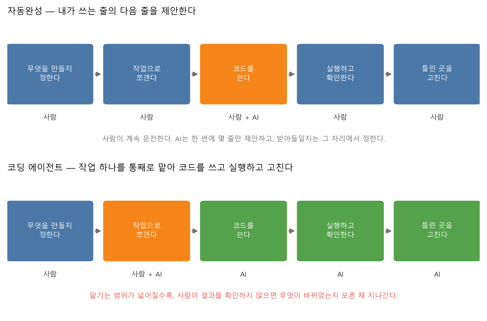
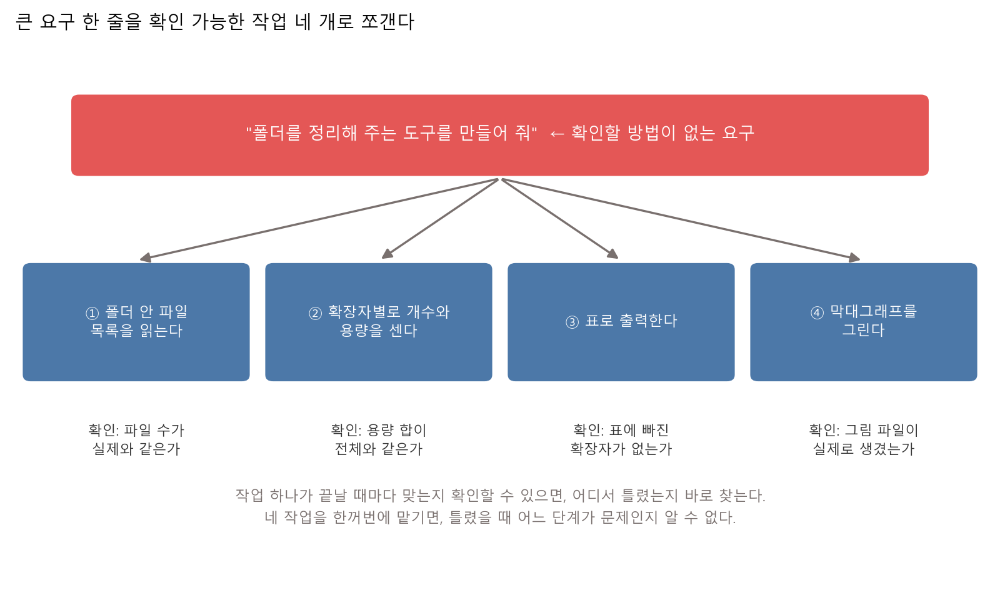
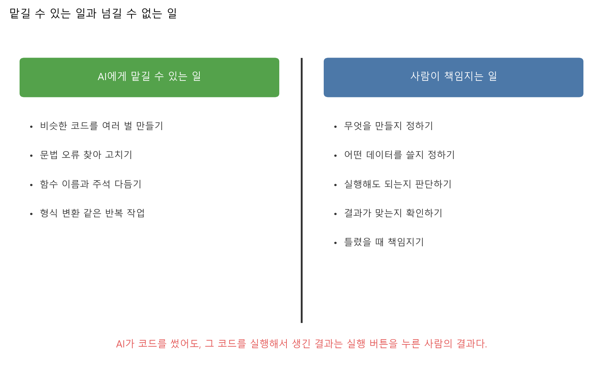
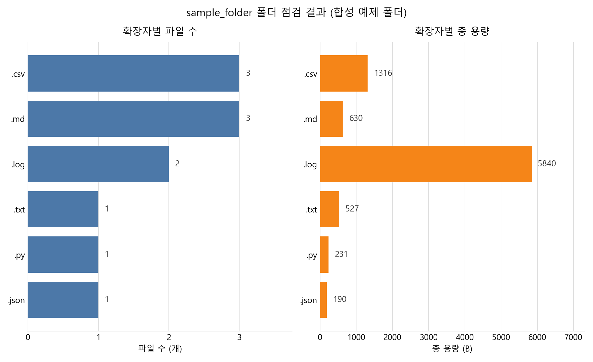
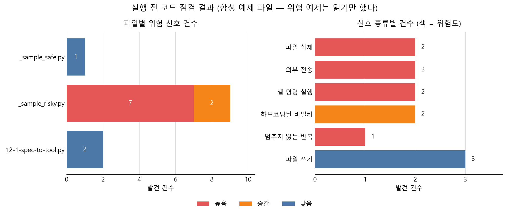

# 제12장 AI 코딩 에이전트와 책임 있는 자동화 — 맡기되 확인한다

---

## [전반부] 이론 강의
---

### 학습 목표

- 코딩 에이전트와 자동완성이 각각 어디까지 맡는지 구분해 설명한다
- 큰 요구 하나를 확인할 수 있는 작업 단위로 쪼갠다
- 프롬프트를 입력·출력·하면 안 되는 일·실패 시 동작 네 칸의 명세로 쓴다
- AI가 만든 코드에서 위험 신호를 정해진 순서로 찾는다
- AI 도구에 넣지 말아야 할 자료를 구분하고, 자동화 결과의 책임이 어디에 있는지 말한다

지난 장에서 생성형 AI의 답을 확인하는 법을 다뤘다. 틀린 문장은 읽고 넘기면 그것으로 끝난다. 이번 장의 대상은 문장이 아니라 **실행되는 코드**다. 코드는 읽고 넘기는 것이 아니라 실행된다. 실행하는 순간 파일이 지워지고, 데이터가 밖으로 나가고, 명령이 돈다. 그래서 확인하는 자리가 앞으로 당겨진다. 실행 **전에** 읽어야 한다.

---

### 1. 코딩 에이전트는 자동완성과 무엇이 다른가

#### 1-1. 맡기는 단위가 줄에서 작업으로 바뀐다

코드 자동완성은 오래된 기능이다. 변수 이름을 몇 글자 치면 나머지를 채워 준다. 최근 도구는 다음 몇 줄을 통째로 제안한다. 그래도 운전대는 사람이 잡고 있다. 제안이 마음에 안 들면 그 자리에서 지운다.

코딩 에이전트는 맡기는 단위가 다르다. "이 폴더를 읽어서 표로 만들어 줘"라고 하면, 코드를 쓰고, 실행하고, 오류가 나면 고치고, 다시 실행한다. 사람이 한 번도 끼어들지 않아도 여러 번 돌아간다.



**그림 12.1** 같은 다섯 단계를 누가 맡는지가 다르다. 아래쪽에서는 코드 작성·실행·수정 세 단계가 통째로 넘어간다

#### 1-2. 넓게 맡길수록 확인할 것이 늘어난다

그림 12.1의 아래쪽에서 사람이 확실히 맡는 단계는 첫 칸 하나다. 나머지는 AI가 하거나 같이 한다. 여기서 두 가지가 동시에 일어난다.

○ **좋아지는 것** — 반복 작업이 줄어든다. 같은 모양의 코드를 열 벌 쓰는 일, 오타를 찾는 일, 함수 이름을 다듬는 일에서 시간이 덜 든다

○ **나빠지는 것** — 무엇이 바뀌었는지 모른 채 지나가기 쉬워진다. 자동완성은 제안을 받아들일 때마다 사람이 그 줄을 읽는다. 에이전트는 파일 여러 개를 한 번에 고치므로, 읽지 않으면 읽지 않은 채로 끝난다

**표 12.1** 맡기는 범위에 따라 달라지는 것

| 구분 | 자동완성 | 코딩 에이전트 |
|---|---|---|
| 한 번에 만드는 양 | 몇 줄 | 파일 여러 개 |
| 사람이 보는 시점 | 제안이 뜰 때마다 | 다 끝난 다음 |
| 실행 여부 | 사람이 실행한다 | 스스로 실행하고 고친다 |
| 놓치기 쉬운 것 | 문맥에 안 맞는 줄 | 내가 시키지 않은 파일 수정 |
| 필요한 대비 | 그 줄을 읽는다 | 무엇을 만들지 미리 적고, 결과를 표로 확인한다 |

GitHub 공식 문서도 같은 자리를 짚는다. Copilot의 인라인 제안에 대해 "사용자는 제안을 수락하기 전에 제안을 검토하고 유효성을 검사하여 정확하고 적절한지 확인해야 합니다"라고 적어 두었다.[^gh-copilot] 도구를 만든 쪽이 직접 붙인 조건이다.

---

### 2. 좋은 작업 단위 — 확인할 수 있게 쪼갠다

#### 2-1. 확인 방법이 없는 요구는 작업이 아니다

"폴더를 정리해 주는 도구를 만들어 줘"라고 시키면 무언가 나오기는 한다. 문제는 나온 것이 맞는지 확인할 방법이 없다는 점이다. 정리가 무엇인지 정하지 않았기 때문이다. 이름을 바꾸는 것인가, 옮기는 것인가, 지우는 것인가.

작업 단위를 고르는 기준은 하나다. **끝났을 때 맞는지 틀렸는지 셀 수 있는가.**



**그림 12.2** 요구 한 줄을 네 작업으로 쪼갠다. 작업마다 확인 방법이 하나씩 붙는다

#### 2-2. 쪼개면 틀린 자리가 보인다

네 작업을 한꺼번에 맡기면, 결과가 이상할 때 어느 단계가 문제인지 알 수 없다. 하나씩 맡기면 다르다. 파일 수가 안 맞으면 ①번이 틀렸고, 용량 합이 안 맞으면 ②번이 틀렸다.

○ **작업 하나의 크기 기준**
  - 결과를 한 줄로 확인할 수 있는가 (파일 11개, 합계 8734 B)
  - 틀렸을 때 그 작업만 다시 시킬 수 있는가
  - 이 작업이 다른 작업의 결과를 기다리지 않아도 되는가

○ **쪼개기 어려울 때**
  - 확인 방법부터 먼저 쓴다. "무엇을 보고 맞다고 할 것인가"에 답이 안 나오면 아직 작업이 아니다
  - 답이 안 나오는 이유는 대개 내가 원하는 것을 아직 정하지 않았기 때문이다

---

### 3. 프롬프트를 명세로 쓰는 법

#### 3-1. 네 칸을 채운다

AI에게 주는 지시문을 대화체로 쓰면 대화가 돌아온다. 명세로 쓰면 확인할 수 있는 것이 돌아온다. 채울 칸은 네 개다.

**표 12.2** 명세의 네 칸

| 칸 | 무엇을 적는가 | 안 적으면 생기는 일 |
|---|---|---|
| 입력 | 무엇을 읽는가. 어디에 있는가 | 엉뚱한 폴더를 읽는다 |
| 출력 | 무엇이 나오는가. 어디에 저장되는가 | 화면에만 찍고 끝난다 |
| 하면 안 되는 일 | 건드리면 안 되는 것 | 원본을 고쳐 놓는다 |
| 실패 시 동작 | 잘못됐을 때 어떻게 하는가 | 조용히 빈 결과를 내놓는다 |

네 번째 칸이 가장 자주 빠진다. 그런데 사고는 대부분 여기서 난다. 입력 폴더가 없을 때 멈추지 않고 빈 표를 만들어 버리면, 사람은 "파일이 0개구나"라고 읽는다. 실제로는 폴더 이름을 잘못 적은 것이다.

#### 3-2. 같은 요구를 두 가지로 써 본 것

**표 12.3** 대화체 요구와 명세

| 대화체로 쓴 것 | 명세로 쓴 것 |
|---|---|
| "폴더 안에 뭐가 있는지 정리해 줘" | 입력: `practice/chapter12/sample_folder/`, 하위 폴더 포함 |
| | 출력: 확장자별 파일 수·총 용량 표, CSV 한 장, 막대그래프 한 장 |
| | 금지: 입력 폴더의 파일을 지우거나 고치지 않는다. 인터넷에 접속하지 않는다 |
| | 실패: 폴더가 없으면 `FileNotFoundError`를 내고 멈춘다. 빈 표를 만들지 않는다 |

오른쪽 칸이 실습 12.1 코드 맨 위에 그대로 들어 있다. 명세를 먼저 쓰면 좋은 점이 하나 더 생긴다. **다 만든 뒤에 명세와 실제 동작을 하나씩 대조할 수 있다.** 실습 12.1은 그 대조를 코드가 직접 하고 표로 찍는다.

○ 명세는 AI에게 주기 위한 것만이 아니다. 사람이 혼자 코드를 쓸 때도 같은 네 칸을 먼저 적으면, 다 쓴 뒤에 무엇을 확인할지가 이미 정해져 있다

---

### 4. AI가 만든 코드를 읽는 순서

받은 코드를 처음부터 끝까지 정독하는 것은 오래 걸리고, 오래 걸리면 안 읽게 된다. 순서를 정해 두면 짧게 끝난다.

**표 12.4** 실행 전에 확인하는 여섯 가지

| 순서 | 무엇을 보는가 | 찾는 것 |
|---|---|---|
| 1 | 어떤 파일을 읽는가 | 내가 준 것 말고 다른 경로를 읽지 않는가 |
| 2 | 어떤 파일을 쓰거나 지우는가 | 결과 폴더 밖에 쓰지 않는가. 지우는 줄이 있는가 |
| 3 | 밖으로 나가는 것이 있는가 | 네트워크로 무언가 보내지 않는가 |
| 4 | 셸 명령을 실행하는가 | 문자열을 붙여 만든 명령이 있는가 |
| 5 | 비밀키가 코드에 박혀 있는가 | 키·비밀번호가 문자열로 적혀 있지 않은가 |
| 6 | 멈추는 조건이 있는가 | 끝나지 않는 반복이 있지 않은가 |

여섯 가지를 다 본 다음에도 곧바로 진짜 데이터에 돌리지 않는다.

○ **작은 입력으로 먼저 돌린다**
  - 파일 3개짜리 폴더를 만들어 거기에 먼저 돌린다. 결과가 예상과 같은지 본다
  - 되돌릴 수 없는 동작(삭제·전송·덮어쓰기)이 있으면, 그 줄을 주석 처리한 채로 한 번 돌려 본다

○ **실행 기록을 남긴다**
  - 무엇을 어떤 설정으로 돌렸고 무엇이 나왔는지를 로그 파일로 남긴다
  - 이 강의 실습이 `practice/chapter12/results/*.log` 를 남기는 이유가 같다. 결과를 기억이 아니라 파일에서 인용하기 위해서다
  - 로그가 없으면 "그때는 됐는데"라는 말밖에 남지 않는다

---

### 5. 위험 신호 목록과 넣지 말아야 할 자료

#### 5-1. 여섯 가지 위험 신호

표 12.4의 여섯 항목을 코드에서 찾을 때는 몇 가지 표현만 보면 된다. 실습 12.2가 찾는 신호가 이것이다.

**표 12.5** 위험 신호와 찾는 표현

| 신호 | 위험도 | 코드에서 찾는 표현 | 왜 위험한가 |
|---|---|---|---|
| 파일 삭제 | 높음 | `os.remove`, `os.unlink`, `shutil.rmtree` | 지운 파일은 되돌릴 수 없다 |
| 외부 전송 | 높음 | `requests.post`, `urllib.request.urlopen`, `socket.socket` | 무엇이 나가는지 코드만 봐서는 모른다 |
| 셸 명령 실행 | 높음 | `os.system`, `shell=True`, `eval(`, `exec(` | 문자열을 붙여 만든 명령은 붙인 내용에 따라 다른 명령까지 실행한다 |
| 하드코딩된 비밀키 | 중간 | `api_key = "..."`, `password = "..."`, `"sk-..."` | 코드를 복사하는 모든 사람에게 키가 함께 복사된다 |
| 멈추지 않는 반복 | 중간~높음 | `while True:` 안에 `break`가 없음 | 사람이 강제로 끄기 전까지 돈다 |
| 파일 쓰기 | 낮음 | `open(..., "w")`, `.to_csv(`, `.savefig(` | 어느 경로에 쓰는지 확인한다. 자기 결과 폴더면 문제가 아니다 |

이 목록은 우리가 지어낸 것이 아니다. Python 공식 문서는 `shell=True`에 대해 "셸 주입 취약점을 피하고자 모든 공백과 메타 문자를 적절하게 인용하는 것은 응용 프로그램의 책임입니다"라고 적어 두었다.[^py-subprocess] 파이썬 보안 검사 도구 Bandit도 같은 항목에 번호를 붙여 관리한다. 하드코딩된 비밀번호는 B105·B106·B107, `shell=True`로 실행하는 subprocess는 B602, `exec` 사용은 B102다.[^bandit]

○ **위험도는 판정이 아니라 순서다**
  - "높음"이 붙었다고 그 코드가 악성인 것은 아니다. 파일을 지우는 도구는 파일을 지우는 것이 일이다
  - 순서를 정해 줄 뿐이다. 높음이 붙은 줄부터 사람이 읽는다
  - 반대로 "0건"이 안전을 증명하지도 않는다. 목록에 없는 방식으로 위험한 코드는 얼마든지 있다

#### 5-2. AI 도구에 넣지 않는 것

코드를 받는 쪽만 위험한 것이 아니다. **보내는 쪽**도 확인해야 한다. AI 도구에 붙여 넣은 내용은 내 컴퓨터 밖으로 나간다.

○ **넣지 않는다**
  - 사람 이름·학번·연락처·주민등록번호가 들어 있는 자료
  - 비밀번호, API 키, 접속 토큰, 인증서 파일
  - 비공개 연구 자료, 미공개 논문 원고, 남의 과제 파일
  - 회사·기관 내부 문서, 계약서, 시험 문제

○ **넣어도 되는 것으로 바꾸는 법**
  - 이름을 A·B·C로 바꾸고 숫자를 임의 값으로 바꾼 뒤 붙여 넣는다
  - 키는 `API_KEY = os.environ["API_KEY"]` 처럼 코드 밖으로 뺀 형태로만 보여 준다
  - 파일 전체 대신 문제가 나는 함수 하나만 잘라 붙인다

키가 이미 코드에 들어간 채 저장소에 올라갔다면 지우는 것만으로는 끝나지 않는다. GitHub의 비밀 검사 문서는 API 키·암호가 하드코딩된 채 커밋되면 자동으로 찾아내며, 노출된 자격 증명은 권한 없는 액세스의 대상이 되므로 신속히 교체해야 한다고 적어 두었다.[^gh-secret] 커밋 기록에는 지운 내용도 남아 있다. 지우는 것이 아니라 **키를 새로 발급받아 바꾸는 것**이 해결이다.

---

### 6. 자동화의 책임은 누구에게 있는가

#### 6-1. 맡길 수 있는 일과 넘길 수 없는 일



**그림 12.3** 왼쪽은 넘겨도 되는 일, 오른쪽은 넘길 수 없는 일

오른쪽 다섯 항목에는 공통점이 있다. 전부 **결정**이다. 무엇을 만들지, 어떤 데이터를 쓸지, 실행해도 되는지, 결과가 맞는지. AI는 이 자리에서 의견을 낼 수 있지만 결정하지는 않는다. 실행 버튼은 사람이 누른다.

"AI가 짜 준 코드라서요"는 설명이 되지만 책임을 옮기지는 못한다. 지워진 파일은 실행한 사람의 파일이고, 나간 데이터는 실행한 사람이 내보낸 데이터다.

#### 6-2. 되돌릴 수 있게 해 두면 실행이 가벼워진다

책임을 진다는 말이 "절대 실수하지 말라"는 뜻은 아니다. 실수했을 때 되돌릴 수 있게 해 두면 된다. 그 장치가 버전 관리다.

○ **AI에게 코드를 맡기기 전에 하는 것**
  - 지금 상태를 커밋해 둔다. 되돌릴 지점이 생긴다
  - 새 가지(branch)에서 작업한다. 원래 코드는 그대로 남는다

○ **맡긴 다음에 하는 것**
  - `git diff` 로 무엇이 바뀌었는지 본다. 파일 목록부터 본다. 내가 시키지 않은 파일이 바뀌었으면 그것부터 읽는다
  - 마음에 안 들면 커밋 전 상태로 되돌린다

○ **되돌릴 수 없는 것**
  - 밖으로 나간 데이터는 되돌아오지 않는다. 지운 파일도 버전 관리 밖에 있었으면 돌아오지 않는다
  - 그래서 전송과 삭제는 위험도가 높음이다

---

### 7. 직접 움직여 보는 웹 자료

수업에서 다 보여줄 수 없는 내용은 아래 자료로 보충한다. 모두 무료이고, 아래 설명은 각 페이지를 열어 확인한 내용이다.

| 자료 | 무엇을 볼 수 있는가 | 주소 |
|---|---|---|
| GitHub Docs(한국어), Copilot 인라인 제안의 책임 있는 사용 | 도구를 만든 쪽이 직접 적은 제한 사항 목록과, 제안을 수락하기 전에 사람이 검토·검증해야 한다는 문장 | https://docs.github.com/ko/copilot/responsible-use-of-github-copilot-features/responsible-use-of-github-copilot-code-completion |
| Python 공식 문서(한국어), subprocess 보안 고려 사항 | `shell=True` 를 쓸 때 셸 주입을 막을 책임이 어디에 있는지, `shlex.quote()` 로 어떻게 막는지 | https://docs.python.org/ko/3/library/subprocess.html#security-considerations |
| PyCQA Bandit, 검사 항목 목록 | 실습 12.2가 하는 일을 실제로 하는 도구. 위험 항목마다 B105, B602 같은 번호와 이름이 붙어 있다 | https://bandit.readthedocs.io/en/latest/plugins/index.html |
| GitHub Docs(한국어), 비밀 검사 정보 | 저장소에 커밋된 API 키·암호를 자동으로 찾아내는 기능. 어떤 종류의 자격 증명을 찾는지 | https://docs.github.com/ko/code-security/secret-scanning/introduction/about-secret-scanning |

○ Bandit 항목 목록은 실습 12.2와 짝이 된다. 우리는 신호 6개를 문자열 찾기로 잡았지만, Bandit은 코드를 구문 나무(AST)로 바꿔 훨씬 정확하게 잡는다. 다만 잡으려는 대상 목록은 크게 다르지 않다

○ Copilot 문서는 GitHub 계정 없이도 읽힌다. 실습 시간에 Copilot을 못 쓰는 학생도 이 페이지의 제한 사항 목록은 볼 수 있다

---

## [후반부] 실습
---

두 가지를 한다. 첫 번째는 명세를 먼저 쓰고 그 명세대로 도구를 만드는 실습이고, 두 번째는 만들어진 코드를 실행 전에 점검하는 실습이다. 두 실습은 이어져 있다. 12.2가 검사하는 파일 중 하나가 12.1에서 만든 도구다.

#### 실행 환경

```bash
cd practice/chapter12
python -m pip install -r ../requirements.txt
```

필요한 패키지는 pandas, matplotlib이다. GPU는 필요 없다. **인터넷 연결도 필요 없다.** 두 실습 모두 외부 API를 호출하지 않는다.

수업 중에 쓰는 AI 도구(Copilot, ChatGPT, Claude 등)는 학생이 직접 연다. 이 실습 코드가 AI를 호출하지는 않는다. 실습이 만드는 것은 **AI가 만든 코드를 사람이 점검하는 도구**다.

검사 대상 폴더와 예제 파일은 모두 **컴퓨터로 만든 합성 예제**다. 실제 수업 자료나 개인 자료가 아니다.

---

### 실습 12.1: 명세를 먼저 쓰고, 그대로 만든다

#### 실습 목표

- 도구의 명세를 입력·출력·하면 안 되는 일·실패 시 동작 네 칸으로 쓴다
- 명세를 코드 맨 위에 두고, 그 아래에 구현을 둔다
- 다 만든 뒤 명세 항목과 실제 동작을 하나씩 대조해 표로 확인한다

#### 데이터

`practice/chapter12/sample_folder/` 는 실습용으로 만든 합성 예제 폴더다. 하위 폴더 세 개(`data`, `logs`, `notes`)와 파일 11개가 들어 있다. 강의 메모, 표 데이터, 학습 로그를 흉내 낸 파일이고, 안에 든 숫자와 이름은 모두 지어낸 값이다.

도구는 이 폴더를 **읽기만 한다.** 파일을 지우거나 고치지 않는다.

#### 실행 명령

```bash
cd practice/chapter12/code
python 12-1-spec-to-tool.py
```

#### 핵심 코드

파일 맨 위에 구현보다 명세가 먼저 온다.

```python
"""실습 12.1 - 명세를 먼저 쓰고, 그 명세대로 도구를 만든다.

[입력]  practice/chapter12/sample_folder/ 폴더. 하위 폴더까지 모두 본다.
[출력]  1. 확장자별 파일 수·총 용량 표를 화면에 출력한다.
        2. 같은 표를 results/folder_extension_table.csv 로 저장한다.
        3. 확장자별 파일 수와 총 용량을 results/folder_report.png 막대그래프로 그린다.
[하면 안 되는 일]
        - 입력 폴더의 파일을 지우거나 고치거나 새로 만들지 않는다. 읽기만 한다.
        - 인터넷에 접속하지 않는다. 어떤 데이터도 밖으로 보내지 않는다.
[실패 시 동작]
        - 입력 폴더가 없으면 FileNotFoundError 를 내고 멈춘다.
          빈 표를 만들거나 다른 폴더로 조용히 바꾸지 않는다.
"""
```

학생이 바꿀 값은 그 아래에 모여 있다.

```python
TARGET_FOLDER_NAME = "sample_folder"   # 점검할 폴더 이름
CHART_TOP_N = 8                        # 그래프에 그릴 확장자 개수(많은 순)
SIZE_UNIT = "B"                        # 용량 단위: "B" 또는 "KB"
```

"읽기만 한다"는 약속을 지켰는지 확인하는 부분은 이렇게 생겼다. 실행 전후로 폴더 안 모든 파일의 크기와 내용 해시를 재서 비교한다.

```python
def snapshot(folder: Path) -> dict[str, tuple[int, str]]:
    state = {}
    for path in sorted(folder.rglob("*")):
        if path.is_file():
            digest = hashlib.sha256(path.read_bytes()).hexdigest()
            state[str(path.relative_to(folder))] = (path.stat().st_size, digest)
    return state
```

_전체 코드는 `practice/chapter12/code/12-1-spec-to-tool.py` 참고_

#### 실행 결과

```text
=== 확장자별 집계 ===
확장자  파일 수  총 용량(B)  평균 용량(B)
------  -------  ----------  ------------
.csv          3        1316         438.7
.md           3         630           210
.log          2        5840          2920
.txt          1         527           527
.py           1         231           231
.json         1         190           190
합계: 파일 11개, 용량 8734 B, 확장자 6종
```

_출처: `practice/chapter12/results/12-1-spec-to-tool.log`_



**그림 12.4** 왼쪽은 확장자별 파일 수, 오른쪽은 총 용량. 파일 수가 가장 많은 것과 용량이 가장 큰 것이 다르다

이어서 코드가 자기 명세를 검사한 결과를 찍는다.

```text
=== 명세 자기 점검 ===
번호  명세 항목                        기대                                          실제                                                      판정
----  -------------------------------  --------------------------------------------  --------------------------------------------------------  ----
1     입력: 하위 폴더까지 읽는다       하위 폴더 3개(data, logs, notes)의 파일 포함  하위 폴더 안 파일 8개를 셈                                통과
2     출력: 확장자별 파일 수의 합      전체 11개                                     11개                                                      통과
3     출력: 확장자별 용량의 합         전체 8734 B                                   8734 B                                                    통과
4     출력: 결과 파일 생성             2개 파일                                      2개 생성 (folder_extension_table.csv, folder_report.png)  통과
5     금지: 입력 폴더를 고치지 않는다  바뀐 파일 0개                                 바뀐 파일 0개                                             통과
6     실패: 없는 폴더를 주면 멈춘다    FileNotFoundError                             FileNotFoundError 발생                                    통과

명세 6개 항목 모두 통과. 만든 것과 적은 것이 같다.
```

_출처: `practice/chapter12/results/12-1-spec-to-tool.log`_

#### 결과 읽기

○ **파일 수 1위와 용량 1위가 다르다**
  - `.csv`와 `.md`가 각각 3개로 가장 많다. 그런데 용량은 `.log`가 5840 B로 가장 크다
  - `.log` 파일 2개가 전체 8734 B의 3분의 2를 차지한다. 개수만 세면 이 사실이 안 보인다

○ **점검 1번이 하는 일** — 하위 폴더 안까지 들어갔는지 센다
  - `data`, `logs`, `notes` 세 폴더 안에 있는 파일 8개가 집계에 들어갔다
  - 맨 위 폴더의 파일만 세는 코드였다면 여기서 0개가 나온다

○ **점검 2번과 3번이 하는 일**
  - 확장자별로 나눠 센 값을 다시 더하면 전체와 같아야 한다. 11개와 8734 B로 양쪽이 맞았다
  - 이런 대조를 넣지 않으면, 확장자 하나를 통째로 빠뜨려도 표가 그럴듯하게 나온다

○ **점검 5번이 하는 일** — 명세에 "읽기만 한다"고 적었으니 실제로 그런지 재야 한다
  - 실행 전후로 파일 11개의 내용 해시를 비교했다. 바뀐 파일 0개다
  - "안 고쳤을 것이다"가 아니라 "안 고쳤다"를 확인한 것이다

○ **점검 6번이 하는 일** — 실패했을 때 어떻게 되는지도 명세다
  - 없는 폴더 이름을 일부러 넣어 보고, 오류를 내고 멈추는지 확인했다
  - 여기서 조용히 빈 표를 만드는 도구였다면, 폴더 이름을 잘못 적은 날 "파일이 0개네"라고 읽고 넘어갔을 것이다

#### 해 보기

파일 위쪽 값을 바꿔 다시 실행한다.

1. `SIZE_UNIT` 을 `"KB"` 로 바꾼다. 표와 그래프의 숫자가 어떻게 달라지는가. 8734 B는 몇 KB인가
2. `TARGET_FOLDER_NAME` 을 `"code"` 로 바꾼다. 이번에는 실습 코드가 든 폴더를 센다. 확장자가 몇 종류 나오는가
3. `TARGET_FOLDER_NAME` 을 `"없는폴더"` 처럼 아무 이름이나 넣는다. 명세에 적은 대로 멈추는지 본다

○ 3번이 이 실습의 핵심이다. 실패했을 때 어떻게 되는지를 눈으로 본 도구와 안 본 도구는 다르다

---

### 실습 12.2: 실행하기 전에 코드를 점검한다

#### 실습 목표

- 파이썬 파일을 텍스트로 읽어 위험 신호를 찾는 도구를 만든다
- 찾은 신호를 위험도별로 정리해 표와 그림으로 낸다
- 도구가 판단하는 것이 아니라 사람이 판단할 자리를 표시한다는 것을 확인한다

#### 데이터

검사 대상은 파이썬 파일 세 개다.

| 파일 | 무엇인가 |
|---|---|
| `_sample_safe.py` | AI에게 시켜서 받았다고 가정한 합성 예제. 위험 신호를 넣지 않았다 |
| `_sample_risky.py` | 같은 가정의 합성 예제. 위험 신호를 일부러 넣었다 |
| `12-1-spec-to-tool.py` | 실습 12.1에서 우리가 직접 만든 도구 |

**`_sample_risky.py` 는 한 줄도 실행하지 않는다.** 점검 도구는 `read_text` 로 글자를 읽을 뿐이고, `import` 도 하지 않는다. 안전장치를 세 겹으로 걸어 두었다.

1. 파일 이름이 밑줄로 시작한다. 실행 증거 게이트(`run_and_capture.py`)가 밑줄로 시작하는 파일을 건너뛴다
2. 파일 첫머리에서 `raise SystemExit` 로 멈춘다. 실수로 `python _sample_risky.py` 를 쳐도 아무 일도 일어나지 않는다
3. 위험한 줄은 전부 아무도 부르지 않는 함수 안에 있다. 삭제·전송 대상 경로와 주소도 존재하지 않는 이름으로 적었다

위험 신호는 **문자열 패턴 수준으로만** 넣었다. 실제로 무언가를 지우거나 내보내는 코드는 들어 있지 않다.

#### 실행 명령

```bash
cd practice/chapter12/code
python 12-2-code-safety-check.py
```

#### 핵심 코드

찾을 신호를 표처럼 늘어놓는다. 신호 하나가 규칙 하나다.

```python
RULES = [
    {
        "이름": "파일 삭제",
        "위험도": "높음",
        "패턴": [r"\bos\.(remove|unlink|rmdir)\s*\(", r"\bshutil\.rmtree\s*\("],
        "왜": "지운 파일은 되돌릴 수 없다. 어느 경로를 지우는지 사람이 확인해야 한다",
    },
    ...
]
```

검사하는 부분은 짧다. 파일을 글자로 읽고, 줄마다 규칙을 맞춰 본다.

```python
def scan_file(path: Path) -> list[dict]:
    """파일 하나를 텍스트로 읽어 위험 신호를 찾는다. 실행하지도 import 하지도 않는다."""
    lines = path.read_text(encoding="utf-8").splitlines()
```

`while True:` 는 문자열 찾기만으로는 부족하다. 반복 안에 멈추는 문장이 있는지까지 봐야 위험도가 정해진다.

```python
        for follow in lines[i + 1:]:
            if follow.strip() and indent_of(follow) <= base:
                break                      # 반복문 블록이 끝났다
            if any(word in follow for word in STOP_WORDS):
                has_stop = True            # break·return·raise 가 있다
                break
        risk = "중간" if has_stop else "높음"
```

찾은 비밀키를 로그에 그대로 남기지 않는 부분도 넣어 두었다. 점검 도구가 비밀을 다시 흘리면 안 된다.

```python
def mask_secrets(code_line: str) -> str:
    """따옴표 안의 긴 문자열을 가린다. 찾은 비밀키를 로그에 그대로 남기지 않는다."""
    return re.sub(r"[\"'][^\"']{6,}[\"']", '"***"', code_line)
```

_전체 코드는 `practice/chapter12/code/12-2-code-safety-check.py` 참고_

#### 실행 결과

```text
=== 찾은 위험 신호 ===
위험도  신호               파일                   줄  코드
------  -----------------  --------------------  ---  --------------------------------------------
높음    파일 삭제          _sample_risky.py       49  os.remove(leftover)
높음    파일 삭제          _sample_risky.py       50  shutil.rmtree(WORK_DIR)
높음    외부 전송          _sample_risky.py       59  requests.post(UPLOAD_URL, json=payload, hea…
높음    외부 전송          _sample_risky.py       60  urllib.request.urlopen(UPLOAD_URL + "?ping=…
높음    셸 명령 실행       _sample_risky.py       69  os.system("tar -czf backup.tar.gz " + folde…
높음    셸 명령 실행       _sample_risky.py       70  subprocess.run("echo " + folder_name, shell…
높음    멈추지 않는 반복   _sample_risky.py       79  while True:  (멈추는 문장 없음)
중간    하드코딩된 비밀키  _sample_risky.py       35  API_KEY = "***"
중간    하드코딩된 비밀키  _sample_risky.py       36  DB_PASSWORD = "***"
낮음    파일 쓰기          12-1-spec-to-tool.py  184  fig.savefig(out_path, dpi=160)
낮음    파일 쓰기          12-1-spec-to-tool.py  289  table.to_csv(csv_path, index=False, encodin…
낮음    파일 쓰기          _sample_safe.py        42  summary.to_csv(OUTPUT_CSV, index=False, enc…
```

_출처: `practice/chapter12/results/12-2-code-safety-check.log`_

**표 12.6** 파일별 집계

| 파일 | 높음 | 중간 | 낮음 | 합계 | 판정 |
|---|---:|---:|---:|---:|---|
| `_sample_safe.py` | 0 | 0 | 1 | 1 | 높음 신호 없음 |
| `_sample_risky.py` | 7 | 2 | 0 | 9 | 실행 전 사람이 읽어야 함 |
| `12-1-spec-to-tool.py` | 0 | 0 | 2 | 2 | 높음 신호 없음 |

_출처: `practice/chapter12/results/12-2-code-safety-check.log`_



**그림 12.5** 왼쪽은 파일별 건수를 위험도로 나눠 쌓은 것, 오른쪽은 신호 종류별 건수. 색이 위험도다

#### 결과 읽기

○ **위험 예제는 읽기만 했다**
  - `_sample_risky.py` 에서 신호 9건이 나왔다. 그중 7건이 높음이다
  - 이 9건은 전부 글자를 읽어서 찾은 것이다. 파일을 실행해서 확인한 것이 아니다
  - 실행해서 확인하는 방법도 있기는 하다. 그러면 확인하는 순간 파일이 지워진다. 그래서 실행 전에 읽는다

○ **비밀키는 위치만 나왔다**
  - 35번, 36번 줄에서 신호가 잡혔는데 값은 `"***"` 로 가려져 있다
  - 점검 도구가 찾은 키를 로그에 그대로 찍으면, 로그 파일이 새로운 유출 경로가 된다

○ **우리가 만든 도구에도 신호 2건이 나왔다**
  - `12-1-spec-to-tool.py` 의 184번, 289번 줄이 잡혔다. 그림을 저장하고 표를 저장하는 줄이다
  - 위험도는 낮음이다. 파일을 쓰는 것은 이 도구의 일이고, 쓰는 곳도 자기 결과 폴더다
  - 그래도 목록에 나오는 것이 맞다. 사람이 "여기에 쓰는 게 맞다"라고 확인하고 넘어가는 것과, 애초에 안 보이는 것은 다르다

○ **높음 7건이 "이 코드는 악성"이라는 뜻은 아니다**
  - 백업 도구라면 파일을 지우고 셸을 부르는 것이 정상 동작이다
  - 표가 말하는 것은 "이 7줄부터 사람이 읽어라"까지다. 그다음은 사람이 정한다
  - 반대로 `_sample_safe.py` 의 "높음 0건"도 안전 증명이 아니다. 목록에 없는 방식은 잡히지 않는다

#### 해 보기

파일 위쪽 값을 바꿔 다시 실행한다.

1. `SCAN_TARGETS` 에 `"12-2-code-safety-check.py"` 를 넣는다. 점검 도구가 자기 자신을 검사하면 몇 건이 나오는가. 왜 그런가
2. `SECRET_WORDS` 에 `"license[_-]?key"` 를 넣고, `_sample_safe.py` 에 `LICENSE_KEY = "abcdef123456"` 한 줄을 넣어 본다. 잡히는가
3. AI 도구에게 "파일 목록을 세는 짧은 파이썬 코드"를 시켜 받은 뒤, 그 파일을 `code/` 폴더에 저장하고 `SCAN_TARGETS` 에 넣어 검사한다. 몇 건이 나오는가

○ 1번을 하면 건수가 꽤 나온다. 규칙에 적어 둔 패턴 문자열 자체가 패턴에 걸리기 때문이다. 검사 도구가 완벽하지 않다는 것을 가장 빨리 보는 방법이다

○ 3번을 할 때는 받은 코드를 **검사한 뒤에** 실행한다. 순서를 바꾸면 이 실습을 한 의미가 없다

---

### 과제 (LMS 제출)

수업 시간에 실습을 실행했는지만 확인한다. 따로 보고서를 쓰지 않는다.

#### 제출물

두 실습을 실행하면 만들어지는 그림 파일 두 장을 LMS에 올린다.

1. `practice/chapter12/results/folder_report.png`
2. `practice/chapter12/results/safety_report.png`

#### 평가 기준

- 두 파일을 올리면 완료로 인정한다. 신호가 몇 건 나왔는지는 채점하지 않는다
- 실습 12.1에서 `TARGET_FOLDER_NAME` 이나 `SIZE_UNIT` 을 바꿨다면 바뀐 그림이 올라온다. 기본값 그대로여도 인정한다

#### 마감

- 실습 수업일 포함 7일 이내

---

### 핵심 정리

| 개념 | 한 줄 정리 |
|---|---|
| 코딩 에이전트 | 맡기는 단위가 몇 줄에서 작업 하나로 넓어진다. 넓어진 만큼 사람이 확인할 것도 늘어난다 |
| 작업 단위 | 끝났을 때 맞는지 셀 수 있어야 작업이다. 확인 방법이 없으면 아직 작업이 아니다 |
| 프롬프트 명세 | 입력·출력·하면 안 되는 일·실패 시 동작 네 칸을 채운다. 네 번째 칸이 가장 자주 빠진다 |
| 코드 읽는 순서 | 읽는 파일 → 쓰거나 지우는 파일 → 밖으로 나가는 것 → 셸 명령 → 비밀키 → 멈추는 조건 |
| 위험 신호 | 위험도는 판정이 아니라 읽는 순서다. 0건이 안전 증명은 아니다 |
| AI 도구 입력 금지 | 개인정보·비밀번호·API 키·비공개 자료는 넣지 않는다. 넣은 것은 내 컴퓨터 밖으로 나간다 |
| 자동화 책임 | AI가 코드를 썼어도, 실행해서 생긴 결과는 실행 버튼을 누른 사람의 결과다 |

다음 장에서는 지금까지 만든 모델을 사람이 쓸 수 있는 형태로 감싼다. 그때 "실행된다"와 "쓸 만하다" 사이의 거리가 드러난다.

---

[^gh-copilot]: GitHub, "GitHub Copilot 인라인 제안의 책임 있는 사용", GitHub Docs. https://docs.github.com/ko/copilot/responsible-use-of-github-copilot-features/responsible-use-of-github-copilot-code-completion (2026년 8월 24일 확인)

[^py-subprocess]: Python Software Foundation, "subprocess — 서브 프로세스 관리: 보안 고려 사항", Python 문서(한국어). https://docs.python.org/ko/3/library/subprocess.html#security-considerations (2026년 8월 24일 확인)

[^bandit]: PyCQA, "Bandit Test Plugins". https://bandit.readthedocs.io/en/latest/plugins/index.html (2026년 8월 24일 확인)

[^gh-secret]: GitHub, "비밀 검사 정보", GitHub Docs. https://docs.github.com/ko/code-security/secret-scanning/introduction/about-secret-scanning (2026년 8월 24일 확인)
