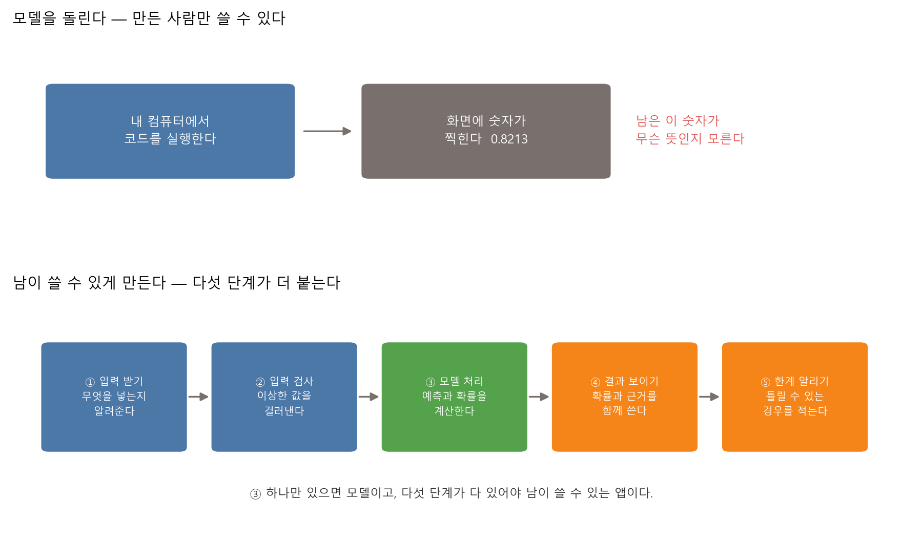
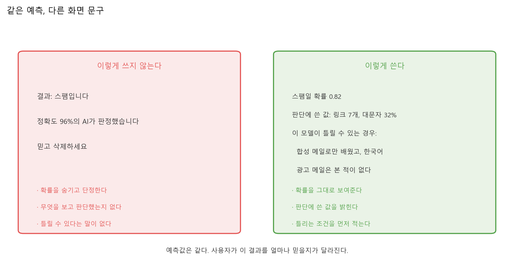
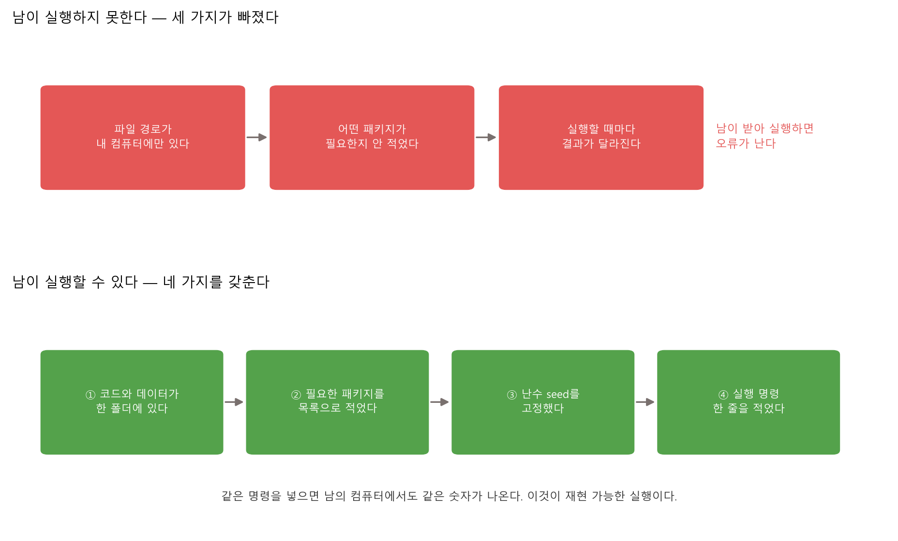
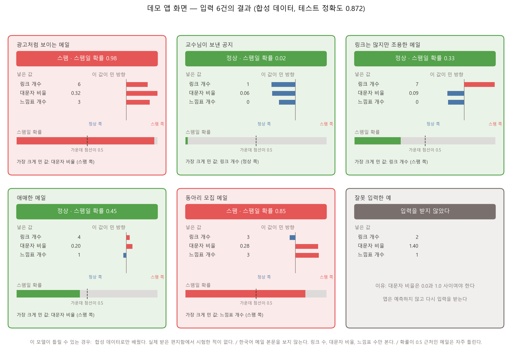
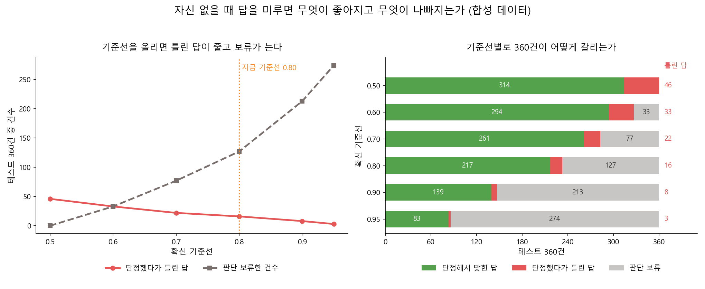

# 제13장 나만의 AI 앱 만들기 — 데모와 사용자 경험

---

## [전반부] 이론 강의
---

### 학습 목표

- 모델을 실행하는 것과 남이 쓸 수 있는 앱을 만드는 것이 어떻게 다른지 설명한다
- 앱이 받을 입력의 범위를 정하고, 범위를 벗어난 입력을 거절하는 코드를 쓴다
- 예측 하나에 확률과 판단 근거와 한계 안내를 함께 붙인다
- 모델이 자신 없을 때 답을 단정하지 않고 판단 보류로 돌린다
- 확신 기준선을 올릴 때 틀린 답과 보류 건수가 어떻게 맞바뀌는지 읽는다
- 남이 같은 결과를 얻을 수 있게 실행 조건을 적는다

12장에서 AI 코딩 에이전트와 함께 작은 도구를 만들었다. 그 도구는 내가 실행했고 내가 결과를 읽었다. 이번 장에서는 같은 코드를 남이 실행한다. 모델은 그대로 두고 앞뒤에 무엇을 붙여야 다른 사람이 결과를 이해하는지를 다룬다. 새 알고리즘은 나오지 않는다. 대신 사람이 정해야 하는 판단이 여러 번 나온다.

---

### 1. 모델과 앱은 무엇이 다른가

#### 1-1. 화면에 숫자 하나만 찍히면 앱이 아니다

지금까지 실습 코드는 마지막에 정확도 한 줄을 찍고 끝났다. 만든 사람은 그 숫자가 무엇인지 안다. 옆자리 학생은 모른다. 무엇을 넣어야 하는지, 그 숫자가 무엇을 뜻하는지, 얼마나 믿어도 되는지가 화면에 없기 때문이다.



**그림 13.1** 모델 처리는 다섯 단계 중 하나다. 나머지 네 단계가 붙어야 남이 쓸 수 있다

#### 1-2. 앱이 더 하는 네 가지

○ **입력 받기** — 무엇을 몇 개 넣어야 하는지 화면에 적는다

○ **입력 검사** — 받을 수 있는 값의 범위를 정하고, 벗어나면 예측하지 않는다

○ **결과 보이기** — 예측 이름만 쓰지 않는다. 확률과 판단에 쓴 값을 함께 쓴다

○ **한계 알리기** — "이 모델이 틀릴 수 있는 경우"를 화면에 적는다

**표 13.1** 같은 모델, 다른 산출물

| 구분 | 모델을 돌리기만 할 때 | 앱으로 만들었을 때 |
|---|---|---|
| 쓰는 사람 | 만든 사람 | 코드를 안 본 사람 |
| 입력 | 코드 안에 박혀 있다 | 화면에서 받고 범위를 검사한다 |
| 출력 | 숫자 한 줄 | 예측 · 확률 · 근거 · 한계 |
| 틀렸을 때 | 만든 사람이 알아서 판단한다 | 화면에 적힌 한계를 보고 사용자가 판단한다 |
| 남이 실행하면 | 오류가 나거나 결과가 달라진다 | 같은 명령으로 같은 결과가 나온다 |

#### 1-3. gradio와 streamlit

파이썬 코드를 웹 화면으로 바꿔 주는 패키지가 있다. 둘 다 무료다.

○ **Gradio** — `pip install --upgrade gradio` 로 설치한다. 함수 하나를 `gr.Interface` 에 넘기면 입력 상자와 출력 칸이 있는 화면이 만들어지고, 브라우저의 `localhost:7860` 에서 열린다[^gradio]

○ **Streamlit** — `pip install streamlit` 으로 설치하고 `streamlit hello` 로 예제를 띄운다. 파이썬 스크립트를 위에서 아래로 읽어 화면을 그린다[^streamlit]

이 수업에서는 둘 다 설치하지 않는다. 설치가 되고 안 되고에 따라 실습을 못 하는 학생이 생기기 때문이다. 실습에서는 화면을 콘솔 출력과 그림 파일로 만든다. 화면을 만드는 도구가 바뀌어도 이 장에서 정하는 것들 — 입력 범위, 확률 표시, 한계 안내, 판단 보류 — 은 그대로 쓴다. 기말 프로젝트에서 웹 화면이 필요하면 그때 둘 중 하나를 골라 쓴다.

---

### 2. 입력과 출력을 정하는 법

#### 2-1. 입력은 세 가지를 정한다

앱이 받을 값을 정할 때 세 가지를 함께 정한다. 무엇을 받는가, 어디까지 받는가, 벗어나면 어떻게 하는가.

**표 13.2** 실습 13.1 앱의 입력 명세

| 입력 | 받는 범위 | 벗어나면 |
|---|---|---|
| 링크 개수 | 0 이상의 정수 | 예측하지 않고 "링크 개수는 0 이상이어야 한다"고 쓴다 |
| 대문자 비율 | 0.0 ~ 1.0 | 예측하지 않고 "대문자 비율은 0.0과 1.0 사이여야 한다"고 쓴다 |
| 느낌표 개수 | 0 이상의 정수 | 예측하지 않고 "느낌표 개수는 0 이상이어야 한다"고 쓴다 |

범위를 벗어난 값을 그냥 모델에 넣으면 예측이 나오기는 한다. 로지스틱 회귀는 대문자 비율 1.4를 받아도 계산을 끝낸다. 문제는 그 숫자가 뜻을 잃는다는 것이다. 세상에 대문자 비율 140%인 제목은 없다. 앱이 답을 주면 사용자는 그 답을 믿는다. 그래서 앱은 예측하기 전에 입력을 먼저 본다.

#### 2-2. 출력에는 네 가지를 넣는다

○ **예측 이름** — 스팸인가 정상인가

○ **예측 확률** — 0.98과 0.51은 같은 "스팸"이 아니다

○ **판단에 쓴 값** — 어떤 입력이 어느 쪽으로 얼마나 밀었는가

○ **한계 안내** — 이 모델이 틀릴 수 있는 경우

넷 중 확률과 근거를 빼면 사용자는 결과를 검사할 방법이 없다. 실습 13.1의 다섯 번째 입력이 그 예다. 링크가 3개뿐인 동아리 모집 메일을 앱이 스팸이라고 판정했는데, 근거를 보면 느낌표 3개와 대문자 비율 0.28이 스팸 쪽으로 밀었다. 근거가 화면에 있으면 사용자는 "느낌표 때문이구나"까지 읽는다. 없으면 "이 앱은 이상하다"에서 끝난다.

---

### 3. 사용자가 오해하지 않게 하는 문구

같은 예측이라도 화면에 어떻게 쓰느냐에 따라 사용자가 믿는 정도가 달라진다.



**그림 13.2** 왼쪽과 오른쪽의 예측값은 같다. 사용자가 이 결과를 얼마나 믿을지가 다르다

○ **확률을 숨기고 단정한다** — "스팸입니다"라고만 쓰면 확률 0.51과 0.99가 같은 문장이 된다

○ **정확도 한 숫자를 앞세운다** — "정확도 96%의 AI"는 이 메일 한 통과 아무 상관이 없다. 4장에서 본 대로 정확도 하나는 무엇을 놓쳤는지 감춘다

○ **사용자의 행동을 대신 정한다** — "믿고 삭제하세요"라고 쓰면 틀렸을 때 책임이 사용자에게 넘어간다. 앱은 판단 재료를 주고, 결정은 사용자가 한다

○ **"이 모델이 틀릴 수 있는 경우"를 적는다** — 이 장의 실습 두 개 모두 이 문구를 화면에 넣는다. 무엇으로 배웠는지, 무엇을 보지 않는지, 어떤 구간에서 자주 틀리는지 세 줄이면 된다

Google의 People + AI Guidebook도 확신도를 사용자에게 보이는 방식을 네 가지로 정리한다. 높음·중간·낮음 같은 단계로 쓰는 방법, 후보를 여러 개 보여주는 방법, 백분율로 쓰는 방법, 불확실한 범위를 그림으로 그리는 방법이다. 같은 문서는 확신도를 화면에 넣기 전에 그것이 사용자의 결정을 실제로 낫게 하는지 먼저 시험하라고 적는다.[^pair]

---

### 4. 자신 없을 때 말하는 법

#### 4-1. 확신을 숫자로 정의한다

분류기는 예측과 함께 확률을 준다. 답이 둘뿐일 때 그 앱의 확신은 두 확률 중 큰 쪽이다.

```
확신 = max(스팸일 확률, 정상일 확률)
```

스팸일 확률이 0.98이면 확신은 0.98이다. 0.02면 정상이라고 답할 것이므로 확신은 0.98이다. 스팸일 확률이 0.51이면 확신은 0.51이고, 이때 앱은 거의 동전을 던지는 상태다.

#### 4-2. 기준선을 정하고 그 아래는 답하지 않는다

확신이 기준선보다 낮으면 앱은 답을 단정하지 않는다. 실습 13.2의 화면 문구는 이렇게 나간다.

```text
판단 보류
  스팸일 확률 0.49 — 확신 0.51이 기준선 0.80보다 낮다
  이 메일은 자신 있게 답하지 못한다. 사람이 직접 확인하기 바란다.
```

_출처: `practice/chapter13/results/13-2-honest-output.log`_

#### 4-3. 4장에서 한 걸음 더 간다

4장에서 정확도 하나만 보면 속는다는 것을 확인했다. 그때는 혼동행렬로 무엇을 놓쳤는지 세는 데서 멈췄다. 세고 나면 답이 두 개뿐이었다. 놓치는 쪽을 줄이거나, 헛짚는 쪽을 줄이거나.

여기서 세 번째 선택지가 붙는다. **답하지 않는다.** 확신이 낮은 건은 사람에게 넘긴다. 이 선택지가 생기면 성적표에 숫자가 하나 더 필요하다. 몇 건에 답했는가다. 답한 것 중에서만 정확도를 재면 답을 적게 할수록 정확도가 올라가기 때문이다.

○ **공짜가 아니다**
  - 기준선을 올리면 단정했다가 틀리는 답이 준다
  - 대신 답하지 못한 건수가 는다. 그 건수는 사람이 처리해야 한다
  - 사람이 감당할 수 있는 양인지 먼저 확인하고 기준선을 정한다

실습 13.2에서 이 맞바꿈을 직접 센다.

---

### 5. 남이 실행할 수 있게 만들기

"제 컴퓨터에서는 됐는데요"는 앱이 완성되지 않았다는 뜻이다. 남이 같은 명령으로 같은 결과를 얻을 수 있어야 앱이다.



**그림 13.3** 재현 가능한 실행에 필요한 네 가지

○ **코드와 데이터를 한 폴더에 둔다** — 파일 경로를 `C:\Users\내이름\...` 처럼 쓰지 않는다. 파이썬에서는 `pathlib.Path` 로 지금 파일 위치를 기준으로 잡는다

○ **필요한 패키지를 목록으로 적는다** — 이 저장소의 `practice/requirements.txt` 가 그 목록이다

○ **난수 seed를 고정한다** — 실습 코드 맨 위의 `RANDOM_SEED = 42` 가 그 일을 한다. seed를 고정하지 않으면 실행할 때마다 훈련·테스트 분할이 달라져 정확도가 흔들린다

○ **실행 명령 한 줄을 적는다** — `python 13-1-demo-app.py` 처럼 그대로 복사해 붙일 수 있게 쓴다

이 수업 저장소도 같은 규칙을 따른다. 실습 코드를 고치면 `scripts/run_and_capture.py` 로 실행 로그를 다시 만들고, 강의자료의 숫자는 그 로그에서만 가져온다. 이 장의 확률과 건수도 전부 `practice/chapter13/results/` 의 로그에서 인용한 것이다.

---

### 6. 앱을 만들 때 피할 것 — 개인정보를 요구하는 구조

학생 프로젝트에서 가장 자주 나오는 위험은 모델이 아니라 입력 칸이다. 이름·학번·전화번호·주소를 넣게 만들면, 그 앱은 만드는 순간부터 개인정보를 다루는 시스템이 된다. 보관·파기·동의를 모두 책임져야 한다.

**표 13.3** 요구하지 않아도 되는 입력을 바꾸는 방법

| 넣고 싶어지는 입력 | 왜 위험한가 | 대신 받을 것 |
|---|---|---|
| 이름, 학번 | 결과와 사람을 이어 붙일 수 있다 | 받지 않는다. 입력마다 번호만 붙인다 |
| 전화번호, 이메일 주소 | 유출되면 그대로 연락처가 된다 | 받지 않는다. 결과를 화면에만 보여준다 |
| 실제 메일 본문 전체 | 제3자의 개인정보가 함께 들어온다 | 링크 수, 대문자 비율 같은 숫자만 받는다 |
| 얼굴 사진 | 본인 동의가 있어도 보관이 문제가 된다 | 공개 데이터셋의 이미지를 쓴다 |

○ **실습 13.1이 이 원칙을 따른다**
  - 입력은 숫자 세 개뿐이다. 메일 본문도, 보낸 사람도 받지 않는다
  - 데이터는 컴퓨터로 만든 합성 데이터다. 실제 메일이 한 통도 들어가지 않는다
  - 개인정보를 다루지 않는 앱은 개인정보 사고를 낼 수 없다

12장의 보안 점검표와 이어진다. 그때는 코드가 무엇을 밖으로 보내는지 봤다. 여기서는 코드가 무엇을 안으로 받는지 본다.

---

### 7. 직접 움직여 보는 웹 자료

수업에서 다 보여줄 수 없는 화면은 아래 자료로 보충한다. 모두 무료이고, 아래 설명은 각 페이지를 열어 확인한 내용이다.

| 자료 | 무엇을 볼 수 있는가 | 주소 |
|---|---|---|
| Gradio, Quickstart | 함수 하나를 `gr.Interface` 로 감싸 입력 상자와 출력 칸이 있는 화면을 만드는 예제, 브라우저에서 열리는 화면 설명 | https://www.gradio.app/guides/quickstart |
| Streamlit, Installation | `pip install streamlit` 과 `streamlit hello` 두 명령으로 예제 앱을 띄우는 순서 | https://docs.streamlit.io/get-started/installation |
| Google PAIR, Explainability + Trust | AI 제품이 사용자에게 무엇을 설명해야 하는지, 확신도를 화면에 보이는 방식 네 가지 | https://pair.withgoogle.com/chapter/explainability-trust/ |
| scikit-learn, Probability calibration curves | 모델이 말한 확률이 실제 빈도와 얼마나 맞는지 재는 곡선, 보정 전후 비교 그림 | https://scikit-learn.org/stable/auto_examples/calibration/plot_calibration_curve.html |

○ Gradio와 Streamlit 페이지는 설치 명령부터 나온다. 이 수업에서는 설치하지 않으므로 읽기만 한다. 기말 프로젝트에서 웹 화면이 필요할 때 다시 연다

○ scikit-learn의 보정 곡선은 실습 13.2와 짝이 된다. 실습 13.2는 확률을 그대로 믿고 기준선을 긋는다. 그 확률 자체가 실제 빈도와 맞는지 재는 방법이 이 페이지에 있다

---

## [후반부] 실습
---

두 가지를 한다. 첫 번째는 분류기를 남이 쓸 수 있는 앱으로 감싸는 실습이고, 두 번째는 그 앱이 자신 없을 때 답을 미루게 만드는 실습이다.

#### 실행 환경

```bash
cd practice/chapter13
python -m pip install -r ../requirements.txt
```

필요한 패키지는 numpy, pandas, matplotlib, scikit-learn이다. **gradio와 streamlit은 설치하지 않는다.** GPU는 필요 없다. 두 실습 모두 노트북에서 몇 초 안에 끝난다.

두 실습의 데이터는 모두 **컴퓨터로 만든 합성 데이터**다. 실제 메일이 아니다. 개인정보가 들어갈 자리가 없다.

---

### 실습 13.1: 분류기를 데모 앱으로 감싸기

#### 실습 목표

- 예측 한 줄짜리 코드에 입력 검사·확률·근거·한계 안내를 붙인다
- 내가 넣은 입력이 어떤 값 때문에 어느 쪽으로 판정됐는지 읽는다
- 앱이 잘못된 입력을 거절하는 것을 눈으로 확인한다

#### 데이터

합성 메일 1200통을 만든다. 스팸이 480통, 전체의 40%다. 특징은 세 개다.

- 메일에 들어 있는 링크 개수
- 제목에서 대문자가 차지하는 비율
- 제목의 느낌표 개수

스팸은 세 값이 모두 큰 편이지만 정상 메일과 겹치는 구간을 넉넉히 남겼다. 겹치는 구간이 있어야 확률이 0.5 근처인 메일이 생기고, 실습 13.2에서 그 메일들을 다룬다.

#### 실행 명령

```bash
cd practice/chapter13/code
python 13-1-demo-app.py
```

#### 핵심 코드

파일 맨 위에 학생이 바꿀 목록이 두 개 있다.

```python
# 앱에 넣을 입력을 한 줄에 한 건씩 적는다.
#   (설명, 링크 개수, 대문자 비율, 느낌표 개수)
MY_INPUTS = [
    ("광고처럼 보이는 메일", 6, 0.32, 3),
    ("교수님이 보낸 공지", 1, 0.06, 0),
    ...
    ("잘못 입력한 예", 2, 1.40, 1),   # 대문자 비율이 1을 넘는다 -> 받지 않는다
]

# 화면에 함께 적을 한계 안내문. 학생이 자기 앱에 맞게 고쳐 쓴다.
MODEL_LIMITS = [
    "합성 데이터로만 배웠다. 실제 받은 편지함에서 시험한 적이 없다.",
    ...
]
```

입력 검사는 예측보다 먼저 한다.

```python
def check_input(links: float, caps: float, excl: float) -> str | None:
    """입력을 검사한다. 받을 수 있으면 None, 아니면 거절 이유를 돌려준다."""
    if links < 0:
        return "링크 개수는 0 이상이어야 한다"
    if not 0.0 <= caps <= 1.0:
        return "대문자 비율은 0.0과 1.0 사이여야 한다"
    if excl < 0:
        return "느낌표 개수는 0 이상이어야 한다"
    return None
```

판단 근거는 각 값이 민 크기로 계산한다. 표준화한 값에 무게를 곱한 것이 그 값이 민 크기다.

```python
z = scaler.transform(x_one)[0]      # 세 값을 같은 자로 바꾼다
push = clf.coef_[0] * z             # 양수는 스팸 쪽, 음수는 정상 쪽
prob = model.predict_proba(x_one)[0, 1]
```

_전체 코드는 `practice/chapter13/code/13-1-demo-app.py` 참고_

#### 실행 결과

```text
데이터: 컴퓨터로 만든 합성 메일 데이터(실제 메일 아님)
전체 1200통 중 스팸 480통 = 40.0%
훈련 840통, 테스트 360통
테스트 정확도: 0.872

입력 1  광고처럼 보이는 메일
  링크 개수   : 6
  대문자 비율 : 0.32
  느낌표 개수 : 3
  판정         : 스팸
  스팸일 확률  : 0.977
  판단에 쓴 값이 민 크기 (양수는 스팸 쪽, 음수는 정상 쪽)
    링크 개수   : +1.21
    대문자 비율 : +1.77
    느낌표 개수 : +1.33
```

_출처: `practice/chapter13/results/13-1-demo-app.log`_

**표 13.4** 입력 6건의 처리 결과

| 입력 | 링크 | 대문자 | 느낌표 | 판정 | 스팸일 확률 |
|---|---:|---:|---:|---|---:|
| 광고처럼 보이는 메일 | 6 | 0.32 | 3 | 스팸 | 0.977 |
| 교수님이 보낸 공지 | 1 | 0.06 | 0 | 정상 | 0.016 |
| 링크는 많지만 조용한 메일 | 7 | 0.09 | 0 | 정상 | 0.327 |
| 애매한 메일 | 4 | 0.20 | 1 | 정상 | 0.450 |
| 동아리 모집 메일 | 3 | 0.28 | 3 | 스팸 | 0.850 |
| 잘못 입력한 예 | 2 | 1.40 | 1 | 입력 거절 | — |

_출처: `practice/chapter13/results/13-1-demo-app.log`_



**그림 13.4** 카드 한 장이 화면 한 칸이다. 예측·확률·판단에 쓴 값이 함께 들어 있고, 맨 아래에 한계 안내가 붙는다

#### 결과 읽기

○ **확률 0.977과 0.850은 같은 "스팸"이 아니다**
  - 판정 이름만 쓰면 두 메일이 같아 보인다
  - 화면에 확률이 있으면 사용자가 두 건을 다르게 다룰 수 있다

○ **링크 7개짜리 메일을 앱이 정상이라고 했다**
  - 링크 개수는 스팸 쪽으로 +1.72만큼 밀었다. 셋 중 가장 큰 값이다
  - 그런데 대문자 비율(-0.96)과 느낌표 개수(-0.93)가 반대로 밀어 확률이 0.327에서 멈췄다
  - 근거를 함께 보여주지 않으면 사용자는 이 판정을 이해할 수 없다

○ **동아리 모집 메일을 앱이 스팸이라고 했다**
  - 링크는 3개뿐인데 대문자 비율 0.28과 느낌표 3개가 스팸 쪽으로 밀었다
  - 사람이 보면 스팸이 아니다. 이 모델은 메일 본문을 읽지 않고 숫자 세 개만 본다
  - 그래서 화면 아래에 "링크 수, 대문자 비율, 느낌표 수만 본다"고 적는다

○ **잘못된 입력에서 앱이 답을 만들지 않았다**
  - 대문자 비율 1.40은 있을 수 없는 값이다
  - 모델에 넣으면 확률이 나오기는 한다. 앱은 넣기 전에 막았다
  - 회색 카드에 거절 이유가 적혀 있어 사용자가 무엇을 고쳐야 하는지 안다

#### 해 보기

`MY_INPUTS`에 자기 입력을 넣고 다시 실행한다.

1. 링크 개수만 0에서 10까지 바꿔가며 확률이 어디서 0.5를 넘는지 찾는다
2. 세 값 중 하나만 크게 넣었을 때와 셋 다 조금씩 크게 넣었을 때를 비교한다
3. 느낌표 개수를 -1로 넣으면 앱이 어떻게 하는지 확인한다
4. `MODEL_LIMITS`를 자기 문장으로 고쳐 쓴다. 이 모델이 무엇을 보지 않는지 세 줄로 적는다

○ 확인할 것은 정확도가 아니다. **입력을 조금 바꿨을 때 확률이 얼마나 움직이는지**와 **그 이유가 화면에 적혀 있는지**다

---

### 실습 13.2: 자신 없을 때 답을 미루는 앱

#### 실습 목표

- 확신이 낮은 예측을 판단 보류로 돌리는 규칙을 만든다
- 기준선을 올릴 때 틀린 답과 보류 건수가 맞바뀌는 것을 직접 센다
- 기준선을 어디에 두어야 하는지는 데이터가 정하지 않는다는 것을 확인한다

#### 데이터

실습 13.1과 같은 합성 메일 1200통, 같은 모델을 쓴다. 테스트 데이터 360통에서 확률을 재고, 확신이 기준선보다 낮은 건을 보류로 돌린다.

#### 실행 명령

```bash
cd practice/chapter13/code
python 13-2-honest-output.py
```

#### 핵심 코드

파일 맨 위에 학생이 바꿀 값이 두 개 있다.

```python
# 확신이 이 값보다 낮으면 앱이 답을 단정하지 않고 "판단 보류"로 쓴다.
# 0.50 이면 모든 건에 답한다. 1.00 에 가까울수록 답하는 건수가 줄어든다.
CONFIDENCE_THRESHOLD = 0.80

# 표와 그림에 함께 넣을 비교용 기준선들
THRESHOLD_SWEEP = [0.50, 0.60, 0.70, 0.80, 0.90, 0.95]
```

화면 문구를 만드는 부분은 다음과 같다.

```python
confidence = max(prob, 1.0 - prob)
if confidence < threshold:
    return ["판단 보류", ...]     # 답을 단정하지 않는다
```

_전체 코드는 `practice/chapter13/code/13-2-honest-output.py` 참고_

#### 실행 결과

```text
훈련 840통, 테스트 360통
모든 건에 답했을 때의 정확도: 0.872

=== 지금 기준선 CONFIDENCE_THRESHOLD = 0.80 ===
단정한 답: 233건
  그중 틀린 답: 16건
  단정한 답의 정확도: 0.931
판단 보류: 127건 (35.3%)
```

_출처: `practice/chapter13/results/13-2-honest-output.log`_

**표 13.5** 기준선을 바꾸면 무엇이 맞바뀌는가 (테스트 360건)

| 기준선 | 단정한 답 | 그중 틀린 답 | 판단 보류 | 단정한 답의 정확도 |
|---:|---:|---:|---:|---:|
| 0.50 | 360 | 46 | 0 | 0.872 |
| 0.60 | 327 | 33 | 33 | 0.899 |
| 0.70 | 283 | 22 | 77 | 0.922 |
| 0.80 | 233 | 16 | 127 | 0.931 |
| 0.90 | 147 | 8 | 213 | 0.946 |
| 0.95 | 86 | 3 | 274 | 0.965 |

_출처: `practice/chapter13/results/13-2-honest-output.log`_



**그림 13.5** 왼쪽은 기준선에 따른 두 건수의 움직임, 오른쪽은 360건이 기준선마다 어떻게 갈리는지

#### 결과 읽기

○ **기준선 0.50은 모든 건에 답한다**
  - 확신은 정의상 0.5 이상이므로 한 건도 보류하지 않는다
  - 360건에 모두 답하고 46건을 틀렸다. 정확도 0.872는 4장까지 재던 것과 같은 숫자다

○ **기준선을 0.95로 올리면 틀린 답이 46건에서 3건으로 준다**
  - 열 배 넘게 줄었다. 여기까지만 보면 기준선을 올리는 것이 언제나 이득처럼 보인다

○ **같은 구간에서 보류가 0건에서 274건으로 는다**
  - 360건 중 274건에 답하지 않았다. 답한 것은 86건뿐이다
  - 이 274건은 사라지지 않는다. 사람이 하나씩 봐야 한다
  - 사람이 하루에 30건을 볼 수 있다면 274건은 9일치다. 그러면 그 기준선을 쓸 수 없다

○ **"단정한 답의 정확도"만 보고하면 속인다**
  - 0.95에서 정확도는 0.965다. 0.50의 0.872보다 높다
  - 답을 적게 할수록 이 숫자는 올라간다. 답하지 않은 274건은 이 계산에 안 들어가기 때문이다
  - 그래서 이 숫자는 답한 건수와 항상 함께 적는다. 4장에서 정확도 하나만 적으면 안 된다고 한 것과 같은 이유다

○ **어느 기준선이 맞는가**
  - 데이터만 보고 답할 수 없다. 사람이 몇 건을 처리할 수 있는지가 정한다
  - 틀린 답이 크게 아픈 문제(질병 검사, 대출 심사)라면 기준선을 올리고 보류를 사람에게 넘긴다
  - 보류를 처리할 사람이 없다면 기준선을 낮추고, 대신 화면에 확률을 크게 적는다

#### 해 보기

`CONFIDENCE_THRESHOLD`를 바꿔 다시 실행한다.

1. 0.60으로 낮춘다. 틀린 답이 몇 건 늘고 보류가 몇 건 주는가
2. 0.99로 올린다. 몇 건에 답하는가. 그 앱을 쓸 수 있겠는가
3. 틀린 답을 10건 아래로 줄이면서 보류를 150건 아래로 유지할 수 있는 기준선이 있는가
4. `THRESHOLD_SWEEP`에 0.55, 0.85 같은 값을 더해 그림의 선이 어떻게 촘촘해지는지 본다

○ 3번에는 답이 없을 수도 있다. 없다는 것을 표로 확인하는 것이 이 실습의 목표다. 두 숫자를 동시에 좋게 만드는 기준선은 대개 없다

---

### 과제 (LMS 제출)

수업 시간에 실습을 실행했는지만 확인한다. 따로 보고서를 쓰지 않는다.

#### 제출물

두 실습을 실행하면 만들어지는 그림 파일 두 장을 LMS에 올린다.

1. `practice/chapter13/results/demo_app_cards.png`
2. `practice/chapter13/results/confidence_tradeoff.png`

#### 평가 기준

- 두 파일을 올리면 완료로 인정한다. 확률이 얼마인지는 채점하지 않는다
- 실습 13.1에서 `MY_INPUTS`를 바꿨다면 바뀐 카드가 올라온다. 기본값 그대로여도 인정한다
- 실습 13.2에서 `CONFIDENCE_THRESHOLD`를 바꿨다면 그림의 세로 점선 위치가 달라진다. 기본값 그대로여도 인정한다

#### 마감

- 실습 수업일 포함 7일 이내

---

### 핵심 정리

| 개념 | 한 줄 정리 |
|---|---|
| 모델과 앱 | 모델 처리는 다섯 단계 중 하나다. 입력 검사·확률·근거·한계가 붙어야 남이 쓴다 |
| 입력 명세 | 무엇을 받는지, 어디까지 받는지, 벗어나면 어떻게 하는지를 함께 정한다 |
| 출력 네 가지 | 예측 이름, 확률, 판단에 쓴 값, 틀릴 수 있는 경우 |
| 판단 보류 | 확신이 기준선보다 낮으면 답하지 않는다. 그 건수는 사람이 처리한다 |
| 맞바꿈 | 기준선을 올리면 틀린 답이 줄고 보류가 는다. 두 숫자를 함께 보고한다 |
| 재현 가능한 실행 | 한 폴더 · 패키지 목록 · 고정된 seed · 실행 명령 한 줄 |
| 개인정보 | 받지 않으면 사고가 나지 않는다. 이름과 연락처를 입력 칸에 두지 않는다 |

다음 장에서는 이 장에서 정한 것들을 자기 프로젝트에 옮긴다. 문제를 정의하고, 데이터를 고르고, 실행되는 중간 결과를 만든다.

---

[^gradio]: Gradio, "Quickstart". https://www.gradio.app/guides/quickstart (2026년 8월 24일 확인)

[^streamlit]: Streamlit, "Install Streamlit". https://docs.streamlit.io/get-started/installation (2026년 8월 24일 확인)

[^pair]: Google, "Explainability + Trust", People + AI Guidebook. https://pair.withgoogle.com/chapter/explainability-trust/ (2026년 8월 24일 확인)
