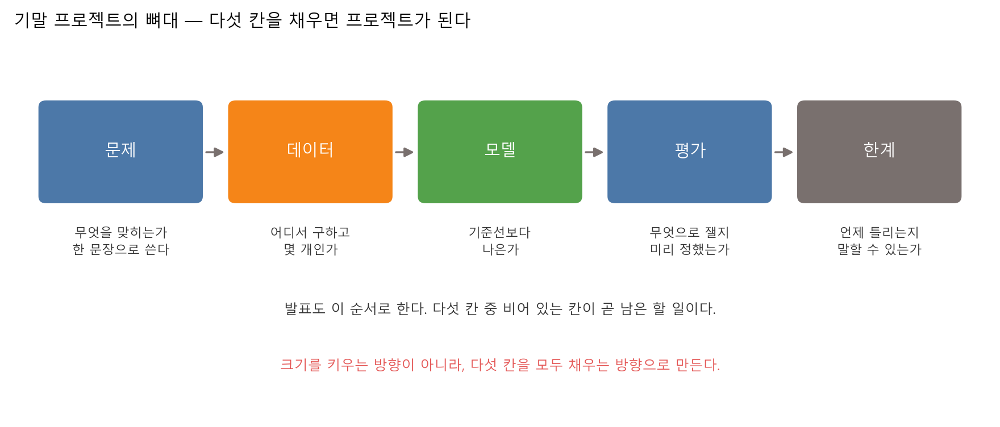
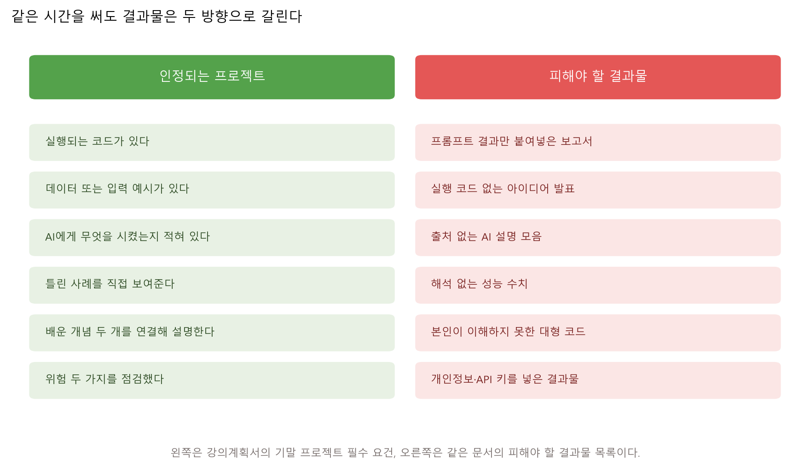
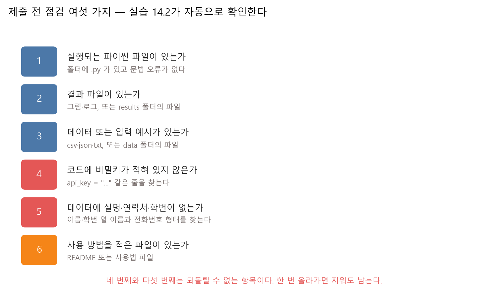
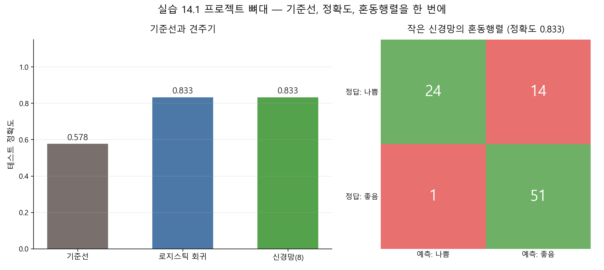
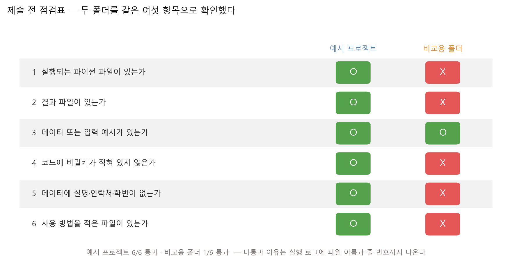

# 제14장 기말 프로젝트 제작 워크숍 — 작지만 실행되는 결과물

---

## [전반부] 이론 강의
---

### 학습 목표

- 자기 프로젝트의 문제를 입력과 출력이 들어간 한 문장으로 쓴다
- 데이터를 어디서 구할지 정하고, 몇 줄이면 되는지 판단한다
- 프로젝트를 어디까지 줄여야 발표 전에 끝나는지 정한다
- 모델을 만들기 전에 기준선과 평가 방법을 정한다
- 개인정보·출처·편향·보안·과도한 의존 중 자기 프로젝트에 해당하는 위험을 짚는다

지난 장에서 데모 앱을 하나 만들었다. 이번 장에서는 그 앱을 자기 프로젝트로 바꾼다. 새 개념을 배우는 장이 아니다. 4장의 기준선과 혼동행렬, 5장의 은닉층, 7장의 훈련·테스트 비교, 12장의 보안 점검이 이번 장의 두 실습에 모인다.

○ **이 장이 목표로 하는 것을 먼저 밝힌다**
  - 큰 모델을 만드는 것이 목표가 아니다. 강의계획서의 기말 프로젝트 항목은 "큰 모델을 만드는 과제가 아니다. 배운 개념으로 작지만 실행되는 결과물을 만든다"로 적혀 있다
  - 정확도를 겨루지 않는다. 평가는 정확도가 아니라 문제·데이터·모델·평가·한계가 이어지는지를 본다
  - 이번 주에 끝내야 하는 것은 완성품이 아니라 **한 번 실행되는 중간 결과**다

---

### 1. 무엇을 만들 것인가 — 문제를 한 문장으로

#### 1-1. 한 문장 틀

프로젝트 첫 줄은 이 틀에 맞춰 쓴다.

```text
[무엇]을 넣으면 [무엇]을 [분류한다 / 예측한다].
```

입력과 출력을 못 채우면 아직 문제가 아니라 관심사다. 관심사는 프로젝트가 되지 않는다.

**표 14.1** 같은 관심사를 문제로 바꾸면 이렇게 달라진다

| 아직 관심사 | 문제로 바꾼 한 문장 |
|---|---|
| AI로 리뷰를 분석한다 | 리뷰 문장을 넣으면 긍정인지 부정인지 답한다 |
| 사진을 정리하고 싶다 | 내가 찍은 사진을 넣으면 실내인지 실외인지 나눈다 |
| 공부에 도움이 되는 걸 만든다 | 과목 이름과 공부 시간을 넣으면 다음 시험 등급을 예측한다 |
| 챗봇을 만든다 | 수업 공지 문장을 넣으면 어느 과목 공지인지 분류한다 |

오른쪽 문장에는 입력이 무엇인지, 답이 이름인지 숫자인지가 들어 있다. 답이 이름이면 분류, 숫자면 회귀다. 4장에서 나눈 그 구분이 여기서 다시 쓰인다.

#### 1-2. 프로젝트의 다섯 칸

한 문장을 쓰고 나면 나머지 네 칸이 따라온다.



**그림 14.1** 문제에서 한계까지 다섯 칸. 비어 있는 칸이 곧 남은 할 일이다

발표도 이 순서로 한다. 15주차 발표 구성은 이 다섯 칸에 AI 활용 과정과 위험 점검을 더한 것이다.

○ **체크 질문**
  - 내 프로젝트의 입력은 무엇이고 출력은 무엇인가
  - 다섯 칸 중 지금 비어 있는 칸은 몇 번째인가

---

### 2. 데이터를 어디서 구하는가

프로젝트가 멈추는 자리는 대부분 모델이 아니라 데이터다. 데이터를 구하는 길은 세 갈래다.

**표 14.2** 데이터를 구하는 세 갈래

| 갈래 | 하는 일 | 조심할 것 | 예 |
|---|---|---|---|
| 직접 만든다 | 표에 30~100줄을 손으로 적는다 | 내가 만든 만큼만 있다. 편향이 그대로 들어간다 | 3주차 `week03-my-data.csv` |
| 이미 있는 것을 모은다 | 내 사진, 내가 쓴 글, 내가 받은 메시지를 모은다 | 다른 사람이 나오면 쓰지 않는다. 출처와 이용 조건을 확인한다 | 내 사진첩에서 고른 사진 50장 |
| 공개 데이터를 가져온다 | 내려받거나 라이브러리에서 불러온다 | 라이선스와 수집 방법을 읽는다 | 9주차 `load_digits()` 1797장 |

가장 빠르고 가장 안전한 길은 첫 번째다. 직접 적은 30줄짜리 표는 개인정보가 들어갈 자리가 없고, 어디서 왔는지 설명할 수 있고, 오늘 안에 만들어진다.

○ **몇 줄이면 되는가**
  - 실습 14.1의 데이터는 300줄이고, 그중 90줄을 테스트로 뗀다
  - 테스트가 30줄 아래로 내려가면 한 줄이 정확도를 3%p 넘게 흔든다. 그 정확도로는 두 모델을 비교할 수 없다
  - 기준선과 견줄 생각이면 전체 100줄, 테스트 30줄을 아래쪽 한계로 잡는다

○ **출처를 적는 자리**
  - 데이터 파일 옆 `README`에 어디서 가져왔는지 한 줄로 적는다
  - 직접 만든 데이터도 "직접 만들었다"라고 적는다. 적지 않으면 나중에 구분되지 않는다

---

### 3. 얼마나 작게 시작해야 하는가

한 번 실행되는 최소 결과물을 먼저 만들고, 그 뒤에 키운다. 순서를 뒤집으면 발표 전날까지 실행되지 않는 코드가 남는다.

○ **줄이는 손잡이 세 개**
  - 데이터 줄 수를 줄인다. 1000줄로 안 되는 것은 100줄로도 안 된다. 100줄로 먼저 확인한다
  - 클래스 수를 줄인다. 다섯 종류를 나누는 문제를 두 종류로 바꾼다
  - 특징 수를 줄인다. 특징 네 개로 파이프라인이 돌면 그다음에 늘린다

○ **끝나지 않는 프로젝트의 공통점**
  - 데이터를 아직 못 구했는데 모델부터 고른 경우
  - 정확도를 올리는 데 시간을 쓰느라 혼동행렬과 틀린 사례를 한 번도 안 본 경우
  - 이해하지 못한 코드를 붙여 넣어 놓고 오류가 나면 어디를 볼지 모르는 경우

실습 14.1이 그 최소 결과물이다. 파일 하나에 데이터 불러오기부터 틀린 사례 저장까지 들어 있고, 학생이 바꾸는 곳은 함수 하나와 파일 맨 위 상수 여섯 줄이다.

---

### 4. 평가를 미리 정한다

평가 방법을 나중에 고르면 결과에 맞춰 고르게 된다. 정확도가 낮게 나오면 다른 지표를 찾고, 그 지표도 낮으면 또 다른 지표를 찾는다. 이 순서를 막는 방법은 하나다. 코드를 쓰기 전에 두 줄을 적는다.

```text
무엇으로 재는가: 테스트 데이터 정확도와 혼동행렬
얼마면 성공인가: 기준선보다 높으면 성공
```

○ **기준선을 먼저 계산한다**
  - 기준선은 훈련 데이터에서 가장 많았던 답으로만 찍었을 때의 점수다
  - 실습 14.1에서 기준선은 0.578이다. 정답이 좋음 173줄, 나쁨 127줄로 갈려 있어서 그렇다
  - 기준선을 모르면 0.833이 좋은 점수인지 알 수 없다. 4장에서 다룬 그 이야기가 여기서 실제로 필요해진다

○ **정확도 한 숫자로 끝내지 않는다**
  - 혼동행렬을 같이 낸다. 어느 방향으로 틀렸는지는 정확도에 안 나온다
  - 틀린 사례를 세 개 이상 저장한다. 강의계획서의 필수 요건 5번이 "실패 사례와 한계를 설명한다"이다

○ **자주 나오는 함정**
  - 전체 데이터로 특징을 고르거나 크기를 맞춘 다음 훈련·테스트를 나누면, 테스트 데이터의 정보가 훈련 쪽으로 새어 든다. 그러면 점수가 실제보다 높게 나온다
  - 막는 방법은 나누기를 먼저 하는 것이다. 실습 14.1은 `make_pipeline`으로 크기 맞추기를 모델 안에 넣어 이 순서가 저절로 지켜지게 했다
  - 이 함정의 잘못된 코드와 올바른 코드는 7절의 scikit-learn 문서에 나란히 실려 있다

---

### 5. AI 활용 과정을 남기는 법

이 과목은 AI 사용을 금지하지 않는다. 사용을 숨기는 것을 금지한다. 감점 대상은 AI를 쓴 것이 아니라 기록하지 않은 것이다.

강의계획서가 정한 양식은 다섯 줄이다.

```text
이 과제에서 사용한 AI 도구:
사용한 프롬프트:
AI가 도와준 부분:
내가 직접 수정하거나 검증한 부분:
아직 이해가 부족한 부분:
```

○ **어디에 적는가**
  - 프로젝트 폴더의 `README` 안에 적는다. 따로 파일을 만들지 않는다
  - 실습 14.2의 여섯 번째 점검 항목이 이 `README`가 있는지를 확인한다

○ **다섯 번째 줄을 비우지 않는다**
  - "아직 이해가 부족한 부분"을 적는 것은 감점 사유가 아니다. 강의계획서의 감점 대상 첫 줄이 "AI가 만든 코드를 이해하지 못한 채 제출"이다
  - 이 줄에 무엇을 적을지 모르겠으면, 자기 코드에서 한 줄을 골라 무슨 일을 하는지 말로 설명해 본다. 설명이 막히는 줄이 그 줄이다

---

### 6. 위험 점검 — 되돌릴 수 있는 것과 없는 것

강의계획서는 개인정보·출처·편향·보안·과도한 AI 의존 다섯 가지 중 최소 두 가지를 점검하라고 한다.

**표 14.3** 다섯 가지 위험과 확인 방법

| 위험 | 무엇이 문제인가 | 어떻게 확인하는가 |
|---|---|---|
| 개인정보 | 실명·학번·연락처가 데이터에 들어간다 | 데이터 파일의 열 이름을 읽는다. 실습 14.2의 5번 항목 |
| 출처·저작권 | 가져온 이미지·글·코드의 조건을 모른다 | 파일마다 어디서 왔는지 한 줄 적는다 |
| 편향 | 데이터가 한쪽으로 치우쳐 모델도 치우친다 | 클래스별 줄 수를 센다. 혼동행렬을 클래스별로 읽는다 |
| 보안 | 코드에 API 키·비밀번호가 그대로 적혀 있다 | 실습 14.2의 4번 항목 |
| 과도한 의존 | 코드를 이해하지 못한 채 제출한다 | AI 기록 다섯 번째 줄을 채워 본다 |

이 다섯 가지가 같은 무게는 아니다. 코드가 틀린 것은 고치면 끝난다. 개인정보를 올린 것과 키를 노출한 것은 파일을 지워도 남는다. 올라간 뒤에 되돌릴 방법이 없다.



**그림 14.2** 왼쪽은 강의계획서의 기말 프로젝트 필수 요건 일곱 가지를 여섯 줄로 묶은 것이고, 오른쪽은 같은 문서의 "피해야 할 결과물" 여섯 가지를 그대로 옮긴 것이다

두 열을 견주면 갈림길이 어디인지 보인다. 왼쪽과 오른쪽을 가르는 것은 모델 크기가 아니라 **실행되는 코드가 있는가**, **틀린 사례를 보여주는가**, **어디서 왔는지 적었는가** 세 가지다.



**그림 14.3** 제출 전 점검 여섯 항목. 실습 14.2가 이 여섯 가지를 자동으로 확인한다

---

### 7. 직접 움직여 보는 웹 자료

데이터를 구할 곳과 평가에서 미끄러지는 자리를 아래 자료로 보충한다. 모두 무료이고, 아래 설명은 각 페이지를 열어 확인한 내용이다.

| 자료 | 무엇을 볼 수 있는가 | 주소 |
|---|---|---|
| scikit-learn, Toy datasets | 내려받기 없이 바로 불러 쓰는 데이터 6개를 표본 수와 특징 수까지 적어 나열한다. 붓꽃 150개, 손글씨 1797개, 와인 178개 | https://scikit-learn.org/stable/datasets/toy_dataset.html |
| UCI Machine Learning Repository | 데이터셋 689개를 분류·회귀·군집 같은 과제 유형과 표본 수·특징 수로 걸러 본다 | https://archive.ics.uci.edu/datasets |
| 공공데이터포털 | 한국 공공기관 데이터를 파일데이터·오픈API·표준데이터 세 형식으로 찾는다. 없는 데이터를 신청하는 절차도 있다 | https://www.data.go.kr/ |
| scikit-learn, Common pitfalls and recommended practices | 전처리를 훈련·테스트에 다르게 적용했을 때, 전체 데이터로 특징을 고른 뒤 나눴을 때 결과가 어떻게 달라지는지 잘못된 코드와 올바른 코드를 나란히 싣는다 | https://scikit-learn.org/stable/common_pitfalls.html |

○ scikit-learn Toy datasets은 데이터를 아직 못 구한 학생이 오늘 바로 쓸 수 있는 길이다. 표본 수와 특징 수가 적혀 있어 3절의 "얼마나 작게"를 정할 때 그대로 기준이 된다

○ 공공데이터포털의 데이터를 쓸 때는 이용 조건을 먼저 읽는다. 공공 데이터라도 재배포 조건이 붙는 경우가 있다

○ Common pitfalls 문서는 그림 없이 코드로만 설명한다. 데이터 누출(data leakage) 절만 읽으면 4절 마지막 함정이 왜 생기는지 확인할 수 있다

---

## [후반부] 실습
---

두 가지를 한다. 첫 번째는 프로젝트 뼈대를 한 파일로 돌려 보는 실습이고, 두 번째는 제출 전에 폴더를 자동으로 점검하는 실습이다.

#### 실행 환경

```bash
cd practice/chapter14
python -m pip install -r ../requirements.txt
```

필요한 패키지는 numpy, pandas, matplotlib, scikit-learn이다. GPU는 필요 없다. 두 실습 모두 노트북에서 몇 초 안에 끝난다.

실습 14.1의 기본 데이터는 **컴퓨터로 만든 합성 데이터**다. 실제 리뷰가 아니다. 실습 14.2가 읽는 두 예시 폴더도 교재용으로 지어낸 것이며, 실제 학생 자료가 아니다.

---

### 실습 14.1: 프로젝트 뼈대 한 파일

#### 실습 목표

- 데이터 불러오기부터 틀린 사례 저장까지 최소 파이프라인을 한 번 통과시킨다
- 기준선과 두 모델을 같은 테스트 데이터에서 견준다
- `load_data()` 함수 하나만 바꾸면 자기 데이터로 옮겨 갈 수 있다는 것을 확인한다

#### 데이터

합성 리뷰 데이터 300줄이다. 특징은 네 개다.

- 문장에 들어 있는 긍정어 개수
- 부정어 개수
- 느낌표 개수
- 글자수

정답은 평점이 좋음인지 나쁨인지다. 긍정어와 부정어 개수가 평점을 대부분 정하고, 느낌표는 조금 거들며, **글자수는 평점과 아무 관계가 없다.** 쓸모없는 특징이 섞였을 때 모델이 어떻게 되는지 보려고 일부러 넣었다.

#### 실행 명령

```bash
cd practice/chapter14/code
python 14-1-project-skeleton.py
```

#### 핵심 코드

파일 맨 위에 학생이 바꿀 여섯 줄이 있다.

```python
DATA_SOURCE = "synthetic"   # "synthetic" 이면 합성 데이터, "csv" 이면 내 파일
CSV_PATH = "my_project_data.csv"   # DATA_SOURCE = "csv" 일 때 읽을 파일
LABEL_COLUMN = "평점"        # 정답이 들어 있는 열 이름
N_SAMPLES = 300             # 합성 데이터일 때 만들 줄 수
TEST_RATIO = 0.3            # 테스트로 떼어 둘 비율
HIDDEN_UNITS = 8            # 작은 신경망의 은닉층 뉴런 수
```

자기 데이터로 옮겨 갈 때 고치는 곳은 이 함수 하나다.

```python
def load_data() -> tuple[pd.DataFrame, pd.Series, str]:
    """특징 표와 정답을 돌려준다."""
    if DATA_SOURCE == "csv":
        return load_from_csv()
    return make_synthetic_reviews()
```

크기 맞추기를 모델 안에 넣어, 훈련·테스트를 나눈 뒤에만 계산되도록 했다.

```python
linear = make_pipeline(
    StandardScaler(),
    LogisticRegression(random_state=RANDOM_SEED),
)
```

_전체 코드는 `practice/chapter14/code/14-1-project-skeleton.py` 참고_

#### 실행 결과

```text
데이터: 컴퓨터로 만든 합성 데이터(실제 리뷰 아님)
전체 300줄, 특징 4개: 긍정어수, 부정어수, 느낌표수, 글자수
정답 열 이름: 평점, 값의 종류: 나쁨, 좋음
정답 분포: 나쁨 127줄, 좋음 173줄
훈련 210줄 + 테스트 90줄 (테스트 비율 0.3)

=== 세 방법의 정확도 ===
방법                      훈련       테스트
기준선                      -     0.578
로지스틱 회귀              0.833     0.833
신경망(8)               0.833     0.833

=== 작은 신경망의 혼동행렬 ===
                   예측:나쁨       예측:좋음
정답:나쁨                 24          14
정답:좋음                  1          51
```

_출처: `practice/chapter14/results/14-1-project-skeleton.log`_



**그림 14.4** 왼쪽은 기준선과 두 모델의 테스트 정확도, 오른쪽은 작은 신경망의 혼동행렬

#### 결과 읽기

○ **기준선 0.578** — 좋음 173줄, 나쁨 127줄이라 많은 쪽으로만 찍어도 절반은 넘는다. 여기가 출발선이다

○ **두 모델이 0.833으로 같다** — 은닉층 8개짜리 신경망이 로지스틱 회귀를 앞서지 못했다. 특징이 네 개뿐이고 경계가 직선에 가까우면 층을 더해도 얻는 것이 없다. 프로젝트를 키우기 전에 확인해야 하는 사실이 이것이다

○ **훈련 0.833, 테스트 0.833** — 두 값이 같다. 7장에서 본 과적합 신호가 없다. 훈련 쪽만 높았다면 모델을 줄여야 한다

○ **혼동행렬이 한쪽으로 기울었다** — 실제 좋음 52줄 중 51줄을 맞혔는데, 실제 나쁨 38줄 중에서는 24줄만 잡고 14줄을 좋음이라고 했다. 정확도 0.833 안에 이 치우침이 숨어 있다. 나쁜 리뷰를 걸러 내는 것이 목적이었다면 이 모델은 쓸 수 없다

#### 모델이 틀린 사례

```text
 긍정어수  부정어수  느낌표수  글자수 실제 모델예측
    1     1     1  223 나쁨   좋음
    1     1     0  288 나쁨   좋음
    0     0     1   49 나쁨   좋음
    0     0     0  117 나쁨   좋음
    1     1     2  183 나쁨   좋음
```

_출처: `practice/chapter14/results/project_wrong_examples.csv`_

다섯 줄 모두 긍정어수와 부정어수가 같다. 두 특징이 서로 상쇄되어 모델이 볼 것이 남지 않은 줄이다. 이런 줄은 어떤 모델을 써도 맞히지 못한다. 남은 특징인 글자수는 49부터 288까지 흩어져 있어 아무 도움이 되지 않는다.

이 표가 곧 프로젝트의 "한계" 칸에 들어갈 내용이다. 정확도를 올리는 방법을 찾기 전에, 무엇을 못 맞히는지부터 이렇게 적는다.

#### 해 보기

파일 맨 위 값을 바꿔 다시 실행한다.

1. `N_SAMPLES`를 1000으로 올린다. 기준선과 모델의 차이가 어떻게 되는가
2. `HIDDEN_UNITS`를 2로 줄인다. 뉴런 두 개로도 0.833이 나오는가
3. `TEST_RATIO`를 0.5로 올린다. 테스트 줄 수가 늘면 정확도가 얼마나 흔들리는가
4. 자기 데이터를 넣는다. `my_project_data.csv`를 `code/` 폴더에 두고, `DATA_SOURCE`를 `"csv"`로, `LABEL_COLUMN`을 자기 정답 열 이름으로 바꾼다

○ 4번이 이 실습의 목적이다. 파일이 없으면 코드가 어디를 고쳐야 하는지 알려주고 멈춘다. 조용히 다른 데이터로 바꿔치기하지 않는다

---

### 실습 14.2: 제출 전 자동 점검

#### 실습 목표

- 프로젝트 폴더를 훑어 여섯 가지를 자동으로 확인한다
- 비밀키와 개인정보처럼 되돌릴 수 없는 항목을 올리기 전에 찾아낸다
- 자동 점검이 무엇을 못 잡는지도 함께 확인한다

#### 점검 대상

저장소 안의 두 폴더를 읽는다. 둘 다 교재용으로 지어낸 폴더다.

| 폴더 | 넣어 둔 것 |
|---|---|
| `example_project/` | `README.md`, `run.py`, `data/input_example.csv`, `results/run.log`, `results/scores.csv` |
| `example_project_rough/` | `app.py`(가짜 키 두 줄), `half_written.py`(문법 오류), `participants.csv`(이름·학번·연락처 열) |

이 도구는 **파일을 읽기만 한다.** 고치거나 지우지 않는다. 파이썬 파일도 실행하지 않고 문법만 검사한다.

#### 실행 명령

```bash
cd practice/chapter14/code
python 14-2-submission-check.py
```

#### 핵심 코드

점검 대상은 파일 맨 위 두 줄이다.

```python
PROJECT_DIR = CHAPTER_DIR / "example_project"          # 기본값: 저장소 안의 예시 폴더
COMPARE_DIR = CHAPTER_DIR / "example_project_rough"    # 문제를 일부러 넣어 둔 폴더
```

실행하지 않고 문법만 보는 부분은 다음과 같다.

```python
for path in py_files:
    try:
        ast.parse(path.read_text(encoding="utf-8"))
    except SyntaxError as error:
        broken.append(f"{path.relative_to(root).as_posix()}:{error.lineno}")
```

찾는 문자열 모양은 정규식으로 적어 두었다.

```python
SECRET_PATTERNS = [
    (re.compile(
        r"(?i)[a-z_]*(?:api[_-]?key|secret|token|password|passwd|credential)[a-z_]*"
        r"\s*[:=]\s*[\"'][^\"']{6,}[\"']"),
     "코드에 값이 그대로 적힌 키·비밀번호"),
    (re.compile(r"sk-[A-Za-z0-9_-]{16,}"), "키 형태의 긴 문자열"),
]
```

_전체 코드는 `practice/chapter14/code/14-2-submission-check.py` 참고_

#### 실행 결과

```text
--- 예시 프로젝트: example_project ---
1    통과    실행되는 파이썬 파일이 있는가
           근거: .py 1개 모두 문법 오류 없음
2    통과    결과 파일이 있는가
           근거: 결과 파일 2개 - results/run.log, results/scores.csv
3    통과    데이터 또는 입력 예시가 있는가
           근거: 입력 파일 1개 - data/input_example.csv
4    통과    코드에 비밀키가 적혀 있지 않은가
           근거: 키처럼 보이는 문자열을 찾지 못했다
5    통과    데이터에 실명·연락처·학번이 없는가
           근거: 개인정보처럼 보이는 문자열을 찾지 못했다
6    통과    사용 방법을 적은 파일이 있는가
           근거: README.md
=> 6/6 통과

--- 비교용 폴더: example_project_rough ---
1    미통과   실행되는 파이썬 파일이 있는가
           근거: .py 2개 중 문법 오류 1개 - half_written.py:8
2    미통과   결과 파일이 있는가
           근거: 그림·로그도 없고 results 폴더도 없다
3    통과    데이터 또는 입력 예시가 있는가
           근거: 입력 파일 1개 - participants.csv
4    미통과   코드에 비밀키가 적혀 있지 않은가
           근거: 2곳 - app.py:5 코드에 값이 그대로 적힌 키·비밀번호 / app.py:6 코드에 값이 그대로 적힌 키·비밀번호
5    미통과   데이터에 실명·연락처·학번이 없는가
           근거: 4곳 - participants.csv:1 이름·학번을 담는 열 이름 / participants.csv:2 휴대폰 번호 형태
6    미통과   사용 방법을 적은 파일이 있는가
           근거: README 또는 사용법 파일이 없다
=> 1/6 통과
```

_출처: `practice/chapter14/results/14-2-submission-check.log`_



**그림 14.5** 같은 여섯 항목으로 두 폴더를 확인한 결과. 왼쪽 열 6개 통과, 오른쪽 열 1개 통과

#### 결과 읽기

○ **두 폴더가 6/6과 1/6으로 갈렸다** — 넣은 파일 종류가 다를 뿐 코드 양은 비슷하다. 갈림길은 코드 분량이 아니라 무엇을 남겼는지다

○ **1번은 파일을 실행하지 않고 걸렀다** — `half_written.py:8`에 문법 오류가 있다. `ast.parse`가 파일을 읽어 구문만 확인하므로, 코드가 무슨 일을 하든 실행되지 않는다. 남의 코드를 점검할 때 이 순서를 지킨다

○ **4번은 가짜 키에도 걸렸다** — `app.py`의 두 줄은 자리만 채운 가짜 문자열이다. 도구는 문자열의 모양만 본다. 진짜인지 가짜인지는 사람이 확인한다. 반대로, 이 도구가 아무것도 못 찾았다고 해서 키가 없다는 뜻은 아니다

○ **5번은 열 이름과 값을 둘 다 봤다** — `participants.csv:1`은 첫 줄의 `이름,학번,연락처` 열 이름에서, `:2`는 `010-` 으로 시작하는 값에서 걸렸다. 열 이름만 바꿔도 값이 남아 있으면 다시 걸린다

○ **근거는 4곳인데 두 곳만 찍혔다** — 코드가 화면을 짧게 유지하려고 앞의 두 건만 보여준다(`found[:2]`). 나머지 두 곳은 `participants.csv`의 3행과 4행이고, 2행과 마찬가지로 `010-` 으로 시작하는 번호에서 걸렸다. 걸린 줄이 몇 개인지는 앞의 숫자로 알 수 있지만 어느 줄인지는 다 안 나온다. 자기 프로젝트를 점검할 때는 이 숫자부터 본다

○ **통과가 안전을 뜻하지 않는다** — 이 도구는 정해 둔 모양만 찾는다. 규칙에 없는 형태로 적힌 키, 사진 속에 찍힌 학번, 파일 이름에 들어간 실명은 못 찾는다. 자동 점검은 사람 눈을 대신하는 것이 아니라 사람이 놓치는 것을 줄인다

#### 해 보기

1. `PROJECT_DIR`을 8주차 미니 프로젝트 폴더로 바꿔 실행한다. 몇 개가 통과하는가
2. `PROJECT_DIR`과 `COMPARE_DIR`을 같은 폴더로 두면 두 열이 같아지는지 확인한다
3. `USAGE_STEMS`에 자기가 쓰는 파일 이름(`설명`, `가이드` 등)을 넣고 6번이 통과로 바뀌는지 본다
4. 자기 프로젝트 폴더를 넣었을 때 4번이나 5번이 미통과로 나오면, LMS에 올리기 전에 고친다

---

### 책임 있는 AI 체크

기말 프로젝트에 그대로 쓰는 표다. 제출 전에 한 줄씩 짚는다.

**표 14.4** 제출 전 점검

| 점검 항목 | 확인 질문 |
|---|---|
| 성능 과장 | 정확도만 보고 모델이 좋다고 적지 않았는가 |
| 실패 기록 | 모델이 틀린 사례를 세 건 이상 기록했는가 |
| 과적합 확인 | 훈련 정확도와 테스트 정확도를 함께 확인했는가 |
| AI 기록 | AI 도구에 무엇을 시켰고 무엇을 고쳤는지 적었는가 |
| 개인정보 | 데이터와 캡처에 실제 개인정보가 없는가 |
| 보안 | 코드에 파일 삭제·외부 전송·비밀키 노출 위험이 없는가 |
| 한계 안내 | 모델이 못 하는 일을 발표 자료에 적었는가 |

---

### 과제 (LMS 제출)

수업 시간에 실습을 실행했는지만 확인한다. 따로 보고서를 쓰지 않는다.

#### 제출물

두 실습을 실행하면 만들어지는 그림 파일 두 장을 LMS에 올린다.

1. `practice/chapter14/results/project_result.png`
2. `practice/chapter14/results/submission_check.png`

#### 평가 기준

- 두 파일을 올리면 완료로 인정한다. 정확도가 얼마인지는 채점하지 않는다
- 실습 14.1에서 값을 바꿨다면 바뀐 그림이 올라온다. 기본값 그대로여도 인정한다
- `PROJECT_DIR`을 자기 폴더로 바꿔 점검한 그림이면 미통과 항목이 있어도 인정한다

#### 마감

- 실습 수업일 포함 7일 이내

---

### 핵심 정리

| 개념 | 한 줄 정리 |
|---|---|
| 문제 한 문장 | 입력과 출력을 못 쓰면 아직 문제가 아니라 관심사다 |
| 다섯 칸 뼈대 | 문제·데이터·모델·평가·한계. 비어 있는 칸이 남은 할 일이다 |
| 데이터 구하기 | 직접 30~100줄을 적는 길이 가장 빠르고 가장 안전하다 |
| 작게 시작하기 | 한 번 실행되는 최소 결과물을 먼저 만들고 그다음에 키운다 |
| 평가 먼저 | 기준선과 지표를 코드보다 먼저 정한다. 나중에 정하면 결과에 맞춰 고른다 |
| AI 기록 | 감점 대상은 AI를 쓴 것이 아니라 기록하지 않은 것이다 |
| 되돌릴 수 없는 위험 | 코드 오류는 고치면 되지만, 올라간 개인정보와 노출된 키는 지워도 남는다 |
| 자동 점검 | 정해 둔 모양만 찾는다. 통과가 안전을 뜻하지 않는다 |

다음 장에서는 이 다섯 칸을 발표로 옮긴다. 발표에서 확인하는 것은 정확도가 아니라, 자기가 만든 것을 자기 말로 설명할 수 있는가다.
