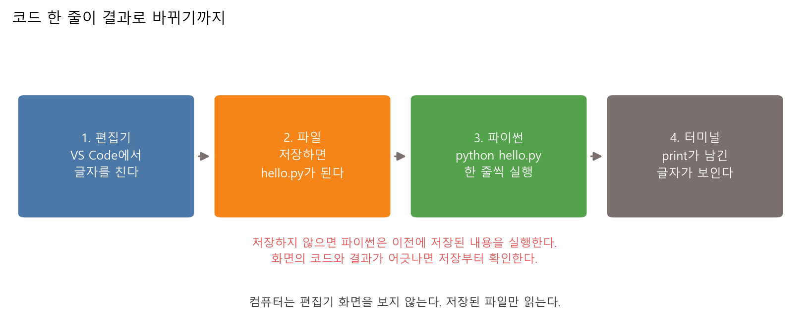
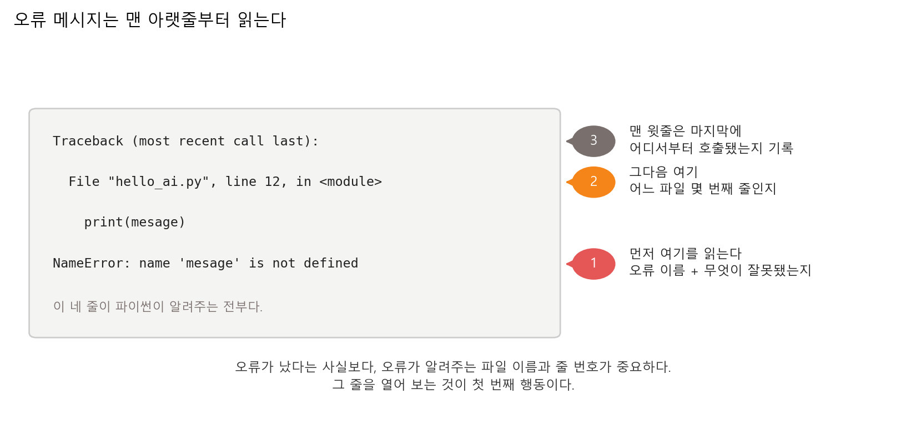
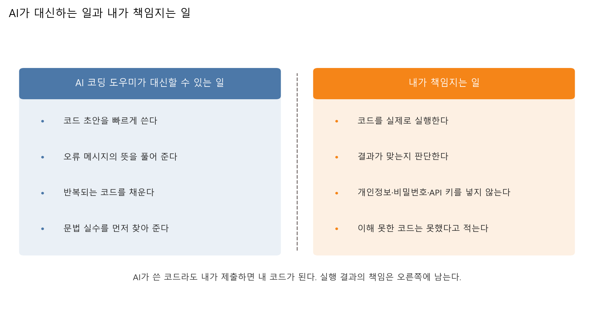
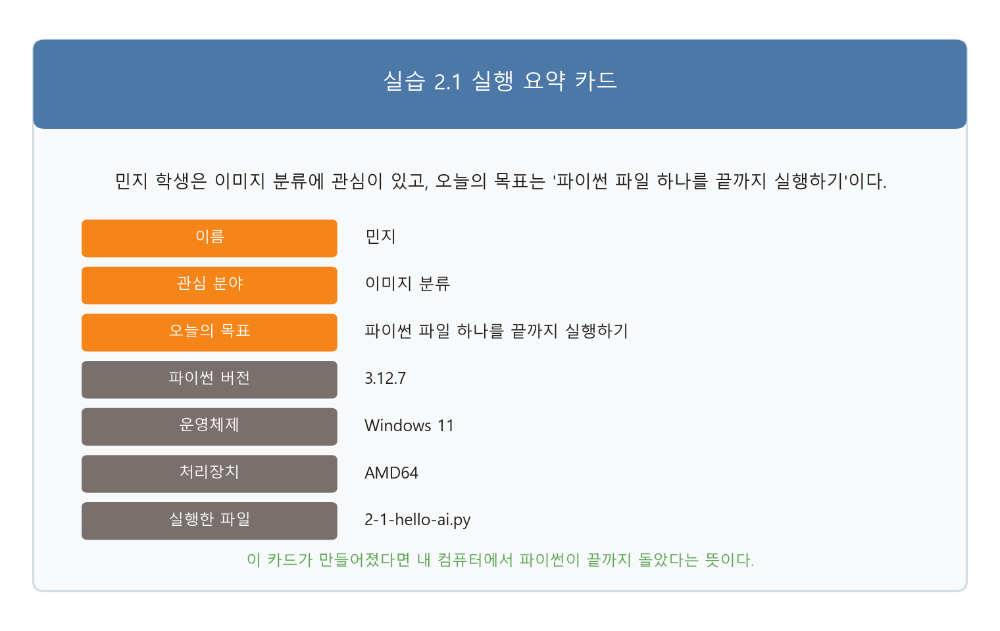
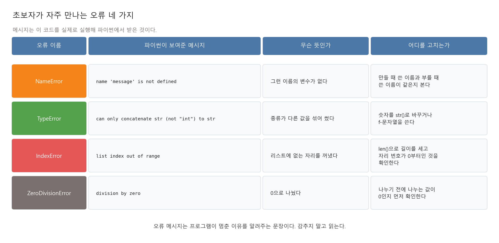

# 제2장 AI 코딩 작업실 만들기 — 내 컴퓨터에서 코드가 도는지 확인한다

---

## 이론 강의
---

### 학습 목표

- 개발환경을 이루는 네 가지(편집기, 파이썬, 터미널, 저장소)가 각각 무슨 일을 하는지 구분한다
- 파이썬과 VS Code를 순서대로 설치하고, 설치가 막히는 지점을 미리 안다
- 터미널에서 폴더를 옮겨 다니며 파이썬 파일 하나를 실행한다
- AI 코딩 도우미에게 넣어도 되는 것과 넣으면 안 되는 것을 구분한다
- 오류 메시지를 맨 아랫줄부터 읽고, 파일 이름과 줄 번호를 찾아 그 줄을 연다

1장에서 인공지능이 무엇이고 무엇을 못 하는지를 이야기로 다뤘다. 3장부터는 데이터를 직접 만지기 시작한다. 그 사이에 필요한 것이 작업실이다. 이번 장에서 만드는 작업실은 책상이 아니라, **내가 쓴 코드가 내 컴퓨터에서 실제로 돌고 그 결과를 눈으로 확인할 수 있는 상태**를 뜻한다.

---

### 1. 개발환경이란 무엇인가

#### 1-1. 네 가지 도구가 나눠 맡는다

"개발환경"은 프로그램 이름이 아니다. 네 가지 도구가 일을 나눠 맡은 상태를 부르는 말이다.

**표 2.1** 작업실을 이루는 네 가지

| 도구 | 하는 일 | 없으면 생기는 일 |
|---|---|---|
| 편집기(VS Code) | 코드를 글자로 쓰고 저장한다 | 메모장으로도 쓸 수는 있다. 오타를 대신 잡아 주지 않는다 |
| 파이썬 | 저장된 파일을 한 줄씩 읽어 실행한다 | 코드는 그냥 글자 뭉치로 남는다 |
| 터미널 | 컴퓨터에게 명령을 글자로 시킨다 | 파일을 실행할 방법이 줄어든다 |
| GitHub 저장소 | 파일을 보관하고 남에게 보여준다 | 노트북이 고장 나면 코드가 사라진다 |

이 네 가지는 서로를 대신하지 못한다. VS Code는 코드를 실행하지 않고, 파이썬은 코드를 대신 써 주지 않는다. VS Code의 실행 버튼도 결국 터미널에 명령을 대신 쳐 주는 장치다.

#### 1-2. 컴퓨터는 화면이 아니라 파일을 읽는다

초보자가 가장 자주 겪는 사고는 문법 오류가 아니다. **저장하지 않고 실행하는 것**이다.



**그림 2.1** 편집기에서 친 글자는 저장을 거쳐야 파일이 되고, 파이썬은 그 파일만 읽는다

화면에는 고친 코드가 보이는데 실행 결과는 그대로인 상황이 여기서 나온다. 파이썬은 편집기 화면을 보지 않는다. 디스크에 저장된 파일만 읽는다.

○ **체크 질문**
  - 코드를 고쳤는데 결과가 안 바뀐다. 무엇을 가장 먼저 확인하는가
  - VS Code의 실행 버튼과 터미널에 직접 명령을 치는 것은 무엇이 다른가

---

### 2. VS Code와 파이썬 — 설치 순서와 막히는 지점

#### 2-1. 순서를 지킨다

세 가지를 이 순서로 깐다. 순서를 바꾸면 뒤에서 다시 손봐야 한다.

○ **1단계: 파이썬을 먼저 깐다**
  - `python.org` 다운로드 페이지에서 자기 운영체제용 설치 파일을 받는다[^py-download]
  - **3.12 이상이면 된다.** 확인 시점(2026년 8월) 최신 안정판은 3.14.7이지만, 갓 나온 버전에서는 실습에 쓰는 패키지가 아직 준비되지 않아 설치가 막히는 일이 있다. 이 강의의 실습 로그는 3.12.7에서 만들었다
  - 이미 3.13이나 3.14가 깔려 있어도 그대로 쓴다. 패키지 설치에서 막히면 그때 3.12를 따로 깐다
  - Windows 설치 화면 맨 아래의 **Add python.exe to PATH** 를 반드시 켠다. 이 한 칸을 놓치면 터미널에서 `python` 명령이 안 먹는다
  - macOS는 시스템에 파이썬이 이미 있지만, 수업에서는 직접 깐 것을 쓴다

○ **2단계: VS Code를 깐다**
  - `code.visualstudio.com`에서 받는다. 설치 자체는 다음 버튼만 누르면 끝난다

○ **3단계: VS Code에 Python 확장을 깐다**
  - 왼쪽 막대의 확장(Extensions) 아이콘을 누르고 `Python`을 검색해 Microsoft가 만든 것을 설치한다
  - 확장을 깔아야 VS Code가 `.py` 파일을 파이썬 코드로 알아본다

○ **4단계: 폴더를 열고 인터프리터를 고른다**
  - `파일 > 폴더 열기`로 수업용 폴더를 연다. 파일 하나만 열지 않고 **폴더**를 연다
  - `Ctrl+Shift+P`(macOS는 `Cmd+Shift+P`)를 눌러 `Python: Select Interpreter`를 실행하고 방금 깐 파이썬을 고른다

VS Code 공식 문서는 이 순서를 화면 캡처와 함께 안내한다. 폴더를 열고, 환경을 만들고, `hello.py`를 만들어 편집기 우측 위 실행 버튼을 누르는 데까지가 한 페이지에 들어 있다.[^vscode-tutorial]

#### 2-2. 여기서 막힌다

수업에서 실제로 걸리는 지점은 정해져 있다. 증상을 알고 가면 대부분 그 자리에서 풀린다.

**표 2.2** 자주 막히는 지점과 확인할 것

| 증상 | 원인 | 확인할 것 |
|---|---|---|
| 터미널에 `python은(는) 내부 또는 외부 명령이 아닙니다` | 설치할 때 PATH를 안 켰다 | 파이썬을 다시 설치하며 **Add python.exe to PATH** 를 켠다. 또는 `py 파일이름.py`로 실행한다 |
| Windows에서 `python`을 치면 마이크로소프트 스토어가 열린다 | 스토어 연결용 껍데기가 먼저 잡힌다 | `py` 명령을 쓰거나, 설정의 앱 실행 별칭에서 파이썬 항목을 끈다 |
| VS Code가 파이썬을 못 찾는다 | 인터프리터를 안 골랐다 | `Python: Select Interpreter`로 직접 고른다 |
| 실행은 되는데 결과가 안 바뀐다 | 저장을 안 했다 | `Ctrl+S`를 누른다. 탭 이름 옆의 점이 사라졌는지 본다 |
| `ModuleNotFoundError: No module named 'matplotlib'` | 패키지를 안 깔았다 | `python -m pip install -r practice/requirements.txt` 를 친다 |
| 한글 폴더 이름이나 공백 때문에 명령이 꼬인다 | 경로에 띄어쓰기가 있다 | 폴더 이름을 영문으로 짓는다. 예: `basic-dl` |

#### 2-3. 로컬이 막히면 Colab으로 간다

설치가 끝나지 않아도 수업은 계속한다. Google Colab은 브라우저에서 파이썬을 실행하는 서비스이고, 설치가 필요 없으며 무료로 쓴다. 만든 노트북은 구글 드라이브에 저장된다.[^colab-faq]

○ **Colab으로 실습하는 순서**
  - `colab.research.google.com`에 구글 계정으로 들어가 새 노트북을 만든다
  - 실습 코드를 셀에 붙여 넣고 `Shift+Enter`로 실행한다
  - 만들어진 그림 파일은 왼쪽 파일 탭에서 내려받아 LMS에 올린다

○ **Colab을 쓸 때 알아 둘 것**
  - 일정 시간 손대지 않으면 연결이 끊기고 만든 파일이 사라진다. 결과 파일은 바로 내려받는다
  - 이번 장 실습 두 개는 Colab에서 그대로 돌아간다. 딥러닝 프레임워크를 쓰지 않기 때문이다
  - 로컬 설치는 나중에 마저 해도 된다. 이번 주에 끝내야 하는 것은 설치가 아니라 **파일 하나를 실행해 보는 경험**이다

---

### 3. 터미널에서 파일 하나 실행하기

터미널은 컴퓨터에게 글자로 명령하는 창이다. VS Code 위쪽 메뉴의 `터미널 > 새 터미널`로 연다. 단축키는 Ctrl 키와 백틱 키를 함께 누르는 것이다.

터미널에서 하는 일은 두 가지뿐이다. **지금 어느 폴더에 있는지 맞추고, 그 폴더의 파일을 실행한다.**

**표 2.3** 이번 장에서 쓰는 명령 전부

| 하는 일 | Windows(PowerShell) | macOS·Linux |
|---|---|---|
| 지금 있는 폴더 확인 | `pwd` | `pwd` |
| 폴더 안 파일 보기 | `ls` | `ls` |
| 폴더 안으로 들어가기 | `cd code` | `cd code` |
| 한 단계 위로 나가기 | `cd ..` | `cd ..` |
| 파이썬 파일 실행 | `python 2-1-hello-ai.py` | `python3 2-1-hello-ai.py` |

○ **오류의 절반은 위치 문제다**
  - `can't open file ... No such file or directory` 는 문법 오류가 아니다. 그 폴더에 그 파일이 없다는 뜻이다
  - `ls`를 쳐서 실행하려는 파일 이름이 목록에 보이는지 먼저 본다
  - 파일 이름은 대소문자와 하이픈까지 정확히 친다. 앞 몇 글자를 치고 `Tab`을 누르면 나머지가 채워진다

○ **`python`인가 `python3`인가**
  - Windows에서는 보통 `python`, macOS·Linux에서는 `python3`가 잡힌다
  - Windows에서 `python`이 안 먹으면 `py`를 쓴다
  - 어느 쪽이 잡히는지는 `python --version`으로 확인한다

---

### 4. GitHub 저장소 만들기

저장소(repository)는 파일을 모아 두는 인터넷 위의 폴더다. 여기에 올려 두면 노트북이 고장 나도 코드가 남고, 링크 하나로 남에게 보여줄 수 있다.

○ **브라우저만으로 만드는 순서**
  - `github.com`에서 계정을 만든다
  - 오른쪽 위 `+` 버튼 → `New repository`를 누른다
  - 이름을 `basic-dl-2026`처럼 영문으로 짓고, `Public` 또는 `Private`을 고른다
  - `Add a README file`을 켜고 `Create repository`를 누른다
  - 만들어진 화면에서 `Add file > Upload files`로 실습 파일을 끌어다 놓는다

GitHub 공식 한국어 문서의 Hello World 안내는 저장소 만들기부터 브랜치, 파일 편집과 커밋, 풀 리퀘스트까지를 다룬다. 명령줄을 쓰지 않고 Git을 깔지 않아도 브라우저만으로 따라갈 수 있다고 밝힌다.[^github-hello]

○ **올리면 안 되는 것**
  - 비밀번호, API 키, 학번, 주민등록번호, 남의 연락처
  - `Public` 저장소는 전 세계 누구나 본다. 한 번 올린 것은 지워도 기록에 남을 수 있다
  - 이번 장 실습 코드에 개인정보를 넣을 자리를 두지 않은 것도 같은 이유다

○ **지금은 넘어가는 것**
  - `git clone`, `commit`, `push` 같은 명령줄 사용법은 이번 장에서 다루지 않는다
  - 이번 주는 브라우저에서 파일을 올리는 것까지만 한다

---

### 5. 오류 메시지 읽는 법

오류는 실패 통지가 아니다. 어디를 고치면 되는지 알려주는 문장이다. 초보자는 오류가 뜨면 화면을 닫는데, 필요한 정보가 바로 그 화면에 있다.



**그림 2.2** 맨 아랫줄에 오류 이름이, 그 위에 파일 이름과 줄 번호가 있다

○ **읽는 순서**
  1. **맨 아랫줄**을 읽는다. 오류 이름과 무엇이 잘못됐는지가 거기 있다
  2. 그 위에서 **파일 이름과 줄 번호**를 찾는다. 그 줄을 연다
  3. 맨 윗줄 `Traceback (most recent call last):` 은 호출 기록이다. 마지막에 본다

파이썬 공식 튜토리얼도 구문 에러와 예외를 나누고, `ZeroDivisionError`·`NameError`·`TypeError`의 트레이스백을 실제 화면 그대로 보여준다. 한국어로 번역돼 있다.[^py-errors]

#### 5-1. 자주 만나는 네 가지

실습 2.2에서 이 네 가지를 직접 내 본다. 아래 메시지는 실습 코드를 실행해 받은 것이다.

**표 2.4** 초보자가 자주 만나는 오류

| 오류 이름 | 파이썬이 보여준 메시지 | 무슨 뜻인가 |
|---|---|---|
| `NameError` | `name 'message' is not defined` | 그런 이름의 변수가 없다 |
| `TypeError` | `can only concatenate str (not "int") to str` | 종류가 다른 값을 섞어 썼다 |
| `IndexError` | `list index out of range` | 리스트에 없는 자리를 꺼냈다 |
| `ZeroDivisionError` | `division by zero` | 0으로 나눴다 |

_출처: `practice/chapter2/results/2-2-read-error.log`_

#### 5-2. 오류를 숨기는 코드는 쓰지 않는다

파이썬에는 오류를 잡는 `try`/`except` 문법이 있다. 이것으로 오류를 잡아 아무것도 하지 않으면(`except: pass`) 화면은 조용해지고 프로그램은 계속 돈다.

그렇게 하지 않는다. 오류 메시지는 프로그램이 왜 틀렸는지 알려주는 유일한 단서다. 그것을 지우면 원인을 찾을 방법이 사라진다.

○ **`except`가 실제로 하는 일**
  - `try` 안에서 오류가 나면 파이썬은 그 자리에서 멈추고, 무엇이 왜 틀렸는지를 담은 값을 하나 만든다
  - `except ... as error`는 그 값을 `error`라는 변수로 받는다. 오류를 없애는 것이 아니라 변수에 담아 두는 것이다
  - `pass`를 쓰면 받아 둔 변수를 한 번도 꺼내지 않고 버린다. 문제가 되는 것은 `try`/`except` 문법이 아니라 버리는 쪽이다

실습 2.2도 `try`/`except`를 쓰지만, 잡은 오류를 버리지 않고 화면에 꺼내 읽는다. 이유는 두 가지다.

○ **네 가지를 한 번에 보려고 잡는다**
  - 실습 2.2는 `NameError`, `TypeError`, `IndexError`, `ZeroDivisionError`를 차례로 낸다
  - 잡지 않으면 첫 번째 `NameError`에서 프로그램이 끝나므로 나머지 세 개는 화면에 나오지 않는다

○ **받아 둔 값에서 정보를 꺼내 찍는다**
  - 오류 이름, 파이썬이 준 메시지, 오류가 난 파일과 줄 번호, 그 줄이 들어 있던 함수 이름
  - 이 네 가지가 `except: pass`로 사라지는 정보 전부다

차이는 `except` 다음 줄에서 갈린다. 아래는 실습 2.2가 하는 일을 두 줄로 줄여 쓴 것이다.

```python
# 쓰지 않는 방식 - 받아 둔 오류를 그대로 버린다
try:
    cause_name_error()
except Exception:
    pass

# 실습 2.2 방식 - 받아 둔 오류에서 필요한 것을 꺼내 찍는다
try:
    cause_name_error()
except Exception as error:
    print(type(error).__name__)   # 오류 이름
    print(error)                  # 파이썬이 준 메시지
```

실습 2.2를 실행하면 첫 사례가 이렇게 나온다.

```
--- 1. NameError ---
파이썬이 준 메시지: name 'message' is not defined
어디서 났는가: 2-2-read-error.py 52번째 줄, cause_name_error() 안
```

_출처: `practice/chapter2/results/2-2-read-error.log`_

세 줄은 앞의 읽는 순서와 그대로 맞물린다. 오류 이름과 메시지가 1단계이고, 파일 이름과 줄 번호가 2단계다. 실습 2.2는 첫 사례에서 오류를 잡지 않았을 때 나오는 `Traceback` 화면까지 함께 찍으므로, 3단계에 해당하는 호출 기록도 같은 화면에서 확인한다.

○ **그러면 `except`는 언제 쓰는가**
  - 잡은 다음에 무엇을 할지가 정해져 있을 때 쓴다. 메시지를 찍거나, 기록을 남기거나, 사용자에게 다시 물을 때다
  - 잡은 다음에 할 일이 떠오르지 않으면 잡지 않는다. 오류가 그대로 화면에 나오는 편이 원인을 찾기에 낫다
  - 잡은 다음에 할 일이 정해진 예는 14장 실습 코드에 나온다. 문법 오류를 잡아 파일 이름과 줄 번호를 목록에 담는다

---

### 6. AI 코딩 도우미와 일하는 방법

AI 코딩 도우미는 코드 초안을 쓰고 오류 메시지를 풀어 준다. 대신 실행은 하지 않고, 결과가 맞는지도 판단하지 않는다.



**그림 2.3** 왼쪽은 맡길 수 있는 일, 오른쪽은 넘길 수 없는 일

#### 6-1. 넣으면 안 되는 것

AI 도구에 친 글은 내 컴퓨터 밖으로 나간다. 다음은 넣지 않는다.

○ **개인정보** — 이름과 학번, 연락처, 주소, 남의 정보 전부

○ **비밀번호와 API 키** — 한 번 노출된 키는 다시 안전해지지 않는다. 새로 발급받아야 한다

○ **공개하면 안 되는 자료** — 아직 발표하지 않은 과제, 남의 코드, 회사·기관의 내부 문서

키를 코드에 직접 쓰지 않고 환경변수로 빼는 방법은 12장에서 다룬다. 이번 장에서는 **넣지 않는다**는 규칙만 지킨다.

#### 6-2. 질문에 세 가지를 담는다

"이거 왜 안 돼요"라고만 물으면 답도 그만큼만 온다. 다음 세 가지를 함께 적는다.

1. 무엇을 하려고 했는가 (목표)
2. 무엇을 했는가 (코드 또는 명령)
3. 무엇이 나왔는가 (오류 메시지 전체를 그대로 붙여 넣는다)

오류 메시지는 요약하지 않고 통째로 붙인다. 파일 이름과 줄 번호가 거기 들어 있다.

#### 6-3. 받은 답을 확인하는 순서

○ **실행부터 한다** — 설명이 그럴듯해도 실행하기 전까지는 확인된 것이 아니다

○ **바뀐 줄을 찾는다** — AI가 통째로 새로 쓴 코드를 받으면, 원래 코드와 무엇이 달라졌는지 짚는다

○ **이해 못 한 줄을 표시한다** — 이해하지 못한 채 제출한 코드는 다음 오류에서 고칠 수 없다

○ **책임은 옮겨 가지 않는다** — AI가 쓴 코드라도 내가 제출하면 내 코드다

---

### 7. 직접 움직여 보는 웹 자료

설치와 실행은 글로 읽는 것보다 화면을 따라가는 편이 빠르다. 아래 설명은 각 페이지를 열어 확인한 내용이다.

| 자료 | 무엇을 볼 수 있는가 | 주소 |
|---|---|---|
| VS Code, Getting Started with Python | 폴더 열기부터 `hello.py` 작성, 우측 위 실행 버튼 누르기, F9·F5 디버깅까지를 화면 캡처와 함께 순서대로 보여준다 | https://code.visualstudio.com/docs/python/python-tutorial |
| GitHub Docs(한국어), Hello World | 저장소 만들기 → 브랜치 → 파일 편집·커밋 → 풀 리퀘스트를 브라우저만으로 따라간다. Git 설치가 필요 없다 | https://docs.github.com/ko/get-started/start-your-journey/hello-world |
| Google Colab FAQ | 설치 없이 쓰는 무료 노트북 서비스라는 점, 노트북이 구글 드라이브에 저장된다는 점을 공식 문서로 확인한다 | https://research.google.com/colaboratory/faq.html |
| 파이썬 공식 튜토리얼(한국어), 8. 에러와 예외 | 구문 에러와 예외를 나누고, 실제 트레이스백 화면을 예외별로 보여준다 | https://docs.python.org/ko/3/tutorial/errors.html |

○ VS Code 문서의 화면 캡처는 설치 절(2절)과 짝이 된다. 화면이 문서와 다르게 보이면 확장을 깔았는지, 인터프리터를 골랐는지 먼저 확인한다

○ 파이썬 공식 튜토리얼의 트레이스백 예시는 실습 2.2가 만드는 화면과 같은 형식이다. 두 화면을 나란히 놓고 어느 줄이 오류 이름인지 짚어 본다

---

## 실습
---

두 가지를 한다. 첫 번째는 내 컴퓨터에서 파이썬이 끝까지 도는지 확인하는 실습이고, 두 번째는 오류를 일부러 내서 메시지를 읽는 실습이다. 둘 다 딥러닝 코드가 아니다. 이번 주에 확인할 것은 모델 성능이 아니라 **실행된다는 사실**이다.

#### 실행 환경

```bash
cd practice/chapter2
python -m pip install -r ../requirements.txt
```

필요한 패키지는 matplotlib 하나다. GPU는 필요 없다. 두 실습 모두 노트북에서 몇 초 안에 끝난다.

로컬 설치가 끝나지 않았으면 Colab에서 같은 코드를 실행한다. 두 실습 모두 Colab에서 그대로 돌아간다.

---

### 실습 2.1: 내 컴퓨터에서 파이썬이 도는지 확인한다

#### 실습 목표

- 파일을 만들고, 저장하고, 터미널에서 실행하는 한 바퀴를 끝까지 돈다
- 내가 쓴 값이 화면의 결과로 바뀌는 것을 확인한다
- 지금 쓰는 파이썬 버전과 운영체제를 눈으로 본다

#### 데이터

데이터를 쓰지 않는다. 학생이 파일 맨 위에 직접 적은 세 값과, 코드가 실행 중에 알아낸 환경 정보만 쓴다. 개인정보를 넣을 자리를 두지 않았다.

#### 실행 명령

```bash
cd practice/chapter2/code
python 2-1-hello-ai.py
```

#### 핵심 코드

파일 맨 위에 학생이 바꿀 세 줄이 있다.

```python
MY_NAME = "민지"
MY_INTEREST = "이미지 분류"
MY_GOAL = "파이썬 파일 하나를 끝까지 실행하기"
```

실행 환경을 알아내는 부분은 다음과 같다. 값을 직접 적는 것이 아니라, 코드가 실행되는 컴퓨터에게 물어본다.

```python
sys.version.split()[0]                            # 파이썬 버전
f"{platform.system()} {platform.release()}"       # 운영체제
platform.machine()                                # 처리장치
```

_전체 코드는 `practice/chapter2/code/2-1-hello-ai.py` 참고_

#### 실행 결과

```text
=== 나의 첫 파이썬 실행 ===
민지 학생은 이미지 분류에 관심이 있고, 오늘의 목표는 '파이썬 파일 하나를 끝까지 실행하기'이다.

=== 실행 환경 ===
파이썬 버전: 3.12.7
운영체제: Windows 11
처리장치: AMD64
실행한 파일: 2-1-hello-ai.py

[그림 폰트] 한글 폰트 사용: ['Malgun Gothic']
저장: results/hello_ai_card.png  (LMS 제출물 1)
```

_출처: `practice/chapter2/results/2-1-hello-ai.log`_



**그림 2.4** 실행이 끝나면 이 카드가 만들어진다. 아래 네 줄은 코드가 컴퓨터에게 물어 받은 값이다

#### 결과 읽기

○ **자기소개 문장** — 내가 적은 세 값이 한 문장으로 합쳐졌다. 값을 바꾸면 문장도 바뀐다

○ **파이썬 버전 3.12.7** — 이 로그를 만든 컴퓨터의 값이다. 내 화면에는 내가 깐 버전이 찍힌다. 두 값이 다른 것이 정상이다

○ **운영체제 Windows 11** — 이것도 컴퓨터마다 다르다. macOS면 `Darwin`이 찍힌다

○ **그림 폰트 줄** — 한글 폰트를 찾았다는 뜻이다. 못 찾으면 그림 라벨이 영어로 바뀐다. 글자가 네모(□□□)로 깨지지 않게 해 둔 장치다

○ **카드 파일이 만들어졌다** — 이 파일 한 장이 "내 컴퓨터에서 파이썬이 끝까지 돌았다"는 증거다. LMS에 올릴 첫 번째 파일이다

#### 해 보기

1. `MY_NAME`, `MY_INTEREST`, `MY_GOAL`을 자기 것으로 바꾸고 다시 실행한다
2. 카드 그림에 바뀐 값이 나왔는지 본다
3. 값을 바꾸고 **저장하지 않은 채** 실행해 본다. 결과가 안 바뀐다. 그림 2.1이 말한 것이 이것이다

○ 이름 자리에 학번이나 연락처를 넣지 않는다. 이 파일은 LMS에 올라가고, GitHub에 올리면 남이 본다

---

### 실습 2.2: 오류 메시지 읽기 연습

#### 실습 목표

- 오류를 일부러 내고, 파이썬이 준 메시지를 그대로 읽는다
- 오류 이름·파일 이름·줄 번호를 화면에서 찾아낸다
- 오류를 숨기는 코드와 읽는 코드의 차이를 본다

#### 데이터

데이터를 쓰지 않는다. 오류를 내는 짧은 함수 네 개가 전부다.

#### 실행 명령

```bash
cd practice/chapter2/code
python 2-2-read-error.py
```

#### 핵심 코드

오류를 내는 함수는 이렇게 생겼다. 만들 때 쓴 이름과 부를 때 쓴 이름이 한 글자 다르다.

```python
def cause_name_error() -> str:
    mesage = "안녕하세요"          # 만들 때는 mesage
    return message                 # 부를 때는 message -> 그런 이름이 없다
```

잡은 오류에서 파일 이름과 줄 번호를 꺼내는 부분은 다음과 같다.

```python
frames = traceback.extract_tb(error.__traceback__)
last = frames[-1]
return Path(last.filename).name, last.lineno, last.name
```

_전체 코드는 `practice/chapter2/code/2-2-read-error.py` 참고_

#### 실행 결과

```text
--- 1. NameError ---
파이썬이 준 메시지: name 'message' is not defined
어디서 났는가: 2-2-read-error.py 52번째 줄, cause_name_error() 안
무슨 뜻인가: 그런 이름의 변수가 없다
어디를 고치는가: 만들 때 쓴 이름과 부를 때 쓴 이름이 같은지 본다

[참고] 오류를 잡지 않았다면 화면에 이렇게 나온다.
      (폴더 경로는 파일 이름만 남기고 줄였다)
    Traceback (most recent call last):
      File "2-2-read-error.py", line 131, in run_one_case
        case["trigger"]()
      File "2-2-read-error.py", line 52, in cause_name_error
        return message                 # 부를 때는 message -> 그런 이름이 없다
               ^^^^^^^
    NameError: name 'message' is not defined. Did you mean: 'mesage'?
```

_출처: `practice/chapter2/results/2-2-read-error.log`_



**그림 2.5** 실행해서 받은 오류 네 가지. 메시지 칸의 글자는 파이썬이 실제로 출력한 것이다

#### 결과 읽기

○ **맨 아랫줄이 답을 준다** — `NameError: name 'message' is not defined`. 오류 이름과 무엇이 잘못됐는지가 한 줄에 들어 있다

○ **줄 번호가 고칠 자리를 가리킨다** — `line 52`. 52번째 줄을 열면 `return message`가 있다. 오류를 찾아 헤맬 필요가 없다

○ **파이썬이 오타까지 짚는다** — `Did you mean: 'mesage'?`. 비슷한 이름이 근처에 있으면 이렇게 물어본다

○ **화살표가 위치를 가리킨다** — `^^^^^^^` 는 그 줄에서 문제가 난 지점이다

○ **네 번 틀렸는데 프로그램은 끝까지 돌았다** — 오류를 잡아 읽고 다음으로 넘어갔기 때문이다. 잡은 오류를 버렸다면 화면에는 아무것도 안 남는다

#### 해 보기

1. `cause_name_error()` 안의 `mesage`를 `message`로 고치고 다시 실행한다. 코드가 멈추며 `RuntimeError`가 난다. 오류가 나지 않으면 그것도 알려주도록 만들어 뒀다
2. 파일 맨 위 `SHOW_FULL_TRACEBACK`을 `False`로 바꿔 실행한다. 원본 오류 화면이 사라진다. 실제 개발에서 이렇게 하면 무엇을 잃는지 생각해 본다
3. 오류 함수 하나를 골라 다른 방식으로 틀리게 고쳐 본다. 오류 이름이 바뀌는지 본다

○ 오류 메시지를 AI 도우미에게 물을 때는 위 화면을 **통째로** 붙여 넣는다. 줄여서 붙이면 줄 번호가 사라진다

---

### 책임 있는 AI 체크

AI 코딩 도우미를 처음 쓰는 주다. 아래를 습관으로 만든다.

**표 2.5** 제출 전 점검

| 점검 항목 | 확인 질문 |
|---|---|
| 입력 금지 | 비밀번호·토큰·API 키를 AI 도구에 붙여 넣지 않았는가 |
| 오류 은폐 | 오류를 `try/except`로 감싸 넘기지 않고 원인을 고쳤는가 |
| 실행 확인 | AI가 준 코드를 실행해 결과를 직접 봤는가 |
| 설명 가능 | 받은 코드가 무엇을 하는지 한 줄로 말할 수 있는가 |
| 캡처 점검 | 터미널 캡처에 계정 이름이나 사설 경로가 드러나지 않았는가 |

---

### 과제 (LMS 제출)

수업 시간에 실습을 실행했는지만 확인한다. 따로 보고서를 쓰지 않는다.

#### 제출물

두 실습을 실행하면 만들어지는 그림 파일 두 장을 LMS에 올린다.

1. `practice/chapter2/results/hello_ai_card.png`
2. `practice/chapter2/results/error_guide_table.png`

#### 평가 기준

- 두 파일을 올리면 완료로 인정한다
- 실습 2.1에서 이름을 바꿨다면 바뀐 카드가 올라온다. 기본값 그대로여도 인정한다
- Colab에서 실행해 내려받은 파일도 같게 인정한다
- GitHub 저장소를 만들었다면 링크를 함께 적는다. 저장소 만들기가 막혔어도 감점하지 않는다

#### 마감

- 실습 수업일 포함 7일 이내

---

### 핵심 정리

| 개념 | 한 줄 정리 |
|---|---|
| 개발환경 | 편집기·파이썬·터미널·저장소가 일을 나눠 맡은 상태다. 서로를 대신하지 못한다 |
| 저장과 실행 | 파이썬은 편집기 화면이 아니라 저장된 파일을 읽는다 |
| 설치 순서 | 파이썬 → VS Code → Python 확장 → 인터프리터 선택. PATH 체크박스를 놓치면 터미널에서 막힌다 |
| Colab | 설치 없이 브라우저에서 실행한다. 로컬이 막혀도 수업을 계속한다 |
| GitHub 저장소 | 인터넷 위의 폴더다. 비밀번호와 키는 올리지 않는다 |
| AI 코딩 도우미 | 초안과 설명은 맡기고, 실행과 판단과 책임은 내가 진다. 개인정보·키는 넣지 않는다 |
| 오류 메시지 | 맨 아랫줄에 오류 이름, 그 위에 파일 이름과 줄 번호가 있다. 숨기지 않고 읽는다 |

다음 장에서는 이 작업실에서 표 데이터를 직접 만든다. 모델에게 줄 재료가 어떻게 생겼는지부터 확인한다.

---

[^py-download]: Python Software Foundation, "Download Python". https://www.python.org/downloads/ (2026년 8월 24일 확인. 최신 안정판 3.14.7, 2026년 8월 5일 배포)

[^vscode-tutorial]: Microsoft, "Getting Started with Python in VS Code". https://code.visualstudio.com/docs/python/python-tutorial (2026년 8월 24일 확인)

[^colab-faq]: Google, "Colaboratory Frequently Asked Questions". https://research.google.com/colaboratory/faq.html (2026년 8월 24일 확인)

[^github-hello]: GitHub, "Hello World", GitHub Docs 한국어판. https://docs.github.com/ko/get-started/start-your-journey/hello-world (2026년 8월 24일 확인)

[^py-errors]: Python Software Foundation, "8. 에러와 예외", 파이썬 자습서 한국어판. https://docs.python.org/ko/3/tutorial/errors.html (2026년 8월 24일 확인)
