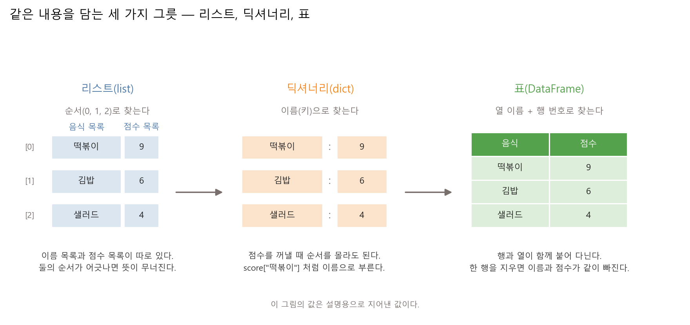
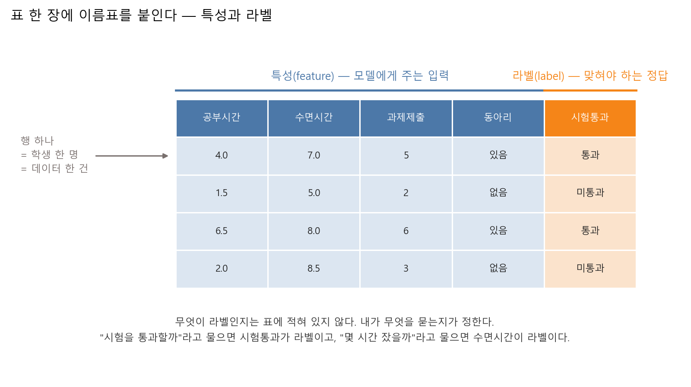
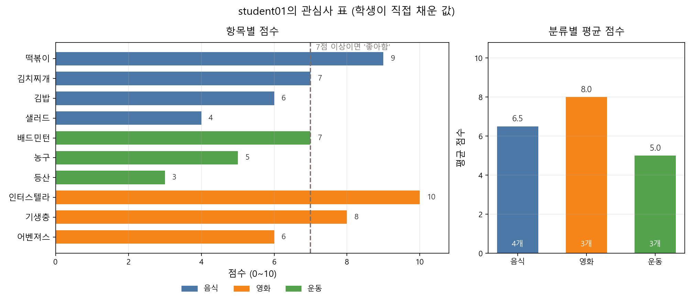
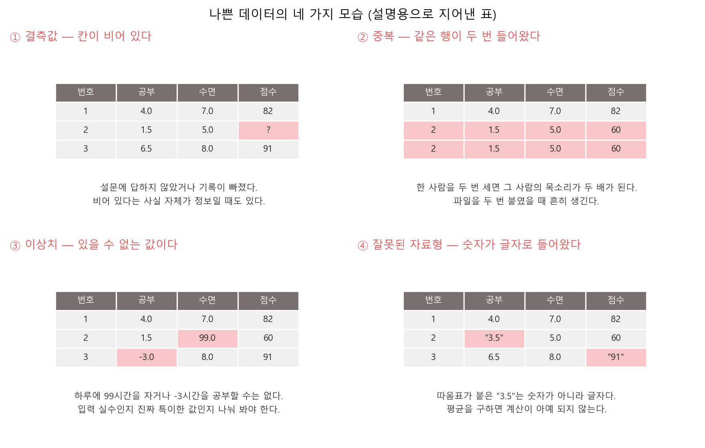
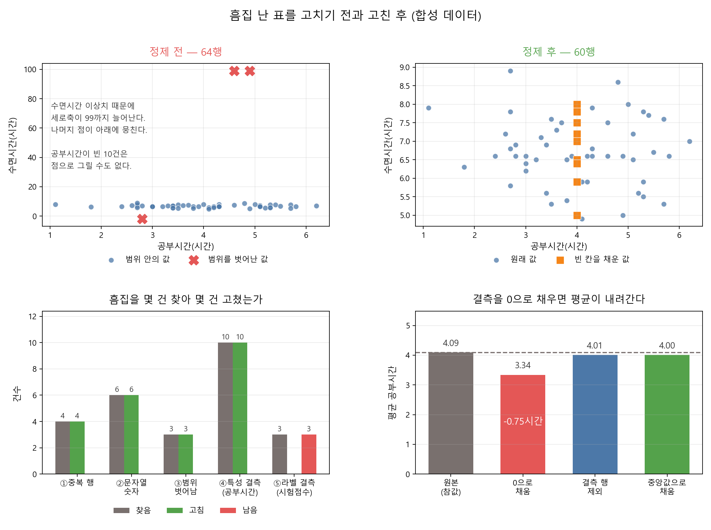
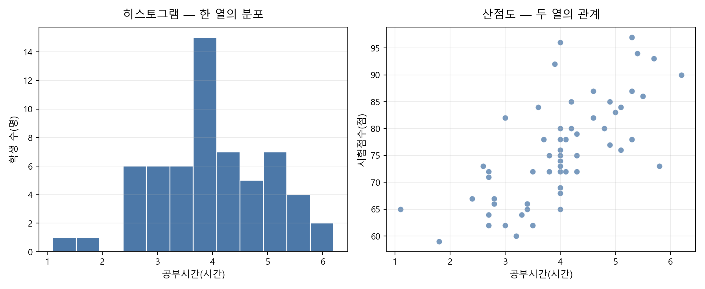

# 제3장 Python과 데이터 — AI에게 먹일 재료 만들기

---

### 학습 목표

- 표 한 장에서 행과 열이 각각 무엇을 뜻하는지 설명한다
- AI에게 요구사항을 전달해 코드를 받고, 출력을 체크리스트로 검증한다
- 표의 어느 열이 특성이고 어느 열이 라벨인지 스스로 정한다
- 한글 CSV와 그래프가 깨지는 원인을 인코딩과 폰트로 나눠 설명한다
- 결측값, 중복 행, 이상치, 잘못된 자료형을 찾아 고치고, 결측을 0으로 채우면 평균이 어긋나는 정도를 숫자로 말한다
- 정제한 표를 요약 통계·히스토그램·산점도로 읽고, 글자 분류 열을 원-핫 인코딩으로 바꾼다

2장에서 코드 한 줄이 도는 작업실을 만들었다. 이번 장에서는 그 작업실에서 표를 만든다. 모델은 이야기나 느낌을 먹지 않는다. 행과 열로 정리된 표를 먹는다. 4장에서 모델에게 표를 넘기기 전에, 그 표가 어떻게 생겨야 하는지부터 손으로 확인한다.

이 장은 설명과 실습을 번갈아 진행한다. 표 만드는 방법을 배운 뒤 실습 3.1에서 내 관심사 표를 바이브코딩으로 만들고, 나쁜 데이터를 배운 뒤 실습 3.2에서 일부러 흠집 낸 표를 바이브코딩으로 고친다.

---

### 실습 준비

```bash
cd practice/chapter3
python -m pip install -r ../requirements.txt
```

필요한 패키지는 numpy, pandas, matplotlib, scikit-learn이다. GPU는 필요 없다. 두 실습 모두 노트북에서 몇 초 안에 끝난다.

---

### 1. 데이터를 표로 본다

딥러닝 교재를 펼치면 곧바로 행렬이 나온다. 그 행렬의 정체는 표다. 엑셀에서 보던 그 표다.

표에는 규칙이 두 개 있다.

○ **행 하나가 데이터 한 건이다**
  - 학생 표라면 행 하나가 학생 한 명이다
  - 메일 표라면 행 하나가 메일 한 통이다
  - 행을 세면 데이터가 몇 건인지 나온다

○ **열 하나가 재고 싶은 항목이다**
  - 공부 시간, 수면 시간, 시험 점수처럼 항목마다 열을 따로 만든다
  - 한 열 안의 값은 단위가 같아야 한다. 어떤 칸은 시간이고 어떤 칸은 분이면 계산이 어긋난다

**표 3.1** 학생 데이터 표의 예 (행 5건 × 열 3개)

| 학생 번호 | 공부 시간 | 수면 시간 | 시험 점수 |
|---|---|---|---|
| 1 | 3.0 | 7.0 | 65 |
| 2 | 5.5 | 6.5 | 78 |
| 3 | 6.5 | 8.0 | 82 |
| 4 | 2.0 | 7.5 | 55 |
| 5 | 8.0 | 6.0 | 90 |

이 표는 두 방향으로 읽는다. 가로로 읽으면 학생 한 명의 모든 항목이 나온다 — 3번 행을 보면 3번 학생은 6.5시간 공부하고 8시간 자서 82점을 받았다. 세로로 읽으면 모든 학생의 한 항목이 나온다 — 공부 시간 열의 다섯 값을 더해 5로 나누면 이 반의 평균 공부 시간은 5.0시간이다.

모델을 학습시킬 때는 가로로 읽는다. 행 하나를 통째로 넣고 정답 하나를 맞힌다. 데이터를 점검할 때는 세로로 읽는다. 한 열 안에 있을 수 없는 값이 섞여 있는지 본다.

---

### 2. 변수, 리스트, 딕셔너리 — 같은 내용을 담는 세 그릇

표를 만들기 전에 값을 어디에 담을지 정한다. Python에서 쓰는 그릇은 세 가지다.

○ **변수** — 값 하나에 이름을 붙인다
  - `score = 9` 라고 쓰면 `score` 라는 이름으로 9를 다시 꺼낼 수 있다

○ **리스트(list)** — 값 여러 개를 순서대로 담는다
  - `foods = ["떡볶이", "김밥", "샐러드"]`
  - `foods[0]` 은 첫 번째 값이다. Python은 0부터 센다

○ **딕셔너리(dict)** — 이름과 값을 짝지어 담는다
  - `scores = {"떡볶이": 9, "김밥": 6}`
  - `scores["떡볶이"]` 처럼 이름으로 꺼낸다. 몇 번째인지 몰라도 된다



**그림 3.1** 세 그릇은 담는 방식이 다를 뿐, 담긴 내용은 같다

리스트 두 개를 나란히 쓰는 방식에는 위험이 하나 있다. 이름 목록과 점수 목록을 따로 두면, 한쪽에서 항목 하나를 지웠을 때 나머지 순서가 통째로 밀린다. 떡볶이의 점수 자리에 김밥의 점수가 들어간다. 코드는 오류를 내지 않는다. 조용히 틀린 값을 돌려준다.

딕셔너리는 이름으로 부르기 때문에 순서가 밀려도 값이 어긋나지 않는다. 표(`DataFrame`)는 여기서 한 걸음 더 간다. 행 하나를 지우면 그 행의 모든 열이 함께 빠진다. 그래서 데이터를 다룰 때는 표를 쓴다.

○ **표를 만드는 순서**
  1. 리스트에 값을 적는다
  2. 행 하나를 딕셔너리로 만든다. 딕셔너리의 키가 열 이름이 된다
  3. 딕셔너리 여러 개를 `pandas.DataFrame` 에 넣는다

실습 3.1에서는 AI가 만든 코드가 이 세 단계를 밟는지 확인한다.

---

### 3. 특성과 라벨 — 무엇이 정답인지는 표에 적혀 있지 않다

#### 3-1. 두 이름

표의 열은 역할에 따라 두 종류로 나뉜다.

○ **특성(feature)** — 모델에게 주는 입력이다
  - 공부 시간, 수면 시간, 과제 제출 횟수

○ **라벨(label)** — 모델이 맞혀야 하는 정답이다
  - 시험 통과 여부

Google 머신러닝 소개 문서도 같은 방식으로 나눈다. 특성은 모델이 라벨을 예측하는 데 쓰는 값이고, 라벨은 모델이 예측할 답이다.[^google-supervised]



**그림 3.2** 파란 네 열이 특성, 주황 한 열이 라벨이다. 행 하나가 학생 한 명이다

#### 3-2. 라벨을 정하는 것은 표가 아니라 질문이다

여기가 이 절의 핵심이다. 표를 아무리 들여다봐도 어느 열이 라벨인지 적혀 있지 않다. 내가 무엇을 묻느냐가 정한다.

**표 3.2** 같은 표, 다른 질문

| 내가 묻는 것 | 라벨이 되는 열 | 특성이 되는 열 |
|---|---|---|
| 이 학생은 시험을 통과할까 | 시험통과 | 공부시간, 수면시간, 과제제출, 동아리 |
| 이 학생은 몇 시간 잤을까 | 수면시간 | 공부시간, 과제제출, 동아리, 시험통과 |
| 이 학생은 동아리에 들었을까 | 동아리 | 나머지 네 열 |

같은 표에서 질문을 바꾸면 라벨 자리도 바뀐다. 그래서 데이터를 모으기 전에 "무엇을 맞히고 싶은가"를 먼저 정해야 한다.

#### 3-3. 미리 떼어 두는 데이터

표를 다 만들었으면 곧바로 전부 쓰지 않는다. 일부를 떼어 숨겨 둔다.

○ **훈련 데이터(training set)** — 모델이 보고 배우는 부분

○ **테스트 데이터(test set)** — 모델이 보지 않고 남겨 두는 부분

이유는 시험과 같다. 연습 문제를 통째로 외운 학생과 원리를 이해한 학생은 그 연습 문제에서 똑같이 100점을 받는다. 둘을 가르려면 처음 보는 문제를 줘야 한다. 실습 3.1에서 표를 훈련 7행과 테스트 3행으로 나눠 본다. 이 분할을 실제로 쓰는 것은 4장부터다.

---

### 4. 개인정보가 들어가면 안 되는 이유

이 수업에서 만드는 표에 **실명, 학번, 연락처, 이메일, SNS 계정을 넣지 않는다.** 별명만 쓴다.

○ **제출한 파일은 내 손을 떠난다**
  - LMS에 올린 CSV는 조교와 교수가 열어 본다. 실습 결과를 발표 자료에 쓰면 더 많은 사람이 본다
  - 파일을 지워도 이미 내려받은 사본은 지워지지 않는다

○ **표에 들어가면 계산에 섞인다**
  - 학번은 숫자로 읽힌다. 실수로 특성 열에 넣으면 모델이 학번으로 무언가를 예측하려 든다
  - 학번 순서와 성적 사이에 우연한 관계가 보이면, 모델은 그 관계를 학습한다

○ **AI 도구에 붙여 넣을 때 특히 조심한다**
  - 2장에서 다룬 규칙이 여기서도 그대로 적용된다. 표를 통째로 복사해 AI에게 물어보기 전에 이름 열이 남아 있는지 확인한다

**표 3.3** 관심사 표에 넣어도 되는 것과 안 되는 것

| 넣지 않는다 | 대신 쓴다 |
|---|---|
| 실명 "김민수" | 별명 "student01" |
| 학번 20251234 | 순번 1, 2, 3 |
| 전화번호, 이메일, SNS 계정 | 넣지 않는다 |
| 특정할 수 있는 소속(학과 + 학년 + 동아리) | 넣지 않거나 분류만 남긴다 |

바로 아래 실습 3.1에서는 AI에게 코드를 요청할 때 이 규칙을 요구사항에 그대로 넣는다.

---

### 실습 3.1: 내 관심사 표를 바이브코딩으로 만든다

#### 실습 목표

- 코드를 직접 치지 않고, AI에게 요구사항을 전달해 표 만드는 코드를 받는다
- 받은 코드를 실행하고, 출력이 요구사항과 맞는지 체크리스트로 검증한다
- 한글 CSV와 그래프가 깨지는 원인을 인코딩과 폰트에서 찾아 고친다

#### 진행 방식

바이브코딩(vibe coding)은 코드를 한 줄씩 치는 대신, 만들고 싶은 것을 AI에게 말로 설명해 코드를 받고, 실행 결과를 보며 요청을 고쳐 완성하는 방식이다. 코드는 AI가 쓰지만 두 가지는 사람 몫이다. 요구사항을 빠짐없이 말하는 일과, 나온 결과를 검증하는 일이다.

1. 아래 요구사항의 항목과 점수를 자기 취향으로 바꿔 AI 도구에 붙여 넣는다
2. 받은 코드를 파일로 저장해 실행한다. 2장에서 만든 로컬 환경이나 Colab 어느 쪽이든 된다
3. 출력을 표 3.4의 체크리스트와 대조한다
4. 어긋난 항목이 있으면 오류 메시지나 출력을 그대로 AI에게 보여주고, 고친 코드를 받아 다시 실행한다. 여덟 항목을 전부 통과할 때까지 반복한다

#### AI에게 전달할 요구사항

아래를 그대로 붙여 넣지 말고, 1번의 괄호 자리를 자기 항목으로 채워서 보낸다.

```text
파이썬과 pandas로 다음 조건을 전부 만족하는 프로그램을 만들어 줘.

1. 데이터: 음식·영화·운동 세 분류에 좋아하는 항목과 0~10점 점수를
   코드 맨 위에 리스트로 적는다. 항목은 모두 10개다.
   (여기에 자기 항목과 점수를 적는다. 예: 음식 - 떡볶이 9점, ...)
2. 개인정보: 이름 대신 별명 "student01"만 쓴다.
   실명·학번·연락처는 코드 어디에도 넣지 않는다.
3. 행 하나를 딕셔너리로 만들고, 딕셔너리 리스트를 DataFrame으로 바꾼다.
   열은 별명, 분류, 항목, 점수, 이름글자수(항목 이름의 글자 수)로 한다.
4. 점수가 7점 이상이면 "좋아함", 아니면 "보통"인 라벨 열을 추가한다.
5. 표를 CSV 파일로 저장했다가 다시 읽어, 저장 전과 내용이 같은지
   True/False로 출력한다. 엑셀에서 열어도 한글이 깨지지 않게 저장한다.
6. 표를 훈련 7행과 테스트 3행으로 무작위로 나누고,
   테스트로 간 항목 이름을 출력한다.
7. 항목별 점수 막대그래프를 my-interests.png로 저장한다.
   그래프 안의 한글이 깨지지 않게 한다.
8. 표의 크기, 열 이름, 열마다 자료형을 출력한다.
```

#### 한글 데이터는 인코딩에서 한 번 깨진다

요구사항 5와 7에 "한글이 깨지지 않게"라는 조건이 들어 있다. 이 실습의 항목 이름이 전부 한글이라서, 영어 데이터에는 없는 문제가 두 군데서 생기기 때문이다.

○ **CSV — 저장 규칙과 읽기 규칙이 다르면 깨진다**
  - 컴퓨터는 글자를 숫자로 바꿔 저장하는데, 그 변환 규칙이 인코딩(encoding)이다. 한글을 다루는 규칙은 둘 있다. 요즘 표준인 UTF-8과, 옛 Windows 한글 규칙인 CP949다
  - 저장할 때 쓴 규칙과 읽을 때 쓴 규칙이 다르면 글자가 깨진다. UTF-8로 저장한 "떡볶이"를 CP949 규칙으로 읽으면 "�뼞蹂띠씠"처럼 읽을 수 없는 글자가 된다
  - pandas의 `to_csv`는 UTF-8로 저장하는데, Windows 엑셀은 표식이 없는 UTF-8 CSV를 CP949로 짐작하고 열 때가 있다. 그래서 파이썬에서는 멀쩡한 파일이 엑셀에서만 깨진다
  - `encoding="utf-8-sig"`로 저장하면 파일 맨 앞에 "이 파일은 UTF-8"이라는 표식(BOM) 3바이트가 붙어서, 엑셀도 규칙을 맞게 고른다. 참고 구현도 이 방식으로 저장한다
  - 반대로 남이 CP949로 저장한 파일을 `read_csv`로 읽다가 `UnicodeDecodeError`가 나면, `encoding="cp949"`를 지정해서 읽는다

○ **그래프 — 폰트에 한글이 없으면 네모가 나온다**
  - matplotlib의 기본 폰트에는 한글 글자가 없다. 그래서 축과 제목의 한글이 □□□로 나온다. 인코딩이 아니라 폰트 문제다
  - Windows에서는 맑은 고딕(Malgun Gothic) 같은 한글 폰트를 지정하면 된다. Colab에는 한글 폰트가 처음부터 없어서, 나눔 폰트를 설치한 뒤 지정한다
  - AI에게 "그래프 한글이 깨지지 않게"라고 요구하면 보통 폰트 지정 코드를 넣어 준다. 실제로 넣었는지는 저장된 그림을 열어서 확인한다

#### 결과 확인

AI가 만든 코드는 개인마다 다르다. 그래서 이 실습의 정답은 코드가 아니라 출력이다. 코드가 어떻게 생겼든 아래 여덟 항목을 통과하면 된다.

**표 3.4** 실습 3.1 검증 체크리스트

| # | 확인 항목 | 통과 기준 |
|---|---|---|
| 1 | 표의 크기 | 10행 6열이다. 열은 별명·분류·항목·점수·이름글자수·좋아함이다 |
| 2 | 자료형 | 점수와 이름글자수는 int64(숫자), 나머지는 object(글자)다 |
| 3 | 개인정보 | 출력·코드·CSV 어디에도 실명·학번·연락처가 없다 |
| 4 | CSV 왕복 | 다시 읽은 표가 저장 전과 같다고 나온다(True) |
| 5 | 한글 | CSV를 엑셀로 열어도, 그림 속 글자도 깨지지 않는다 |
| 6 | 라벨 | 7점 이상인 항목만 "좋아함"이다. 개수를 손으로 세어 출력과 맞춘다 |
| 7 | 분할 | 훈련 7행 + 테스트 3행 = 10행이다 |
| 8 | 그림 | my-interests.png의 막대 높이가 내가 적은 점수와 같다 |

4번이 True인데 5번에서 깨지는 경우가 있다. 파이썬은 저장할 때와 같은 규칙으로 읽기 때문에 왕복 비교는 통과하지만, 엑셀은 다른 규칙으로 열 수 있기 때문이다. 그래서 4번과 5번을 따로 확인한다.

2번의 `int64`와 `object`는 파이썬의 자료형(int, str)이 아니라 pandas가 쓰는 자료형이다. 파이썬의 int는 값 하나하나가 크기 제한 없는 객체이지만, pandas의 int64는 "이 열의 모든 칸은 64비트 정수"라는 뜻이다. 칸 크기를 고정해야 열 전체를 연속으로 붙여 놓고 평균·합을 한 번에 계산할 수 있어서, pandas는 표를 만들 때 파이썬 int를 int64로 바꿔 담는다. 글자는 길이가 제각각이라 고정 크기로 만들 수 없으므로 파이썬 문자열 객체를 가리키는 방식 그대로 남는데, 그 열의 자료형 이름이 object다. 그래서 object는 "문자열형"이 아니라 "고정 크기로 담지 못한 열"이라는 뜻에 가깝다.

#### 막혔을 때 보는 참고 구현

몇 번을 고쳐 요청해도 통과하지 못하는 항목이 있으면, 같은 요구사항을 구현해 둔 참고 코드를 실행해 비교한다.

```bash
cd practice/chapter3/code
python 3-1-my-data.py
```

아래는 참고 구현을 기본값으로 실행한 로그다. 내 코드의 출력이 이런 모양이면 된다.

```text
=== 2단계. 표로 만든 결과 ===
표의 크기: 10행 x 6열
열 이름: ['별명', '분류', '항목', '점수', '이름글자수', '좋아함']

=== 열마다 어떤 자료형인가 ===
별명       object
분류       object
항목       object
점수        int64
이름글자수     int64
좋아함      object

=== 3단계. CSV로 저장하고 다시 읽기 ===
저장한 파일: results/week03-my-data.csv
파일 크기: 470바이트
다시 읽은 표의 크기: 10행 x 6열
저장 전과 후의 내용이 같은가: True

=== 4단계. 특성과 라벨 정하기 ===
질문: "이 항목을 좋아할까?"
특성(feature) 열: ['분류', '점수', '이름글자수']
라벨(label) 열: 좋아함
좋아함    5
보통     5

=== 5단계. 훈련 데이터와 테스트 데이터로 나누기 ===
전체 10행 = 훈련 7행 + 테스트 3행
테스트 쪽으로 간 항목: ['농구', '김치찌개', '기생충']
```

_출처: `practice/chapter3/results/3-1-my-data.log`_



**그림 3.3** 참고 구현이 그린 그림이다. 왼쪽은 항목별 점수, 오른쪽은 분류별 평균 점수다. 회색 점선이 "좋아함" 기준선이다

#### 결과 읽기

○ **라벨은 내가 정한 기준이 만든다** — 참고 구현은 기준을 7점으로 뒀더니 좋아함 5개, 보통 5개다. 기준을 9점으로 올리면 좋아함이 줄어든다. 라벨은 데이터에 원래 있던 것이 아니다

○ **자료형이 두 종류로 나뉜다** — `점수`와 `이름글자수`는 `int64`(숫자)이고 나머지는 `object`(글자)다. 이 구분이 4장에서 모델에 넣을 수 있는 열과 그렇지 않은 열을 가른다

○ **저장 전과 후가 같다** — `True`가 나왔다. 열마다 값이 일관됐기 때문에 자료형도 그대로 살아났다. 한 칸이라도 `"9점"` 처럼 들어 있었다면 `점수` 열이 통째로 글자가 된다. 실습 3.2가 그 경우를 다룬다

○ **테스트로 간 3행은 이번 장에서 쓰지 않는다** — 4장에서 모델을 만들 때 이 분할을 실제로 쓴다

○ **코드가 달라도 통과 기준은 같다** — 내 코드와 참고 구현은 생김새가 다르다. 그래도 체크리스트 여덟 항목은 둘 다 통과한다. 검증 기준을 먼저 정해 두면, 코드를 누가 썼는지와 무관하게 결과를 믿어도 되는지 판단할 수 있다

#### 해 보기

AI와의 대화를 이어 가며 하나씩 바꿔 본다. 바꿀 때마다 체크리스트를 다시 통과하는지 확인한다.

1. "좋아함 기준을 7점에서 9점으로 바꿔 줘"라고 요청해 다시 실행한다. 좋아함 개수가 어떻게 달라지는가. 받은 코드에서 어느 줄이 바뀌었는지 찾아본다
2. "분류별 평균 점수 그래프를 옆에 하나 더 그려 줘"라고 추가 요청한다
3. 요구사항 5에서 "엑셀에서 열어도 한글이 깨지지 않게"를 뺀 채 새 대화에서 처음부터 요청해 본다. AI가 인코딩을 어떻게 처리하는지 받은 코드에서 찾고, 저장된 CSV를 엑셀로 열어 확인한다

○ 별명 자리에 실명을 넣지 않는다. AI에게 보낸 글도, 제출한 파일도 내 손을 떠난다

---

### 5. 좋은 데이터와 나쁜 데이터

모델의 성능은 코드보다 데이터에서 먼저 갈린다. 나쁜 데이터는 크게 네 가지 모습으로 나타난다.



**그림 3.4** 결측값, 중복 행, 이상치, 잘못된 자료형

○ **① 결측값** — 칸이 비어 있다
  - 설문에 답하지 않았거나 기록이 빠졌다
  - 비어 있다는 사실 자체가 정보일 때도 있다. 성적이 낮은 학생이 성적 문항을 건너뛰었다면, 빈칸이 무작위로 생긴 것이 아니다

○ **② 중복 행** — 같은 행이 두 번 들어왔다
  - 파일을 두 번 붙였을 때 흔히 생긴다
  - 한 사람을 두 번 세면 그 사람의 응답이 두 배로 반영된다

○ **③ 이상치** — 있을 수 없는 값이다
  - 하루에 99시간을 자거나 -3시간을 공부할 수는 없다
  - 입력 실수인지 진짜 특이한 값인지 나눠 봐야 한다. Google 단기집중과정도 이 둘을 구분하라고 안내한다. 명백한 오류는 지우고, 진짜 특이값은 남길지 판단한다[^google-numeric]

○ **④ 잘못된 자료형** — 숫자가 글자로 들어왔다
  - `"82점"` 처럼 단위가 붙으면 컴퓨터는 그 칸을 글자로 읽는다
  - 한 칸만 글자여도 그 열 전체가 글자 열이 된다. 평균을 구하는 계산이 아예 되지 않는다

○ **찾는 순서**
  1. 표를 읽자마자 열마다 자료형을 확인한다. 숫자여야 하는 열이 `object`면 글자가 섞여 있다
  2. 완전히 같은 행이 있는지 센다
  3. 열마다 있을 수 있는 값의 범위를 정하고, 벗어난 칸을 센다
  4. 빈 칸을 센다. 특성 열의 빈 칸과 라벨 열의 빈 칸을 나눠서 센다

실습 3.2에서는 AI가 만든 코드로 이 순서를 밟는다.

---

### 6. 결측을 0으로 채우면 생기는 일

빈 칸을 만나면 0을 넣고 싶어진다. 계산이 바로 되기 때문이다. 그런데 0은 "값이 없다"는 뜻이 아니다. **"0시간 공부했다"는 뜻이다.**

빈 칸을 0으로 채우는 순간, 공부를 한 시간도 하지 않은 학생이 새로 생긴다. 그 학생들은 실제로는 존재하지 않는다.

바로 아래 실습 3.2의 데이터(60명)에서 공부 시간 10칸을 비우고 평균을 네 가지 방법으로 구하면 다음과 같다.

**표 3.5** 빈 칸을 어떻게 다루느냐에 따라 달라지는 평균 (합성 데이터 60명, 빈 칸 10개)

| 방법 | 평균 공부시간 | 참값과의 차이 | 어긋난 정도 |
|---|---:|---:|---:|
| 흠집 내기 전 원본(참값) | 4.09 | +0.00 | +0.0% |
| 결측을 0으로 채움 | 3.34 | -0.75 | -18.4% |
| 결측인 행을 뺌 | 4.01 | -0.09 | -2.1% |
| 결측을 중앙값(4.0)으로 채움 | 4.00 | -0.09 | -2.1% |

_출처: `practice/chapter3/results/3-2-data-quality.log`_

0으로 채운 평균이 참값보다 0.75시간 낮다. 데이터를 고친 것이 아니라 없는 학생을 만들어 낸 결과다.

○ **그럼 무엇으로 채우는가**
  - 중앙값이나 평균으로 채우는 방법이 흔하다. 위 표에서 중앙값으로 채운 평균은 참값과 0.09시간 차이다
  - scikit-learn 공식 예제도 0으로 채우기, 평균으로 채우기, 이웃 값으로 채우기를 같은 데이터에서 비교한다[^sklearn-impute]
  - 어느 방법도 원래 값을 되살리지는 못한다. 빈 칸을 채우는 일은 복원이 아니라 추정이다

○ **라벨의 빈 칸은 채우지 않는다**
  - 라벨은 맞혀야 하는 정답이다. 정답을 내가 지어내면, 그 행은 정답이 아니라 내가 만든 값을 정답이라고 우기는 행이 된다
  - 실습 3.2에서 라벨이 빈 3건은 고치지 않고 남긴다. 그 3행은 학습에 쓰지 않는다

○ **왜 빠졌는지가 더 중요하다**
  - 실습 3.2는 빈 칸을 무작위로 만들었다. 그래서 결측 행을 뺀 평균이 참값에 가깝다
  - 특정 집단만 답을 하지 않았다면 결측 행을 빼도 평균이 어긋난다. 채우는 방법을 고르기 전에 왜 빠졌는지를 먼저 묻는다

---

### 실습 3.2: 흠집 난 표를 바이브코딩으로 고친다

#### 실습 목표

- 제공된 스크립트로 흠집 난 표를 먼저 만들고, AI에게 요구사항을 전달해 점검·수정 코드를 받는다
- 결측값, 중복 행, 이상치, 잘못된 자료형을 찾아 세고, "찾음 = 고침 + 남음"의 합을 맞춘다
- 결측을 0으로 채운 평균과 중앙값으로 채운 평균을 비교해 차이를 숫자로 확인한다

#### 1단계: 흠집 난 표를 만든다

**컴퓨터로 만든 합성 데이터**다. 실제 설문 응답이 아니다. 아래 명령이 60명짜리 깨끗한 표에 흠집 26건을 일부러 낸 표를 만들어 저장한다.

```bash
cd practice/chapter3/code
python 3-2-make-messy-data.py
```

```text
=== 실습 3.2 준비. 흠집 난 표 만들기 ===
데이터: 컴퓨터로 만든 합성 데이터(실제 설문 응답 아님)
원본 60행에 낸 흠집:
  중복 행 4건 / 문자열 점수 6건 / 수면시간 이상치 3건 / 공부시간 결측 10건 / 시험점수 결측 3건
저장: results/week03-dirty.csv
저장한 표: 64행 x 5열

표 앞부분 8행
 응답번호        별명  공부시간  수면시간 시험점수
    1 student01   NaN   5.0   69
    2 student02   2.4   6.6  67점
    3 student03   5.1   7.2   84
    4 student04   5.4   7.7   94
    5 student05   1.1   7.9   65
    6 student06   NaN   8.0   68
    7 student07   4.2   6.6   85
    8 student08   NaN   6.4   65

어느 행, 어느 칸에 흠집이 있는지는 여기에 적지 않는다.
찾는 일부터가 실습이다. 교재의 검증 체크리스트와 대조하며 진행한다.
```

_출처: `practice/chapter3/results/3-2-make-messy-data.log`_

무엇을 몇 건 냈는지는 표 3.6에 다 적혀 있다. 어느 행, 어느 칸에 냈는지만 비밀이다. 그래서 몇 건을 찾아야 하는지 알고 시작하고, 검증도 그 숫자로 한다.

**표 3.6** 일부러 낸 흠집

| 종류 | 건수 | 어떻게 냈는가 |
|---|---:|---|
| 중복 행 | 4 | 흠집 없는 행 4개를 통째로 한 번 더 붙였다 |
| 문자열로 들어온 숫자 | 6 | 시험점수를 `"67점"` 처럼 단위를 붙여 적었다 |
| 범위를 벗어난 값 | 3 | 수면시간에 99.0, 99.0, -2.0을 넣었다 |
| 특성 결측(공부시간) | 10 | 칸을 비웠다 |
| 라벨 결측(시험점수) | 3 | 칸을 비웠다 |
| **합계** | **26** | |

흠집은 서로 겹치지 않는 행에 나 있다. 한 칸에 두 가지 흠집이 겹치면 건수를 두 번 세게 되기 때문이다. 위 로그의 앞부분 8행만 봐도 공부시간의 빈 칸(NaN)과 `67점`이 벌써 보인다.

#### 진행 방식

1. 위 명령으로 `results/week03-dirty.csv`를 만든다
2. 아래 요구사항을 AI 도구에 붙여 넣고 점검·수정 코드를 받는다. 이 표는 합성 데이터라서 CSV 내용을 AI에게 통째로 보여줘도 된다. 실제 설문이었다면 4절의 규칙대로 개인정보부터 지워야 한다
3. 받은 코드를 CSV가 있는 폴더 기준으로 실행하고, 출력을 표 3.7의 체크리스트와 대조한다
4. 어긋난 항목이 있으면 오류 메시지나 출력을 그대로 AI에게 보여주고, 고친 코드를 받아 다시 실행한다

#### AI에게 전달할 요구사항

```text
pandas로 흠집 난 설문 표를 점검하고 고치는 프로그램을 만들어 줘.

1. 같은 폴더의 week03-dirty.csv를 읽는다. 열은 응답번호, 별명,
   공부시간, 수면시간, 시험점수다.
2. 읽자마자 표의 크기와 열마다 자료형을 출력한다.
3. 다음 순서로 문제를 찾아 세고 고친다. 유형마다
   "찾음 몇 건 / 고침 몇 건 / 남음 몇 건"을 출력한다.
   ① 완전히 같은 중복 행: 하나만 남기고 지운다.
   ② "67점"처럼 단위가 붙어 글자가 된 시험점수: 단위를 떼고 숫자로 바꾼다.
   ③ 범위를 벗어난 값: 공부시간 0~16, 수면시간 3~14, 시험점수 0~100을
      벗어난 값은 그 열의 정상 값들의 중앙값으로 바꾼다.
   ④ 비어 있는 공부시간: 그 열의 중앙값으로 채운다.
   ⑤ 비어 있는 시험점수: 정답(라벨)이므로 채우지 말고 그대로 남긴다.
4. 유형별 찾음·고침·남음 표와 합계를 출력하고,
   "찾은 건수 = 고친 건수 + 남은 건수"가 맞는지 확인한다.
5. 공부시간 평균을 세 가지로 출력한다:
   결측을 0으로 채웠을 때 / 결측 행을 뺐을 때 / 중앙값으로 채웠을 때.
6. 정제 전과 정제 후의 공부시간-수면시간 산점도를 나란히 그려
   data-cleaning-before-after.png로 저장한다. 그래프 한글이 깨지지 않게 한다.
7. 정제한 표를 week03-cleaned.csv로 저장한다.
   엑셀에서 열어도 한글이 깨지지 않게 저장한다.
```

#### 결과 확인

실습 3.1과 마찬가지로 정답은 코드가 아니라 출력이다. 이번에는 흠집을 몇 건 넣었는지 알고 시작하므로, 통과 기준에 정확한 건수를 적을 수 있다.

**표 3.7** 실습 3.2 검증 체크리스트

| # | 확인 항목 | 통과 기준 |
|---|---|---|
| 1 | 처음 자료형 | 시험점수 열이 object(글자)로 읽혔다고 나온다 |
| 2 | 중복 행 | 4건을 찾아 지워 64행이 60행이 된다 |
| 3 | 문자열 숫자 | 6건을 찾아 고치고, 시험점수 열이 숫자형으로 바뀐다 |
| 4 | 이상치 | 수면시간에서 3건(99.0, 99.0, -2.0)을 찾아 고친다 |
| 5 | 결측 | 공부시간 10건은 채우고, 시험점수 3건은 채우지 않고 남긴다 |
| 6 | 합계 | 찾음 26건 = 고침 23건 + 남음 3건이 맞는다 |
| 7 | 평균 비교 | 0으로 채운 평균이 중앙값으로 채운 평균보다 낮다 |
| 8 | 그림·저장 | 그림과 정제 CSV가 만들어졌고, 둘 다 한글이 깨지지 않는다 |

내 코드가 이상치를 5건 찾았다면 데이터가 다른 것이 아니라 코드가 틀린 것이다. 정답 건수를 알고 세는 연습을 먼저 해 두면, 정답을 모르는 실제 데이터를 만났을 때 코드부터 의심할 줄 알게 된다.

#### 막혔을 때 보는 참고 구현

생성부터 점검·수정까지 한 번에 실행하는 참고 코드가 있다.

```bash
cd practice/chapter3/code
python 3-2-data-quality.py
```

숫자가 글자로 들어온 칸을 찾는 핵심 부분은 다음과 같다. 비어 있지도 않은데 숫자로 못 바꾸는 칸이 문제 칸이다.

```python
found = int(((~blank_before) & pd.to_numeric(raw, errors="coerce").isna()).sum())
```

_전체 코드는 `practice/chapter3/code/3-2-data-quality.py` 참고_

아래는 참고 구현의 로그다. 내 코드의 출력이 이런 모양이면 된다. 먼저 표를 읽자마자 자료형을 확인한다.

```text
다시 읽은 표: 64행 x 5열

열마다 어떤 자료형으로 읽혔는가
응답번호      int64
별명       object
공부시간    float64
수면시간    float64
시험점수     object
시험점수 열이 object다. 숫자가 아니라 글자 덩어리로 읽혔다.
```

_출처: `practice/chapter3/results/3-2-data-quality.log`_

흠집을 순서대로 고친 결과는 다음과 같다.

```text
        문제 유형  찾음  고침  남음
       ① 중복 행   4   4   0
② 문자열로 들어온 숫자   6   6   0
  ③ 범위를 벗어난 값   3   3   0
④ 특성 결측(공부시간)  10  10   0
⑤ 라벨 결측(시험점수)   3   0   3
           합계  26  23   3

찾은 26건 = 고친 23건 + 남은 3건
합이 맞는다.

정제 후 표: 60행
그중 라벨이 있어 학습에 쓸 수 있는 행: 57행
라벨이 없어 학습에 쓸 수 없는 행: 3행
```

_출처: `practice/chapter3/results/3-2-data-quality.log`_



**그림 3.5** 참고 구현이 그린 그림이다. 왼쪽 위가 정제 전, 오른쪽 위가 정제 후다. 아래 왼쪽은 흠집을 몇 건 찾아 몇 건 고쳤는지, 아래 오른쪽은 빈 칸을 어떻게 다루느냐에 따라 평균이 어떻게 달라지는지 보여준다

#### 결과 읽기

내 코드도 같은 데이터를 읽으므로, 아래 내용은 참고 구현만이 아니라 내 결과에서도 그대로 나와야 한다.

○ **자료형이 첫 신호다**
  - 시험점수 열이 `object`로 읽혔다. 숫자여야 하는 열이 글자로 읽혔다는 뜻이다
  - 값을 하나하나 보기 전에, 표를 읽자마자 `dtypes` 한 줄로 알 수 있다
  - 단위를 떼고 숫자로 바꾸자 `Int64`가 됐다. 대문자로 시작하는 `Int64`는 `int64`에 빈 칸(결측)을 허용하도록 pandas가 확장한 자료형이다

○ **64행이 60행이 됐다**
  - 중복 4건을 지우니 원래 60행으로 돌아왔다
  - 지우기 전에는 그 4명의 응답이 두 번씩 반영됐다

○ **이상치는 세로축을 망가뜨린다**
  - 그림 3.5 왼쪽 위를 보면 수면시간 99시간 두 건 때문에 세로축이 100까지 늘어났다
  - 나머지 점들은 바닥에 뭉쳐서 서로 구분되지 않는다
  - 이상치 3건을 고치자(오른쪽 위) 세로축이 5~9시간 구간으로 좁아지고 점들이 흩어졌다

○ **남은 3건은 실패가 아니다**
  - 라벨이 빈 3건을 채우지 않고 남겼다. 시험점수는 맞혀야 하는 정답이다. 정답을 내가 지어내면 그 행은 더 이상 정답이 아니다
  - 그래서 정제 후 60행 중 57행만 학습에 쓸 수 있다. 3행은 남겨 두되 쓰지 않는다
  - "고칠 수 없는 것을 고쳤다고 적지 않는다"가 데이터 점검의 기본이다

○ **0으로 채운 평균이 18.4% 낮다**
  - 표 3.5에서 본 그대로다. 참값 4.09시간이 3.34시간으로 내려갔다
  - 그림 3.5 오른쪽 아래에서 빨간 막대만 회색 점선 아래로 내려가 있다
  - 공부시간을 0이라고 적은 순간, 공부를 한 시간도 안 한 학생 10명을 새로 만든 셈이 된다

#### 해 보기

AI와의 대화를 이어 가며 하나씩 바꿔 본다. 바꿀 때마다 합계 검증(찾음 = 고침 + 남음)이 여전히 맞는지 확인한다.

1. "공부시간 결측을 중앙값 대신 0으로 채우게 바꿔 줘"라고 요청한다. 평균 출력에서 0으로 채운 값이 어떻게 되는지, 산점도에서 채운 점들이 어디에 몰리는지 본다
2. "수면시간의 정상 범위를 3~14가 아니라 0~100으로 바꿔 줘"라고 요청한다. 이상치 몇 건이 그물을 빠져나가는가
3. 요구사항 ⑤(라벨은 채우지 않는다)를 빼고 새 대화에서 처음부터 요청해 본다. AI가 시험점수 빈 칸을 어떻게 처리하는지 확인하고, 6절의 기준으로 그 처리가 옳은지 판단한다

○ 요구사항을 바꿔도 "찾은 건수 = 고친 건수 + 남은 건수"는 항상 맞아야 한다. 이 합이 어긋나면 고친 것이 아니라 세는 방법이 틀린 것이다

---

### 7. 정제한 표를 숫자와 그림으로 요약한다

고친 표는 읽어야 쓸모가 있다. 60행을 눈으로 훑는 대신 숫자 몇 개와 그림 두 장으로 줄인다.

○ **요약 통계 — 열 하나를 숫자 몇 개로 줄인다**
  - 평균: 다 더해 개수로 나눈 값. 이상치에 끌려간다
  - 중앙값: 크기순으로 줄 세웠을 때 가운데 값. 이상치에 강하다. 실습 3.2에서 결측을 중앙값으로 채운 이유다
  - 표준편차: 값들이 평균에서 얼마나 흩어져 있는가
  - 최솟값·최댓값: 5절의 "있을 수 있는 값의 범위" 점검과 바로 이어진다

○ **히스토그램 — 한 열의 분포 모양을 본다**
  - 값의 구간마다 몇 건이 있는지 막대로 센다
  - 봉우리가 어디인지, 한쪽으로 치우쳤는지, 뚝 떨어진 값이 있는지가 보인다

○ **산점도 — 두 열의 관계를 본다**
  - 행 하나가 점 하나다. 가로축에 한 열, 세로축에 다른 열을 놓는다
  - 점들이 한 방향으로 흐르면 두 열 사이에 관계가 있다는 신호다

실습 3.2에서 정제한 표를 이 세 가지로 요약하는 참고 코드가 있다.

```bash
cd practice/chapter3/code
python 3-3-summarize-table.py
```

```text
=== 1. 정제한 표를 숫자로 요약한다 ===
읽은 표: results/week03-cleaned.csv (60행 x 5열)

       공부시간   수면시간   시험점수
개수    60.00  60.00  57.00
평균     4.00   6.74  75.77
중앙값    4.00   6.60  75.00
표준편차   1.05   0.91   9.58
최솟값    1.10   4.90  59.00
최댓값    6.20   8.90  97.00

공부시간과 시험점수의 상관계수: 0.69
(1에 가까우면 함께 커지는 관계, 0이면 관계 없음, -1에 가까우면 반대 방향)

그림 저장: results/table-summary.png
산점도에 그린 학생: 라벨(시험점수)이 있는 57명
```

_출처: `practice/chapter3/results/3-3-summarize-table.log`_



**그림 3.6** 왼쪽은 공부시간의 분포, 오른쪽은 공부시간과 시험점수의 관계다. 라벨이 있는 57명만 점으로 그렸다

○ **읽기**
  - 시험점수의 개수가 57이다. 라벨이 빈 3건은 요약에서도 자동으로 빠진다
  - 공부시간의 평균과 중앙값이 둘 다 4.00이다. 결측 10칸을 중앙값 4.0으로 채웠으니 가운데가 두꺼워졌고, 히스토그램에서 4시간 부근 막대가 가장 높은 이유이기도 하다. 표 3.5의 참값 4.09와 다른 것도 같은 이유다
  - 상관계수가 0.69다. 공부시간이 긴 학생이 대체로 시험점수도 높다
  - 산점도의 점들이 오른쪽 위로 흐른다. 이 흐름 위에 선을 긋고, 그 선으로 새 학생의 점수를 예측하는 것이 4장에서 할 일이다

실습 3.2의 AI 대화에 "정제한 표의 요약 통계와 공부시간-시험점수 산점도도 출력해 줘"라고 한 줄 요청하면, 같은 요약을 내 코드로도 얻는다.

---

### 8. 글자 열은 숫자로 바꿔야 모델에 들어간다

실습 3.1에서 분류 열이 object(글자)라 특성으로 못 쓴다고 했다. 못 쓰는 채로 둘 필요는 없다. 글자를 숫자로 바꾸는 표준 방법이 있다.

○ **번호를 매기면 안 되는 이유**
  - 음식=1, 영화=2, 운동=3으로 바꾸면 계산은 되지만 없던 관계가 생긴다
  - 모델은 "운동(3)은 음식(1)의 세 배"라거나 "영화(2)는 음식과 운동의 중간"이라는 가짜 순서를 진짜 정보로 배운다

○ **원-핫 인코딩(one-hot encoding) — 분류마다 열을 하나씩 만든다**
  - 분류가 세 가지면 열 세 개를 만들고, 해당하는 칸에만 1, 나머지에 0을 적는다
  - 행마다 1이 정확히 한 칸이라서 one-hot이라고 부른다
  - 분류 사이에 순서도 거리도 생기지 않는다

참고 코드(3-3-summarize-table.py)의 두 번째 부분이 실습 3.1과 같은 분류 열을 바꿔 본다.

```text
=== 2. 글자 분류 열을 숫자로 바꾼다 (원-핫 인코딩) ===
바꾸기 전
 항목 분류  점수
떡볶이 음식   9
기생충 영화   8
 농구 운동   7

바꾼 후
 항목  점수  분류_영화  분류_운동  분류_음식
떡볶이   9      0      0      1
기생충   8      1      0      0
 농구   7      0      1      0

분류 열 하나가 0과 1만 담는 세 열이 됐다. 행마다 1은 한 칸뿐이다.
```

_출처: `practice/chapter3/results/3-3-summarize-table.log`_

pandas에서는 `pd.get_dummies(표, columns=["분류"])` 한 줄이다. 분류가 수백 가지면 열도 수백 개가 되는 비용이 있어서 그때는 다른 방법을 쓰지만, 이 수업 범위에서는 원-핫이면 충분하다.

---

### 9. 데이터는 어디서 오는가 — 공개 데이터셋

지금까지 표를 직접 만들거나(실습 3.1) 컴퓨터로 합성했다(실습 3.2). 세 번째 길이 있다. 남이 만들어 공개한 데이터셋을 쓰는 길이다.

참고 코드의 세 번째 부분이 scikit-learn에 내장된 붓꽃(iris) 데이터를 연다. 1936년 통계학자 Fisher의 논문에서부터 쓰여 온 고전 데이터로, 내려받기 없이 바로 열린다.

```text
=== 3. 공개 데이터셋도 같은 표다 ===
scikit-learn 내장 붓꽃(iris) 데이터: 150행 x 5열
열 이름: ['sepal length (cm)', 'sepal width (cm)', 'petal length (cm)', 'petal width (cm)', 'target']

표 앞부분 3행
 sepal length (cm)  sepal width (cm)  petal length (cm)  petal width (cm)  target
               5.1               3.5                1.4               0.2       0
               4.9               3.0                1.4               0.2       0
               4.7               3.2                1.3               0.2       0

행 하나가 꽃 한 송이, 앞 네 열이 특성(꽃잎·꽃받침 치수), target 열이 품종 라벨이다.
내가 만든 관심사 표와 구조가 같다. 크기와 내용만 다르다.
```

_출처: `practice/chapter3/results/3-3-summarize-table.log`_

행 하나가 꽃 한 송이, 앞 네 열이 특성, target 열이 품종 라벨이다. 내 관심사 표 10행과 구조가 같으므로, 이 장에서 배운 점검 순서(자료형 → 중복 → 범위 → 결측)도 그대로 적용된다.

**표 3.8** 공개 데이터셋을 구하는 곳

| 곳 | 무엇이 있는가 | 주소 |
|---|---|---|
| scikit-learn 내장 데이터 | 붓꽃·당뇨병 등 교재용 소형 데이터. 설치만 하면 코드에서 바로 연다 | https://scikit-learn.org/stable/datasets.html |
| 공공데이터포털 | 한국 정부·공공기관이 공개한 데이터 | https://www.data.go.kr |
| Kaggle Datasets | 전 세계 사용자가 올린 데이터셋과 경진대회 | https://www.kaggle.com/datasets |
| UCI Machine Learning Repository | 머신러닝 연구용 데이터 저장소. 붓꽃 데이터도 여기서 배포되어 왔다 | https://archive.ics.uci.edu |

○ **공개 데이터셋을 쓸 때 먼저 확인할 것**
  - 라이선스: 수업 과제·발표에 써도 되는지 확인하고, 출처를 남긴다
  - 개인정보: 남이 올린 표에도 4절의 기준을 그대로 적용한다. 실명·연락처가 든 열이 있으면 지우고 쓴다
  - 열 설명: 열 이름의 단위와 뜻을 데이터 설명 문서에서 확인한다. 단위를 모르는 열은 실습 3.2 같은 범위 점검을 할 수 없다

다음 장에서는 이렇게 만들고 고치고 요약한 표를 컴퓨터에게 넘긴다. 사람이 규칙을 쓰지 않고 모델이 기준을 찾게 한다.

---

[^google-supervised]: Google, "지도 학습", 머신러닝 소개. https://developers.google.com/machine-learning/intro-to-ml/supervised?hl=ko (2026년 8월 24일 확인)

[^google-numeric]: Google, "숫자 데이터: 데이터 살펴보기 첫 단계", 머신러닝 단기집중과정. https://developers.google.com/machine-learning/crash-course/numerical-data/first-steps?hl=ko (2026년 8월 24일 확인)

[^sklearn-impute]: scikit-learn developers, "Imputing missing values before building an estimator". https://scikit-learn.org/stable/auto_examples/impute/plot_missing_values.html (2026년 8월 24일 확인)
