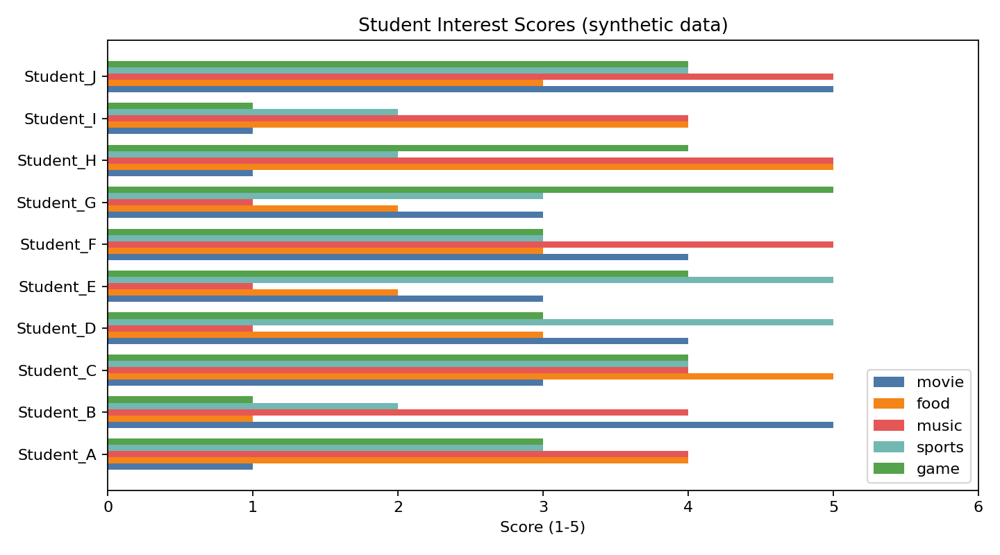

# 3강. Python과 데이터: AI에게 먹일 재료 만들기

## Part A -- 강의 (1교시, 90분)

### 강의 목표

이번 강의의 목표는 딥러닝 모델에 들어가는 재료, 즉 **데이터**의 구조와 역할을 이해하는 것이다. 모델이 아무리 정교해도, 재료인 데이터가 나쁘면 결과도 나쁘다.

학생은 이번 시간 후 다음을 할 수 있어야 한다.

1. Python에서 변수, 리스트, 딕셔너리를 만들고 값을 꺼낸다.
2. 표 데이터의 행, 열, 셀의 의미를 설명한다.
3. 특성(feature)과 라벨(label)을 구분한다.
4. 훈련 데이터와 테스트 데이터를 나누는 이유를 말한다.
5. 좋은 데이터와 나쁜 데이터의 차이를 예로 들어 설명한다.

이번 강의에서는 모델을 학습시키지 않는다. 대신 4주차에서 모델에 넣을 재료를 직접 만들고 살펴보는 것이 목표다.

### 3.1 Python 기초: 변수, 리스트, 딕셔너리

딥러닝 실습을 하려면 Python으로 데이터를 다룰 수 있어야 한다. 이번 절에서는 세 가지 도구만 익힌다. 변수, 리스트, 딕셔너리다.

**변수**는 값에 이름을 붙이는 도구다.

```python
name = "Student_A"
score = 4
```

`name`에는 문자열 `"Student_A"`가 들어 있고, `score`에는 숫자 `4`가 들어 있다. 이후 코드에서 `name`이나 `score`를 쓰면 그 값이 나온다.

**리스트**는 여러 값을 순서대로 담는 도구다.

```python
categories = ["movie", "food", "music", "sports", "game"]
print(categories[0])  # "movie"
print(len(categories))  # 5
```

대괄호 `[]` 안에 번호를 넣으면 해당 위치의 값이 나온다. 번호는 0부터 시작한다. `len()`은 리스트에 들어 있는 값의 개수를 알려준다.

**딕셔너리**는 이름표와 값을 쌍으로 담는 도구다.

```python
student = {"name": "Student_A", "movie": 1, "food": 4, "music": 4}
print(student["name"])   # "Student_A"
print(student["movie"])  # 1
```

딕셔너리는 순서보다 이름표(키)로 값을 찾는다. 데이터의 한 행을 표현할 때 유용하다.

이 세 가지 도구를 알면 이번 장의 실습 코드를 읽고 수정할 수 있다.

### 3.2 데이터란 무엇인가

딥러닝에서 데이터는 대부분 **표(table)** 형태로 정리된다. 표는 행, 열, 셀로 구성된다.

| 용어 | 의미 | 비유 |
|---|---|---|
| 행(row) | 관찰 대상 하나 | 학생 한 명, 사진 한 장, 댓글 하나 |
| 열(column) | 관찰 대상의 속성 하나 | 영화 점수, 음식 점수, 음악 점수 |
| 셀(cell) | 행과 열이 만나는 칸 하나 | Student_A의 영화 점수 = 1 |

이번 실습에서 만든 합성 데이터 표는 다음과 같다. 이 데이터는 합성 데이터이며 실제 학생 정보가 아니다.

```text
     name  movie  food  music  sports  game
Student_A      1     4      4       3     3
Student_B      5     1      4       2     1
Student_C      3     5      4       4     4
Student_D      4     3      1       5     3
Student_E      3     2      1       5     4
Student_F      4     3      5       3     3
Student_G      3     2      1       3     5
Student_H      1     5      5       2     4
Student_I      1     4      4       2     1
Student_J      5     3      5       4     4
```

이 표에는 10개의 행(학생 10명)과 6개의 열(이름, 영화, 음식, 음악, 운동, 게임)이 있다. 이 출력은 `practice/chapter3/results/3-1-my-data-plot.log`에서 확인한 실제 실행 결과다.

표를 파일로 저장하는 가장 흔한 형식은 **CSV(Comma-Separated Values)**다. CSV는 각 열을 쉼표로 구분한 텍스트 파일이다. 위 표를 CSV로 저장하면 다음처럼 생긴다.

```text
name,movie,food,music,sports,game,recommendation
Student_A,1,4,4,3,3,Music lover
Student_B,5,1,4,2,1,Music lover
...
```

CSV는 거의 모든 프로그래밍 언어, 스프레드시트, 데이터베이스에서 읽고 쓸 수 있다. 딥러닝 실습에서 가장 자주 쓰는 데이터 형식이다.

### 3.3 특성과 라벨

표 데이터를 모델에 넣으려면, 어떤 열이 입력이고 어떤 열이 정답인지 구분해야 한다.

- **특성(feature)**: 모델이 판단 재료로 사용하는 열이다. 이번 데이터에서는 `movie`, `food`, `music`, `sports`, `game` 다섯 열이 특성이다.
- **라벨(label)**: 모델이 맞혀야 하는 정답 열이다. 이번 데이터에서는 `recommendation` 열이 라벨이다.

실행 로그에서 확인한 특성과 라벨의 구분은 다음과 같다.

```text
특성 열(입력): ['movie', 'food', 'music', 'sports', 'game']
  -> 모델이 판단 재료로 사용하는 열
라벨 열(정답): recommendation
  -> 모델이 맞혀야 하는 정답 열
```

첫 3행을 특성과 라벨로 나누어 보면 다음과 같다.

```text
 movie  food  music  sports  game recommendation
     1     4      4       3     3    Music lover
     5     1      4       2     1    Music lover
     3     5      4       4     4  Active foodie
```

이 구분이 중요한 이유는 다음과 같다.

- 모델은 특성만 보고 라벨을 예측해야 한다.
- 라벨을 특성에 섞어 넣으면 모델은 정답을 보고 정답을 맞히는 셈이 되어 의미가 없다.
- 어떤 열이 특성이고 어떤 열이 라벨인지 결정하는 것은 사람의 몫이다. 모델이 자동으로 정하지 않는다.

### 3.4 훈련 데이터와 테스트 데이터

모델은 데이터를 보고 배운다. 그런데 모델이 배운 데이터를 그대로 맞히게 하면, 새로운 상황에서도 잘하는지 알 수 없다.

- **훈련 데이터(training data)**: 모델이 학습하는 데이터다. 연습문제라고 생각하면 된다.
- **테스트 데이터(test data)**: 모델이 처음 보는 데이터다. 시험문제라고 생각하면 된다.

이번 3주차에서는 데이터를 나누지 않는다. 데이터를 만들고 살펴보는 것이 목표이기 때문이다. 4주차에서 실제로 모델을 학습시킬 때, 데이터를 훈련 세트와 테스트 세트로 나누는 과정을 직접 실행한다.

여기서 기억할 핵심은 다음이다.

- 훈련 데이터로 배우고, 테스트 데이터로 시험 본다.
- 시험문제를 미리 보면 실력을 알 수 없듯, 모델도 테스트 데이터를 미리 보면 안 된다.
- 데이터를 나누는 이유는 모델이 진짜 배웠는지 확인하기 위해서다.

### 3.5 좋은 데이터 vs 나쁜 데이터

모델의 성능은 데이터 품질에 크게 달려 있다. 좋은 데이터와 나쁜 데이터의 차이를 다음 표로 정리할 수 있다.

| 문제 | 나쁜 데이터 예시 | 좋은 데이터 예시 |
|---|---|---|
| 결측값 | 영화 점수가 빈 칸인 행이 30% | 모든 칸에 값이 들어 있음 |
| 범위 오류 | 1~5 범위인데 99가 섞임 | 모든 값이 1~5 범위 안에 있음 |
| 중복 | 같은 행이 여러 번 반복 | 중복 행이 없음 |
| 불균형 | 한 라벨만 90%, 나머지 10% | 라벨별 비율이 크게 치우치지 않음 |
| 편향 | 특정 집단의 데이터만 수집 | 다양한 집단의 데이터를 포함 |

이번 실습 데이터의 품질 체크 결과는 다음과 같다. 이 결과는 실행 로그에서 확인한 것이다.

```text
결측값 수: 0
범위 밖(1-5) 값 수: 0
중복 행 수: 0
movie 평균: 3.0
food 평균: 3.2
music 평균: 3.4
sports 평균: 3.3
game 평균: 3.2
전체 데이터 수: 10행 x 6열
```

이 데이터는 결측값, 범위 오류, 중복이 없으므로 기본적인 품질 조건을 만족한다. 다만 10행은 모델을 학습시키기에 매우 적은 양이다. 실제 머신러닝에서는 수백에서 수만 행의 데이터를 사용한다. 이번 실습의 목적은 데이터 구조와 품질을 이해하는 것이므로 10행으로 충분하다.

### 핵심 정리

- 변수는 값에 이름을 붙이고, 리스트는 순서대로 담고, 딕셔너리는 이름표로 찾는다.
- 표 데이터는 행(대상), 열(속성), 셀(값)로 구성된다.
- 특성은 모델의 입력 열이고, 라벨은 모델이 맞혀야 하는 정답 열이다.
- 훈련 데이터로 배우고 테스트 데이터로 시험 보는 이유는, 모델이 진짜 배웠는지 확인하기 위해서다.
- 데이터에 결측값, 범위 오류, 중복, 편향이 있으면 모델 성능이 나빠진다.

---

## Part B -- 실습 (2교시, 90분)

### 실습 목표

이번 실습의 목표는 학생 관심사 데이터를 직접 만들고, 시각화하고, 간단한 규칙으로 추천 라벨을 붙이는 것이다. 실습이 끝나면 다음을 갖게 된다.

1. CSV 파일 하나 (`week03-my-data.csv`)
2. 데이터 시각화 이미지 하나 (`data_overview.png`)
3. 데이터 품질 체크리스트

### 실습 절차

전체 코드는 다음 위치에 있다.

```text
practice/chapter3/code/3-1-my-data-plot.py
```

이 코드는 다음 순서로 실행된다.

1. 가명 학생 10명의 관심사 점수(영화, 음식, 음악, 운동, 게임)를 합성한다. 각 점수는 1~5 사이의 정수다. 모든 이름은 가명이며 실제 인물과 관계가 없다.
2. 간단한 규칙으로 추천 라벨을 붙인다.
3. 데이터를 가로 막대그래프로 그린다.
4. 데이터 품질 체크리스트를 출력한다.
5. CSV 파일과 PNG 파일을 `results/` 디렉토리에 저장한다.

실행 명령은 다음과 같다.

```bash
python3 scripts/run_and_capture.py 3
```

실행 후 다음 파일이 생성되었다.

| 파일 | 역할 |
|---|---|
| `practice/chapter3/results/3-1-my-data-plot.log` | 실행 로그 |
| `practice/chapter3/results/3-1-my-data-plot.evidence.json` | 실행 증거 JSON |
| `practice/chapter3/results/week03-my-data.csv` | 관심사 데이터 CSV |
| `practice/chapter3/results/data_overview.png` | 학생별 관심사 막대그래프 |

### 규칙 기반 추천

이번 실습의 추천은 사람이 직접 쓴 규칙으로 동작한다. 규칙은 다음과 같다.

| 조건 | 추천 라벨 |
|---|---|
| movie >= 4 이고 game >= 4 | SF fan |
| sports >= 4 이고 food >= 4 | Active foodie |
| music >= 4 | Music lover |
| 위 조건에 해당하지 않음 | Explorer |

이 규칙을 Python 코드로 쓰면 다음과 같다.

```python
if row["movie"] >= 4 and row["game"] >= 4:
    label = "SF fan"
elif row["sports"] >= 4 and row["food"] >= 4:
    label = "Active foodie"
elif row["music"] >= 4:
    label = "Music lover"
else:
    label = "Explorer"
```

실행 결과 추천 분포는 다음과 같았다.

```text
Music lover: 5명
Explorer: 3명
Active foodie: 1명
SF fan: 1명
```

이 결과를 보면 Music lover가 5명으로 가장 많다. 규칙의 세 번째 조건(`music >= 4`)이 비교적 느슨하기 때문이다. 규칙을 바꾸면 결과도 달라진다. 이것이 규칙 기반 방식의 특징이다. 사람이 규칙을 정하므로, 규칙이 바뀌면 결과가 바뀐다.

4주차에서는 사람이 규칙을 쓰지 않고 모델이 데이터에서 직접 규칙을 찾는 방식(머신러닝)을 다룬다. "이 규칙을 AI가 배운다면 어떤 데이터가 필요할까?"라는 질문이 그 연결 고리다.

### 시각화

데이터를 시각화하면 숫자만 볼 때 보이지 않던 패턴이 드러난다.



이 그래프를 볼 때는 다음을 확인한다.

- 각 학생의 관심사 분포가 고르게 퍼져 있는가, 특정 항목에 치우쳐 있는가.
- 학생 간 패턴의 차이가 보이는가.
- 점수가 모두 같은 학생이 있는가 (데이터 품질 문제).

### AI 활용 가이드

이번 실습에서는 AI에게 다음을 요청할 수 있다.

```text
다음 CSV 파일을 읽어서 막대그래프를 그리는 Python 코드를 만들어줘.
CSV 열은 name, movie, food, music, sports, game이야.
matplotlib을 사용해줘.

[여기에 CSV 내용 붙여넣기]
```

AI가 만든 코드를 받은 뒤에는 다음을 확인한다.

| 확인 항목 | 질문 |
|---|---|
| 파일 경로 | AI가 사용한 파일 경로가 내 컴퓨터 경로와 맞는가 |
| 열 이름 | AI가 사용한 열 이름이 실제 CSV와 일치하는가 |
| 실행 여부 | AI 코드가 오류 없이 실행되는가 |
| 그래프 내용 | 그래프가 실제 데이터를 반영하는가 |
| 불필요한 코드 | AI가 필요 없는 패키지를 설치하라고 하지 않았는가 |

여기서 중요한 점은 AI가 CSV를 읽는 코드를 잘 만드는 경우가 많지만, 파일 경로를 틀리는 경우도 흔하다는 것이다. AI 코드를 받으면 경로부터 확인하고 직접 실행한다.

### 결과 해석

이번 실습의 핵심 결과는 다음 세 가지다.

1. **데이터 표**: 10명의 합성 학생 관심사 데이터를 CSV로 저장했다.
2. **규칙 추천**: 사람이 쓴 4개 규칙으로 추천 라벨을 붙였다. Music lover가 5명으로 가장 많았다.
3. **데이터 품질**: 결측값 0개, 범위 밖 값 0개, 중복 행 0개로 기본 품질을 만족했다.

이 결과에서 배울 수 있는 점은 다음이다.

- 데이터를 만들고, 표로 정리하고, 저장하는 것이 딥러닝 실습의 출발점이다.
- 규칙 기반 추천은 사람이 규칙을 직접 쓰므로, 규칙이 바뀌면 결과가 달라진다.
- 데이터 품질을 체크하는 습관은 모델을 학습시키기 전에 반드시 필요하다.

### 책임 있는 AI 체크

이번 장의 책임 있는 AI 체크는 데이터와 코드 두 가지를 다룬다.

| 점검 항목 | 확인 질문 |
|---|---|
| 개인정보 | 데이터에 실제 이름, 학번, 연락처가 포함되지 않았는가 |
| 합성 표시 | 합성 데이터임을 출력과 파일에 표시했는가 |
| 파일 입출력 | 코드가 어떤 파일을 읽고 쓰는지 설명할 수 있는가 |
| 외부 전송 | 코드가 데이터를 외부 서버로 보내지 않는가 |
| AI 코드 검증 | AI가 만든 코드를 직접 실행했는가 |

실행 로그에서 확인한 안전 점검 결과는 다음과 같다.

```text
- 데이터에 실제 개인정보(이름, 학번, 연락처)가 포함되지 않았다.
- 합성 데이터임을 출력에 표시했다.
- 이 코드가 읽는 파일: 없음 (자체 생성)
- 이 코드가 쓰는 파일: week03-my-data.csv, data_overview.png
- 외부 네트워크 전송: 없음
```

학생이 자기 데이터를 넣을 때는, 실제 이름이나 개인정보 대신 가명(`Student_A` 등)을 사용해야 한다.

### 제출물

이번 주 제출물은 다음과 같다.

| 제출물 | 설명 |
|---|---|
| `week03-my-data.csv` | 관심사 데이터 CSV (합성 데이터 기반, 자기 데이터로 교체 가능) |
| 데이터 시각화 이미지 | 막대그래프 PNG |
| 데이터 품질 체크리스트 | 결측값, 범위, 중복 확인 결과 |
| 토론 메모 | "이 규칙을 AI가 배운다면 어떤 데이터가 필요할까" |

토론 메모는 다음 질문에 대한 자기 답을 쓴다.

- 규칙을 사람이 쓰는 것과 모델이 배우는 것은 어떻게 다른가?
- 모델이 배우려면 데이터에 무엇이 들어 있어야 하는가?
- 데이터가 10행이면 충분한가? 왜?

이 질문은 4주차의 머신러닝 첫걸음으로 자연스럽게 이어진다.

## 참고자료

- Python 공식 문서. *Data Structures*. https://docs.python.org/3/tutorial/datastructures.html
- pandas 공식 문서. *10 Minutes to pandas*. https://pandas.pydata.org/docs/user_guide/10min.html
- matplotlib 공식 문서. *Pyplot tutorial*. https://matplotlib.org/stable/tutorials/pyplot.html
