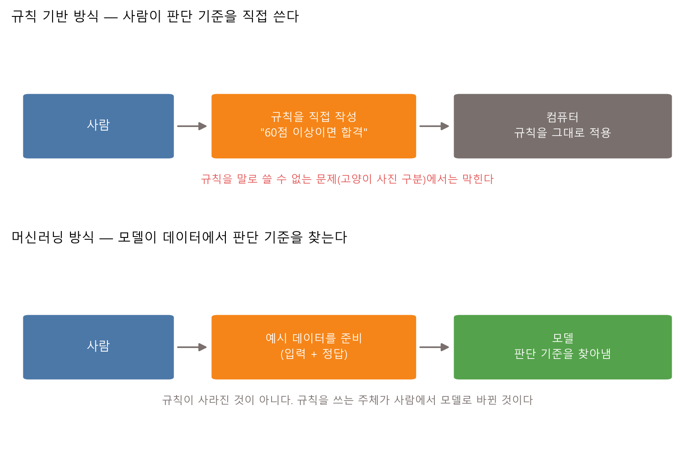
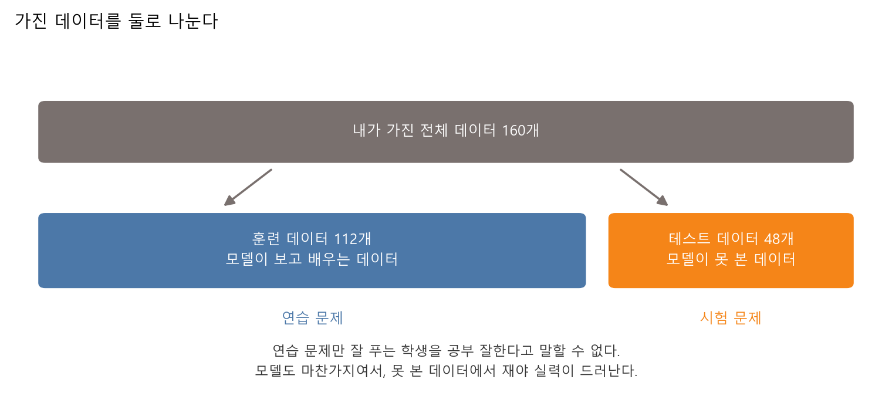
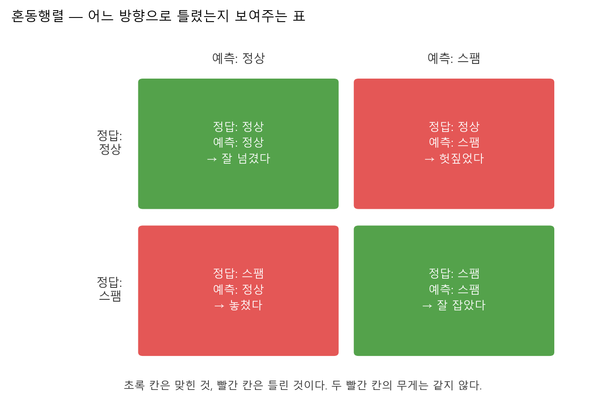

# 제4장 머신러닝 첫걸음 — 규칙을 쓰지 않고 분류하기

---

## [전반부] 이론 강의
---

### 학습 목표

- 사람이 규칙을 직접 쓰는 방식과 모델이 데이터에서 규칙을 찾는 방식이 어떻게 다른지 설명한다
- 분류와 회귀를 자기 주변의 예로 구분한다
- 훈련 데이터와 테스트 데이터를 왜 나누는지 설명한다
- 기준선 모델을 만들고, 새 모델을 기준선과 비교한다
- 정확도 하나만 보면 왜 속는지, 혼동행렬이 무엇을 더 보여주는지 설명한다

지난 3주 동안 데이터를 표로 만들고 그림으로 그렸다. 이번 장에서는 그 표를 컴퓨터에게 주고 판단 기준을 찾게 한다. 딥러닝도 머신러닝의 한 갈래다. 신경망으로 들어가기 전에 "모델이 데이터를 보고 기준을 찾는다"는 생각부터 손으로 확인한다.

---

### 1. 규칙을 직접 쓰면 어디서 막히는가

#### 1-1. 사람이 규칙을 쓰는 방식

컴퓨터에게 일을 시키는 가장 오래된 방법은 사람이 조건문을 쓰는 것이다.

```python
if score >= 60:
    result = "합격"
else:
    result = "불합격"
```

이 방식은 강력하다. 기준이 분명하고, 왜 그렇게 판정했는지 한 줄로 설명할 수 있고, 데이터가 한 건도 없어도 돌아간다.

문제는 기준을 말로 쓸 수 없을 때 생긴다. 고양이 사진과 강아지 사진을 가르는 규칙을 조건문으로 써 보면 금방 막힌다. 귀가 뾰족하면 고양이라고 쓰면 뾰족한 귀를 가진 강아지에서 틀린다. 수염을 세면 사진마다 수염이 다르게 찍힌다. 조건을 하나 더할 때마다 예외가 두 개씩 늘어난다.

#### 1-2. 모델이 규칙을 찾는 방식

머신러닝은 순서를 바꾼다. 사람은 규칙 대신 **예시**를 준다. 예시에는 입력과 정답이 함께 들어 있다. 모델은 그 둘의 관계를 보고 판단 기준을 스스로 만든다.



**그림 4.1** 두 방식의 차이 — 규칙이 사라진 것이 아니라, 규칙을 쓰는 주체가 사람에서 모델로 바뀐다

여기서 오해를 하나 정리한다. 머신러닝은 규칙 없이 판단하는 방법이 아니다. 모델도 결국 어떤 기준선을 긋는다. 다만 그 선을 사람이 문장으로 쓰지 않고, 데이터를 보며 찾을 뿐이다. 실습 4.1에서 모델이 찾은 선을 숫자로 뽑아 볼 텐데, 그 선은 사람이 손으로 그은 선과 같은 종류의 식이다.

**표 4.1** 두 방식 비교

| 구분 | 규칙 기반 방식 | 머신러닝 방식 |
|---|---|---|
| 사람이 하는 일 | 규칙을 직접 쓴다 | 예시 데이터를 모은다 |
| 컴퓨터가 하는 일 | 규칙을 적용한다 | 데이터에서 기준을 찾는다 |
| 잘 맞는 문제 | 점수 기준 합격 판정, 세금 계산 | 사진 분류, 댓글 분류, 추천 |
| 막히는 지점 | 기준을 말로 쓸 수 없을 때 | 데이터가 적거나 한쪽으로 치우쳤을 때 |
| 결과를 설명하는 방법 | 규칙을 그대로 읽는다 | 모델이 만든 기준을 꺼내 본다 |

○ **체크 질문**
  - 학교 장학금 선발을 규칙 기반으로 짜면 어디까지 되고, 어디서 막히는가
  - 반대로 머신러닝으로 짜면 무엇이 위험한가

---

### 2. 분류와 회귀 — 답이 이름인가 숫자인가

머신러닝 문제는 정답의 생김새로 크게 둘로 나뉜다.

○ **분류(classification)** — 정답이 **이름**일 때
  - 스팸인가 정상인가, 고양이인가 강아지인가, 통과인가 미통과인가
  - 답의 종류가 정해져 있고, 그중 하나를 고른다

○ **회귀(regression)** — 정답이 **숫자**일 때
  - 내일 기온은 몇 도인가, 이 중고차는 얼마인가, 이 학생의 점수는 몇 점인가
  - 답이 연속된 값이고, 딱 떨어지는 후보가 없다

**표 4.2** 같은 데이터라도 무엇을 묻느냐에 따라 문제가 달라진다

| 가진 데이터 | 분류 문제로 물으면 | 회귀 문제로 물으면 |
|---|---|---|
| 학생의 공부 시간, 수면 시간 | 시험에 통과할까 | 시험 점수가 몇 점일까 |
| 메일의 링크 수, 대문자 비율 | 스팸일까 | 스팸일 확률이 몇 %일까 |
| 사진의 픽셀값 | 고양이일까 강아지일까 | 사진 속 동물의 나이가 몇 살일까 |

이번 장의 실습은 둘 다 분류다. 회귀는 6장에서 손실함수를 다룰 때 다시 나온다.

○ **자주 하는 실수**
  - 별점 1~5를 예측하는 문제를 회귀로만 보면, 3.7점이라는 답이 나온다. 별점에 3.7은 없다
  - 반대로 기온을 분류로 보면 20도와 21도를 완전히 다른 이름으로 취급해, 1도 차이와 30도 차이를 똑같이 틀린 것으로 센다
  - 정답이 이름인지 숫자인지는 데이터가 아니라 **내가 무엇을 묻는지**가 정한다

---

### 3. 훈련 데이터와 테스트 데이터

모델을 만들 때 가진 데이터를 전부 쓰면 안 된다. 반드시 일부를 떼어 숨겨 둔다.



**그림 4.2** 가진 데이터를 둘로 나눈다 — 모델은 훈련 데이터만 보고 배우고, 성적은 테스트 데이터에서 잰다

이유는 단순하다. 모델이 이미 본 데이터에서 성적을 재면, 답을 보고 시험을 치는 것과 같다. 시험 범위를 통째로 외운 학생과 원리를 이해한 학생은 연습 문제에서 똑같이 100점을 받는다. 둘을 가르려면 처음 보는 문제를 줘야 한다.

○ **나누는 방법**
  - 보통 훈련 7 : 테스트 3, 또는 8 : 2로 나눈다
  - 나눌 때 두 그룹의 비율을 맞춘다(`stratify`). 통과 학생이 훈련 쪽에만 몰리면 비교가 성립하지 않는다
  - 한 번 테스트로 떼어 낸 데이터는 모델을 고칠 때 **보지 않는다**

○ **지금은 넘어가는 것**
  - 실무에서는 훈련 · 검증 · 테스트 셋으로 나눈다. 검증 데이터는 모델을 고르는 데 쓰고, 테스트는 마지막에 딱 한 번 쓴다
  - 이 구분은 7장(과적합)에서 다시 다룬다. 이번 장은 둘로만 나눈다

---

### 4. 기준선 — 비교 상대가 없으면 잘했는지 알 수 없다

"정확도 95%"라는 말만으로는 아무것도 알 수 없다. 95%가 좋은 성적인지 나쁜 성적인지는 **아무 생각 없이 찍었을 때 몇 %가 나오는지**와 비교해야 정해진다.

기준선(baseline)은 그 비교 상대다. 만드는 방법은 허무할 만큼 간단하다.

○ **가장 흔한 기준선** — 훈련 데이터에서 더 많았던 쪽으로만 답한다
  - 통과 학생이 더 많으면, 테스트 데이터 전부를 통과로 찍는다
  - 데이터를 보지도 않고, 학습도 하지 않는다

○ **기준선을 만드는 이유**
  - 새 모델이 기준선을 못 넘으면, 그 모델은 데이터에서 아무것도 배우지 못한 것이다
  - 반대로 기준선이 이미 95%라면, 96%짜리 모델은 자랑거리가 아니다

실습 4.1에서 기준선 정확도는 0.500이 나왔다. 두 그룹의 수가 거의 같았기 때문이다. 실습 4.2에서는 같은 기준선이 0.950까지 올라간다. 왜 그런지는 다음 절에서 다룬다.

---

### 5. 정확도 하나만 보면 속는다

정확도(accuracy)는 맞힌 비율이다.

```
정확도 = 맞힌 개수 / 전체 개수
```

계산이 쉽고 한 숫자로 요약되니 편하다. 그래서 위험하다.

○ **한쪽이 드물면 정확도가 무너진다**
  - 메일 1000통 중 스팸이 50통이라고 하자. 스팸은 전체의 5%다
  - "전부 정상"이라고만 답하는 프로그램을 만들면 950통을 맞힌다. 정확도 95%다
  - 이 프로그램은 스팸을 **한 통도** 못 잡는다. 그런데 성적표에는 95%라고 찍힌다

이런 데이터를 **불균형 데이터**라고 부른다. 실제로 중요한 문제는 대부분 불균형하다. 불량품, 질병, 사기 거래, 재난 신고는 전부 드물게 일어난다. 드물기 때문에 찾아낼 값어치가 있고, 드물기 때문에 정확도가 속인다.

Google 머신러닝 단기집중과정도 같은 예를 든다. 한 클래스가 1%만 나타나는 데이터에서는 전부 음성이라고 답하는 모델이 정확도 99%를 기록하지만, 그 모델은 쓸모가 없다.[^google-acc]

○ **그래서 무엇을 봐야 하는가**
  - 기준선 정확도를 먼저 계산한다. 내 모델이 그보다 나은가
  - 맞힌 비율이 아니라 **무엇을 놓쳤는지** 센다. 그 도구가 다음 절의 혼동행렬이다

---

### 6. 혼동행렬 — 어느 방향으로 틀렸는가

혼동행렬(confusion matrix)은 예측과 정답을 짝지어 개수를 센 표다. 답이 두 종류면 칸이 네 개 생긴다.



**그림 4.3** 혼동행렬 읽는 법 — 초록 칸은 맞힌 것, 빨간 칸은 틀린 것

빨간 칸이 두 개라는 점이 핵심이다. 틀리는 방향이 하나가 아니다.

○ **놓쳤다** — 정답은 스팸인데 정상이라고 했다
  - 스팸이 받은편지함에 들어온다. 사용자가 광고를 본다

○ **헛짚었다** — 정답은 정상인데 스팸이라고 했다
  - 합격 통보 메일이 스팸함으로 간다. 사용자가 중요한 메일을 놓친다

두 오류의 무게는 문제마다 다르다. 스팸 필터에서는 헛짚는 쪽이 더 아프고, 질병 검사에서는 놓치는 쪽이 훨씬 위험하다. 정확도는 이 둘을 그냥 더해 버려서 구분하지 못한다. 혼동행렬은 나눠서 보여준다.

○ **읽는 순서**
  1. 가로줄을 본다. 실제 스팸이 몇 통이고, 그중 몇 통을 잡았는가
  2. 세로줄을 본다. 스팸이라고 부른 것 중 몇 통이 진짜였는가
  3. 두 빨간 칸 중 이 문제에서 더 아픈 쪽을 정한다

---

### 7. 직접 움직여 보는 웹 자료

수업에서 다 보여줄 수 없는 그림은 아래 자료로 보충한다. 모두 무료이고, 아래 설명은 각 페이지를 열어 확인한 내용이다.

| 자료 | 무엇을 볼 수 있는가 | 주소 |
|---|---|---|
| MLU-Explain, Train/Test/Validation Sets | 고양이·개 예시에서 훈련 데이터의 점을 마우스로 끌면 경계선이 따라 움직인다 | https://mlu-explain.github.io/train-test-validation/ |
| Google 머신러닝 단기집중과정(한국어), 데이터 세트 분할 | 훈련·테스트 2분할 그림과 훈련·검증·테스트 3분할 그림을 나란히 비교한다 | https://developers.google.com/machine-learning/crash-course/overfitting/dividing-datasets?hl=ko |
| Google 머신러닝 단기집중과정(한국어), 정확도·정밀도·재현율 | 혼동행렬의 네 칸으로 정확도를 정의하고, 불균형 데이터에서 정확도가 속이는 예를 든다 | https://developers.google.com/machine-learning/crash-course/classification/accuracy-precision-recall?hl=ko |
| scikit-learn, Classifier comparison | 같은 데이터에 여러 분류기를 적용했을 때 경계선 모양이 어떻게 달라지는지 한 장의 격자 그림으로 보여준다 | https://scikit-learn.org/stable/auto_examples/classification/plot_classifier_comparison.html |

○ MLU-Explain의 드래그 실습은 실습 4.1과 짝이 된다. 점 하나를 옮겼을 뿐인데 선이 따라 움직이는 것을 보면, 모델이 데이터에서 기준을 찾는다는 말이 눈으로 이해된다

○ scikit-learn 예제 그림은 BSD 라이선스로 공개돼 있다. 발표 자료에 넣을 때는 출처를 적는다

---

## [후반부] 실습
---

두 가지를 한다. 첫 번째는 내가 그은 선과 모델이 찾은 선을 겨루는 실습이고, 두 번째는 정확도 95% 모델의 정체를 밝히는 실습이다.

#### 실행 환경

```bash
cd practice/chapter4
python -m pip install -r ../requirements.txt
```

필요한 패키지는 numpy, pandas, matplotlib, scikit-learn이다. GPU는 필요 없다. 두 실습 모두 노트북에서 몇 초 안에 끝난다.

두 실습의 데이터는 모두 **컴퓨터로 만든 합성 데이터**다. 실제 학생 자료나 실제 메일이 아니다. 개인정보가 들어갈 자리가 없다.

---

### 실습 4.1: 내가 그은 선 vs 모델이 찾은 선

#### 실습 목표

- 점 하나가 무엇을 뜻하는지, 선 하나가 어떤 판단인지 눈으로 익힌다
- 사람이 직접 그은 선의 정확도를 재고, 모델이 찾은 선과 같은 자로 비교한다
- 모델이 찾은 선을 식으로 꺼내 본다

#### 데이터

점 하나가 학생 한 명이다. 가로축은 하루 공부 시간, 세로축은 하루 수면 시간이고, 색은 시험 통과 여부다. 공부와 수면이 모두 넉넉하면 통과할 확률이 높게 만들되, 잡음을 섞어 경계 근처에서는 결과가 갈리게 했다. 그래서 어떤 선을 그어도 틀리는 점이 남는다.

#### 실행 명령

```bash
cd practice/chapter4/code
python 4-1-simple-classifier.py
```

#### 핵심 코드

파일 맨 위에 학생이 바꿀 두 줄이 있다.

```python
# 내가 그을 선:  수면시간 = MY_SLOPE * 공부시간 + MY_INTERCEPT
# 선보다 위에 있는 점을 "통과"로 예측한다.
MY_SLOPE = -1.0
MY_INTERCEPT = 11.0
```

모델이 찾은 선을 사람이 읽을 수 있는 식으로 바꾸는 부분은 다음과 같다.

```python
w0, w1 = model.coef_[0]      # 공부 시간에 붙는 무게, 수면 시간에 붙는 무게
b = model.intercept_[0]
slope = -w0 / w1             # 기울기
intercept = -b / w1          # y절편
```

_전체 코드는 `practice/chapter4/code/4-1-simple-classifier.py` 참고_

#### 실행 결과

아래는 기본값(`MY_SLOPE = -1.0`, `MY_INTERCEPT = 11.0`)으로 실행한 로그다.

```text
데이터: 컴퓨터로 만든 합성 데이터(실제 학생 자료 아님)
전체 160명 = 훈련 112명 + 테스트 48명
전체에서 통과한 학생: 79명, 미통과: 81명

=== 내가 그은 선 ===
식: 수면시간 = -1.0 x 공부시간 + 11.0
훈련 데이터 정확도: 0.902
테스트 데이터 정확도: 0.896

=== 모델이 찾은 선 ===
식: 수면시간 = -1.59 x 공부시간 + 13.96
훈련 데이터 정확도: 0.893
테스트 데이터 정확도: 0.938
```

_출처: `practice/chapter4/results/4-1-simple-classifier.log`_

**표 4.3** 테스트 데이터 48명에서 세 방법 비교

| 방법 | 테스트 정확도 |
|---|---:|
| 기준선(무조건 한쪽으로 찍기) | 0.500 |
| 내가 그은 선 | 0.896 |
| 모델이 찾은 선 | 0.938 |


**그림 4.4** 회색 점선이 사람이 그은 선, 초록 실선이 모델이 찾은 선. X 표시는 테스트 데이터다

#### 결과 읽기

○ **기준선 0.500** — 통과 79명과 미통과 81명이 거의 반반이라, 한쪽으로만 찍으면 절반만 맞는다. 여기가 출발선이다

○ **내 선 0.896** — 사람이 눈대중으로 그은 선도 기준선을 크게 넘었다. 데이터가 두 덩어리로 갈려 있으면 사람의 감도 꽤 정확하다

○ **모델 선 0.938** — 모델이 4%p쯤 앞섰다. 압도한 것이 아니라 조금 앞섰다. 모델이 마법을 부린 것이 아니라, 112명을 하나씩 대조하며 선을 미세하게 조정했을 뿐이다

○ **훈련과 테스트가 뒤집힌 지점** — 훈련 데이터에서는 내 선(0.902)이 모델(0.893)보다 높았는데, 테스트에서는 뒤집혔다. 이런 뒤집힘을 어떻게 읽어야 하는지는 7장(과적합)에서 다룬다. 지금은 "훈련 성적과 테스트 성적은 다를 수 있다"만 확인한다

#### 해 보기

`MY_SLOPE`와 `MY_INTERCEPT`를 바꿔 다시 실행한다. 목표는 모델을 이기는 것이다.

1. 그림 4.4를 보고 내 선을 어느 쪽으로 옮겨야 할지 정한다
2. 값을 바꾸고 실행한다. 테스트 정확도가 올랐는지 본다
3. 모델이 찾은 식(`-1.59`, `13.96`)에 가깝게 넣으면 어떻게 되는지도 해 본다

○ 모델을 이겨도 좋고 못 이겨도 좋다. 확인할 것은 **선을 조금 옮기면 정확도가 얼마나 움직이는지**다

○ 이 손조정을 자동으로, 그리고 훨씬 잘게 하는 방법이 6장의 경사하강법이다

#### 모델이 틀린 사례

```text
 순위  공부시간  수면시간  실제 모델예측
  1  4.71  5.93  통과  미통과
  2  4.06  7.78 미통과   통과
  3  5.69  3.74  통과  미통과
```

_출처: `practice/chapter4/results/misclassified_examples.csv`_

세 명 모두 그림에서 선 가까이에 있다. 모델이 엉뚱한 곳에서 틀린 것이 아니라, 두 그룹이 섞이는 구간에서 틀렸다. 선 하나로 나누는 한 이 구간의 오류는 사라지지 않는다.

---

### 실습 4.2: 정확도 95% 모델의 정체

#### 실습 목표

- 불균형 데이터에서 정확도가 어떻게 사람을 속이는지 직접 본다
- 정확도가 가장 높은 모델이 가장 쓸모없을 수 있다는 것을 혼동행렬로 확인한다

#### 데이터

메일 1000통을 만든다. 그중 스팸은 50통, 전체의 5%다. 특징은 두 개다.

- 메일에 들어 있는 링크 개수
- 제목에서 대문자가 차지하는 비율

스팸은 링크가 많고 대문자 비율이 높은 편이지만, 정상 메일과 겹치는 구간을 남겨 뒀다.

#### 세 모델

| 모델 | 하는 일 |
|---|---|
| A 무조건 정상 | 학습하지 않는다. 모든 메일을 정상이라고 답한다 |
| B 기본 모델 | 로지스틱 회귀를 기본 설정으로 학습한다 |
| C 스팸 중시 모델 | 같은 로지스틱 회귀에 "스팸을 놓치면 더 큰 손해"라고 알려주고 학습한다(`class_weight="balanced"`) |

#### 실행 명령

```bash
cd practice/chapter4/code
python 4-2-accuracy-trap.py
```

#### 실행 결과

```text
전체 1000통 중 스팸 50통 = 5.0%
훈련 700통, 테스트 300통(테스트 안의 스팸 15통)

        모델   정확도 스팸 잡음  정상을 스팸이라 함
  A 무조건 정상 0.950  0/15           0
   B 기본 모델 0.967  5/15           0
C 스팸 중시 모델 0.883 10/15          30
```

_출처: `practice/chapter4/results/4-2-accuracy-trap.log`_


**그림 4.5** 정확도는 비슷한데 잡은 스팸 수는 다르다

#### 결과 읽기

이 표에서 확인할 것은 세 가지다.

○ **A는 아무것도 하지 않고 95%를 받았다**
  - 학습을 한 줄도 하지 않았는데 정확도가 0.950이다. 스팸이 5%뿐이라 그렇다
  - 혼동행렬 왼쪽 그림을 보면 오른쪽 두 칸이 0이다. 스팸이라고 부른 메일이 한 통도 없다
  - 정확도만 적힌 보고서였다면 이 모델이 통과했을 수도 있다

○ **정확도가 가장 높은 B가 스팸의 3분의 2를 놓쳤다**
  - B의 정확도 0.967은 셋 중 가장 높다
  - 그런데 스팸 15통 중 5통만 잡았다. 10통은 그냥 통과시켰다
  - 정확도 순위와 쓸모 순위가 어긋난다

○ **정확도가 가장 낮은 C가 스팸을 두 배 잡았다**
  - C의 정확도 0.883은 셋 중 가장 낮다. A보다도 낮다
  - 그런데 스팸을 10통 잡았다. B의 두 배다
  - 대신 정상 메일 30통을 스팸이라고 헛짚었다

○ **그래서 어느 모델이 좋은가**
  - 이 질문에는 데이터만 보고 답할 수 없다. 무엇이 더 아픈지를 사람이 정해야 한다
  - 광고 메일이 몇 통 들어오는 정도가 참을 만하다면 B를 고른다
  - 스팸을 놓치는 쪽이 위험한 상황(피싱 메일 차단)이라면, 정상 메일 30통을 스팸함에서 다시 꺼내는 수고를 감수하고 C를 고른다
  - 어느 쪽을 고르든, 정확도 한 숫자만 보고서에 적으면 이 판단 과정이 통째로 사라진다

#### 해 보기

코드 위쪽의 값을 바꿔 다시 실행한다.

```python
N_MAILS = 1000
N_SPAM = 50
```

1. `N_SPAM`을 10으로 줄이면(1%) 모델 A의 정확도는 몇으로 오르는가
2. `N_SPAM`을 500으로 올려 반반으로 만들면 세 모델의 차이가 어떻게 되는가
3. 스팸 비율과 모델 A의 정확도 사이에 어떤 관계가 있는가

---

### 책임 있는 AI 체크

이 장에서 배운 것은 "정확도 한 숫자를 그대로 믿지 않는다"이다. 제출물에도 그대로 적용한다.

**표 4.4** 제출 전 점검

| 점검 항목 | 확인 질문 |
|---|---|
| 기준선 비교 | 정확도를 기준선 0.500과 나란히 적었는가 |
| 정확도 과장 | 정확도 하나만 보고 모델이 좋다고 적지 않았는가 |
| 오류 방향 | 혼동행렬에서 어느 방향으로 틀렸는지 적었는가 |
| 틀린 사례 | 모델이 틀린 사례를 직접 확인했는가 |
| 선택 근거 | 실습 4.2의 세 모델 중 하나를 고른 이유를 적었는가 |
| AI 답변 검증 | AI가 해석해 준 내용이 로그 수치와 맞는지 대조했는가 |

#### AI에게 해석을 맡기고 검증한다

결과 해석을 대화형 AI에게 시켜도 된다. 다만 받은 답을 그대로 내지 않고 로그와 대조한다. 아래를 그대로 붙여 넣는다.

```text
아래는 스팸 분류 실습의 실행 결과다. 학부 2학년이 알아듣게 해석해 줘.
정확도만 보고 좋다고 말하지 말고, 잡은 스팸 수와 헛짚은 수를 함께 봐 줘.

전체 1000통 중 스팸 50통(5%). 테스트 300통, 그중 스팸 15통.
A 무조건 정상: 정확도 0.950, 스팸 0/15 잡음, 헛짚음 0
B 기본 모델:   정확도 0.967, 스팸 5/15 잡음, 헛짚음 0
C 스팸 중시:   정확도 0.883, 스팸 10/15 잡음, 헛짚음 30
```

받은 답을 아래 표로 채점한다.

**표 4.5** AI 답변 검증표

| 확인 항목 | 맞았나 |
|---|:---:|
| A가 학습을 하지 않은 모델이라는 점을 짚었는가 | |
| 정확도가 가장 높은 B가 스팸 10통을 놓쳤다는 점을 짚었는가 | |
| C의 헛짚음 30통을 함께 말했는가 | |
| 어느 모델이 나은지 데이터만으로 정할 수 없다고 말했는가 | |
| 로그에 없는 수치를 지어내지 않았는가 | |

○ 마지막 줄이 가장 중요하다. 위 네 줄을 다 맞혀도 없는 숫자를 하나 지어냈다면 그 답은 쓰지 않는다

---

### 과제 (LMS 제출)

수업 시간에 실습을 실행했는지만 확인한다. 따로 보고서를 쓰지 않는다.

#### 제출물

두 실습을 실행하면 만들어지는 그림 파일 두 장을 LMS에 올린다.

1. `practice/chapter4/results/decision_boundary.png`
2. `practice/chapter4/results/confusion_matrix.png`

#### 평가 기준

- 두 파일을 올리면 완료로 인정한다. 정확도가 얼마인지는 채점하지 않는다
- 실습 4.1에서 `MY_SLOPE`, `MY_INTERCEPT`를 바꿨다면 바뀐 그림이 올라온다. 기본값 그대로여도 인정한다

#### 마감

- 실습 수업일 포함 7일 이내

---

### 핵심 정리

| 개념 | 한 줄 정리 |
|---|---|
| 규칙 기반 vs 머신러닝 | 규칙이 사라지는 것이 아니라, 규칙을 쓰는 주체가 사람에서 모델로 바뀐다 |
| 분류와 회귀 | 정답이 이름이면 분류, 숫자면 회귀다. 데이터가 아니라 질문이 정한다 |
| 훈련/테스트 분할 | 모델이 본 데이터에서 잰 성적은 성적이 아니다 |
| 기준선 | 아무 생각 없이 찍었을 때의 점수. 이걸 못 넘으면 모델은 아무것도 배우지 못한 것이다 |
| 정확도 | 맞힌 비율. 한쪽이 드문 데이터에서는 사람을 속인다 |
| 혼동행렬 | 놓친 것과 헛짚은 것을 나눠서 보여준다. 둘의 무게는 문제마다 다르다 |

다음 장에서는 선 하나로 나눌 수 없는 데이터를 만난다. 그때 은닉층이 왜 필요한지가 드러난다.

---

[^google-acc]: Google, "정확성, 재현율, 정밀도 및 관련 측정항목", 머신러닝 단기집중과정. https://developers.google.com/machine-learning/crash-course/classification/accuracy-precision-recall?hl=ko (2026년 8월 24일 확인)
