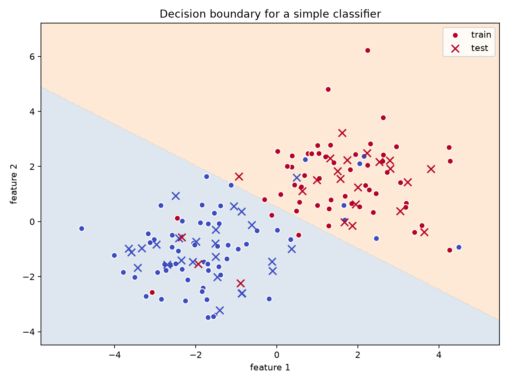
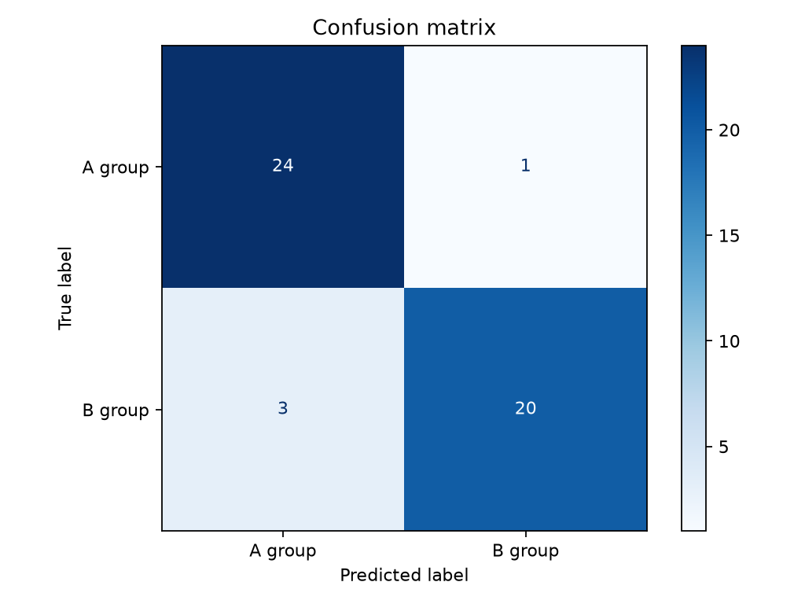

# 4강. 머신러닝 첫걸음: 규칙을 쓰지 않고 분류하기

## 강의 목표

이번 강의의 목표는 **사람이 규칙을 직접 쓰는 방식**과 **모델이 데이터에서 규칙을 배우는 방식**의 차이를 이해하는 것이다. 딥러닝도 넓게 보면 머신러닝의 한 종류다. 따라서 신경망으로 들어가기 전에, 모델이 데이터를 보고 판단 기준을 찾는다는 생각을 먼저 익혀야 한다.

학생은 이번 시간 후 다음을 할 수 있어야 한다.

1. 규칙 기반 방식과 머신러닝 방식의 차이를 설명한다.
2. 분류와 회귀를 구체적인 예로 구분한다.
3. 훈련 데이터와 테스트 데이터를 나누는 이유를 설명한다.
4. 기준선 모델이 왜 필요한지 말한다.
5. 정확도만 보고 모델을 평가하면 왜 위험한지 설명한다.
6. 혼동행렬을 보고 어떤 방향의 오류가 많은지 해석한다.
7. 모델이 틀린 사례를 숨기지 않고 분석한다.

이번 강의의 실습은 2차원 점 분류기다. 점 하나는 학생 한 명, 사진 한 장, 댓글 하나처럼 생각할 수 있다. 점의 위치는 그 대상이 가진 두 가지 특징을 뜻한다. 모델은 점들의 위치를 보고 A그룹과 B그룹을 나누는 선을 찾는다.

## 4.1 사람이 규칙을 쓰는 방식과 모델이 배우는 방식

컴퓨터에게 일을 시키는 가장 오래된 방식은 사람이 규칙을 직접 쓰는 것이다. 예를 들어 다음과 같은 규칙을 생각할 수 있다.

- **규칙 기반 방식**
  - 사람이 먼저 판단 기준을 정한다.
  - 예를 들어 "점수가 60점 이상이면 합격, 아니면 불합격"이라고 쓴다.
  - 컴퓨터는 사람이 정한 규칙을 그대로 적용한다.
  - 규칙이 명확한 문제에서는 이 방식이 단순하고 강력하다.
  - 그러나 기준을 사람이 쓰기 어려운 문제에서는 한계가 있다. 예를 들어 고양이 사진과 강아지 사진을 구분하는 규칙을 사람이 모든 경우에 대해 직접 쓰기는 어렵다.

- **머신러닝 방식**
  - 사람이 규칙을 직접 쓰지 않고, 예시 데이터를 준다.
  - 데이터에는 입력과 정답이 함께 들어 있다.
  - 모델은 입력과 정답의 관계를 보고 판단 기준을 찾는다.
  - 예를 들어 여러 점의 위치와 색깔을 보여주면, 모델은 어떤 위치의 점이 A그룹이고 어떤 위치의 점이 B그룹인지 나누는 경계를 찾는다.
  - 이 방식은 규칙을 말로 쓰기 어려운 문제에 유용하다. 이미지, 음성, 자연어처럼 복잡한 입력에서 특히 중요하다.

두 방식의 차이는 다음 표처럼 정리할 수 있다.

| 구분 | 규칙 기반 방식 | 머신러닝 방식 |
|---|---|---|
| 사람이 하는 일 | 규칙을 직접 작성한다 | 예시 데이터를 준비한다 |
| 컴퓨터가 하는 일 | 규칙을 적용한다 | 데이터에서 판단 기준을 찾는다 |
| 좋은 예 | 점수 기준 합격 판정 | 사진 분류, 댓글 분류, 추천 |
| 약점 | 규칙이 복잡하면 작성이 어렵다 | 데이터가 나쁘면 모델도 나빠진다 |
| 핵심 질문 | 어떤 규칙을 쓸 것인가 | 어떤 데이터에서 무엇을 배울 것인가 |

여기서 중요한 점은 머신러닝이 규칙이 없는 방식이라는 뜻이 아니라는 것이다. 모델도 결국 어떤 판단 기준을 사용한다. 다만 그 기준을 사람이 문장으로 직접 쓰는 것이 아니라, 데이터와 학습 과정을 통해 찾는다.

## 4.2 분류와 회귀

머신러닝 문제는 여러 종류가 있지만, 처음에는 **분류**와 **회귀**를 구분하는 것이 중요하다.

- **분류(classification)**
  - 정답이 범주일 때 사용한다.
  - 범주는 서로 구분되는 이름이다.
  - 예를 들어 "스팸/정상", "고양이/강아지", "합격/불합격", "A그룹/B그룹"은 분류 문제다.
  - 이번 실습의 목표는 점 하나를 A그룹 또는 B그룹으로 나누는 것이므로 분류 문제다.

- **회귀(regression)**
  - 정답이 숫자일 때 사용한다.
  - 예를 들어 내일 기온, 집값, 시험 점수, 매출액을 예측하는 문제는 회귀 문제다.
  - 회귀에서는 "어느 범주인가"보다 "얼마인가"가 중요하다.

다음 표는 두 문제를 구체적으로 구분한다.

| 예측하고 싶은 것 | 정답의 모양 | 문제 종류 |
|---|---|---|
| 사진이 고양이인지 강아지인지 | 고양이/강아지 | 분류 |
| 내일 최고 기온 | 27.3도 같은 숫자 | 회귀 |
| 댓글이 긍정인지 부정인지 | 긍정/부정 | 분류 |
| 다음 달 매출 | 1,250만 원 같은 숫자 | 회귀 |
| 점 하나가 A그룹인지 B그룹인지 | A/B | 분류 |

분류와 회귀를 구분하는 가장 쉬운 질문은 다음이다.

> 정답이 이름인가, 숫자인가?

정답이 이름이면 분류에 가깝다. 정답이 숫자이면 회귀에 가깝다.

## 4.3 훈련 데이터와 테스트 데이터

모델은 데이터를 보고 배운다. 그러나 모델이 배운 데이터를 그대로 다시 맞히게 하면, 그 모델이 정말 새로운 상황에서도 잘하는지 알 수 없다.

학생의 시험을 비유로 생각하면 쉽다.

- **훈련 데이터**
  - 모델이 공부하는 연습문제다.
  - 모델은 이 데이터를 보면서 판단 기준을 조정한다.
  - 사람이 문제집을 풀며 풀이법을 익히는 것과 비슷하다.

- **테스트 데이터**
  - 모델이 처음 보는 시험문제다.
  - 모델을 평가할 때 사용한다.
  - 모델은 테스트 데이터의 정답을 미리 보면 안 된다.

훈련 데이터와 테스트 데이터를 나누는 이유는 단순하다.

- 모델이 연습문제만 외웠는지 확인해야 한다.
- 처음 보는 데이터에서도 판단이 되는지 확인해야 한다.
- 모델이 실제로 배운 것인지, 우연히 맞힌 것인지 구분해야 한다.

이번 실습에서는 전체 데이터 160개를 만들었다. 실행 로그 기준으로 훈련 데이터는 112개, 테스트 데이터는 48개다. 즉, 모델은 112개로 배우고 48개로 시험을 본다.

```text
전체 데이터 수: 160
훈련 데이터 수: 112
테스트 데이터 수: 48
```

이 수치는 `practice/chapter4/results/4-1-simple-classifier.log`에서 확인한 실제 실행 결과다.

## 4.4 기준선 모델

모델을 만들면 바로 "좋다" 또는 "나쁘다"라고 말하고 싶어진다. 그러나 비교 기준이 없으면 그 말은 의미가 약하다.

**기준선 모델(baseline model)**은 최소한 넘어야 할 비교 대상이다. 기준선은 복잡할 필요가 없다. 오히려 단순해야 한다. 단순한 기준선보다도 못한 모델이라면, 복잡한 모델을 쓸 이유가 없기 때문이다.

이번 실습의 기준선 모델은 매우 단순하다.

- 훈련 데이터에서 더 많은 그룹을 찾는다.
- 테스트 데이터의 모든 점을 그 그룹으로 예측한다.
- 점의 위치는 전혀 보지 않는다.
- 즉, "대충 많은 쪽으로 찍기" 전략이다.

실행 결과 기준선 정확도는 다음과 같았다.

```text
기준선 정확도: 0.521
```

이 값은 테스트 데이터 48개 중 약 절반 정도를 맞힌 수준이다. 두 그룹이 비슷하게 섞여 있으면, 아무 생각 없이 많은 쪽으로 찍는 전략은 대략 절반 정도만 맞힌다.

기준선 모델은 약해 보이지만 중요하다.

- 기준선이 있어야 새 모델이 실제로 나아졌는지 알 수 있다.
- 기준선보다 조금 나은 정도라면 복잡한 모델을 쓸 이유가 약하다.
- 기준선보다 훨씬 낫다면 모델이 데이터의 패턴을 어느 정도 배웠다고 볼 수 있다.

## 4.5 정확도의 의미와 한계

**정확도(accuracy)**는 전체 예측 중 맞힌 비율이다. 예를 들어 테스트 데이터 100개 중 90개를 맞히면 정확도는 0.90이다.

정확도는 처음 배우기 쉽고 직관적이다. 그러나 항상 충분한 지표는 아니다.

- **정확도의 장점**
  - 계산이 쉽다.
  - "얼마나 많이 맞혔는가"를 한 숫자로 보여준다.
  - 두 모델을 빠르게 비교할 때 유용하다.

- **정확도의 한계**
  - 어떤 종류의 오류가 많은지 알려주지 않는다.
  - 한쪽 그룹이 압도적으로 많으면 착시가 생긴다.
  - 예를 들어 전체 100명 중 95명이 정상이고 5명이 위험인 상황에서, 모두 정상이라고 예측해도 정확도는 95%가 된다.
  - 그러나 이 모델은 위험한 5명을 모두 놓쳤으므로 실제로는 매우 나쁜 모델일 수 있다.

이번 실습에서 로지스틱 회귀 분류기의 테스트 정확도는 다음과 같았다.

```text
테스트 정확도: 0.917
```

기준선 정확도 0.521보다 높으므로 모델이 점의 위치 정보를 사용해 더 나은 판단을 했다고 볼 수 있다. 그러나 여기서 멈추면 안 된다. 정확도 0.917이라는 숫자는 "많이 맞혔다"는 사실을 말해주지만, 어떤 점을 어떤 방향으로 틀렸는지는 알려주지 않는다.

그래서 혼동행렬을 함께 봐야 한다.

## 4.6 혼동행렬로 틀린 방향 보기

**혼동행렬(confusion matrix)**은 모델이 어떤 정답을 어떤 예측으로 헷갈렸는지 보여주는 표다.

이번 실습의 혼동행렬은 다음과 같다.

```text
[[24  1]
 [ 3 20]]
```

이 표를 처음 보면 숫자 네 개가 어색해 보일 수 있다. 그러나 의미는 단순하다.

| 실제 정답 | 모델 예측 | 개수 | 해석 |
|---|---|---:|---|
| A그룹 | A그룹 | 24 | A그룹을 맞힘 |
| A그룹 | B그룹 | 1 | A그룹을 B그룹으로 잘못 예측 |
| B그룹 | A그룹 | 3 | B그룹을 A그룹으로 잘못 예측 |
| B그룹 | B그룹 | 20 | B그룹을 맞힘 |

이 모델은 총 48개 테스트 데이터 중 44개를 맞히고 4개를 틀렸다. 틀린 방향을 보면 A그룹을 B그룹으로 틀린 경우가 1개, B그룹을 A그룹으로 틀린 경우가 3개다.

따라서 이 모델을 설명할 때는 다음처럼 말하는 것이 더 정확하다.

- 부정확한 설명:
  - "정확도가 0.917이므로 좋은 모델이다."
  - 이 설명은 너무 짧다. 어떤 오류가 있는지 말하지 않는다.

- 더 나은 설명:
  - "이 모델은 테스트 데이터 48개 중 44개를 맞혔다. 기준선 정확도 0.521보다 높다. 다만 B그룹을 A그룹으로 잘못 예측한 사례가 3개 있어, B그룹 쪽 오류를 추가로 확인해야 한다."
  - 이 설명은 정확도, 기준선, 오류 방향을 함께 말한다.

머신러닝에서 좋은 해석은 모델을 칭찬하는 문장이 아니다. 좋은 해석은 모델이 맞힌 것과 틀린 것을 함께 드러내는 문장이다.

## 4.7 실습: 2차원 점 분류기 만들기

이번 실습의 전체 코드는 다음 위치에 있다.

```text
practice/chapter4/code/4-1-simple-classifier.py
```

실습 코드는 다음 순서로 실행된다.

1. 2차원 점 데이터 160개를 만든다.
2. 각 점에 A그룹 또는 B그룹 정답을 붙인다.
3. 일부 점은 일부러 겹치게 만들어 모델이 틀릴 수 있게 한다.
4. 데이터를 훈련 데이터 112개와 테스트 데이터 48개로 나눈다.
5. 기준선 모델을 만든다.
6. 로지스틱 회귀 분류기를 학습시킨다.
7. 테스트 정확도와 혼동행렬을 출력한다.
8. 틀린 사례 일부를 CSV로 저장한다.
9. 판단 경계 그림과 혼동행렬 그림을 저장한다.

실행 명령은 다음과 같다.

```bash
python3 scripts/run_and_capture.py 4
```

실행 후 다음 파일이 생성되었다.

| 파일 | 역할 |
|---|---|
| `practice/chapter4/results/4-1-simple-classifier.log` | 실행 로그 |
| `practice/chapter4/results/4-1-simple-classifier.evidence.json` | 실행 증거 JSON |
| `practice/chapter4/results/decision_boundary.png` | 판단 경계 그림 |
| `practice/chapter4/results/confusion_matrix.png` | 혼동행렬 그림 |
| `practice/chapter4/results/misclassified_examples.csv` | 틀린 사례 표 |

### 판단 경계 그림

판단 경계 그림은 모델이 어느 영역을 A그룹, 어느 영역을 B그룹으로 보는지 보여준다.



그림을 볼 때는 다음을 확인한다.

- 배경색이 바뀌는 선이 모델의 판단 경계다.
- 같은 색 점들이 한쪽에 모여 있으면 모델이 비교적 쉽게 분류한다.
- 서로 다른 색 점이 섞인 부분에서는 모델이 틀릴 가능성이 높다.
- 테스트 점은 훈련 때 보지 않은 점이므로, 이 점을 얼마나 잘 나누는지가 중요하다.

### 혼동행렬 그림

혼동행렬 그림은 맞힌 개수와 틀린 개수를 한눈에 보여준다.



이 그림은 정확도보다 더 구체적인 질문을 하게 만든다.

- A그룹을 B그룹으로 틀린 경우는 몇 개인가?
- B그룹을 A그룹으로 틀린 경우는 몇 개인가?
- 두 오류 중 어느 쪽이 더 많은가?
- 이 오류가 실제 문제에서는 어떤 의미를 가질까?

## 4.8 틀린 사례를 분석하기

모델이 틀린 사례는 실패가 아니라 가장 좋은 학습 자료다. 이번 실행에서 틀린 사례 일부는 다음과 같았다.

| 순번 | feature 1 | feature 2 | 실제 정답 | 모델 예측 |
|---:|---:|---:|---:|---:|
| 1 | -1.933 | -1.546 | 1 | 0 |
| 2 | -2.340 | -0.576 | 1 | 0 |
| 3 | 0.495 | 1.592 | 0 | 1 |
| 4 | -0.890 | -2.246 | 1 | 0 |

이 표는 `practice/chapter4/results/misclassified_examples.csv`에서 가져온 것이다.

틀린 사례를 볼 때는 다음 질문을 한다.

- 이 점은 판단 경계 가까이에 있는가?
- 실제 정답과 예측이 어떻게 다른가?
- 특정 그룹을 더 자주 틀리는가?
- 데이터가 겹쳐 있어서 사람도 헷갈릴 수 있는 점인가?

모델이 틀린 사례를 숨기면 모델을 제대로 이해할 수 없다. 특히 AI 도구에게 결과 해석을 맡길 때, 틀린 사례를 함께 주지 않으면 AI는 모델을 과장해서 설명할 수 있다.

## 4.9 AI에게 해석을 맡기고 검증하기

이번 장에서는 AI에게 모델 해석을 요청할 수 있다. 그러나 AI 답변은 최종 결론이 아니라 검토 대상이다.

다음 프롬프트를 사용한다.

```text
다음 머신러닝 결과를 학부 2학년이 이해할 수 있게 설명해줘.
정확도만 보고 모델이 좋다고 단정하지 말고,
혼동행렬과 틀린 사례를 함께 해석해줘.

기준선 정확도: 0.521
테스트 정확도: 0.917
혼동행렬:
[[24  1]
 [ 3 20]]

틀린 사례:
1. 실제 1, 예측 0
2. 실제 1, 예측 0
3. 실제 0, 예측 1
4. 실제 1, 예측 0
```

AI 답변을 받은 뒤에는 다음 표를 채운다.

| 확인 항목 | 내 판단 |
|---|---|
| AI가 기준선 정확도와 모델 정확도를 구분했는가 |  |
| AI가 정확도 0.917을 과장하지 않았는가 |  |
| AI가 혼동행렬의 네 숫자를 올바르게 해석했는가 |  |
| AI가 B그룹을 A그룹으로 틀린 사례가 더 많다는 점을 언급했는가 |  |
| AI가 모델의 한계를 함께 설명했는가 |  |

AI가 "이 모델은 매우 우수하다"라고만 말한다면 답변이 부족하다. 좋은 답변은 다음 요소를 포함해야 한다.

- 기준선보다 좋아졌다는 점
- 테스트 데이터에서 44개를 맞히고 4개를 틀렸다는 점
- B그룹을 A그룹으로 틀린 사례가 더 많다는 점
- 틀린 사례를 추가로 봐야 한다는 점
- 실제 문제에서는 오류의 비용을 따져야 한다는 점

## 4.10 책임 있는 AI 체크

머신러닝 결과를 설명할 때 가장 흔한 위험은 성능을 과장하는 것이다. 특히 정확도 하나만 보고 모델이 좋다고 말하는 습관은 위험하다.

이번 장의 책임 있는 AI 체크는 다음과 같다.

| 점검 항목 | 확인 질문 |
|---|---|
| 정확도 과장 | 정확도 하나만 보고 모델을 좋다고 단정하지 않았는가 |
| 틀린 사례 기록 | 모델이 틀린 사례를 최소 3개 이상 확인했는가 |
| 혼동행렬 해석 | 어떤 방향의 오류가 많은지 설명했는가 |
| 기준선 비교 | 단순 기준선보다 얼마나 나아졌는지 확인했는가 |
| AI 답변 검증 | AI의 설명이 실행 로그와 일치하는지 확인했는가 |

학생은 제출물에 다음 문장을 반드시 포함한다.

```text
이 모델은 기준선보다 성능이 높았지만, 틀린 사례가 있었다.
따라서 정확도만으로 모델을 평가하지 않고 혼동행렬과 틀린 사례를 함께 확인했다.
```

## 제출물

이번 주 제출물은 다음과 같다.

| 제출물 | 설명 |
|---|---|
| 실행 로그 또는 화면 | 코드가 실제로 실행되었음을 보여준다 |
| 판단 경계 그림 | 모델이 어떤 선으로 두 그룹을 나누었는지 보여준다 |
| 혼동행렬 그림 | 어떤 오류가 많은지 보여준다 |
| 틀린 사례 3개 분석 | 모델이 틀린 점을 숨기지 않고 설명한다 |
| AI 답변 검증표 | AI 해석이 실행 결과와 맞는지 확인한다 |
| 5문장 설명 | "정확도만 보면 왜 위험한가"를 자기 말로 쓴다 |

## 핵심 정리

- 머신러닝은 사람이 규칙을 직접 쓰는 대신, 데이터에서 판단 기준을 찾는 방식이다.
- 분류는 범주를 예측하는 문제이고, 회귀는 숫자를 예측하는 문제다.
- 훈련 데이터는 모델이 배우는 연습문제이고, 테스트 데이터는 처음 보는 시험문제다.
- 기준선 모델은 새 모델이 최소한 넘어야 할 비교 기준이다.
- 정확도는 맞힌 비율이지만, 어떤 방향으로 틀렸는지는 알려주지 않는다.
- 혼동행렬은 모델의 오류 방향을 보여준다.
- 틀린 사례를 숨기지 않는 것이 책임 있는 AI 활용의 출발점이다.
