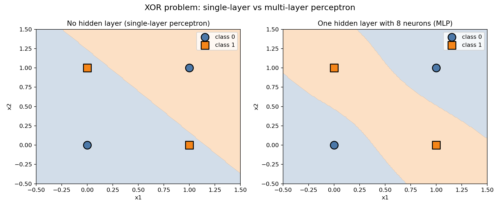

# 5강. 신경망의 직관: 작은 뉴런들이 만드는 판단

## Part A — 강의 (1교시, 90분)

### 강의 목표

이번 강의의 목표는 **인공 뉴런(퍼셉트론)이 무엇을 계산하는지** 이해하고, **은닉층을 쌓으면 왜 더 복잡한 문제를 풀 수 있는지** 직관적으로 파악하는 것이다. 4주차에서 머신러닝 모델이 데이터에서 판단 경계를 찾는다는 것을 배웠다. 이번에는 그 모델의 내부 구조를 살펴본다.

학생은 이번 시간 후 다음을 할 수 있어야 한다.

1. 퍼셉트론이 무엇을 계산하는지 설명한다 (입력 x 가중치 + 편향 -> 활성화 함수).
2. 활성화 함수가 왜 필요한지 설명한다.
3. 단층 퍼셉트론이 XOR 문제를 풀 수 없는 이유를 설명한다.
4. 은닉층을 추가하면 왜 비선형 판단 경계를 만들 수 있는지 설명한다.
5. 다층 퍼셉트론의 구조(입력층-은닉층-출력층)를 그림으로 그린다.

이번 강의의 실습은 XOR 문제다. XOR은 입력 두 개가 같으면 0, 다르면 1을 출력하는 논리 연산이다. 직선 하나로 나눌 수 없는 가장 간단한 문제이기 때문에, 단층 퍼셉트론의 한계와 은닉층의 역할을 보여주기에 적합하다.

### 5.1 퍼셉트론이란

**퍼셉트론(perceptron)**은 인공 신경망의 가장 작은 단위다. 하나의 퍼셉트론은 다음 세 단계를 거쳐 출력을 만든다.

1. **입력에 가중치를 곱한다.** 입력이 여러 개일 때, 각 입력마다 별도의 가중치가 있다. 가중치가 크면 그 입력이 출력에 미치는 영향이 크다.
2. **편향을 더한다.** 편향은 입력과 관계없이 더해지는 값이다. 판단 기준을 좌우로 밀어주는 역할을 한다.
3. **활성화 함수를 통과한다.** 위에서 구한 합을 활성화 함수에 넣으면 최종 출력이 나온다.

이 과정을 식으로 쓰면 다음과 같다.

```text
출력 = 활성화함수(입력1 x 가중치1 + 입력2 x 가중치2 + 편향)
```

예를 들어 입력이 두 개인 퍼셉트론을 생각하자.

- 입력1 = 3, 가중치1 = 0.5
- 입력2 = 2, 가중치2 = -1.0
- 편향 = 0.1

이때 합은 3 x 0.5 + 2 x (-1.0) + 0.1 = 1.5 - 2.0 + 0.1 = -0.4 이다. 이 값을 활성화 함수에 넣으면 최종 출력이 결정된다.

퍼셉트론을 이해하기 위해 알아야 하는 용어를 정리하면 다음과 같다.

| 용어 | 뜻 | 비유 |
|---|---|---|
| 입력 | 퍼셉트론에 들어오는 데이터 값 | 시험 문제의 각 항목 점수 |
| 가중치 | 각 입력이 출력에 미치는 영향의 크기 | 항목별 배점 |
| 편향 | 입력과 무관하게 더해지는 기본값 | 기본 점수 |
| 활성화 함수 | 합산된 값을 변환하는 함수 | 합격/불합격 기준선 |

가중치와 편향은 모델이 학습할 때 조정되는 값이다. 사람이 정하지 않는다. 모델은 데이터를 보면서 가중치와 편향을 조금씩 바꾸어 정답에 가까운 출력을 만들어간다. 이 조정 과정이 6주차에서 배울 "학습"이다.

### 5.2 활성화 함수는 왜 필요한가

가중치를 곱하고 편향을 더하는 계산은 **선형 변환**이다. 선형 변환만으로는 직선(또는 평면)밖에 만들 수 없다.

활성화 함수는 이 선형 변환의 결과를 **비선형으로 바꾸는** 역할을 한다. 비선형이란 곧은 선이 아니라 꺾이거나 휘는 형태를 뜻한다.

활성화 함수가 없으면 무슨 일이 생기는가? 퍼셉트론을 여러 개 쌓아도 결과는 여전히 선형이다. 선형 변환을 여러 번 반복하면 더 복잡한 선형 변환이 될 뿐, 곡선은 만들 수 없다. 이것은 직선 여러 개를 합쳐도 직선인 것과 같다.

활성화 함수를 넣으면 각 층의 출력이 비선형으로 바뀌므로, 여러 층을 쌓았을 때 곡선 형태의 판단 경계를 만들 수 있다.

대표적인 활성화 함수는 다음과 같다.

| 이름 | 특징 |
|---|---|
| 시그모이드(sigmoid) | 출력이 0과 1 사이. 확률처럼 해석할 수 있다 |
| tanh | 출력이 -1과 1 사이. 0 중심이라 학습이 비교적 안정적이다 |
| ReLU | 양수는 그대로, 음수는 0. 계산이 빠르고 현재 가장 많이 쓰인다 |

이번 강의에서 활성화 함수의 수학적 세부 사항을 외울 필요는 없다. 중요한 점은 하나다.

> 활성화 함수가 있어야 신경망이 직선이 아닌 판단 경계를 만들 수 있다.

### 5.3 단층 퍼셉트론의 한계: XOR 문제

4주차의 2차원 점 분류에서 모델은 직선 하나로 두 그룹을 나누었다. 직선 하나로 나눌 수 있는 문제를 **선형 분리 가능한 문제**라고 한다. 4주차 실습의 A그룹과 B그룹은 직선 하나로 대부분 나눌 수 있었다.

그러나 모든 문제가 직선 하나로 풀리지는 않는다. 가장 유명한 반례가 **XOR 문제**다.

XOR은 "배타적 논리합"이라는 논리 연산이다. 규칙은 단순하다.

- 두 입력이 **같으면** 0을 출력한다.
- 두 입력이 **다르면** 1을 출력한다.

```text
x1  x2  |  XOR 결과
--------+----------
 0   0  |     0
 0   1  |     1
 1   0  |     1
 1   1  |     0
```

이 네 점을 2차원 평면에 놓으면 (0,0)과 (1,1)이 한 그룹(결과 0), (0,1)과 (1,0)이 다른 그룹(결과 1)이다. 대각선 방향으로 같은 그룹이 놓여 있다.

직선 하나를 어디에 그어도 이 두 그룹을 완전히 나눌 수 없다. 직선을 위아래로 그으면 (0,0)과 (1,0)이 같은 쪽에 놓이고, 좌우로 그으면 (0,0)과 (0,1)이 같은 쪽에 놓인다. 대각선으로 그어도 마찬가지다.

단층 퍼셉트론은 직선 하나를 만드는 모델이므로 XOR 문제를 풀 수 없다. 이것이 1969년 Minsky와 Papert가 지적한 퍼셉트론의 한계다.

### 5.4 은닉층을 쌓으면 무엇이 달라지는가

단층 퍼셉트론의 한계를 넘는 방법은 **층을 쌓는 것**이다. 입력층과 출력층 사이에 **은닉층(hidden layer)**을 넣으면 **다층 퍼셉트론(Multi-Layer Perceptron, MLP)**이 된다.

다층 퍼셉트론의 구조는 다음과 같다.

```text
입력층        은닉층         출력층
 x1 ──┐    ┌─ h1 ─┐
       ├──>├─ h2 ─├──> 출력
 x2 ──┘    ├─ h3 ─┤
           └─ ... ─┘
```

- **입력층**: 데이터가 들어오는 곳이다. XOR 문제에서는 x1, x2 두 개다.
- **은닉층**: 입력을 받아 중간 결과(중간 표현)를 만든다. 각 뉴런은 퍼셉트론처럼 가중치와 편향으로 합을 구하고 활성화 함수를 통과한다.
- **출력층**: 은닉층의 중간 표현을 받아 최종 예측을 만든다.

은닉층이 하는 일은 무엇인가? 은닉층의 각 뉴런은 입력 데이터를 자기만의 기준으로 변환한다. 예를 들어 XOR 문제에서 은닉층 뉴런 하나는 "x1 + x2가 큰가?"를 보고, 다른 뉴런은 "x1 - x2가 큰가?"를 볼 수 있다. 이런 중간 표현을 여러 개 만든 뒤, 출력층이 중간 표현을 조합하면 원래 입력 공간에서는 직선으로 나눌 수 없었던 패턴을 나눌 수 있다.

정리하면 다음과 같다.

| 구조 | 판단 경계 | XOR 풀 수 있는가 |
|---|---|---|
| 단층 퍼셉트론 (은닉층 없음) | 직선 하나 | 풀 수 없다 |
| 다층 퍼셉트론 (은닉층 있음) | 비선형 (꺾이거나 휜 형태) | 풀 수 있다 |

### 5.5 핵심 정리

- **퍼셉트론**은 입력에 가중치를 곱하고 편향을 더한 뒤 활성화 함수를 통과시키는 계산 단위다.
- **가중치**는 각 입력이 출력에 미치는 영향의 크기이고, **편향**은 판단 기준을 좌우로 미는 기본값이다.
- **활성화 함수**는 선형 계산 결과를 비선형으로 바꾼다. 활성화 함수가 없으면 층을 쌓아도 직선밖에 못 만든다.
- **단층 퍼셉트론**은 직선 판단 경계만 만들 수 있어 XOR 같은 비선형 문제를 풀 수 없다.
- **은닉층**을 추가하면 중간 표현을 만들어 비선형 판단 경계를 형성할 수 있다.
- 입력층-은닉층-출력층으로 구성된 신경망을 **다층 퍼셉트론(MLP)**이라 한다.

---

## Part B — 실습 (2교시, 90분)

### 실습 목표

이번 실습에서는 XOR 데이터를 단층 퍼셉트론과 다층 퍼셉트론으로 각각 학습시키고, 판단 경계를 비교한다. 눈으로 "직선 하나로는 안 되지만, 은닉층을 추가하면 된다"는 것을 확인하는 것이 목표다.

### 5.6 실습: XOR 분류

이번 실습의 전체 코드는 다음 위치에 있다.

```text
practice/chapter5/code/5-1-xor-mlp.py
```

실습 코드는 다음 순서로 실행된다.

1. XOR 데이터 4개 점을 만든다: (0,0)->0, (0,1)->1, (1,0)->1, (1,1)->0.
2. 단층 퍼셉트론(hidden_layer_sizes=(), 은닉층 없음)으로 학습한다.
3. 다층 퍼셉트론(hidden_layer_sizes=(8,), 은닉층 뉴런 8개)으로 학습한다.
4. 두 모델의 예측과 정확도를 비교한다.
5. 두 모델의 판단 경계를 나란히 비교하는 그림을 저장한다.

실행 명령은 다음과 같다.

```bash
python3 scripts/run_and_capture.py 5
```

#### XOR 데이터

```text
  x1  x2  |  정답
  --------+------
   0   0  |   0
   0   1  |   1
   1   0  |   1
   1   1  |   0
```

이 데이터는 `practice/chapter5/results/5-1-xor-mlp.log`에서 확인한 실제 실행 결과다.

#### 단층 퍼셉트론 결과

단층 퍼셉트론은 은닉층이 없다(hidden_layer_sizes=()). 직선 하나로만 판단 경계를 만들 수 있다.

```text
hidden_layer_sizes: ()
activation: logistic
예측: [0, 0, 0, 1]
정답: [0, 1, 1, 0]
정확도: 0.250
틀린 점: 3개
  (0, 1) -> 정답 1, 예측 0
  (1, 0) -> 정답 1, 예측 0
  (1, 1) -> 정답 0, 예측 1
```

4개 점 중 1개만 맞히고 3개를 틀렸다. 정확도 0.250이다. 직선 하나로는 XOR 패턴을 나눌 수 없기 때문이다.

#### 다층 퍼셉트론 결과

다층 퍼셉트론은 뉴런 8개짜리 은닉층이 1개 있다(hidden_layer_sizes=(8,)). tanh 활성화 함수를 사용한다.

```text
hidden_layer_sizes: (8,)
activation: tanh
예측: [0, 1, 1, 0]
정답: [0, 1, 1, 0]
정확도: 1.000
모든 XOR 데이터를 맞혔다.
```

4개 점 모두 맞혔다. 정확도 1.000이다. 은닉층이 중간 표현을 만들어 비선형 판단 경계를 형성했기 때문이다.

#### 비교

```text
단층 퍼셉트론 정확도: 0.250
다층 퍼셉트론 정확도: 1.000
```

이 수치는 `practice/chapter5/results/5-1-xor-mlp.log`에서 확인한 실제 실행 결과다.

#### 판단 경계 그림

실행 후 다음 파일이 생성되었다.

| 파일 | 역할 |
|---|---|
| `practice/chapter5/results/5-1-xor-mlp.log` | 실행 로그 |
| `practice/chapter5/results/5-1-xor-mlp.evidence.json` | 실행 증거 JSON |
| `practice/chapter5/results/xor_decision_boundary.png` | 판단 경계 비교 그림 |

판단 경계 그림은 두 모델이 어느 영역을 어떤 그룹으로 보는지 나란히 보여준다.



그림을 볼 때는 다음을 확인한다.

- **왼쪽 그림 (단층 퍼셉트론)**: 배경이 직선 하나로 나뉘어 있다. 직선 하나로는 대각선 위치의 같은 그룹을 분리할 수 없으므로, class 1인 (0,1)과 (1,0) 중 일부가 틀린 영역에 놓인다.
- **오른쪽 그림 (다층 퍼셉트론)**: 배경이 비선형으로 나뉘어 있다. 은닉층이 만든 중간 표현 덕분에 4개 점이 모두 올바른 영역에 놓인다.

### 5.7 AI 활용: 퍼셉트론 설명 검증

이번 장에서는 AI에게 퍼셉트론과 XOR 문제에 대한 설명을 요청한다. AI 답변은 참고 자료이지 최종 결론이 아니다.

다음 프롬프트를 사용한다.

```text
학부 2학년이 이해할 수 있게 퍼셉트론을 설명해줘.
그리고 단층 퍼셉트론이 XOR 문제를 왜 풀 수 없는지도 설명해줘.
수식을 최소화하고 직관적으로 설명해줘.
```

AI 답변을 받은 뒤에는 다음을 확인한다.

| 확인 항목 | 내 판단 |
|---|---|
| AI가 퍼셉트론의 계산 과정(가중치, 편향, 활성화)을 올바르게 설명했는가 |  |
| AI가 XOR 문제를 구체적으로 설명했는가 (4개 점, 직선 불가) |  |
| AI가 "은닉층을 추가하면 풀 수 있다"는 점을 함께 설명했는가 |  |
| AI가 "신경망은 모든 문제를 풀 수 있다"고 과장하지 않았는가 |  |
| AI 설명이 실습에서 관찰한 결과(단층 정확도 0.250, 다층 정확도 1.000)와 일치하는가 |  |

AI가 흔히 하는 부정확한 설명의 예시는 다음과 같다.

- "퍼셉트론은 단순한 분류기이므로 실무에서는 쓰이지 않는다." -> 부정확하다. 퍼셉트론은 신경망의 기본 단위이며 다층으로 쌓으면 강력한 모델이 된다.
- "XOR은 특수한 예제일 뿐이다." -> XOR은 비선형 문제의 가장 간단한 예시이며, 실제 문제 대부분은 비선형이다.
- "은닉층을 추가하면 어떤 문제든 풀 수 있다." -> 은닉층이 표현 능력을 높이지만, 데이터가 부족하거나 학습이 잘 안 되면 여전히 실패한다.

### 5.8 책임 있는 AI 체크

학생은 제출 전 다음 항목을 확인한다.

| 점검 항목 | 확인 질문 |
|---|---|
| AI 설명 검증 | AI가 퍼셉트론을 설명할 때 XOR 한계를 함께 언급했는가 |
| 결과 일치 | AI 설명이 실습에서 관찰한 결과와 맞는가 |
| 과장 확인 | AI가 "신경망은 모든 것을 풀 수 있다"고 과장하지 않았는가 |
| 이해 표시 | 이해하지 못한 수식이나 코드는 "이해 부족"으로 표시했는가 |
| 실행 확인 | AI가 만든 코드를 직접 실행해 확인했는가 |

학생은 제출물에 다음 문장을 반드시 포함한다.

```text
단층 퍼셉트론은 직선 하나로 판단 경계를 만들므로 XOR 문제를 풀 수 없었다.
은닉층을 추가한 다층 퍼셉트론은 비선형 판단 경계를 만들어 XOR 문제를 풀었다.
AI 설명 중 실습 결과와 다르거나 이해하지 못한 부분은 따로 표시했다.
```

### 제출물

이번 주 제출물은 다음과 같다.

| 제출물 | 설명 |
|---|---|
| 실행 로그 또는 화면 | 코드가 실제로 실행되었음을 보여준다 |
| XOR 데이터 그림 | 단층 실패와 은닉층 성공의 판단 경계를 비교한다 |
| 단층 모델 실패 결과 | 정확도 0.250, 틀린 점 3개 |
| 은닉층 모델 성공 결과 | 정확도 1.000, 모든 점 맞힘 |
| AI 답변 검증표 | AI가 퍼셉트론과 XOR을 올바르게 설명했는지 확인한다 |
| 3문장 설명 | "은닉층이 왜 필요한가"를 자기 말로 쓴다 |

### 핵심 정리

- 퍼셉트론은 입력에 가중치를 곱하고 편향을 더한 뒤 활성화 함수를 통과시키는 계산 단위다.
- 활성화 함수는 선형 계산 결과를 비선형으로 바꾼다. 활성화 함수가 없으면 층을 쌓아도 직선밖에 못 만든다.
- 단층 퍼셉트론은 직선 하나로 판단 경계를 만들기 때문에 XOR처럼 직선으로 나눌 수 없는 문제를 풀 수 없다.
- 은닉층을 추가하면 중간 표현을 만들어 비선형 판단 경계를 형성할 수 있다.
- 이번 실습에서 단층 퍼셉트론은 정확도 0.250, 다층 퍼셉트론은 정확도 1.000을 기록했다.
- AI 설명은 참고 자료이며, 실습 결과와 대조해 확인해야 한다.
