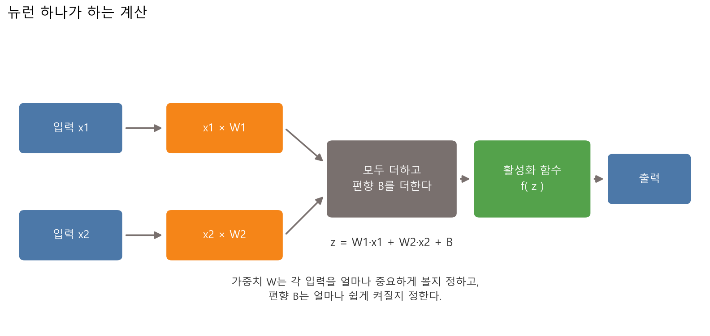
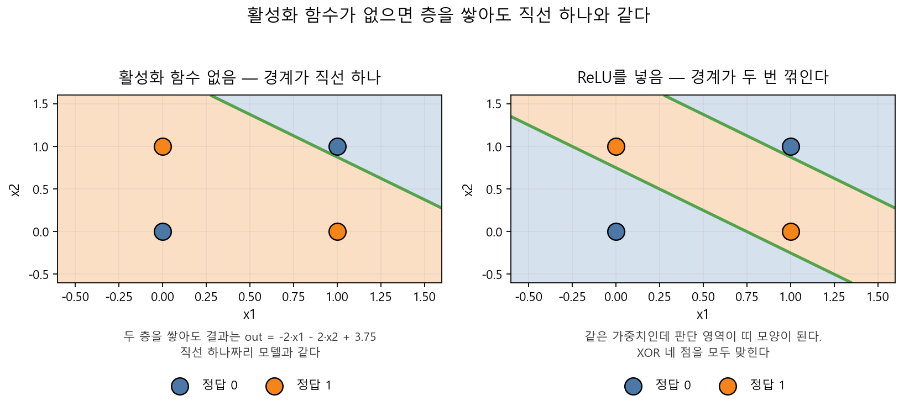
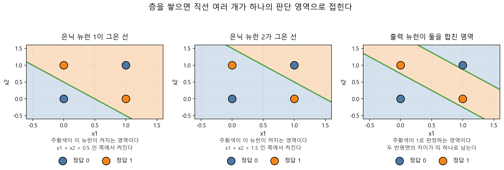
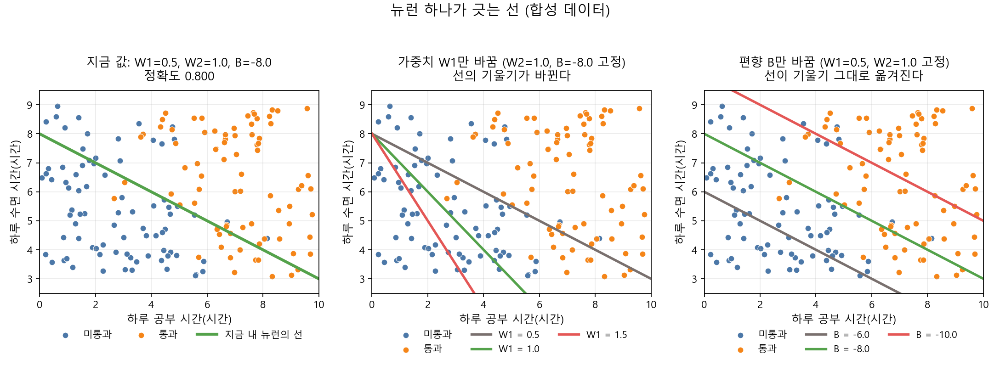
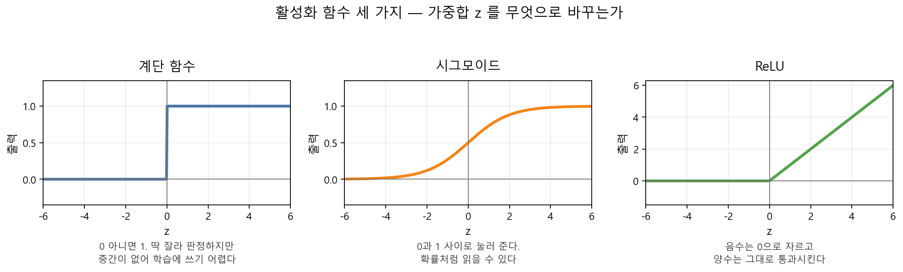
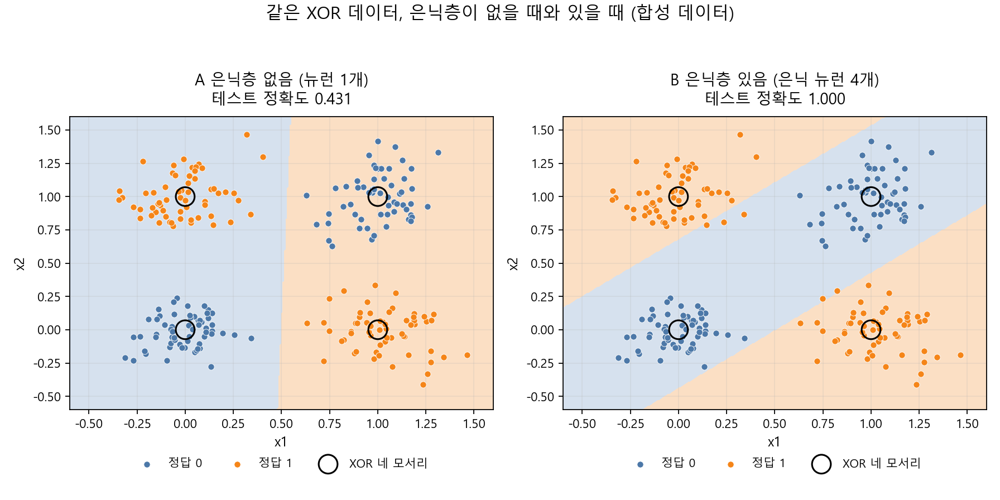

# 제5장 신경망의 직관 — 작은 뉴런들이 만드는 판단

---

## [전반부] 이론 강의
---

### 학습 목표

- 뉴런 하나가 하는 계산을 `z = W1 × x1 + W2 × x2 + B` 로 쓴다
- 가중치를 바꾸면 경계선의 기울기가, 편향을 바꾸면 위치가 움직인다는 것을 확인한다
- 활성화 함수가 무엇을 바꾸는지, 빼면 무엇이 무너지는지 설명한다
- 직선 하나로 나눌 수 없는 문제(XOR)를 네 점의 배치로 설명한다
- 같은 데이터에서 은닉층이 없는 모델과 있는 모델의 정확도를 비교한다

4장 실습 4.1에서 모델이 찾은 경계선을 식으로 꺼내 봤다. `수면시간 = -1.59 × 공부시간 + 13.96` 이었다. 이번 장은 그 선을 긋는 장치가 무엇인지에서 출발한다. 그 장치를 **뉴런** 하나라고 부른다. 뉴런 하나가 무엇을 계산하는지 보고, 뉴런 하나로는 못 푸는 문제를 만나고, 뉴런을 층으로 쌓으면 그 문제가 어떻게 풀리는지까지 간다.

---

### 1. 뉴런 하나는 무엇을 계산하는가

#### 1-1. 4장의 선을 다시 읽는다

4장의 경계선 식을 옮겨 쓴다.

```
수면시간 = -1.59 × 공부시간 + 13.96
```

이 식을 한쪽으로 모으면 이렇게 된다.

```
1.59 × 공부시간 + 1.0 × 수면시간 - 13.96 = 0
```

이제 각 입력 앞에 붙은 수(`1.59`, `1.0`)와 뒤에 더해진 수(`-13.96`)만 남는다. 앞에 붙은 수를 **가중치(weight)**, 뒤에 더해진 수를 **편향(bias)** 이라고 부른다. 이 셋으로 계산하는 장치가 인공 뉴런이다.

#### 1-2. 뉴런의 계산 순서

뉴런은 세 단계로 계산한다.



**그림 5.1** 입력에 가중치를 곱해 모두 더하고, 편향을 더하고, 활성화 함수를 통과시킨다

○ **1단계 — 곱한다**
  - 입력 하나하나에 그 입력의 가중치를 곱한다
  - 공부 시간에는 `W1`, 수면 시간에는 `W2` 를 곱한다

○ **2단계 — 더한다**
  - 곱한 값을 모두 더하고, 마지막에 편향 `B` 를 더한다
  - 이렇게 나온 하나의 숫자를 **가중합** 이라 부르고 `z` 로 쓴다

```
z = W1 × x1 + W2 × x2 + B
```

○ **3단계 — 통과시킨다**
  - `z` 를 **활성화 함수** 에 넣어 최종 출력을 만든다
  - 활성화 함수가 무엇인지는 3절에서 다룬다

`z > 0` 인 자리를 한쪽, `z < 0` 인 자리를 다른 쪽으로 부르면, 경계는 `z = 0` 인 자리다. 입력이 두 개면 `z = 0` 은 직선 하나다. 뉴런 하나가 그을 수 있는 경계는 직선 하나뿐이다. 이 문장이 4절의 출발점이 된다.

---

### 2. 가중치와 편향이 하는 일

두 값이 하는 일이 서로 다르다.

○ **가중치 W — 선의 기울기를 정한다**
  - `W1` 을 키우면 공부 시간을 더 중요하게 본다는 뜻이다
  - 그러면 경계선이 세로로 서는 쪽으로 기운다

○ **편향 B — 선의 위치를 정한다**
  - `B` 를 키우면 `z` 가 커져서 뉴런이 더 쉽게 켜진다
  - 기울기는 그대로 두고 선만 평행하게 옮겨진다

실습 5.1에서 `W1` 만 세 값으로 바꿔 재면 정확도가 0.800 → 0.725 → 0.644 로 내려간다. `B` 만 바꾸면 0.800에서 0.669와 0.731로 갈린다. 값 하나를 건드릴 때마다 선이 움직이고 성적이 따라 움직인다.

여기서 6장으로 이어지는 질문이 하나 남는다. 사람이 값을 하나씩 넣어 보는 대신, 컴퓨터가 스스로 좋은 `W`와 `B`를 찾게 하려면 어떻게 해야 하는가. 그 방법이 6장의 경사하강법이다.

---

### 3. 활성화 함수는 왜 필요한가

#### 3-1. 세 가지 활성화 함수

활성화 함수는 가중합 `z` 를 받아 다른 숫자로 바꿔 내보낸다. 수업에서 쓰는 세 가지는 다음과 같다.

**표 5.1** 활성화 함수 세 가지

| 이름 | 하는 일 | 출력 범위 |
|---|---|---|
| 계단(step) | `z > 0` 이면 1, 아니면 0 | 0 또는 1 |
| 시그모이드(sigmoid) | 어떤 값이 들어와도 0과 1 사이로 누른다 | 0 ~ 1 |
| ReLU | 음수는 0으로 자르고 양수는 그대로 통과시킨다 | 0 이상 |

계단 함수는 판정을 딱 잘라 내지만 중간값이 없다. 0.4와 0.49 둘 다 그냥 0이 되어서, 어느 쪽이 경계에 더 가까운지 알 수 없다. 시그모이드는 그 중간을 남긴다. 그래서 4장의 로지스틱 회귀가 시그모이드를 쓴다. ReLU는 계산이 단순하고 깊은 신경망에서 많이 쓴다.

#### 3-2. 활성화 함수를 빼면 층이 무너진다

활성화 함수가 없으면 어떻게 되는지 계산으로 확인한다. 은닉 뉴런 두 개와 출력 뉴런 하나로 된 작은 신경망을 놓는다.

```
은닉 뉴런 1:  h1 = x1 + x2 - 0.5
은닉 뉴런 2:  h2 = x1 + x2 - 1.5
출력 뉴런  :  out = f(h1) - 3 × f(h2) - 0.25
```

`f` 가 활성화 함수 자리다. `f` 를 빼고 값을 그대로 통과시키면 `out` 을 정리했을 때 `out = -2·x1 - 2·x2 + 3.75` 가 된다. 두 층을 쌓았는데 결과는 직선 하나짜리 식이다.



**그림 5.2** 같은 가중치인데 왼쪽은 경계가 직선 하나이고, 오른쪽은 `f` 에 ReLU를 넣어 경계가 두 번 꺾인다

`f` 에 ReLU를 넣으면 같은 가중치로 판단 영역이 띠 모양이 된다. 층을 쌓는 것으로 얻는 것이 있으려면, 층 사이에 직선을 꺾어 주는 무언가가 있어야 한다. 그 자리가 활성화 함수다.

---

### 4. 직선 하나로 못 나누는 문제 — XOR

XOR는 두 입력이 서로 **다를 때만** 1이 되는 문제다. 네 가지 경우가 전부다.

**표 5.2** XOR의 네 가지 경우

| x1 | x2 | 정답 |
|---:|---:|---:|
| 0 | 0 | 0 |
| 0 | 1 | 1 |
| 1 | 0 | 1 |
| 1 | 1 | 0 |

네 점을 격자 위에 찍어 보면 배치가 눈에 들어온다. 정답이 1인 두 점 `(0,1)`, `(1,0)` 이 대각선으로 마주 보고, 정답이 0인 두 점 `(0,0)`, `(1,1)` 도 반대쪽 대각선으로 마주 본다.

○ **왜 직선으로 안 되는가**
  - 직선 하나는 평면을 두 조각으로만 자른다
  - 같은 색 두 점이 대각선으로 떨어져 있으면, 그 둘을 한 조각에 넣는 순간 반대 색 점도 딸려 들어온다
  - 종이에 네 점을 찍고 자를 대 보면 몇 번 만에 확인된다

○ **가장 잘해도 4점 중 3점**
  - 그림 5.2 왼쪽 신경망(활성화 함수 없음)은 네 점 중 세 점을 맞히고 `(0,0)` 하나를 틀린다
  - 직선을 어디에 놓아도 세 점이 한계다

이 한계가 실제 데이터에서 어떻게 나타나는지는 실습 5.2에서 숫자로 확인한다.

---

### 5. 은닉층을 넣으면 무엇이 달라지는가

입력과 출력 사이에 뉴런 한 줄을 더 놓는다. 이 줄을 **은닉층(hidden layer)** 이라고 부른다. 밖에서 값을 넣지도 읽지도 않아서 붙은 이름이다.

은닉층이 있으면 출력 뉴런의 입력이 달라진다. 원래 데이터 대신, 은닉 뉴런들이 이미 한 번 판정한 결과를 받는다. 3-2절의 신경망을 단계별로 그리면 이렇다.



**그림 5.3** 은닉 뉴런 두 개가 각각 직선 하나씩 긋고, 출력 뉴런이 그 둘을 합쳐 띠 모양 영역을 만든다

○ **은닉 뉴런 1** — `x1 + x2 > 0.5` 인 쪽에서 켜진다. 직선 하나다

○ **은닉 뉴런 2** — `x1 + x2 > 1.5` 인 쪽에서 켜진다. 이것도 직선 하나다

○ **출력 뉴런** — 두 결과를 `h1 - 3 × h2` 로 섞는다. 첫 번째 반평면에서 두 번째 반평면을 빼면 사이에 낀 띠만 남는다

띠는 직선이 아니다. 직선 두 개를 조합해서 만든 모양이다. 뉴런 하나로는 못 만들고, 층을 하나 더 놓아야 만들 수 있다.

로그로 확인하면 활성화 함수 없이 계산했을 때 네 점 중 세 점을 맞히고, ReLU를 넣으면 네 점을 모두 맞힌다.

```text
=== 그림 5-2, 5-3에 쓴 신경망의 XOR 네 점 판정 ===
  x1   x2    정답      활성화 없음    ReLU 사용
   0    0     0           1          0
   0    1     1           1          1
   1    0     1           1          1
   1    1     0           0          0
```

_출처: `practice/chapter5/results/5-0-concept-figures.log`_

이 가중치는 학습으로 찾은 값이 아니라 설명을 위해 손으로 정한 값이다. 컴퓨터가 이런 값을 스스로 찾아내는 과정이 학습이고, 6장에서 다룬다.

---

### 6. 다층 퍼셉트론

뉴런 하나를 **퍼셉트론(perceptron)** 이라 부른다. 퍼셉트론을 층으로 쌓은 것이 **다층 퍼셉트론(multi-layer perceptron, MLP)** 이다. 앞으로 나올 신경망은 거의 다 이 구조의 변형이다.

○ **층의 이름**
  - 입력층 — 데이터가 들어오는 자리. 계산하지 않는다
  - 은닉층 — 중간에서 계산하는 층. 여러 겹 놓을 수 있다
  - 출력층 — 최종 답을 내는 층

○ **깊이와 폭**
  - 은닉층을 몇 겹 놓느냐가 깊이다. 깊을수록 깊은 신경망, 곧 **딥러닝** 이다
  - 한 층에 뉴런을 몇 개 놓느냐가 폭이다

폭이 부족하면 어떻게 되는지는 실습 5.2에서 숫자로 나온다. 은닉 뉴런이 1개나 2개면 테스트 정확도가 0.569와 0.500에 머물고, 3개부터 1.000이 된다. 층을 놓았다고 저절로 풀리지 않는다. 그 층에 뉴런이 몇 개 있느냐가 함께 정한다.

○ **지금은 넘어가는 것**
  - 뉴런을 무작정 늘리면 훈련 데이터만 잘 맞히고 새 데이터에서 무너진다. 이 문제가 7장의 과적합이다
  - 층이 깊어질 때 학습이 잘 안 되는 문제도 있다. 이 수업 범위 밖이다

---

### 7. 직접 움직여 보는 웹 자료

아래 설명은 각 페이지를 열어 확인한 내용이다. 모두 무료다.

| 자료 | 무엇을 볼 수 있는가 | 주소 |
|---|---|---|
| TensorFlow Playground | 은닉층을 add·remove 버튼으로 늘리고 줄이면서 학습 과정을 본다. 활성화 함수를 ReLU·Tanh·Sigmoid·Linear 중에서 고르고, 학습률·잡음·배치 크기를 조절한다. 훈련 손실과 테스트 손실이 함께 표시된다 | https://playground.tensorflow.org/ |
| Google 머신러닝 단기집중과정(한국어), 노드와 은닉층 | 입력 노드와 출력 노드를 그린 다이어그램에서 재생 버튼을 누르면 계산이 실행된다. 은닉 노드 4개를 넣은 연습문제가 있다 | https://developers.google.com/machine-learning/crash-course/neural-networks/nodes-hidden-layers?hl=ko |
| Google 머신러닝 단기집중과정(한국어), 활성화 함수 | 시그모이드·tanh·ReLU의 그래프를 세 장으로 나란히 보여준다 | https://developers.google.com/machine-learning/crash-course/neural-networks/activation-functions?hl=ko |
| scikit-learn, Varying regularization in MLP | 반달·동심원·선형분리 세 데이터에 은닉층 신경망을 적용한 결정 경계를 격자 그림 하나로 보여준다 | https://scikit-learn.org/stable/auto_examples/neural_networks/plot_mlp_alpha.html |

○ TensorFlow Playground는 이 장 전체와 짝이 된다. 은닉층을 하나씩 지웠다 다시 놓아 보고, 활성화 함수를 ReLU에서 Linear로 바꿔 본다. 3-2절에서 계산으로 확인한 층 붕괴가 실제로 일어나는지 화면에서 확인한다

○ scikit-learn 예제 그림은 BSD 라이선스로 공개돼 있다. 발표 자료에 넣을 때는 출처를 적는다

---

## [후반부] 실습
---

두 가지를 한다. 첫 번째는 뉴런 하나의 값 세 개를 손으로 돌려 보는 실습이고, 두 번째는 뉴런 하나가 무너지는 문제를 은닉층으로 푸는 실습이다.

#### 실행 환경

```bash
cd practice/chapter5
python -m pip install -r ../requirements.txt
```

필요한 패키지는 numpy, matplotlib, scikit-learn이다. GPU는 필요 없다. 두 실습 모두 노트북에서 몇 초 안에 끝난다.

두 실습의 데이터는 모두 **컴퓨터로 만든 합성 데이터** 다. 실제 학생 자료가 아니다. 난수 seed를 42로 고정했으므로 몇 번을 실행해도 같은 값이 나온다.

---

### 실습 5.1: 뉴런 하나가 긋는 선

#### 실습 목표

- 뉴런 하나가 하는 계산을 숫자로 따라간다
- 가중치를 바꿨을 때와 편향을 바꿨을 때 선이 어떻게 다르게 움직이는지 본다
- 계단·시그모이드·ReLU가 같은 `z` 를 어떻게 다르게 바꾸는지 그래프로 본다

#### 데이터

4장 실습 4.1과 같은 합성 학생 데이터 160명이다. 생성식도 seed도 같다. 점 하나가 학생 한 명이고, 가로축은 하루 공부 시간, 세로축은 하루 수면 시간이다. 색은 시험 통과 여부다.

#### 실행 명령

```bash
cd practice/chapter5/code
python 5-1-one-neuron.py
```

#### 핵심 코드

파일 맨 위에 학생이 바꿀 세 줄이 있다.

```python
# 경계선 식:  수면시간 = -(W1/W2) * 공부시간 - B/W2
W1 = 0.5
W2 = 1.0
B = -8.0
```

뉴런의 계산은 이 한 줄이 전부다.

```python
def neuron_sum(x, w1, w2, b):
    """뉴런의 가중합 z 를 구한다."""
    return w1 * x[:, 0] + w2 * x[:, 1] + b
```

_전체 코드는 `practice/chapter5/code/5-1-one-neuron.py` 참고_

#### 실행 결과

아래는 기본값(`W1 = 0.5`, `W2 = 1.0`, `B = -8.0`)으로 실행한 로그다.

```text
데이터: 컴퓨터로 만든 합성 데이터(실제 학생 자료 아님), 4장 실습 4.1과 같은 데이터
학생 160명 (통과 79명, 미통과 81명)

=== 내 뉴런 ===
W1 = 0.5  (공부 시간에 붙는 가중치)
W2 = 1.0  (수면 시간에 붙는 가중치)
B  = -8.0   (편향)
z = 0.5 x 공부시간 + 1.0 x 수면시간 + (-8.0)
경계선: 수면시간 = -0.50 x 공부시간 + 8.00
전체 정확도(z > 0 이면 통과로 판정): 0.800
```

_출처: `practice/chapter5/results/5-1-one-neuron.log`_

학생 다섯 명의 계산 과정도 함께 나온다.

```text
=== 학생 5명의 계산 과정 ===
    공부    수면       z      시그모이드    계단    ReLU     판정     실제
  7.74  3.65   -0.48      0.381     0    0.00    미통과     통과
  4.39  8.50    2.69      0.936     1    2.69     통과     통과
  8.59  4.38    0.67      0.662     1    0.67     통과     통과
  6.97  3.22   -1.29      0.216     0    0.00    미통과     통과
  0.94  6.33   -1.20      0.231     0    0.00    미통과    미통과
```

_출처: `practice/chapter5/results/5-1-one-neuron.log`_



**그림 5.4** 왼쪽은 지금 값으로 그은 선, 가운데는 `W1` 만 바꿨을 때, 오른쪽은 `B` 만 바꿨을 때



**그림 5.5** 같은 `z` 가 활성화 함수에 따라 다른 출력이 된다. 세 함수는 출력 범위가 달라 세로축을 따로 잡았다

**표 5.3** 값 하나만 바꿔 가며 잰 정확도 (학생 160명 전체)

| 설정 | 기울기 | y절편 | 정확도 |
|---|---:|---:|---:|
| 지금 값 W1=0.5 | -0.50 | 8.00 | 0.800 |
| W1을 1.0으로 | -1.00 | 8.00 | 0.725 |
| W1을 1.5로 | -1.50 | 8.00 | 0.644 |
| B를 -6.0으로 | -0.50 | 6.00 | 0.669 |
| B를 -10.0으로 | -0.50 | 10.00 | 0.731 |

_출처: `practice/chapter5/results/5-1-one-neuron.log`_

#### 결과 읽기

○ **W를 바꾸면 기울기만 바뀐다** — `W1` 을 0.5에서 1.5로 올리는 동안 y절편은 8.00으로 고정돼 있고 기울기만 -0.50에서 -1.50으로 움직였다. 그림 5.4 가운데 칸에서 세 선이 한 점에서 만나는 것이 그 때문이다

○ **B를 바꾸면 위치만 바뀐다** — `B` 를 -6.0과 -10.0으로 바꿔도 기울기는 -0.50 그대로다. y절편만 6.00과 10.00으로 옮겨졌다. 그림 5.4 오른쪽 칸의 세 선이 평행하다

○ **정확도는 양쪽 다 내려갔다** — 기본값 0.800이 다섯 설정 중 가장 높다. 값을 아무 방향으로나 움직이면 성적이 내려간다. 어느 방향으로 얼마나 움직여야 하는지 정하는 방법이 6장의 주제다

○ **첫 번째 학생을 보라** — 공부 7.74시간, 수면 3.65시간인 학생의 `z` 는 -0.48이다. 0에 아주 가깝다. 시그모이드로 읽으면 0.381이라 반반에 가까운데, 계단 함수로 읽으면 그냥 0이다. 실제로는 통과한 학생이라 이 뉴런이 틀렸다. 경계에 붙은 점에서 판정이 갈린다

#### 해 보기

`W1`, `W2`, `B` 를 바꿔 다시 실행한다.

1. `W2` 를 2.0으로 올리고 실행한다. 기울기가 어느 쪽으로 움직이는가
2. 4장 모델이 찾은 선 `수면시간 = -1.59 × 공부시간 + 13.96` 을 뉴런 값으로 옮기면 `W1 = 1.59`, `W2 = 1.0`, `B = -13.96` 이다. 넣고 실행해 정확도를 확인한다
3. 표 5.3보다 높은 정확도가 나오는 조합을 찾아본다

○ 못 찾아도 좋다. 확인할 것은 **값 하나를 움직였을 때 선과 정확도가 함께 움직인다** 는 것이다

---

### 실습 5.2: XOR — 직선 하나로 못 나누는 문제

#### 실습 목표

- 직선 하나로 나눌 수 없는 데이터를 눈으로 확인한다
- 같은 데이터에서 은닉층 없는 모델과 있는 모델의 정확도를 비교한다
- 은닉 뉴런 개수를 바꾸면 결과가 어떻게 달라지는지 본다

#### 데이터

XOR 네 모서리 주변에 잡음을 뿌린 합성 데이터 240개다. 네 점만 찍으면 그림이 밋밋하고 훈련·테스트로 나눌 수도 없어서, 모서리마다 60개씩 흩뿌렸다. 잡음의 표준편차는 0.16이다.

#### 두 모델

| 모델 | 구조 |
|---|---|
| A 은닉층 없음 | 입력 두 개가 곧바로 출력 뉴런 하나로 간다. 4장에서 쓴 로지스틱 회귀와 같은 구조다 |
| B 은닉층 있음 | 입력 → 은닉 뉴런 4개(ReLU) → 출력 뉴런 하나 |

#### 실행 명령

```bash
cd practice/chapter5/code
python 5-2-xor.py
```

#### 핵심 코드

파일 맨 위에 학생이 바꿀 세 줄이 있다.

```python
HIDDEN_UNITS = 4      # 은닉층에 넣을 뉴런 개수
NOISE = 0.16          # 네 모서리 주변에 뿌리는 잡음의 크기
N_PER_CORNER = 60     # 모서리 하나마다 만들 점의 개수
```

두 모델을 만드는 부분은 다음과 같다.

```python
flat_model = LogisticRegression()               # A 은닉층 없음
deep_model = MLPClassifier(                     # B 은닉층 있음
    hidden_layer_sizes=(HIDDEN_UNITS,),
    activation="relu",
    solver="adam",
    max_iter=6000,
    random_state=RANDOM_SEED,
)
```

_전체 코드는 `practice/chapter5/code/5-2-xor.py` 참고_

#### 실행 결과

```text
데이터: 컴퓨터로 만든 합성 데이터(XOR 네 모서리 주변에 잡음을 뿌림)
설정: HIDDEN_UNITS=4, NOISE=0.16, N_PER_CORNER=60, seed=42
전체 240개 = 훈련 168개 + 테스트 72개
정답 1: 120개, 정답 0: 120개

=== 두 모델 비교 ===
모델                              훈련 정확도       테스트 정확도
A 은닉층 없음(뉴런 1개)                  0.530         0.431
B 은닉 뉴런 4개                       0.970         1.000
```

_출처: `practice/chapter5/results/5-2-xor.log`_



**그림 5.6** 같은 데이터, 같은 훈련·테스트 분할. 왼쪽은 경계가 직선 하나이고, 오른쪽은 띠 모양이다

**표 5.4** 두 모델이 XOR 네 모서리를 어떻게 판정하는가

| x1 | x2 | 정답 | A 판정 | B 판정 |
|---:|---:|---:|---:|---:|
| 0 | 0 | 0 | 0 | 0 |
| 0 | 1 | 1 | 0 | 1 |
| 1 | 0 | 1 | 1 | 1 |
| 1 | 1 | 0 | 1 | 0 |

_출처: `practice/chapter5/results/5-2-xor.log`_

**표 5.5** 은닉 뉴런 개수를 바꾸며 잰 정확도

| 은닉 뉴런 수 | 훈련 정확도 | 테스트 정확도 |
|---:|---:|---:|
| 1 | 0.554 | 0.569 |
| 2 | 0.500 | 0.500 |
| 3 | 0.982 | 1.000 |
| 4 | 0.970 | 1.000 |
| 8 | 1.000 | 1.000 |

_출처: `practice/chapter5/results/5-2-xor.log`_

#### 결과 읽기

○ **A는 동전 던지기보다 못했다** — 테스트 정확도 0.431이다. 정답이 반반인 데이터에서 기준선은 0.500이다. A는 그 아래다. 직선 하나로 나눌 수 없는 데이터에 직선을 억지로 그으면 이렇게 된다

○ **A의 경계선을 보라** — 그림 5.6 왼쪽에서 세로선 하나가 그어져 있다. 왼쪽 절반과 오른쪽 절반으로 나눴는데, 양쪽 모두 파랑과 주황이 섞여 있다. 어느 쪽으로 옮겨도 상황이 같다

○ **A는 네 모서리 중 두 개를 틀렸다** — 표 5.4에서 A는 `(0,1)` 과 `(1,1)` 을 틀렸다. 4절에서 말한 "잘해야 세 점"에 못 미치는 이유는, A가 네 점이 아니라 잡음이 섞인 240개 점에 맞춰 선을 그었기 때문이다

○ **B는 테스트 72개를 전부 맞혔다** — 테스트 정확도 1.000이다. 그림 5.6 오른쪽의 판단 영역이 띠 모양이다. 5절의 그림 5.3에서 손으로 만든 것과 같은 모양을, 이번에는 학습으로 찾았다

○ **B의 훈련 정확도가 테스트보다 낮다** — 0.970과 1.000이다. 훈련 168개 중 다섯 개를 틀렸다는 뜻이다. 그림 5.6 오른쪽에서 자기 덩어리를 벗어나 띠 너머로 튄 점을 찾아보라. 잡음을 뿌려 만든 데이터라 이런 점이 남는다

○ **은닉 뉴런이 1~2개면 실패한다** — 표 5.5에서 뉴런 1개는 0.569, 2개는 0.500이다. 3개부터 1.000이 된다. 은닉층을 놓았다는 사실만으로 풀리지 않는다. 띠 하나를 만들려면 직선이 최소 두 개 필요하고, 그 직선을 긋는 것이 은닉 뉴런이다

#### 해 보기

코드 맨 위의 값을 바꿔 다시 실행한다.

1. `HIDDEN_UNITS` 를 1로 바꿔 실행한다. 그림 5.6 오른쪽 칸의 경계가 어떤 모양이 되는가
2. `HIDDEN_UNITS` 를 16으로 올린다. 경계선의 모양이 4일 때와 어떻게 다른가
3. `NOISE` 를 0.35로 키운다. 네 덩어리가 섞이기 시작하면 B의 정확도가 어떻게 되는가
4. `NOISE` 를 0.05로 줄인다. 덩어리가 뭉치면 A의 정확도가 올라가는가

○ 3번에서 정확도가 내려가도 그것이 모델의 잘못은 아니다. 두 색이 실제로 섞인 자리에서는 어떤 모델도 못 가른다

---

### 책임 있는 AI 체크

신경망을 처음 다루는 주다. 설명을 AI에게 받았다면 아래를 확인한다.

**표 5.6** 제출 전 점검

| 점검 항목 | 확인 질문 |
|---|---|
| 한계 함께 | AI가 퍼셉트론을 설명할 때 XOR 한계를 함께 말했는가 |
| 결과 일치 | AI 설명이 실습 5.2에서 직접 본 결과와 맞는가 |
| 과장 확인 | "신경망은 무엇이든 푼다" 같은 단정을 그대로 옮기지 않았는가 |
| 이해 표시 | 이해하지 못한 식이나 코드를 "이해 못 함"으로 표시했는가 |
| 실행 확인 | AI가 준 코드를 직접 실행해 확인했는가 |

---

### 과제 (LMS 제출)

수업 시간에 실습을 실행했는지만 확인한다. 따로 보고서를 쓰지 않는다.

#### 제출물

두 실습을 실행하면 만들어지는 그림 파일 두 장을 LMS에 올린다.

1. `practice/chapter5/results/one_neuron.png`
2. `practice/chapter5/results/xor_comparison.png`

#### 평가 기준

- 두 파일을 올리면 완료로 인정한다. 정확도가 얼마인지는 채점하지 않는다
- 실습 5.1에서 `W1`, `W2`, `B` 를, 실습 5.2에서 `HIDDEN_UNITS` 를 바꿨다면 바뀐 그림이 올라온다. 기본값 그대로여도 인정한다

#### 마감

- 실습 수업일 포함 7일 이내

---

### 핵심 정리

| 개념 | 한 줄 정리 |
|---|---|
| 뉴런 | 입력에 가중치를 곱해 더하고 편향을 더한 뒤 활성화 함수를 통과시키는 장치다 |
| 가중치 W | 경계선의 기울기를 정한다. 어느 입력을 얼마나 중요하게 볼지에 해당한다 |
| 편향 B | 경계선의 위치를 정한다. 뉴런이 얼마나 쉽게 켜지는지에 해당한다 |
| 활성화 함수 | 직선을 꺾어 준다. 빼면 층을 쌓아도 직선 하나짜리 모델로 주저앉는다 |
| XOR | 같은 색 두 점이 대각선으로 마주 봐서 직선 하나로 못 가른다 |
| 은닉층 | 은닉 뉴런들이 그은 직선을 출력 뉴런이 합쳐 직선이 아닌 영역을 만든다 |
| 다층 퍼셉트론 | 퍼셉트론을 층으로 쌓은 구조. 깊이와 폭이 함께 성능을 정한다 |

다음 장에서는 이 장에서 손으로 돌려 본 `W`와 `B`를 컴퓨터가 스스로 찾는 방법을 다룬다.
