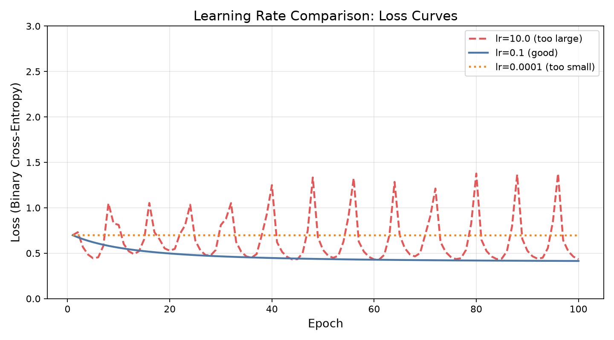

# 6강. 학습이란 무엇인가: 손실함수와 경사하강법

## Part A — 강의 (1교시, 90분)

### 강의 목표

이번 강의의 목표는 **모델이 어떻게 "틀렸다"는 것을 알고, 어떻게 조금씩 나아지는가**를 이해하는 것이다. 4주차에서 모델이 데이터를 보고 판단 기준을 찾는다는 사실을 배웠고, 5주차에서 신경망의 구조를 익혔다. 이번 장은 그 다음 질문에 답한다.

학생은 이번 시간 후 다음을 할 수 있어야 한다.

1. 손실함수가 무엇을 측정하는지 설명한다.
2. 경사하강법이 손실을 줄이는 과정을 자기 말로 설명한다.
3. 학습률이 너무 크면 무엇이 일어나는지, 너무 작으면 무엇이 일어나는지 설명한다.
4. epoch가 무엇을 뜻하는지 설명한다.
5. 학습 곡선(손실 곡선)을 보고 학습이 잘 되었는지 판단한다.
6. 학습률을 바꿔 실험한 결과를 비교표로 정리한다.

### 6.1 모델은 어떻게 "틀렸다"는 것을 아는가

4주차에서 만든 분류기는 데이터를 보고 판단 경계를 찾았다. 그런데 모델은 처음부터 좋은 경계를 찾지 못한다. 처음에는 무작위에 가까운 판단을 내리고, 그 판단이 얼마나 틀렸는지를 확인한 뒤, 조금씩 더 나은 방향으로 바꾸어 간다.

여기서 핵심 질문이 생긴다.

> 모델은 자신이 "틀렸다"는 것을 어떻게 아는가?

답은 **손실함수(loss function)**에 있다. 손실함수는 모델의 예측과 실제 정답이 얼마나 다른지를 하나의 숫자로 알려준다.

- 모델이 정답과 가까운 예측을 하면 손실이 작다.
- 모델이 정답과 먼 예측을 하면 손실이 크다.

모델의 목표는 이 손실을 가능한 한 작게 만드는 것이다. 즉, 학습이란 **손실을 줄여나가는 과정**이다.

### 6.2 손실함수: 예측과 정답의 거리

손실함수는 여러 종류가 있다. 이번 실습에서 사용하는 것은 **이진 교차 엔트로피(binary cross-entropy)**다.

이진 교차 엔트로피가 측정하는 것은 단순하다.

- 정답이 1인 점에 대해 모델이 1에 가까운 확률을 내면 손실이 작다.
- 정답이 1인 점에 대해 모델이 0에 가까운 확률을 내면 손실이 크다.
- 정답이 0인 점에서도 마찬가지로 반대 방향이 적용된다.

수식을 외울 필요는 없다. 중요한 것은 다음 직관이다.

> 손실함수는 "예측이 정답에서 얼마나 멀리 떨어져 있는가"를 숫자로 알려준다.

분류 문제에서는 보통 교차 엔트로피를 쓰고, 회귀 문제(숫자를 예측하는 문제)에서는 보통 **평균 제곱 오차(MSE)**를 쓴다.

| 문제 종류 | 대표 손실함수 | 측정하는 것 |
|---|---|---|
| 분류 (A인가 B인가) | 교차 엔트로피 | 예측 확률과 정답 사이의 거리 |
| 회귀 (숫자 예측) | 평균 제곱 오차 | 예측 숫자와 정답 숫자 사이의 제곱 거리 |

두 손실함수 모두 핵심은 같다. 예측과 정답이 가까우면 작고, 멀면 크다. 모델은 이 값을 줄이는 방향으로 배운다.

### 6.3 경사하강법: 기울기를 따라 내려가기

손실함수는 "지금 얼마나 틀렸는지"를 알려준다. 그러면 다음 질문은 이렇다.

> 손실을 줄이려면 모델의 파라미터(가중치와 편향)를 어떤 방향으로 바꿔야 하는가?

이 질문에 답하는 방법이 **경사하강법(gradient descent)**이다.

경사하강법의 과정은 다음과 같다.

1. 현재 파라미터로 예측한다.
2. 손실함수로 "얼마나 틀렸는지"를 계산한다.
3. 손실이 줄어드는 방향(기울기의 반대 방향)을 찾는다.
4. 그 방향으로 파라미터를 조금 바꾼다.
5. 1~4를 반복한다.

산을 내려가는 상황을 생각하면 이해하기 쉽다. 발밑의 기울기를 확인하고, 내리막 방향으로 한 걸음 내딛는다. 이것을 반복하면 점점 낮은 곳(손실이 작은 곳)으로 간다.

코드로 보면 핵심은 이 한 줄이다.

```python
w = w - lr * dw
```

- `w`는 현재 가중치다.
- `dw`는 기울기(gradient)다. 손실이 커지는 방향을 가리킨다.
- `lr`은 학습률이다. 한 번에 얼마나 움직일지를 정한다.
- 기울기의 반대 방향으로 `lr`만큼 움직여서 손실을 줄인다.

### 6.4 학습률이 왜 중요한가

경사하강법에서 가장 중요한 설정 중 하나가 **학습률(learning rate)**이다. 학습률은 한 걸음의 크기를 정한다.

- **학습률이 너무 크면**: 한 걸음이 너무 커서 목표 지점을 지나친다. 손실이 줄었다가 다시 커지기를 반복한다. 심하면 손실이 계속 커져서 학습이 실패한다.
- **학습률이 적절하면**: 한 걸음 크기가 알맞아서 손실이 꾸준히 줄어든다. 결국 낮은 값에 도달하여 안정된다.
- **학습률이 너무 작으면**: 한 걸음이 너무 작아서 거의 움직이지 않는다. 100번 반복해도 손실이 거의 줄어들지 않는다.

이번 실습에서 세 가지 학습률(10.0, 0.1, 0.0001)을 비교한 결과는 다음과 같다.

```text
       학습률 |      최종 손실 |      테스트 정확도 | 수렴 여부
-------------------------------------------------------
   10.0000 |     0.4334 |        0.800 | 수렴
    0.1000 |     0.4145 |        0.850 | 수렴
    0.0001 |     0.6957 |        0.183 | 매우 느림
```

이 표는 `practice/chapter6/results/6-1-learning-rate.log`에서 확인한 실제 실행 결과다.

학습률 10.0은 최종 손실이 0.4334에 도달했지만, 학습 과정에서 손실이 크게 흔들렸다. 실행 로그를 보면 epoch 2에서 손실이 0.7312로 올라갔다가 epoch 5에서 0.4442로 내려가고, epoch 96에서 다시 1.3765까지 올라가는 등 진동이 반복되었다. 테스트 정확도도 0.800으로, 적절한 학습률(0.850)보다 낮았다.

학습률 0.1은 epoch 1의 0.6980에서 epoch 100의 0.4145까지 꾸준히 손실이 줄어들었다. 테스트 정확도도 0.850으로 세 학습률 중 가장 높았다.

학습률 0.0001은 100 epoch 동안 손실이 0.6980에서 0.6957로 거의 변하지 않았다. 변화량이 0.0023에 불과하다. 테스트 정확도는 0.183으로, 임의 예측보다도 나쁜 수준이다. 학습이 사실상 시작되지 않았기 때문이다.

### 6.5 epoch와 batch

학습 과정에서 자주 나오는 용어를 정리한다.

- **epoch**: 전체 훈련 데이터를 한 바퀴 도는 것이다. 이번 실습에서 훈련 데이터는 140개이고, 100 epoch를 돌렸다. 즉 모델은 전체 데이터를 100번 반복해서 보았다.

- **batch**: 한 번에 처리하는 데이터 묶음이다. 이번 실습에서는 배치를 나누지 않고 전체 데이터를 한꺼번에 처리했다. 이것을 "배치 경사하강법(batch gradient descent)"이라고 한다.

- **미니배치(mini-batch)**: 전체 데이터를 작은 묶음으로 나누어 한 묶음씩 처리하는 방식이다. 데이터가 수만 개 이상으로 클 때 자주 쓴다. 메모리 사용을 줄이고, 파라미터를 더 자주 갱신할 수 있다.

이번 실습에서는 데이터가 200개(훈련 140개)로 작기 때문에 배치를 나눌 필요가 없었다. 실제 딥러닝에서는 데이터가 크므로 미니배치를 쓰는 것이 일반적이다.

| 용어 | 뜻 | 이번 실습 값 |
|---|---|---|
| epoch | 전체 데이터를 한 바퀴 도는 횟수 | 100 |
| batch | 한 번에 처리하는 데이터 개수 | 140 (전체 사용) |
| 학습률 | 파라미터를 한 번에 바꾸는 크기 | 10.0, 0.1, 0.0001 |

### 핵심 정리

- **손실함수**는 예측과 정답이 얼마나 다른지를 숫자로 알려준다. 학습의 목표는 이 숫자를 줄이는 것이다.
- **경사하강법**은 손실이 줄어드는 방향(기울기의 반대)으로 파라미터를 조금씩 바꾸는 방법이다.
- **학습률**은 한 번에 얼마나 바꿀지를 정한다. 너무 크면 진동하고, 너무 작으면 거의 움직이지 않는다.
- **epoch**는 전체 데이터를 한 바퀴 도는 것이다.
- **학습 곡선**은 epoch별 손실을 그린 그래프다. 손실이 꾸준히 줄어들면 학습이 잘 되고 있다는 신호다.

---

## Part B — 실습 (2교시, 90분)

### 실습 목표

학습률 세 가지(10.0, 0.1, 0.0001)로 같은 데이터를 학습하고, 손실 곡선을 비교한다. 학습률에 따라 학습 과정이 어떻게 달라지는지 직접 관찰한다.

### 실습 절차

이번 실습의 전체 코드는 다음 위치에 있다.

```text
practice/chapter6/code/6-1-learning-rate.py
```

실습 코드는 다음 순서로 실행된다.

1. scikit-learn의 make_classification으로 2차원 합성 데이터 200개를 만든다.
2. 훈련 데이터 140개와 테스트 데이터 60개로 나눈다.
3. numpy로 로지스틱 회귀(단층 신경망)를 직접 구현한다. PyTorch 같은 프레임워크를 쓰지 않고 경사하강법을 직접 코드로 작성한다.
4. 학습률 세 가지(10.0, 0.1, 0.0001)로 각각 100 epoch 학습한다.
5. 각 학습률별 손실 곡선을 하나의 그래프에 그려 PNG로 저장한다.
6. 학습률별 최종 손실과 테스트 정확도를 비교표로 출력한다.

실행 명령은 다음과 같다.

```bash
python3 scripts/run_and_capture.py 6
```

실행 후 다음 파일이 생성되었다.

| 파일 | 역할 |
|---|---|
| `practice/chapter6/results/6-1-learning-rate.log` | 실행 로그 |
| `practice/chapter6/results/6-1-learning-rate.evidence.json` | 실행 증거 JSON |
| `practice/chapter6/results/loss_curves.png` | 학습률별 손실 곡선 비교 그래프 |

### 핵심 코드: 경사하강법

전체 코드 중 가장 중요한 부분은 경사하강법의 반복이다. 다음은 한 epoch의 핵심 과정이다.

```python
# 순전파: 현재 가중치로 예측
z = x_train @ w + b
y_pred = sigmoid(z)

# 손실 계산: 예측과 정답의 차이
loss = binary_cross_entropy(y_train, y_pred)

# 기울기 계산: 손실이 커지는 방향
error = y_pred - y_train
dw = (x_train.T @ error) / n_samples
db = np.mean(error)

# 파라미터 갱신: 기울기의 반대 방향으로 한 걸음
w -= lr * dw
b -= lr * db
```

이 과정을 100번 반복하면 모델은 점점 나아진다. 단, 학습률(`lr`)에 따라 "나아지는 속도"와 "안정성"이 크게 달라진다.

### 손실 곡선 그래프

손실 곡선 그래프는 세 학습률의 학습 과정을 하나의 그림에 보여준다.



그래프를 볼 때는 다음을 확인한다.

- **빨간 파선 (lr=10.0)**: 손실이 크게 출렁인다. epoch 2에서 0.7312로 올라갔다가, epoch 96에서 1.3765까지 치솟았다가, epoch 100에서 0.4334로 내려오는 식이다. 학습률이 너무 커서 목표 지점을 지나쳤다가 돌아오기를 반복한다.
- **파란 실선 (lr=0.1)**: 손실이 처음부터 끝까지 꾸준히 줄어든다. epoch 1의 0.6980에서 epoch 100의 0.4145까지 안정적으로 내려간다. 가장 좋은 학습률이다.
- **주황 점선 (lr=0.0001)**: 100 epoch 동안 손실이 거의 변하지 않는다. 0.6980에서 0.6957로 0.0023만 줄었다. 학습이 사실상 시작되지 않았다.

### 학습률 비교표

실행 결과를 정리하면 다음과 같다.

| 학습률 | 최종 손실 | 테스트 정확도 | 학습 과정 |
|---:|---:|---:|---|
| 10.0 | 0.4334 | 0.800 | 손실이 크게 진동. 불안정 |
| 0.1 | 0.4145 | 0.850 | 손실이 꾸준히 감소. 안정 수렴 |
| 0.0001 | 0.6957 | 0.183 | 손실이 거의 줄지 않음. 학습 정체 |

이 표의 수치는 `practice/chapter6/results/6-1-learning-rate.log`에서 확인한 실제 실행 결과다.

학습률 0.1을 사용한 모델은 테스트 정확도 0.850으로 가장 좋았다. 학습률 10.0은 최종 손실은 비슷하게 내려갔지만(0.4334), 학습 과정에서 손실이 크게 흔들렸고 테스트 정확도도 0.800으로 낮았다. 학습률 0.0001은 100 epoch로는 학습이 부족하여 테스트 정확도가 0.183에 불과했다.

### AI 활용 가이드

이번 장의 AI 활용 실습은 다음과 같다.

1. 아래 코드를 AI에게 보여주고 "왜 이 코드가 학습이 안 되는지 설명해줘"라고 요청한다.

```python
# 일부러 오류를 넣은 학습 코드
w -= lr * dw  # 이 줄을 w += lr * dw 로 바꿔서 보여준다
```

2. AI가 수정안을 주면, 다음을 확인한다.
   - AI가 왜 `+=`를 `-=`로 바꿔야 하는지 설명했는가?
   - "기울기의 반대 방향으로 가야 손실이 줄어든다"는 핵심 원리를 말했는가?
   - AI가 에러를 try/except로 감싸서 무시하거나, 학습률을 임의로 바꾸지 않았는가?

다음 프롬프트를 사용할 수 있다.

```text
다음 학습 코드가 제대로 학습되지 않습니다.
경사하강법으로 가중치를 갱신하는 부분인데,
무엇이 잘못되었는지 설명하고 고쳐주세요.
왜 그렇게 고쳐야 하는지도 설명해주세요.

w += lr * dw
b += lr * db
```

AI 답변을 받은 뒤에는 다음 표를 채운다.

| 확인 항목 | 내 판단 |
|---|---|
| AI가 `+=`를 `-=`로 바꿔야 한다고 했는가 |  |
| AI가 기울기의 반대 방향으로 가야 하는 이유를 설명했는가 |  |
| AI가 학습률이나 다른 설정을 임의로 바꾸지 않았는가 |  |
| AI가 에러를 숨기는 방식(try/except)으로 해결하지 않았는가 |  |
| AI의 수정안을 직접 실행하여 학습이 되는지 확인했는가 |  |

### 책임 있는 AI 체크

AI에게 학습 코드 수정을 맡기면 편리하지만, 다음 위험이 있다.

- AI가 에러 메시지를 없애기 위해 try/except로 에러를 삼킬 수 있다. 에러가 사라진 것이 문제가 해결된 것은 아니다.
- AI가 학습률, epoch, 데이터 크기를 임의로 바꿔서 "돌아가게" 만들 수 있다. 그러면 원래 문제의 원인을 모르는 채로 넘어간다.
- AI가 "이 학습률이 최적이다"라고 단정할 수 있다. 그러나 최적의 학습률은 데이터와 모델에 따라 다르며, 실험으로 확인해야 한다.

이번 장의 책임 있는 AI 체크리스트는 다음과 같다.

| 점검 항목 | 확인 질문 |
|---|---|
| 오류 은폐 | AI가 에러를 try/except로 감싸서 무시하지 않았는가 |
| 설정 변경 | AI가 학습률, epoch, 데이터 크기를 임의로 바꾸지 않았는가 |
| 수정 이유 | AI가 왜 그렇게 고쳤는지 설명했는가 |
| 실행 확인 | AI가 고친 코드를 직접 실행해 결과를 확인했는가 |
| 과장 표현 | AI가 "완벽히 해결", "최적의 학습률" 같은 과장을 하지 않았는가 |

### 제출물

이번 주 제출물은 다음과 같다.

| 제출물 | 설명 |
|---|---|
| 실행 로그 또는 화면 | 코드가 실제로 실행되었음을 보여준다 |
| 학습률별 손실 곡선 그림 | 세 학습률의 학습 과정 차이를 보여준다 |
| 학습률 비교표 | 학습률, 최종 손실, 테스트 정확도, 학습 과정 설명 |
| AI 답변 검증표 | AI가 오류 코드를 어떻게 고쳤는지, 그 설명이 맞는지 확인 |
| 5문장 설명 | "학습률을 바꿨을 때 무엇이 달라지는가"를 자기 말로 쓴다 |

## 핵심 정리

- 손실함수는 예측과 정답의 차이를 숫자로 나타낸다. 학습은 이 숫자를 줄여나가는 과정이다.
- 경사하강법은 기울기의 반대 방향으로 파라미터를 조금씩 바꾸어 손실을 줄인다.
- 학습률이 너무 크면 손실이 진동하고, 너무 작으면 손실이 거의 줄지 않는다. 적절한 학습률을 찾는 것이 중요하다.
- epoch는 전체 데이터를 한 바퀴 도는 것이다. epoch를 더 돌리면 학습이 더 진행되지만, 무한히 좋아지지는 않는다.
- 학습 곡선(epoch별 손실 그래프)은 학습이 잘 되고 있는지 확인하는 가장 기본적인 도구다.
- AI가 고친 코드가 에러를 숨기지 않았는지, 설정을 임의로 바꾸지 않았는지 확인하는 것이 책임 있는 AI 활용이다.
