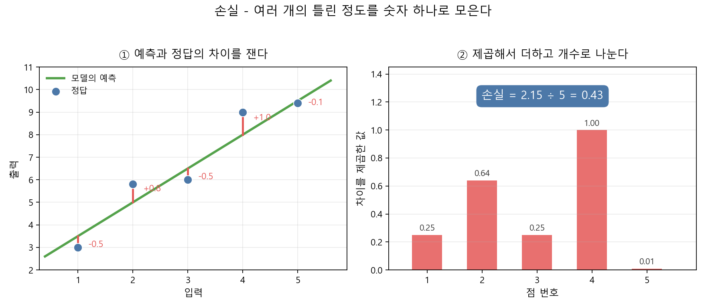
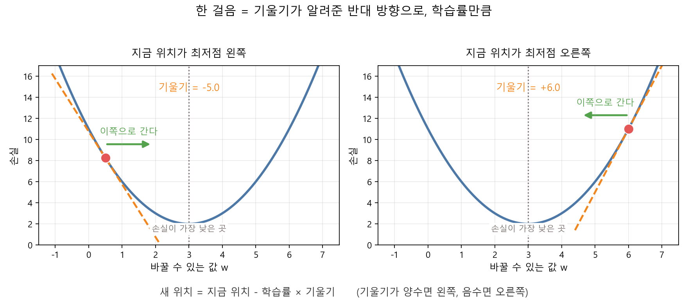
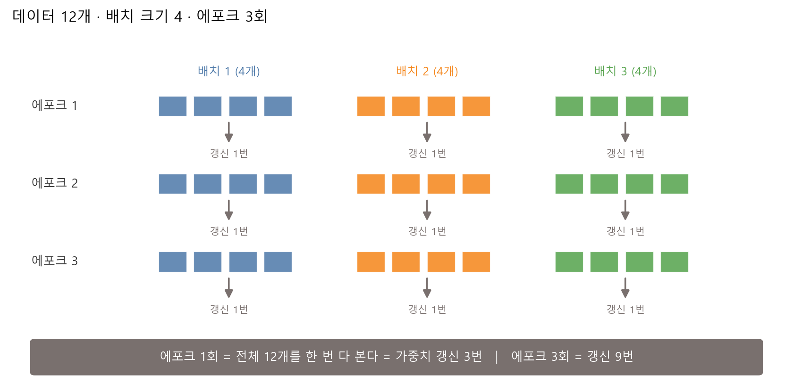
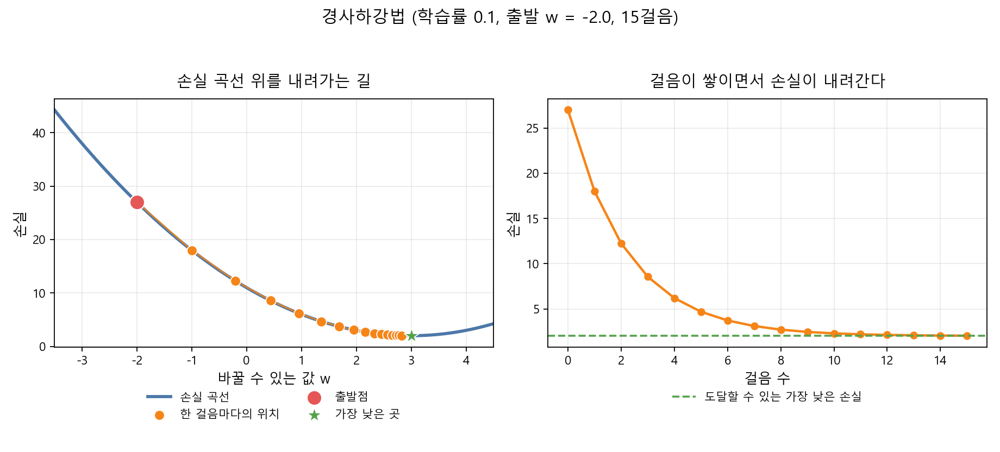
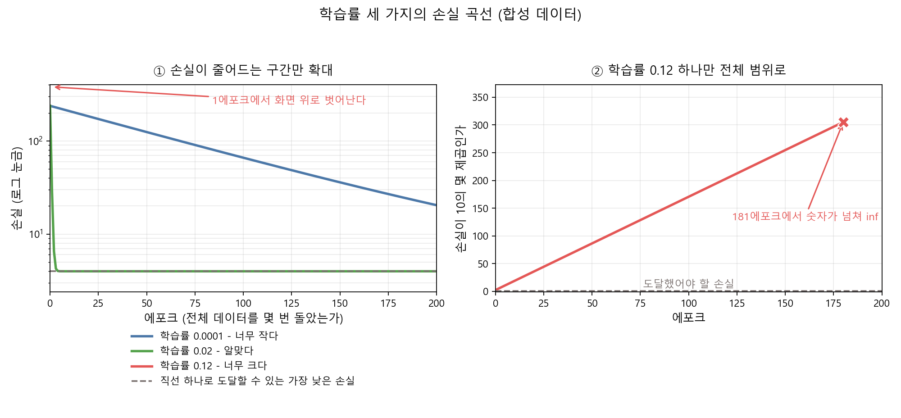

# 제6장 학습이란 무엇인가 — 손실함수와 경사하강법

---

## [전반부] 이론 강의
---

### 학습 목표

- 모델이 "틀렸다"는 것을 어떻게 아는지 손실함수로 설명한다
- 평균제곱오차를 손으로 계산한다
- 기울기가 알려주는 것이 무엇인지, 경사하강법의 갱신 규칙 한 줄을 읽는다
- 학습률이 너무 작을 때와 너무 클 때 손실 곡선이 어떻게 달라지는지 구분한다
- epoch와 batch를 가중치 갱신 횟수로 환산한다

4장 실습에서 여러분은 `MY_SLOPE`와 `MY_INTERCEPT`를 손으로 바꿔 가며 정확도를 올렸다. 값을 조금 바꾸고, 실행하고, 숫자를 보고, 다시 바꿨다. 이번 장에서는 그 손조정을 기계에게 넘긴다. 기계는 같은 일을 훨씬 잘게, 훨씬 여러 번 한다. 그러려면 두 가지가 필요하다. 지금 얼마나 틀렸는지 재는 자(손실함수), 그리고 어느 쪽으로 값을 옮겨야 하는지 정하는 규칙(경사하강법)이다.

---

### 1. 모델은 어떻게 "틀렸다"는 것을 아는가

4장의 손조정을 다시 떠올린다. 그때 여러분이 한 일을 순서대로 적으면 이렇다.

1. 값을 하나 정한다
2. 실행해서 정확도를 본다
3. 정확도가 낮으면 값을 조금 옮긴다
4. 다시 실행한다

기계가 이 일을 대신하려면 2번과 3번이 걸린다.

○ **2번이 걸리는 이유** — 기계는 "낮다"를 모른다
  - 사람은 0.896이라는 숫자를 보고 "아직 부족하다"고 판단한다
  - 기계에게는 판단할 기준이 없다. 낮을수록 좋은 숫자 하나를 정해 줘야 한다
  - 그 숫자를 **손실(loss)** 이라고 부른다

○ **3번이 걸리는 이유** — 기계는 "어느 쪽"을 모른다
  - 사람은 그림을 보고 선을 왼쪽으로 옮길지 오른쪽으로 옮길지 정한다
  - 기계에게는 그림이 없다. 방향을 알려주는 숫자가 필요하다
  - 그 숫자를 **기울기(gradient)** 라고 부른다

이 장의 나머지는 두 숫자를 만드는 방법이다. 손실을 2절에서, 기울기를 3절에서 다룬다.

○ **왜 정확도를 그대로 쓰지 않는가**
  - 정확도는 맞힌 개수를 세는 값이라 계단처럼 움직인다. 선을 아주 조금 옮겨도 맞힌 개수는 그대로다
  - 그러다 어느 지점에서 한 명이 넘어가면 한 칸 뛴다. 이런 값으로는 "조금 옮기면 조금 좋아진다"를 알 수 없다
  - 손실은 조금 옮기면 조금 변하도록 만든다. 그래야 기계가 방향을 잡는다

---

### 2. 손실함수 — 틀린 정도를 숫자 하나로 모은다

#### 2-1. 차이를 재고, 제곱하고, 평균 낸다

손실함수(loss function)는 예측이 정답에서 얼마나 벗어났는지를 숫자 하나로 만드는 계산이다. 회귀 문제에서 가장 많이 쓰는 것이 **평균제곱오차(MSE, mean squared error)** 다. 이름 그대로 세 단계다.

```
1. 차이  = 정답 − 예측            (점마다 하나씩)
2. 제곱  = 차이 × 차이            (점마다 하나씩)
3. 평균  = 제곱한 값을 다 더하고 개수로 나눈다
```



**그림 6.1** 점 다섯 개의 차이를 재고(왼쪽), 제곱해서 더하고 개수로 나눈다(오른쪽). 손실은 0.43이라는 숫자 하나로 줄어든다

그림 6.1의 왼쪽에서 빨간 막대 하나가 차이 하나다. 위로 벗어났으면 양수, 아래로 벗어났으면 음수다. 다섯 개의 차이는 −0.5, +0.8, −0.5, +1.0, −0.1이다. 오른쪽 막대는 그 값을 제곱한 것이고, 다 더해 5로 나누면 0.43이 나온다.

_출처: `practice/chapter6/results/6-0-concept-figures.log`_

#### 2-2. 왜 제곱하는가

차이를 그냥 더하지 않고 제곱부터 하는 데는 이유가 두 개다.

○ **부호를 없앤다**
  - 그림 6.1의 차이를 그대로 더하면 −0.5 + 0.8 − 0.5 + 1.0 − 0.1 = 0.7이다
  - 위로 빗나간 것과 아래로 빗나간 것이 서로 상쇄한다. 크게 틀린 모델이 0에 가까운 점수를 받을 수 있다
  - 제곱하면 전부 양수가 되어 상쇄가 사라진다

○ **크게 틀린 것에 더 무거운 벌을 준다**
  - 0.1의 차이는 제곱하면 0.01로 줄어든다. 1.0의 차이는 제곱해도 1.00이다
  - 차이가 10배면 제곱은 100배다. 크게 빗나간 점 하나가 손실을 크게 끌어올린다
  - 그래서 MSE로 학습한 모델은 큰 오차를 줄이는 쪽으로 먼저 움직인다

○ **바꿔 쓰는 것도 있다**
  - 제곱 대신 절댓값을 쓰면 평균절대오차(MAE)가 된다. 크게 틀린 점의 영향이 MSE보다 작다
  - 이상치가 많은 데이터에서는 MAE를 고르기도 한다. 어느 쪽이 항상 낫지는 않다
  - 분류 문제에서는 또 다른 손실(교차 엔트로피)을 쓴다. 이 장은 MSE 하나만 다룬다

○ **용어 정리**
  - **손실(loss)** — 지금 모델이 얼마나 틀렸는지를 나타내는 숫자 하나. 작을수록 좋다
  - **손실함수(loss function)** — 그 숫자를 만드는 계산 방법
  - 4장의 정확도는 클수록 좋았지만, 손실은 **작을수록** 좋다. 방향이 반대다

---

### 3. 기울기를 보고 내려간다

#### 3-1. 기울기는 방향을 알려주는 화살표

이제 손실이라는 숫자가 생겼다. 남은 문제는 이것이다. **값을 어느 쪽으로 옮겨야 손실이 줄어드는가.**

바꿀 수 있는 값을 w 하나라고 두자. w를 가로축, 손실을 세로축에 놓으면 곡선이 하나 그려진다. 우리가 하려는 일은 이 곡선에서 가장 낮은 지점을 찾는 것이다.



**그림 6.2** 지금 서 있는 자리에서 곡선이 어느 쪽으로 기울었는지 보면(주황 점선), 내려갈 방향이 정해진다

**기울기**는 지금 서 있는 자리에서 곡선이 얼마나, 어느 쪽으로 기울었는지를 나타내는 숫자다. 수학에서는 미분으로 구하지만, 지금은 화살표 하나로 이해하면 된다.

○ **기울기가 양수** — 오른쪽으로 갈수록 손실이 커진다
  - 그림 6.2 오른쪽 그림이 그렇다. 기울기가 +6.0이다
  - 손실을 줄이려면 **왼쪽**으로 가야 한다

○ **기울기가 음수** — 오른쪽으로 갈수록 손실이 작아진다
  - 그림 6.2 왼쪽 그림이 그렇다. 기울기가 −5.0이다
  - 손실을 줄이려면 **오른쪽**으로 가야 한다

○ **기울기가 0** — 어느 쪽으로 가도 손실이 그대로다
  - 곡선의 바닥에 도착했다는 뜻이다. 더 갈 곳이 없다

정리하면 이렇다. **기울기의 반대 방향으로 가면 손실이 줄어든다.** 이것이 경사하강법(gradient descent)의 전부다.

#### 3-2. 갱신 규칙 한 줄

방향이 정해졌으니 얼마나 갈지만 정하면 된다. 그 값이 **학습률(learning rate)** 이다.

```
새 w = 지금 w − 학습률 × 기울기
```

이 한 줄이 딥러닝 학습의 심장이다. 층이 백 개인 신경망도 가중치 하나하나에 이 규칙을 그대로 적용한다.

○ **부호가 저절로 맞는다**
  - 기울기가 양수면 학습률 × 기울기도 양수이고, 빼면 w가 작아진다. 즉 왼쪽으로 간다
  - 기울기가 음수면 빼는 값이 음수라 w가 커진다. 즉 오른쪽으로 간다
  - 방향을 따로 판단할 필요가 없다. 빼기 한 번으로 해결된다

○ **바닥에 가까워지면 걸음이 저절로 줄어든다**
  - 곡선의 바닥 근처는 평평하다. 평평하면 기울기가 0에 가깝다
  - 기울기가 작으면 학습률 × 기울기도 작아져서 조금만 움직인다
  - 멀리 있을 때는 성큼성큼, 가까워지면 살금살금 움직인다. 이 성질을 실습 6.1의 표에서 숫자로 확인한다

---

### 4. 학습률이 정하는 보폭

학습률은 사람이 정해 주는 값이다. 데이터에서 배우는 값이 아니다. 이렇게 사람이 미리 정하는 값을 **하이퍼파라미터(hyperparameter)** 라고 부른다.

학습률 하나만 바꿔도 학습 결과가 완전히 달라진다.

**표 6.1** 학습률에 따라 달라지는 것

| 학습률 | 한 걸음의 크기 | 나타나는 현상 |
|---|---|---|
| 너무 작다 | 아주 짧다 | 방향은 맞지만 진도가 안 나간다. 정해진 횟수를 다 돌아도 바닥에 못 닿는다 |
| 알맞다 | 적당하다 | 손실이 빠르게 내려가다 바닥 근처에서 평평해진다 |
| 너무 크다 | 지나치게 길다 | 바닥을 뛰어넘어 반대편 더 높은 곳에 착지한다. 걸음마다 손실이 커진다 |

○ **너무 클 때 손실이 커지는 이유**
  - 바닥 근처에서 오른쪽으로 가야 한다는 신호를 받았다고 하자
  - 보폭이 너무 길면 바닥을 지나쳐 반대편 비탈에 도착한다. 원래보다 높은 자리다
  - 거기서 다시 왼쪽으로 가라는 신호를 받고, 또 지나친다. 왕복할 때마다 손실이 커진다
  - 이 상태를 **발산**한다고 말한다. 실습 6.2에서 숫자가 넘쳐 `inf`가 되는 것을 직접 본다

○ **알맞은 값을 찾는 방법**
  - 정답 공식이 없다. 몇 개를 넣어 보고 손실 곡선을 비교하는 것이 표준 방법이다
  - 0.1, 0.01, 0.001처럼 10배씩 띄워 가며 시작하는 경우가 많다
  - 발산하면 확실히 크다는 뜻이므로, 그때는 10분의 1로 줄여 다시 본다

---

### 5. epoch와 batch

지금까지는 한 걸음 걷는 방법만 봤다. 실제 학습에서는 데이터가 여러 개이고, 그 데이터를 여러 번 반복해서 본다. 여기에 이름이 두 개 붙는다.

○ **에포크(epoch)** — 전체 데이터를 처음부터 끝까지 한 번 다 본 것
  - 데이터가 1000개면, 1000개를 모두 한 번씩 쓴 시점이 1에포크다
  - 에포크 10회는 같은 데이터를 열 번 반복해서 봤다는 뜻이다

○ **배치(batch)** — 가중치를 한 번 갱신하기 전에 묶어서 보는 데이터의 개수
  - 배치 크기가 32면, 32개를 본 뒤 갱신 한 번, 다음 32개를 본 뒤 갱신 한 번 하는 식이다
  - 배치 크기를 전체 데이터 개수와 같게 두면 에포크마다 갱신이 한 번뿐이다



**그림 6.3** 데이터 12개를 배치 크기 4로 나누면 에포크 1회에 갱신이 3번 일어난다. 에포크 3회면 갱신 9번이다

갱신 횟수는 곱셈으로 나온다.

```
에포크당 갱신 횟수 = 전체 데이터 개수 ÷ 배치 크기
전체 갱신 횟수     = 에포크당 갱신 횟수 × 에포크 수
```

**표 6.2** 데이터 1000개일 때 설정에 따른 갱신 횟수

| 배치 크기 | 에포크 | 에포크당 갱신 | 전체 갱신 |
|---:|---:|---:|---:|
| 1000 | 10 | 1 | 10 |
| 100 | 10 | 10 | 100 |
| 10 | 10 | 100 | 1000 |

○ **배치 크기를 작게 하면**
  - 갱신이 자주 일어나서 같은 에포크 수로도 더 많이 움직인다
  - 대신 한 번에 보는 데이터가 적어 방향이 들쭉날쭉해진다. 손실 곡선이 지그재그로 흔들린다

○ **배치 크기를 크게 하면**
  - 방향이 안정된다. 손실 곡선이 매끄럽다
  - 대신 갱신이 드물고, 한 번에 계산할 양이 많아 메모리를 더 쓴다

○ **실습 6.2의 설정**
  - 실습 6.2는 배치를 나누지 않는다. 200개를 한 번에 보고 갱신 한 번을 한다
  - 그래서 에포크 200회 = 갱신 200번이다. 표의 첫 줄과 같은 구조다

---

### 6. 학습 곡선 읽는 법

**학습 곡선(learning curve)** 은 가로축에 에포크, 세로축에 손실을 놓고 그린 그림이다. 학습이 잘 되고 있는지 이 그림 하나로 판단한다.

**표 6.3** 곡선 모양별 진단

| 곡선 모양 | 무슨 일이 일어났는가 | 다음에 할 일 |
|---|---|---|
| 빠르게 내려가다 평평해진다 | 정상이다. 바닥에 닿았다 | 그대로 둔다. 더 돌려도 크게 안 변한다 |
| 아주 천천히 내려간다 | 학습률이 작거나 에포크가 모자라다 | 학습률을 키우거나 에포크를 늘린다 |
| 위로 솟거나 튄다 | 학습률이 크다 | 학습률을 10분의 1로 줄인다 |
| 처음부터 평평하다 | 갱신이 일어나지 않는다 | 학습률이 0에 가깝지 않은지, 데이터가 제대로 들어갔는지 본다 |
| 지그재그로 흔들리며 내려간다 | 배치 크기가 작을 때 흔히 나타난다 | 전체 방향이 아래로 향하면 문제로 보지 않는다 |

○ **세로축 눈금을 확인한다**
  - 손실이 237에서 4까지 내려간 곡선과 4.1에서 4.0으로 내려간 곡선은 모양이 비슷하게 보일 수 있다
  - 눈금을 보지 않고 모양만 보면 잘못 읽는다
  - 값의 규모 차이가 크면 세로축을 로그 눈금으로 바꾼다. 실습 6.2의 왼쪽 그림이 그렇게 그린 것이다

○ **도달할 수 있는 바닥이 어디인지 안다면 같이 그린다**
  - 잡음이 섞인 데이터에서는 손실이 0까지 내려가지 않는다
  - 실습 6.2는 직선 하나로 도달할 수 있는 가장 낮은 손실을 미리 계산해 가로 점선으로 그린다
  - 곡선이 그 선에 붙으면 더 내려갈 곳이 없다는 뜻이다

---

### 7. 직접 움직여 보는 웹 자료

아래 설명은 각 페이지를 열어 확인한 내용이다. 모두 무료다.

| 자료 | 무엇을 볼 수 있는가 | 주소 |
|---|---|---|
| Google 머신러닝 단기집중과정(한국어), 손실 | 손실을 "예측이 얼마나 잘못되었는지를 나타내는 수치"로 정의하고, L1·L2와 MAE·MSE를 표로 구분한다. 이상치 하나가 MSE와 MAE에 다르게 작용하는 그림 두 장이 있다 | https://developers.google.com/machine-learning/crash-course/linear-regression/loss?hl=ko |
| Google 머신러닝 단기집중과정(한국어), 경사하강법 | 반복 과정을 나타낸 도식, 1000번째 반복 근처에서 수렴하는 손실 곡선, 학습 시작·중간·끝의 모델 스냅샷 세 장, 3차원 손실 표면 그림이 있다 | https://developers.google.com/machine-learning/crash-course/linear-regression/gradient-descent?hl=ko |
| Google 머신러닝 단기집중과정(한국어), 초매개변수 | 학습률·배치 크기·에포크를 각각 정의하고, 학습률이 알맞을 때·너무 작을 때·너무 클 때의 손실 곡선 네 장을 나란히 보여준다. 객관식 점검 문제 두 개가 붙어 있다 | https://developers.google.com/machine-learning/crash-course/linear-regression/hyperparameters?hl=ko |
| TensorFlow Playground | 학습률을 0.00001부터 10까지 목록에서 고르고, 배치 크기를 조절하고, 에포크를 재생·정지하며 Training loss와 Test loss가 변하는 것을 본다 | https://playground.tensorflow.org/ |

○ 세 번째 자료의 그림 네 장은 실습 6.2와 짝이 된다. 우리가 만든 곡선과 나란히 놓고 모양을 비교한다

○ TensorFlow Playground에서는 학습률만 바꾸고 나머지를 그대로 둔 채 두 번 돌려 본다. 같은 데이터·같은 구조인데 손실이 다르게 움직이는 것을 확인한다

---

## [후반부] 실습
---

두 가지를 한다. 첫 번째는 기계가 손실 곡선 위를 한 걸음씩 내려가는 과정을 걸음마다 표로 확인하는 실습이고, 두 번째는 학습률 세 가지로 학습을 일부러 망가뜨려 손실 곡선을 겹쳐 보는 실습이다.

#### 실행 환경

```bash
cd practice/chapter6
python -m pip install -r ../requirements.txt
```

필요한 패키지는 numpy, pandas, matplotlib이다. GPU는 필요 없다. 두 실습 모두 노트북에서 몇 초 안에 끝난다.

실습 6.2의 데이터는 **컴퓨터로 만든 합성 데이터**다. 실제 관측 자료가 아니다.

---

### 실습 6.1: 손실 곡선 위를 한 걸음씩 내려간다

#### 실습 목표

- 갱신 규칙 한 줄이 실제로 어떤 숫자를 만들어 내는지 걸음마다 확인한다
- 바닥에 가까워질수록 걸음이 짧아지는 것을 숫자로 본다
- 학습률과 출발점을 바꾸면 궤적이 어떻게 달라지는지 눈으로 비교한다

#### 데이터

이 실습에는 데이터가 없다. 손실 곡선을 식으로 직접 준다.

```
손실(w) = (w − 3)² + 2
```

이 곡선은 w = 3에서 가장 낮고, 그때 손실은 2다. 답을 우리가 이미 알고 시작한다. 알고 시작하는 이유는, 기계가 그 답을 **어떻게** 찾아가는지 걸음마다 대조하기 위해서다. scikit-learn을 쓰지 않고 numpy로 직접 계산해 식이 코드에 그대로 보이게 했다.

#### 실행 명령

```bash
cd practice/chapter6/code
python 6-1-gradient-descent.py
```

#### 핵심 코드

파일 맨 위에 학생이 바꿀 세 줄이 있다.

```python
LEARNING_RATE = 0.1    # 한 걸음의 보폭을 정하는 값
START_W = -2.0         # 어디에서 출발할 것인가
N_STEPS = 15           # 몇 걸음 걸을 것인가
```

기울기를 구하는 부분과 한 걸음 걷는 부분은 다음과 같다.

```python
def gradient(w: float) -> float:
    # 손실(w) = (w - 3)^2 + 2 를 w로 미분하면 2 * (w - 3) 이 된다.
    return 2.0 * (w - TRUE_BEST_W)

current_grad = gradient(w)
stride = learning_rate * current_grad     # 이번 걸음에서 움직이는 거리
next_w = w - stride
```

_전체 코드는 `practice/chapter6/code/6-1-gradient-descent.py` 참고_

#### 실행 결과

아래는 기본값(`LEARNING_RATE = 0.1`, `START_W = -2.0`, `N_STEPS = 15`)으로 실행한 로그다.

```text
손실 곡선: 손실(w) = (w - 3)^2 + 2
갱신 규칙: 다음 w = 지금 w - 학습률 x 기울기
학습률 0.1, 출발 w = -2.0, 15걸음

=== 걸음마다의 기록 ===
  걸음         w          손실         기울기        이동거리       다음w
   0    -2.000      27.000     -10.000       1.000    -1.000
   1    -1.000      18.000      -8.000       0.800    -0.200
   2    -0.200      12.240      -6.400       0.640     0.440
   3     0.440       8.554      -5.120       0.512     0.952
   4     0.952       6.194      -4.096       0.410     1.362
   5     1.362       4.684      -3.277       0.328     1.689
  ...
  13     2.725       2.076      -0.550       0.055     2.780
  14     2.780       2.048      -0.440       0.044     2.824
  15     2.824       2.031      -0.352       0.035     2.859

=== 처음과 끝 비교 ===
출발: w = -2.000, 손실 = 27.000
도착: w = 2.824, 손실 = 2.031
가장 낮은 곳: w = 3.000, 손실 = 2.000
아직 남은 거리: 0.176
```

_출처: `practice/chapter6/results/6-1-gradient-descent.log`_



**그림 6.4** 왼쪽은 손실 곡선 위를 내려가는 궤적, 오른쪽은 걸음이 쌓이면서 손실이 내려가는 모습이다. 초록 별이 가장 낮은 곳이다

#### 결과 읽기

○ **첫 걸음이 가장 크다**
  - 0걸음에서 기울기가 −10.000이고 이동거리가 1.000이다
  - 15걸음에서는 기울기가 −0.352, 이동거리가 0.035다. 첫 걸음의 29분의 1 수준이다
  - 학습률은 0.1로 처음부터 끝까지 그대로였다. 걸음이 짧아진 것은 기울기가 작아졌기 때문이다

○ **기울기가 전부 음수다**
  - 출발점 −2.0이 최저점 3.0의 왼쪽에 있어서 오른쪽으로 가야 한다
  - 갱신 규칙에서 음수를 빼니 w가 커진다. −2.000 → −1.000 → −0.200 → 0.440으로 오른쪽으로 이동한다
  - 방향을 사람이 알려주지 않았다. 기울기의 부호가 정했다

○ **손실이 27.000에서 2.031로 내려갔다**
  - 도달할 수 있는 가장 낮은 손실은 2.000이다. 차이가 0.031 남았다
  - w는 2.824까지 왔고 목표 3.000까지 0.176이 남았다
  - 15걸음으로는 정확히 도착하지 못한다. 대신 매 걸음 조금씩 가까워진다

○ **그림 6.4 왼쪽에서 점 간격을 본다**
  - 왼쪽 위 출발점 근처에서는 점이 듬성듬성하다
  - 바닥 근처에서는 점이 촘촘히 뭉쳐 있다
  - 같은 규칙, 같은 학습률인데 걸음의 길이만 저절로 달라졌다

#### 해 보기

`LEARNING_RATE`를 바꿔 다시 실행하고, 그림 6.4와 표를 비교한다.

1. `LEARNING_RATE = 0.01`로 줄인다. 15걸음 뒤 w가 어디까지 갔는지, 손실이 얼마나 남았는지 확인한다
2. `LEARNING_RATE = 0.9`로 올린다. 표의 w 열이 최저점 3.000의 왼쪽과 오른쪽 중 어느 쪽에 찍히는지 걸음마다 확인한다
3. `LEARNING_RATE = 1.1`로 더 올린다. 손실 열의 숫자가 커지는지 작아지는지 본다
4. `START_W = 8.0`으로 바꾼다. 기울기의 부호가 바뀌는지, w가 어느 쪽으로 움직이는지 확인한다

○ 확인할 것은 도착 여부가 아니다. **학습률 하나를 바꿨을 때 궤적이 어떻게 달라지는지**다

○ 4번에서 기울기 부호가 바뀌는데도 코드는 한 줄도 고치지 않았다. 갱신 규칙이 방향을 스스로 처리한다는 뜻이다

---

### 실습 6.2: 학습률 셋으로 학습을 일부러 망가뜨린다

#### 실습 목표

- 학습률 하나만 바꿨을 때 손실 곡선이 얼마나 달라지는지 한 그림에서 비교한다
- 학습률이 너무 크면 손실이 커지다 결국 숫자가 넘치는 것을 확인한다
- 학습 곡선을 보고 학습률을 어느 쪽으로 고쳐야 하는지 판단한다

#### 데이터

점 200개를 만든다. 정답 직선은 y = 2.5x + 1.0이고, 여기에 표준편차 2.0의 잡음을 섞었다. **컴퓨터로 만든 합성 데이터**이며 실제 관측 자료가 아니다.

모델은 예측 = w × 입력 + b이고, w와 b 두 값을 경사하강법으로 찾는다. 손실은 평균제곱오차다. 배치를 나누지 않으므로 에포크 1회가 갱신 1번이다.

#### 실행 명령

```bash
cd practice/chapter6/code
python 6-2-learning-rate.py
```

#### 핵심 코드

파일 맨 위에서 학습률 세 개를 정한다.

```python
LEARNING_RATES = [0.0001, 0.02, 0.12]   # 너무 작다 / 알맞다 / 너무 크다
N_EPOCHS = 200                          # 전체 데이터를 몇 번 도는가
```

한 에포크에서 하는 일은 네 줄이다. 실습 6.1의 갱신 규칙을 w와 b 두 개에 각각 적용한 것이다.

```python
error = w * x + b - y
grad_w = float(2.0 * np.mean(error * x))   # w를 키우면 손실이 얼마나 커지는가
grad_b = float(2.0 * np.mean(error))       # b를 키우면 손실이 얼마나 커지는가

w = w - learning_rate * grad_w
b = b - learning_rate * grad_b
```

_전체 코드는 `practice/chapter6/code/6-2-learning-rate.py` 참고_

#### 실행 결과

```text
점 200개, 정답 직선 y = 2.5x + 1.0 (잡음 표준편차 2.0)
출발점 w = 0.0, b = 0.0, 에포크 200회
배치를 나누지 않는다. 에포크 1회 = 가중치 갱신 1번이다.

=== 목적지 ===
직선 하나로 도달할 수 있는 가장 낮은 손실: 3.9832
그때의 w = 2.6318, b = 0.3817

=== 학습률별 결과 ===
   학습률    평가    처음 손실  마지막 손실      찾은 w      찾은 b 발산 시점(에포크)
0.0001 너무 작다 237.9243 20.4245    1.9316    0.2971          -
0.0200   알맞다 237.9243  3.9832    2.6313    0.3850          -
0.1200 너무 크다 237.9243     inf 5.01e+152 7.71e+151        181

=== 에포크별 손실 (일부만 뽑아 봄) ===
   에포크       lr=0.0001         lr=0.02         lr=0.12
     0        237.9243        237.9243        237.9243
     1        234.8390         28.4273        1.13e+04
     5        222.8991          3.9863        6.06e+10
    20        183.3695          3.9833        1.05e+36
    50        124.4349          3.9833        3.17e+86
   100         66.0015          3.9833       4.31e+170
   200         20.4245          3.9832             inf
```

_출처: `practice/chapter6/results/6-2-learning-rate.log`_



**그림 6.5** 왼쪽은 손실이 줄어드는 구간만 확대한 것이고, 오른쪽은 발산한 곡선 하나를 전체 범위로 그린 것이다

#### 결과 읽기

세 곡선은 모두 같은 자리(손실 237.9243)에서 출발했다. 200에포크 뒤 도착 지점만 다르다.

○ **학습률 0.02 — 5에포크 만에 바닥에 닿았다**
  - 1에포크에서 237.9243 → 28.4273으로 떨어졌다
  - 5에포크에서 3.9863이다. 도달할 수 있는 가장 낮은 손실 3.9832와 소수점 둘째 자리까지 같다
  - 나머지 195에포크는 거의 변화가 없다. 찾은 w는 2.6313으로 목표 2.6318과 소수점 셋째 자리까지 같다
  - 그림 6.5 왼쪽에서 초록 곡선이 회색 점선에 붙어 있는 구간이 이 상태다

○ **학습률 0.0001 — 방향은 맞는데 진도가 안 나간다**
  - 손실이 237.9243에서 20.4245까지 내려갔다. 확실히 줄었다
  - 그런데 목표는 3.9832다. 200에포크를 다 쓰고도 5배 이상 남았다
  - 찾은 w는 1.9316이다. 목표 2.6318까지 아직 0.70이 남았다
  - 그림 6.5 왼쪽에서 파란 곡선은 200에포크 내내 아래로 향한다. 방향이 틀린 것이 아니라 보폭이 짧다

○ **학습률 0.12 — 첫 에포크부터 손실이 올라갔다**
  - 0에포크 237.9243에서 1에포크 1.13e+04로 커졌다. 한 걸음 만에 약 47배다
  - 5에포크에 6.06e+10, 50에포크에 3.17e+86, 100에포크에 4.31e+170이다
  - 181에포크에서 숫자가 컴퓨터가 다룰 수 있는 범위를 넘어 `inf`가 됐다. 찾은 w는 5.01e+152다
  - 그림 6.5 왼쪽에서 빨간 곡선은 1에포크에 화면 위로 사라진다. 오른쪽 그림이 그 뒤를 보여준다

○ **그림을 두 칸으로 나눈 이유**
  - 세 곡선을 한 칸에 그리면 세로 눈금이 300자리까지 늘어난다
  - 그러면 3.98과 237의 차이가 눈에 보이지 않아, 파란 곡선과 초록 곡선이 바닥에 붙은 한 줄로 뭉개진다
  - 그래서 왼쪽은 손실이 줄어드는 구간만 잘라 확대하고, 오른쪽은 발산 곡선만 따로 그렸다
  - 오른쪽 세로축은 손실 자체가 아니라 "손실이 10의 몇 제곱인가"다. 값이 직선으로 올라간다는 것은 에포크마다 자릿수가 일정하게 늘어난다는 뜻이다

○ **여기서 얻는 판단 기준**
  - 손실이 첫 몇 에포크에 올라가면 학습률이 크다. 10분의 1로 줄인다
  - 손실이 계속 내려가는데 끝까지 평평해지지 않으면 학습률이 작거나 에포크가 모자라다
  - 손실이 어느 값에 붙어 더 안 내려가면 그 값이 이 모델이 도달할 수 있는 바닥이다. 학습률을 더 만져도 소용없다

#### 해 보기

`LEARNING_RATES` 목록을 바꿔 다시 실행한다.

1. `[0.0001, 0.02, 0.12]`의 첫 값을 `0.005`로 올린다. 200에포크 안에 바닥에 닿는지 확인한다
2. 마지막 값을 `0.03`으로 낮춘다. 발산 시점 열에 숫자가 찍히는지, 아니면 `-`가 나오는지 본다
3. `N_EPOCHS`를 50으로 줄인다. 학습률 0.02의 마지막 손실이 200에포크일 때와 달라지는지 확인한다
4. 학습률 0.0001을 그대로 두고 `N_EPOCHS`만 2000으로 늘린다. 보폭이 짧아도 걸음 수로 메울 수 있는지 확인한다

○ 4번이 이 실습의 핵심 질문이다. 학습률과 에포크는 서로 맞바꿀 수 있는 값인지, 아니면 각자 다른 일을 하는지 판단해 본다

---

### 과제 (LMS 제출)

수업 시간에 실습을 실행했는지만 확인한다. 따로 보고서를 쓰지 않는다.

#### 제출물

두 실습을 실행하면 만들어지는 그림 파일 두 장을 LMS에 올린다.

1. `practice/chapter6/results/gradient_descent_path.png`
2. `practice/chapter6/results/learning_rate_curves.png`

#### 평가 기준

- 두 파일을 올리면 완료로 인정한다. 손실이 얼마나 내려갔는지는 채점하지 않는다
- 실습 6.1에서 `LEARNING_RATE`를 바꿨다면 바뀐 그림이 올라온다. 기본값 그대로여도 인정한다

#### 마감

- 실습 수업일 포함 7일 이내

---

### 핵심 정리

| 개념 | 한 줄 정리 |
|---|---|
| 손실 | 지금 모델이 얼마나 틀렸는지를 나타내는 숫자 하나. 작을수록 좋다 |
| 손실함수 | 그 숫자를 만드는 계산. 회귀에서는 차이를 제곱해 평균 낸 MSE를 많이 쓴다 |
| 제곱하는 이유 | 부호를 없애고, 크게 틀린 것에 더 무거운 벌을 주기 위해서다 |
| 기울기 | 어느 쪽으로 가야 손실이 줄어드는지 알려주는 화살표. 반대 방향으로 간다 |
| 경사하강법 | 새 w = 지금 w − 학습률 × 기울기. 이 한 줄을 반복한다 |
| 학습률 | 한 걸음의 보폭. 사람이 정한다. 작으면 진도가 안 나가고, 크면 발산한다 |
| epoch | 전체 데이터를 한 번 다 본 것 |
| batch | 갱신 한 번 전에 묶어서 보는 데이터 개수. 갱신 횟수 = 데이터 수 ÷ 배치 크기 × 에포크 |
| 학습 곡선 | 에포크별 손실 그림. 모양을 보고 학습률을 어느 쪽으로 고칠지 정한다 |

다음 장에서는 손실을 끝까지 낮춘 모델이 오히려 새 데이터에서 틀리는 현상을 다룬다. 훈련 손실만 보면 안 되는 이유가 거기서 드러난다.
