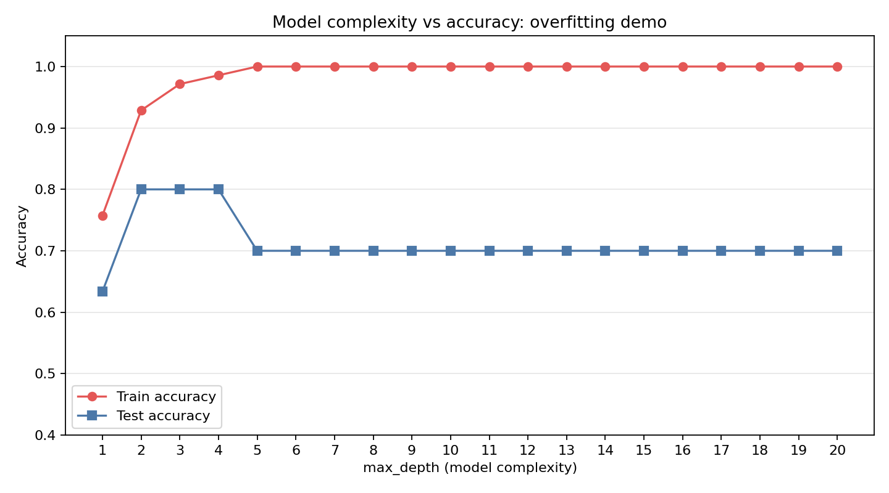

# 7강. 과적합과 일반화: 외운 모델과 이해한 모델

## Part A — 강의 (1교시, 90분)

### 강의 목표

이번 강의의 목표는 **모델이 훈련 데이터를 외우는 것**과 **새로운 데이터에서도 잘 작동하는 것**이 다르다는 사실을 이해하는 것이다. 4주차에서 훈련 데이터와 테스트 데이터를 나누는 이유를 배웠고, 6주차에서 모델이 학습하는 과정을 살펴보았다. 이번 장에서는 한 걸음 더 나아가, 모델이 훈련 데이터를 너무 잘 외워서 오히려 실전에서 실패하는 상황을 직접 확인한다.

학생은 이번 시간 후 다음을 할 수 있어야 한다.

1. 과적합이 무엇인지 자기 말로 설명한다.
2. 훈련 정확도가 높은데 테스트 정확도가 낮으면 과적합을 의심한다.
3. 검증 데이터의 역할을 설명한다.
4. 모델 복잡도를 높이면 훈련 성능은 올라가지만 테스트 성능은 꺾일 수 있다는 점을 안다.
5. 과적합을 줄이는 방법 3가지 이상을 말한다.
6. 훈련 성능만 보고 모델이 좋다고 주장하지 않는다.

### 7.1 시험 비유: 연습문제를 외우면 시험에서 틀린다

과적합을 이해하는 가장 쉬운 방법은 시험 공부를 떠올리는 것이다.

- **외우는 공부**: 문제집의 답을 통째로 외운다. 연습문제를 다시 풀면 100점을 받는다. 그러나 시험에 같은 문제가 나오지 않으면 틀린다.
- **이해하는 공부**: 원리를 파악하고 풀이 방법을 익힌다. 연습문제 점수는 100점이 아닐 수 있다. 그러나 처음 보는 문제도 풀 수 있다.

모델도 마찬가지다.

- **외운 모델**: 훈련 데이터의 패턴을 하나하나 다 기억한다. 훈련 데이터를 다시 맞히면 정확도가 매우 높다. 그러나 처음 보는 데이터에서는 틀린다.
- **이해한 모델**: 훈련 데이터의 전체적인 경향을 파악한다. 훈련 데이터 정확도가 100%는 아닐 수 있다. 그러나 처음 보는 데이터에서도 비교적 잘 맞힌다.

핵심 질문은 이것이다.

> 모델은 훈련 데이터를 외웠는가, 아니면 이해했는가?

### 7.2 과적합의 정의와 신호

**과적합(overfitting)**은 모델이 훈련 데이터에 지나치게 맞추어져서 새로운 데이터에서 성능이 떨어지는 현상이다.

과적합의 신호는 단순하다.

| 상태 | 훈련 정확도 | 테스트 정확도 | 판단 |
|---|---|---|---|
| 정상 학습 | 높음 | 높음 | 모델이 일반적인 패턴을 배웠다 |
| 과적합 | 매우 높음 | 낮음 | 모델이 훈련 데이터를 외웠다 |
| 과소적합 | 낮음 | 낮음 | 모델이 패턴을 아직 배우지 못했다 |

과적합을 확인하는 방법은 훈련 정확도와 테스트 정확도를 함께 보는 것이다.

- 훈련 정확도가 1.000인데 테스트 정확도가 0.700이면, 모델이 훈련 데이터를 완벽히 외웠지만 새로운 데이터에서는 30%를 틀린다는 뜻이다.
- 이 차이(0.300)가 클수록 과적합이 심하다.

이번 실습에서 실제로 확인한 결과가 이 패턴과 정확히 일치한다. 결과는 Part B에서 다룬다.

### 7.3 검증 데이터의 역할

4주차에서는 데이터를 훈련 데이터와 테스트 데이터로 나누었다. 과적합을 관리하려면 여기에 **검증 데이터(validation data)**를 추가할 수 있다.

- **훈련 데이터**: 모델이 배우는 연습문제다.
- **검증 데이터**: 학습 중간중간에 모델이 외우고 있는지 확인하는 모의시험이다. 학습 방향을 조정하는 데 사용한다.
- **테스트 데이터**: 최종 시험이다. 모델 학습이 끝난 뒤에 한 번만 사용해서 실제 성능을 측정한다.

왜 검증 데이터가 따로 필요한가? 테스트 데이터를 학습 중간에 반복해서 보면, 결국 테스트 데이터에도 맞추게 된다. 그러면 테스트 정확도가 실제 성능보다 높게 나오는 착시가 생긴다. 검증 데이터는 이 문제를 막는다.

| 데이터 종류 | 시험 비유 | 사용 시점 | 목적 |
|---|---|---|---|
| 훈련 데이터 | 연습문제 | 학습 중 계속 | 모델의 판단 기준을 조정 |
| 검증 데이터 | 모의시험 | 학습 중 주기적으로 | 과적합 여부를 점검하고 학습 조정 |
| 테스트 데이터 | 본시험 | 학습 완료 후 1회 | 최종 성능 측정 |

이번 실습에서는 데이터가 100개로 적기 때문에 훈련/테스트 2분할을 사용한다. 검증 데이터 분할은 데이터가 더 많은 이후 실습에서 직접 해본다.

### 7.4 모델 복잡도와 일반화의 관계

**모델 복잡도**는 모델이 얼마나 세밀한 패턴까지 배울 수 있는지를 뜻한다.

이번 실습에서 사용하는 결정 트리는 `max_depth` 값으로 복잡도를 조절한다.

- `max_depth=1`: 판단 기준을 1번만 나눈다. 매우 단순하다.
- `max_depth=3`: 판단 기준을 3번까지 나눈다. 적당히 복잡하다.
- `max_depth=None`: 제한 없이 나눈다. 훈련 데이터의 점 하나하나까지 구분하려고 한다.

복잡도와 성능의 관계는 다음과 같다.

- 복잡도가 너무 낮으면: 모델이 데이터의 패턴을 배우지 못한다. 훈련 정확도도 낮고 테스트 정확도도 낮다. 이것을 **과소적합(underfitting)**이라고 한다.
- 복잡도가 적당하면: 모델이 전체적인 경향을 잘 파악한다. 훈련 정확도와 테스트 정확도가 모두 적절히 높다.
- 복잡도가 너무 높으면: 모델이 훈련 데이터를 하나하나 외운다. 훈련 정확도는 올라가지만 테스트 정확도는 떨어진다. 이것이 **과적합**이다.

이 관계를 정리하면 다음과 같다.

> 복잡도를 올리면 훈련 성능은 계속 좋아지지만, 테스트 성능은 어느 지점에서 꺾여 내려간다.

이 "꺾이는 지점"을 찾는 것이 모델 선택의 핵심이다. 실습 그래프에서 이 꺾임을 직접 확인한다.

### 7.5 과적합을 줄이는 방법

과적합을 완전히 없앨 수는 없지만, 줄이는 방법은 여러 가지다.

| 방법 | 원리 | 예시 |
|---|---|---|
| 데이터 늘리기 | 훈련 데이터가 많으면 외우기가 어려워진다 | 데이터 수집, 데이터 증강 |
| 모델 복잡도 제한 | 모델이 너무 세밀한 패턴을 배우지 못하게 막는다 | 결정 트리의 max_depth 제한 |
| 정규화(regularization) | 모델의 가중치가 지나치게 커지는 것을 막는다 | L1, L2 정규화 |
| 조기 종료(early stopping) | 검증 성능이 떨어지기 시작하면 학습을 멈춘다 | 학습 곡선 모니터링 |
| 드롭아웃(dropout) | 학습할 때 뉴런 일부를 랜덤으로 끈다 | 신경망에서 사용 |

각 방법을 조금 더 풀어 설명한다.

**데이터 늘리기**: 시험에 나올 수 있는 문제가 1000가지인데 연습문제가 10개뿐이면, 10개를 외우는 것이 유리하다. 그러나 연습문제가 500개면 외우기보다 원리를 파악하는 편이 효율적이다. 모델도 마찬가지다. 데이터가 많을수록 외우기가 어려워지고, 일반적인 패턴을 배울 수밖에 없다.

**모델 복잡도 제한**: 모델이 복잡할수록 훈련 데이터의 작은 잡음까지 외울 수 있다. 복잡도를 제한하면 모델이 큰 패턴만 배우게 되어 과적합이 줄어든다. 이번 실습에서 `max_depth`를 제한하는 것이 이 방법이다.

**정규화**: 모델의 가중치(파라미터)가 지나치게 크면, 입력의 작은 차이에도 결과가 크게 바뀐다. 정규화는 가중치를 작게 유지하도록 유도해서 모델이 데이터의 작은 변동에 덜 민감하게 만든다. 자세한 수식은 이 장에서 다루지 않는다.

**드롭아웃**: 신경망을 학습할 때 뉴런의 일부를 랜덤으로 끄고 학습한다. 남은 뉴런만으로도 정답을 맞혀야 하므로, 특정 뉴런 몇 개에만 의존하는 외우기 전략이 통하지 않는다. 여러 뉴런이 고루 기여하게 되어 일반화가 좋아진다. 드롭아웃은 신경망을 다루는 이후 장에서 실제로 적용해본다.

### 핵심 정리

- 과적합은 모델이 훈련 데이터를 외워서 새로운 데이터에서 성능이 떨어지는 현상이다.
- 과적합의 신호는 "훈련 정확도는 높은데 테스트 정확도가 낮은 것"이다.
- 검증 데이터는 학습 중간에 과적합 여부를 확인하는 모의시험 역할을 한다.
- 모델 복잡도를 올리면 훈련 성능은 계속 좋아지지만, 테스트 성능은 어느 지점에서 꺾인다.
- 과적합을 줄이는 방법에는 데이터 늘리기, 복잡도 제한, 정규화, 조기 종료, 드롭아웃이 있다.
- 훈련 정확도만 보고 모델이 좋다고 주장하면 안 된다. 반드시 테스트 정확도를 함께 확인한다.

---

## Part B — 실습 (2교시, 90분)

### 실습 목표

일부러 과적합 모델을 만들고, 훈련 정확도는 높지만 테스트 정확도가 낮은 상황을 직접 확인한다. 모델 복잡도를 바꾸며 훈련/테스트 성능의 변화를 그래프로 관찰한다.

### 실습 절차

이번 실습의 전체 코드는 다음 위치에 있다.

```text
practice/chapter7/code/7-1-overfitting-demo.py
```

실습 코드는 다음 순서로 실행된다.

1. scikit-learn의 `make_classification`으로 합성 데이터 100개를 만든다. 데이터가 적으면 모델이 외우기 쉬워 과적합이 잘 드러난다.
2. 훈련 데이터 70개와 테스트 데이터 30개로 나눈다.
3. 과적합 모델(결정 트리, `max_depth=None`)을 학습시킨다. 제한 없이 나누므로 훈련 데이터를 거의 다 외운다.
4. 적절한 모델(결정 트리, `max_depth=3`)을 학습시킨다.
5. 두 모델의 훈련/테스트 정확도를 비교한다.
6. `max_depth`를 1부터 20까지 바꾸며 훈련/테스트 정확도 변화를 그래프로 그린다.

실행 명령은 다음과 같다.

```bash
python3 scripts/run_and_capture.py 7
```

#### 데이터 구성

이번 실습은 합성 데이터를 사용한다. 합성 데이터는 실제 데이터가 아니라 코드로 만든 가상 데이터다. 특성 20개 중 5개가 분류에 유용한 정보를 담고, 나머지는 의미 없는 특성이다.

```text
전체 데이터 수: 100
훈련 데이터 수: 70
테스트 데이터 수: 30
특성 수: 20
```

이 수치는 `practice/chapter7/results/7-1-overfitting-demo.log`에서 확인한 실제 실행 결과다.

#### 과적합 모델 vs 적절한 모델

실행 결과, 두 모델의 성능 차이가 분명하게 나타났다.

```text
=== 과적합 모델 (max_depth=None, 제한 없음) ===
  훈련 정확도: 1.000
  테스트 정확도: 0.700
  차이 (훈련 - 테스트): 0.300

=== 적절한 모델 (max_depth=3) ===
  훈련 정확도: 0.971
  테스트 정확도: 0.800
  차이 (훈련 - 테스트): 0.171
```

이 결과를 해석하면 다음과 같다.

| 모델 | 훈련 정확도 | 테스트 정확도 | 차이 | 해석 |
|---|---|---|---|---|
| 과적합 모델 (max_depth=None) | 1.000 | 0.700 | 0.300 | 훈련 데이터를 완벽히 외웠지만 새 데이터에서 30%를 틀린다 |
| 적절한 모델 (max_depth=3) | 0.971 | 0.800 | 0.171 | 훈련 정확도는 약간 낮지만 새 데이터에서 성능이 더 좋다 |

과적합 모델은 훈련 정확도가 1.000이다. 훈련 데이터 70개를 하나도 틀리지 않고 전부 맞혔다. 그러나 테스트 정확도는 0.700으로, 30개 중 9개를 틀렸다. 훈련에서는 완벽했지만 새로운 데이터에서는 상당히 실패한 것이다.

적절한 모델은 훈련 정확도가 0.971로 완벽하지 않다. 훈련 데이터 2개 정도를 틀렸다. 그러나 테스트 정확도는 0.800으로, 과적합 모델보다 높다. 훈련에서는 조금 못했지만 새로운 데이터에서는 더 잘했다.

여기서 핵심 교훈이 나온다.

> 훈련 정확도가 높다고 좋은 모델이 아니다. 테스트 정확도가 진짜 실력이다.

#### 복잡도별 정확도 그래프

`max_depth`를 1부터 20까지 바꾸며 훈련/테스트 정확도를 측정한 결과는 다음과 같다.

```text
depth     train      test       gap
    1     0.757     0.633     0.124
    2     0.929     0.800     0.129
    3     0.971     0.800     0.171
    4     0.986     0.800     0.186
    5     1.000     0.700     0.300
    6     1.000     0.700     0.300
    ...
   20     1.000     0.700     0.300
```

이 결과를 그래프로 그리면 다음과 같다.



그래프를 볼 때 확인할 점은 다음과 같다.

- **빨간 선(훈련 정확도)**: max_depth가 커질수록 계속 올라간다. depth=5부터는 1.000에 도달해서 더 이상 오르지 않는다.
- **파란 선(테스트 정확도)**: depth=2~4 구간에서 0.800으로 가장 높고, depth=5 이상에서는 0.700으로 떨어진다.
- **두 선이 벌어지는 구간**: depth=5부터 훈련 정확도와 테스트 정확도의 차이(gap)가 0.300으로 벌어진다. 이 구간이 과적합이다.

테스트 정확도가 가장 높은 지점은 max_depth=2였다(테스트 정확도 0.800). 이 지점이 이 데이터에서 과적합과 과소적합 사이의 적절한 균형점이다.

### 결과 파일

실행 후 다음 파일이 생성되었다.

| 파일 | 역할 |
|---|---|
| `practice/chapter7/results/7-1-overfitting-demo.log` | 실행 로그 |
| `practice/chapter7/results/7-1-overfitting-demo.evidence.json` | 실행 증거 JSON |
| `practice/chapter7/results/complexity_vs_accuracy.png` | 복잡도-정확도 그래프 |

### AI 활용 가이드

다음 프롬프트를 AI에게 보내본다.

```text
과적합을 해결하는 방법을 5가지 알려줘.
각 방법이 왜 과적합을 줄이는지 한 줄로 설명해줘.
```

AI 답변을 받은 뒤에는 다음 두 가지를 한다.

1. **적용 가능 여부 구분**: AI가 제안한 5가지 방법 중, 이번 실습에서 바로 적용할 수 있는 것과 적용하기 어려운 것을 구분한다.

| AI가 제안한 방법 | 이번 실습에서 적용 가능한가 | 이유 |
|---|---|---|
| (AI 답변에서 채우기) | 가능 / 어려움 | (학생이 쓰기) |

예를 들어, "데이터를 늘린다"는 방법은 합성 데이터의 개수를 바꿔서 바로 시도할 수 있다. 반면 "드롭아웃을 적용한다"는 결정 트리에는 적용할 수 없다(드롭아웃은 신경망에서 쓰는 기법이다).

2. **AI 답변 검증**: AI가 설명한 원리가 Part A의 내용과 맞는지 비교한다. 틀린 부분이 있으면 표시한다.

### 책임 있는 AI 체크

이번 장의 핵심 위험은 **훈련 성능만 보고 모델이 좋다고 주장하는 것**이다.

| 점검 항목 | 확인 질문 |
|---|---|
| 훈련 성능 과장 | 훈련 정확도 1.000만 보고 "완벽한 모델"이라고 주장하지 않았는가 |
| 테스트 성능 확인 | 테스트 데이터에서의 정확도를 반드시 함께 확인했는가 |
| 과적합 인식 | 훈련 정확도와 테스트 정확도의 차이가 클 때 과적합이라고 판단했는가 |
| 복잡도 맹신 | 모델을 무조건 복잡하게 만드는 것이 좋다고 생각하지 않았는가 |
| AI 답변 검증 | AI가 제안한 해결책이 실습 상황에서 실제로 적용 가능한지 따져보았는가 |

학생은 제출물에 다음 문장을 반드시 포함한다.

```text
훈련 정확도가 높아도 테스트 정확도가 낮으면 과적합이다.
이 실습에서 과적합 모델은 훈련 정확도 1.000, 테스트 정확도 0.700이었다.
훈련 성능만 보고 모델을 평가하지 않고, 테스트 성능을 함께 확인했다.
```

### 제출물

이번 주 제출물은 다음과 같다.

| 제출물 | 설명 |
|---|---|
| 실행 로그 또는 화면 | 코드가 실제로 실행되었음을 보여준다 |
| 복잡도-정확도 그래프 | max_depth를 바꿀 때 훈련/테스트 정확도가 어떻게 변하는지 보여준다 |
| 과적합 모델 vs 적절한 모델 비교표 | 두 모델의 훈련/테스트 정확도와 해석을 정리한다 |
| AI 답변 검증표 | AI가 제안한 과적합 해결책 5개와 적용 가능 여부를 기록한다 |
| 5문장 설명 | "훈련 성능만 보면 왜 위험한가"를 자기 말로 쓴다 |

## 참고자료

- 이번 실습 코드: `practice/chapter7/code/7-1-overfitting-demo.py`
- 실행 로그: `practice/chapter7/results/7-1-overfitting-demo.log`
- scikit-learn DecisionTreeClassifier 공식 문서: https://scikit-learn.org/stable/modules/generated/sklearn.tree.DecisionTreeClassifier.html
