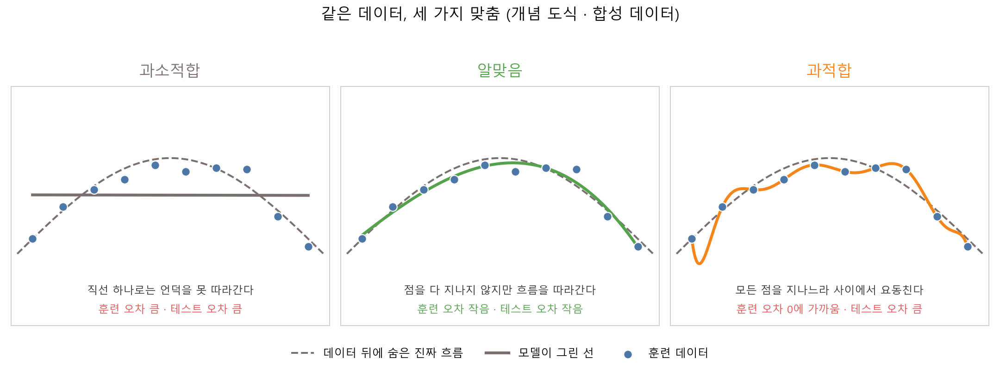
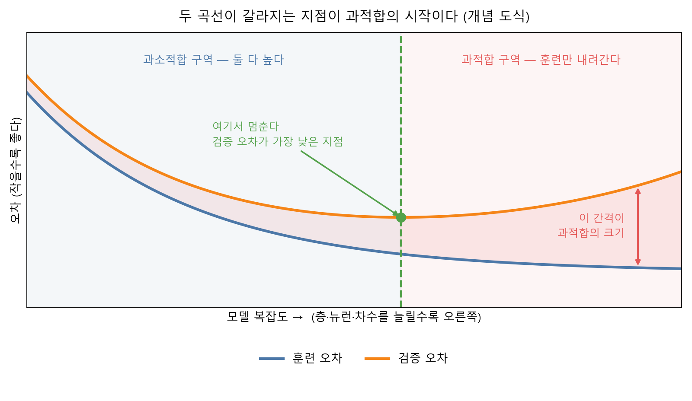
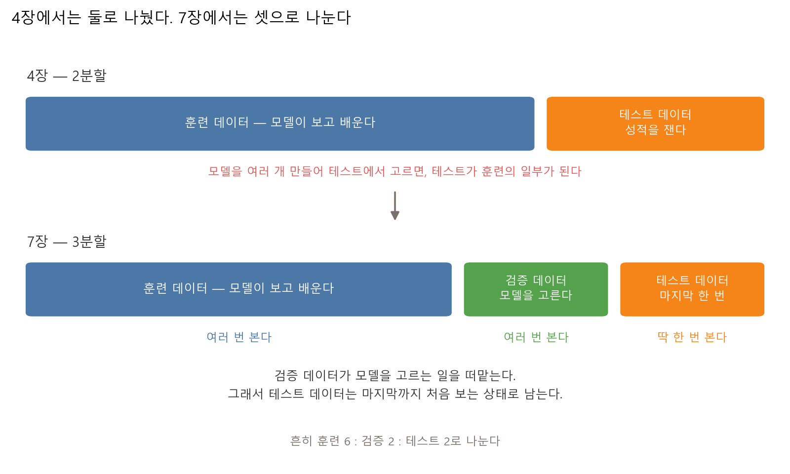
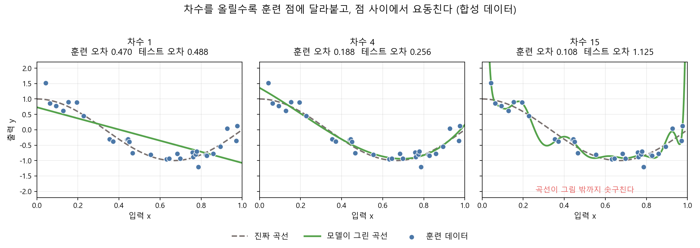
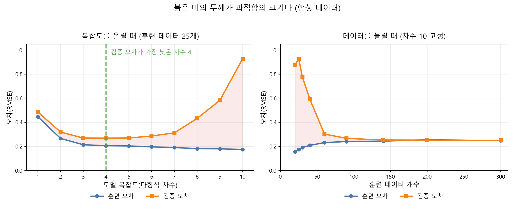

# 제7장 과적합과 일반화 — 외운 모델과 이해한 모델

---

## [전반부] 이론 강의
---

### 학습 목표

- 과적합이 무엇인지 외운 모델과 이해한 모델의 차이로 설명한다
- 훈련 성능과 검증 성능의 간격을 보고 과적합을 알아챈다
- 검증 데이터가 왜 따로 필요한지, 테스트 데이터와 무엇이 다른지 설명한다
- 모델 복잡도를 올릴 때 훈련 오차와 검증 오차가 각각 어디로 움직이는지 말한다
- 과적합을 고치는 네 가지 방법을 구분하고, 각각이 어느 그림에 대응하는지 안다

4장 실습 4.1에 이상한 결과가 하나 남아 있다. 훈련 데이터에서는 사람이 눈대중으로 그은 선(0.902)이 모델이 찾은 선(0.893)보다 성적이 좋았는데, 테스트 데이터에서는 순서가 뒤집혔다(0.896 대 0.938). 그때는 "훈련 성적과 테스트 성적은 다를 수 있다"만 확인하고 넘어갔다. 이번 장에서 그 뒤집힘의 이름을 붙이고, 왜 그런 일이 벌어지는지 손으로 확인한다.

---

### 1. 외운 모델과 이해한 모델

#### 1-1. 시험 범위를 통째로 외운 학생

시험 공부를 두 가지 방식으로 한 학생을 생각해 본다.

○ **A 학생** — 기출문제 100개의 답을 통째로 외웠다
  - 기출문제를 다시 풀면 100점이다
  - 숫자만 바꾼 새 문제를 주면 손도 못 댄다

○ **B 학생** — 기출문제를 풀며 원리를 익혔다
  - 기출문제에서 92점이다. 계산 실수로 몇 개 틀렸다
  - 새 문제에서도 90점 근처가 나온다

모델도 똑같이 나뉜다. 훈련 데이터에 답을 맞추는 데만 매달린 모델은 A 학생이 된다. 이것을 **과적합(overfitting)** 이라고 부른다. 훈련 데이터에 지나치게(over) 맞춰졌다(fit)는 뜻이다.

반대쪽 실패도 있다. 아예 아무것도 못 배운 상태다. 이것이 **과소적합(underfitting)** 이다. 훈련 데이터에서도 못 맞추고 새 데이터에서도 못 맞춘다.

#### 1-2. 세 가지 상태를 한 그림에



**그림 7.1** 같은 점 10개에 서로 다른 선을 맞춘 결과 — 왼쪽은 못 따라가고, 오른쪽은 점 하나하나를 외운다

세 그림 모두 같은 데이터를 쓴다. 달라진 것은 모델에게 허락한 자유도뿐이다.

○ **과소적합(왼쪽)** — 직선 하나만 그릴 수 있게 했다
  - 데이터가 언덕 모양인데 직선으로는 언덕을 표현할 방법이 없다
  - 훈련 데이터도 못 맞추고, 새 데이터도 못 맞춘다

○ **알맞음(가운데)** — 완만한 곡선까지 그릴 수 있게 했다
  - 점을 전부 지나지는 않는다. 점 몇 개는 곡선에서 벗어나 있다
  - 그런데 데이터 뒤에 숨은 흐름(회색 점선)은 잘 따라간다

○ **과적합(오른쪽)** — 마음껏 구부릴 수 있게 했다
  - 점을 하나도 빠짐없이 지나간다. 훈련 오차가 0에 가깝다
  - 대신 점과 점 사이에서 위아래로 요동친다. 그 요동은 데이터에 섞인 **잡음을 외운 흔적**이다

여기서 핵심을 하나 정리한다. 가운데 그림의 곡선은 점을 다 지나지 않는다. 점을 다 지나는 것은 오른쪽 그림이다. 그런데 새 데이터에서 잘하는 쪽은 가운데다. **훈련 데이터를 완벽하게 맞추는 것이 목표가 아니다.**

#### 1-3. 일반화

모델이 처음 보는 데이터에서도 제 성능을 내는 것을 **일반화(generalization)** 라고 부른다. 이 과목에서 만드는 모든 모델의 진짜 목표가 일반화다.

훈련 데이터의 성적은 목표가 아니라 중간 점검이다. 시험을 잘 보려고 공부하는 것이지, 연습 문제를 잘 풀려고 공부하는 것이 아니다.

○ **체크 질문**
  - 훈련 정확도 100%인 모델을 보고 좋아해야 하는가
  - 훈련 정확도가 낮은데 테스트 정확도가 높은 모델이 나올 수 있는가

---

### 2. 과적합은 어떻게 알아채는가

#### 2-1. 숫자 하나로는 못 알아챈다

과적합을 판정하는 방법은 단순하다. **두 숫자를 나란히 놓고 간격을 본다.**

훈련 성능 하나만 보면 과적합인지 아닌지 알 방법이 전혀 없다. 훈련 오차 0.10이 좋은 값인지 나쁜 값인지, 비교 상대 없이는 판정이 성립하지 않는다.

○ **판정 규칙**
  - 훈련 성능은 좋은데 검증 성능이 나쁘다 → 과적합
  - 훈련 성능도 나쁘고 검증 성능도 나쁘다 → 과소적합
  - 둘 다 좋고 간격도 작다 → 지금은 이대로 둔다

#### 2-2. 복잡도를 올릴 때 두 곡선이 갈라진다

모델을 조금씩 복잡하게 만들면서 두 성능을 계속 재면 다음 모양이 나온다.



**그림 7.2** 훈련 오차는 계속 내려가지만 검증 오차는 어느 지점부터 다시 올라간다

○ **훈련 오차(파란 선)** — 복잡하게 만들수록 계속 내려간다
  - 자유도를 더 주면 훈련 데이터에 더 맞출 수 있으니 당연하다
  - 그래서 훈련 오차는 언제 멈춰야 할지 알려주지 못한다

○ **검증 오차(주황 선)** — 내려가다가 어느 지점부터 다시 올라간다
  - 올라가기 시작하는 지점 앞은 아직 덜 배운 상태다(과소적합 구역)
  - 올라가기 시작한 뒤는 잡음을 외우기 시작한 상태다(과적합 구역)
  - 검증 오차가 가장 낮은 지점이 멈출 곳이다

○ **두 곡선 사이의 간격** — 이 간격이 과적합의 크기다
  - 간격이 벌어진다는 말은 "훈련 데이터에만 통하는 것을 배우고 있다"는 뜻이다
  - 실습 7.2에서 이 간격을 숫자로 직접 잰다

이 그림은 개념 도식이다. 실제로 재면 곡선이 더 울퉁불퉁하다. 실습 7.2에서 실제로 잰 곡선을 본다.

---

### 3. 검증 데이터가 필요한 이유

#### 3-1. 4장에서는 둘로 나눴다

4장에서 데이터를 훈련과 테스트 둘로 나눴다. 그때는 모델이 하나뿐이었다. 로지스틱 회귀 하나를 학습시키고 테스트에서 성적을 쟀다. 이 방식은 문제가 없다.

문제는 모델을 **여러 개 만들어 그중 하나를 고를 때** 생긴다.

차수 1부터 10까지 열 개 모델을 만들었다고 하자. 테스트 데이터에서 열 개를 다 재보고 가장 좋은 것을 골랐다. 이렇게 고른 모델의 테스트 성적은 실력인가.

아니다. 열 번 시험을 쳐서 가장 잘 나온 점수만 골라 적은 것과 같다. 테스트 데이터를 보고 모델을 골랐으므로, **테스트 데이터가 학습 과정의 일부가 되어 버렸다.** 그 점수는 실제 성능보다 높게 나온다.

#### 3-2. 그래서 셋으로 나눈다



**그림 7.3** 4장의 2분할과 7장의 3분할 — 검증 데이터가 모델을 고르는 일을 떠맡는다

**표 7.1** 세 갈래 데이터가 각각 맡는 일

| 데이터 | 하는 일 | 모델이 보는 횟수 |
|---|---|---|
| 훈련(train) | 모델의 가중치를 정한다 | 학습 내내 계속 본다 |
| 검증(validation) | 여러 모델 중 하나를 고른다. 언제 멈출지 정한다 | 모델을 고를 때마다 본다 |
| 테스트(test) | 고른 모델의 최종 성적을 잰다 | 맨 마지막에 딱 한 번 |

○ **나누는 비율**
  - 흔히 훈련 6 : 검증 2 : 테스트 2로 나눈다
  - 데이터가 아주 많으면 검증과 테스트 비율을 더 낮춰도 된다

○ **테스트 데이터를 대하는 태도**
  - 테스트 성적을 보고 모델을 고치면, 그 순간 테스트는 검증이 되어 버린다
  - 고칠 것이 생기면 검증 데이터로 돌아가서 고친다
  - 테스트 데이터는 "실제 세상에 내놓기 직전 한 번 재는 자"로 남겨 둔다

○ **데이터가 적을 때**
  - 100개짜리 데이터를 셋으로 나누면 검증에 20개밖에 안 돌아간다. 20개로 잰 성적은 못 믿는다
  - 이럴 때 교차검증(cross-validation)을 쓴다. 데이터를 여러 조각으로 나눠 돌아가며 검증에 쓰는 방법이다
  - 이 과목에서는 이름만 알고 넘어간다

---

### 4. 모델 복잡도 — 무엇을 돌리는 손잡이인가

모델 복잡도는 "모델이 표현할 수 있는 모양이 얼마나 다양한가"다. 자유도가 크면 복잡한 모델이다.

**표 7.2** 모델마다 복잡도를 조절하는 손잡이가 다르다

| 모델 | 복잡도 손잡이 | 올리면 벌어지는 일 |
|---|---|---|
| 다항식 회귀 | 차수 | 곡선이 더 많이 구부러진다 |
| 신경망 | 층 수, 층마다의 뉴런 수 | 표현할 수 있는 경계 모양이 늘어난다 |
| 결정트리 | 트리 깊이 | 조건문이 더 잘게 갈라진다 |
| KNN | 이웃 수 K (반대 방향) | K를 **줄이면** 복잡해진다 |

이 장의 실습에서는 다항식 차수를 손잡이로 쓴다. 차수 하나만 바꿔도 그림이 눈에 띄게 달라지기 때문이다. 신경망의 층 수를 늘리는 것과 원리는 같다.

○ **복잡한 모델이 나쁜 것은 아니다**
  - 데이터가 충분히 많으면 복잡한 모델이 더 잘한다. 실습 7.2에서 이것을 확인한다
  - 문제는 데이터에 비해 모델이 복잡할 때 생긴다
  - "복잡도가 데이터 양에 비해 적당한가"가 질문이지, "복잡도가 낮은가"가 질문이 아니다

○ **자주 하는 실수**
  - 성능이 안 나오면 일단 층을 더 쌓는다. 훈련 성능만 올라가고 검증 성능은 내려간다
  - 손잡이를 돌리기 전에 두 성능을 먼저 재야 어느 방향으로 돌릴지 알 수 있다

---

### 5. 과적합을 고치는 네 가지 방법

#### 5-1. 데이터를 늘린다

원인을 직접 없애는 방법이다. 잡음을 외우려면 외울 잡음이 적어야 한다. 데이터가 많아지면 잡음이 서로 상쇄되어 모델이 외울 것이 없어진다.

실습 7.2에서 같은 복잡도를 유지한 채 데이터만 늘렸을 때 두 곡선의 간격이 어떻게 좁아지는지 숫자로 확인한다.

○ **한계**
  - 데이터를 새로 모으는 데 돈과 시간이 든다
  - 이미지 데이터라면 좌우 뒤집기·자르기·밝기 조절로 데이터를 늘리는 방법이 있다. 데이터 증강(augmentation)이라고 부른다. 9장에서 다시 나온다

#### 5-2. 모델을 줄인다

복잡도 손잡이를 반대 방향으로 돌린다. 차수를 낮추거나, 층을 빼거나, 뉴런 수를 줄인다.

검증 오차가 가장 낮은 지점까지 내려오면 된다. 그 지점을 찾는 방법이 실습 7.2의 복잡도 곡선이다.

○ **한계**
  - 너무 줄이면 과소적합으로 넘어간다
  - 검증 오차가 다시 올라가기 시작하면 너무 줄인 것이다

#### 5-3. 정규화 — 가중치가 커지지 못하게 막는다

모델 크기는 그대로 두고, 학습 과정에 제약을 하나 건다.

과적합된 모델의 가중치를 열어 보면 값이 크다. 그림 7.1의 오른쪽 곡선이 위아래로 크게 요동치려면 계수가 커야 하기 때문이다. 그래서 학습할 때 손실에 항을 하나 더한다.

```
새 손실 = 원래 손실 + λ × (가중치를 제곱해서 다 더한 값)
```

모델은 두 가지를 동시에 줄여야 한다. 데이터를 맞추는 일과 가중치를 작게 유지하는 일이다. 잡음 하나를 맞추려고 가중치를 크게 키우면 두 번째 항이 늘어나서 손해다. 그래서 정말 필요한 만큼만 가중치를 쓴다.

λ는 두 목표의 비중을 정하는 값이다. λ가 크면 가중치를 작게 유지하는 쪽에 힘이 실리고, λ가 0이면 정규화가 없는 것과 같다. 위 식처럼 가중치를 제곱해서 더하는 방식을 L2 정규화라고 부른다.[^google-reg]

○ **6장과의 연결**
  - 6장에서 손실함수를 줄이는 방향으로 가중치를 움직였다
  - 정규화는 그 손실함수 자체에 항을 하나 더하는 일이다. 경사하강법은 그대로다

#### 5-4. dropout — 뉴런 일부를 무작위로 쉬게 한다

신경망에서 쓰는 방법이다. 학습할 때마다 뉴런 일부를 무작위로 골라 그 회차 동안 꺼 둔다. 예를 들어 뉴런의 20%를 끈다면, 매 회차마다 꺼지는 뉴런이 달라진다. 이렇게 하면 모델이 특정 뉴런 하나에 의존하지 못한다. 언제 꺼질지 모르는 뉴런에 답을 몽땅 맡길 수 없기 때문에, 여러 뉴런이 나눠서 정보를 담게 된다. 조별 과제에서 매번 다른 사람이 빠진다면 한 사람에게 일을 몰아줄 수 없는 것과 같은 구조다. 학습이 끝나고 실제로 예측할 때는 뉴런을 끄지 않고 전부 쓴다. 이 과목에서는 dropout을 코드로 구현하지 않는다. 직관만 알고 넘어간다.

**표 7.3** 네 방법 비교

| 방법 | 무엇을 바꾸는가 | 이 장에서 확인하는 방법 |
|---|---|---|
| 데이터 늘리기 | 데이터 양 | 실습 7.2 오른쪽 그림 |
| 모델 줄이기 | 모델 구조 | 실습 7.2 왼쪽 그림 |
| 정규화 | 손실함수 | 개념만. TensorFlow Playground에서 조작 |
| dropout | 학습 과정 | 개념만 |

---

### 6. 4장의 뒤집힘을 다시 읽는다

이제 도입에서 꺼낸 4장 결과를 해석할 수 있다.

**표 7.4** 실습 4.1의 두 선

| 방법 | 훈련 정확도 | 테스트 정확도 |
|---|---:|---:|
| 내가 그은 선 | 0.902 | 0.896 |
| 모델이 찾은 선 | 0.893 | 0.938 |

_출처: `practice/chapter4/results/4-1-simple-classifier.log`_

○ **훈련에서 사람이 앞선 이유**
  - 사람이 그은 선이 훈련 데이터 112명에 우연히 조금 더 잘 맞았다
  - 훈련 정확도 차이 0.009는 112명 중 한 명 차이 수준이다

○ **테스트에서 뒤집힌 이유**
  - 사람의 선은 훈련에서 테스트로 넘어가며 0.902 → 0.896으로 내려갔다
  - 모델의 선은 0.893 → 0.938로 올라갔다
  - 두 선 모두 직선이라 복잡도가 같다. 그래서 이 뒤집힘은 심한 과적합이 아니라 표본이 갈린 결과에 가깝다

○ **여기서 배울 것**
  - 훈련 성적 0.009 차이로 어느 모델이 나은지 판정할 수 없다
  - 4장에서는 데이터를 훈련 112명과 테스트 48명 둘로만 나눴다. 두 선 중 하나를 테스트 성적으로 골랐다면, 그 성적은 실제 성능보다 높게 나온다
  - 제대로 하려면 검증 데이터를 따로 떼어 두 선 중 하나를 고르고, 테스트는 마지막에 한 번만 써야 한다

---

### 7. 직접 움직여 보는 웹 자료

수업에서 다 보여줄 수 없는 그림은 아래 자료로 보충한다. 모두 무료이고, 아래 설명은 각 페이지를 열어 확인한 내용이다.

| 자료 | 무엇을 볼 수 있는가 | 주소 |
|---|---|---|
| MLU-Explain, Bias-Variance Tradeoff | K 값을 조절하면 결정 경계가 실시간으로 바뀐다. K가 작으면 경계가 잘게 구불거리고, 크면 지나치게 평평해진다 | https://mlu-explain.github.io/bias-variance/ |
| Google 머신러닝 단기집중과정(한국어), 과적합 | 적합하지 않음·적합·과적합 세 상태를 한 그래프로 비교하고, 훈련 손실과 검증 손실을 겹쳐 그린 일반화 곡선을 보여준다 | https://developers.google.com/machine-learning/crash-course/overfitting/overfitting?hl=ko |
| Google 머신러닝 단기집중과정(한국어), 정규화 | L2 정규화를 가중치 제곱합으로 정의하고, 정규화율을 높였을 때와 낮췄을 때 가중치 분포가 어떻게 달라지는지 히스토그램 두 장으로 비교한다 | https://developers.google.com/machine-learning/crash-course/overfitting/regularization?hl=ko |
| TensorFlow Playground | Regularization을 None·L1·L2 중에서 고르고, Noise와 훈련·테스트 데이터 비율을 조절하며 Training loss와 Test loss가 벌어지는 것을 본다 | https://playground.tensorflow.org/ |

○ TensorFlow Playground는 6장에서 학습률을 바꿔 보는 데 썼다. 이번에는 다른 손잡이를 돌린다. **Ratio of training to test data**를 10%까지 내리고, **Noise**를 50까지 올린 뒤 층을 여러 개 쌓으면 Training loss만 내려가고 Test loss가 따라오지 않는 상태를 만들 수 있다. 그 상태에서 Regularization을 L2로 바꾸면 두 값이 어떻게 달라지는지 본다

○ MLU-Explain의 K 조절은 표 7.2의 마지막 줄과 짝이 된다. K를 줄이면 복잡해진다는 말이 눈으로 확인된다

---

## [후반부] 실습
---

두 가지를 한다. 첫 번째는 과적합을 일부러 만들어 눈으로 보는 실습이고, 두 번째는 과적합을 숫자로 진단하고 두 가지 처방을 적용하는 실습이다.

#### 실행 환경

```bash
cd practice/chapter7
python -m pip install -r ../requirements.txt
```

필요한 패키지는 numpy, pandas, matplotlib, scikit-learn이다. GPU는 필요 없다. 두 실습 모두 노트북에서 몇 초 안에 끝난다.

두 실습의 데이터는 모두 **컴퓨터로 만든 합성 데이터**다. `cos(1.5πx)` 곡선 위에 잡음을 섞어 점을 뿌렸다. 모델은 이 곡선을 모르는 상태로 점만 보고 곡선을 찾는다.

---

### 실습 7.1: 일부러 과적합 만들기

#### 실습 목표

- 모델 복잡도를 올릴 때 곡선 모양이 어떻게 달라지는지 눈으로 본다
- 훈련 오차와 테스트 오차가 반대 방향으로 움직이는 것을 표로 확인한다
- 과적합된 곡선이 훈련 점 사이에서 어디까지 솟구치는지 숫자로 잰다

#### 데이터

점 하나가 관측 하나다. 가로축은 입력 x, 세로축은 출력 y다. 뒤에 숨은 진짜 곡선은 `cos(1.5πx)`이고, 여기에 잡음을 섞었다. 훈련 데이터는 30개, 테스트 데이터는 200개다.

차수 1·4·15라는 조합은 scikit-learn 공식 예제 Underfitting vs. Overfitting에서 쓰는 조합과 같다.[^sklearn-uo] 같은 구성을 우리 데이터로 다시 만든다.

#### 실행 명령

```bash
cd practice/chapter7/code
python 7-1-overfit.py
```

#### 핵심 코드

파일 맨 위에 학생이 바꿀 세 줄이 있다.

```python
DEGREES = [1, 4, 15]      # 맞춰 볼 다항식 차수 세 개
NOISE_LEVEL = 0.25        # 데이터에 섞는 잡음의 크기. 0으로 하면 잡음이 없다
N_SAMPLES = 30            # 훈련 데이터 점의 개수
```

차수를 올리는 부분은 다음과 같다. `PolynomialFeatures`가 x, x², …, x^degree 열을 만들고, `LinearRegression`이 각 열에 붙는 계수를 찾는다.

```python
model = make_pipeline(
    PolynomialFeatures(degree=degree, include_bias=False),
    StandardScaler(),
    LinearRegression(),
)
model.fit(x.reshape(-1, 1), y)
```

_전체 코드는 `practice/chapter7/code/7-1-overfit.py` 참고_

#### 실행 결과

```text
데이터: 컴퓨터로 만든 합성 데이터(실제 관측값 아님)
훈련 데이터 30개, 테스트 데이터 200개
잡음 크기 NOISE_LEVEL = 0.25
맞춰 본 차수: [1, 4, 15]

=== 차수별 오차 (RMSE, 작을수록 잘 맞춘 것) ===
  차수        훈련오차        테스트오차         차이
   1      0.4703       0.4877     0.0173
   4      0.1882       0.2562     0.0680
  15      0.1077       1.1247     1.0171

테스트 오차가 가장 작은 차수: 4 (테스트 오차 0.2562)
```

_출처: `practice/chapter7/results/7-1-overfit.log`_



**그림 7.4** 회색 점선이 진짜 곡선, 초록 실선이 모델이 그린 곡선. 차수 15의 곡선은 그림 위쪽 밖으로 나간다

**표 7.5** 차수를 올릴 때 곡선이 어디까지 벌어지는가

| 차수 | 곡선 최솟값 | 곡선 최댓값 |
|---:|---:|---:|
| 1 | -1.08 | 0.73 |
| 4 | -0.94 | 1.36 |
| 15 | -0.92 | 24.76 |

_출처: `practice/chapter7/results/7-1-overfit.log`_

#### 결과 읽기

○ **차수 1 — 과소적합**
  - 훈련 오차 0.4703, 테스트 오차 0.4877이다. 둘 다 크고, 차이는 0.0173으로 작다
  - 두 오차가 나란히 크면 과적합이 아니라 과소적합이다. 모델이 아직 아무것도 못 배웠다
  - 곡선이 -1.08에서 0.73 사이만 움직인다. 언덕을 표현할 방법이 없어서 대각선 하나로 지나간다

○ **차수 4 — 알맞음**
  - 훈련 오차 0.1882, 테스트 오차 0.2562다. 테스트 오차가 셋 중 가장 작다
  - 두 오차의 차이 0.0680은 차수 1보다 크다. 간격이 조금 벌어졌지만 아직 감당할 수준이다

○ **차수 15 — 과적합**
  - 훈련 오차는 0.1077로 가장 작다. 세 모델 중 훈련 데이터를 가장 잘 맞췄다
  - 그런데 테스트 오차가 1.1247이다. 차수 1(0.4877)의 두 배가 넘는다
  - 두 오차의 차이가 1.0171이다. 차수 4의 0.0680과 비교하면 15배 차이다

○ **곡선이 24.76까지 솟구쳤다**
  - 진짜 곡선은 -1.00에서 1.00 사이만 움직인다. 그런데 차수 15의 곡선은 최댓값이 24.76이다
  - 그림 7.4의 오른쪽 판에서 초록 선이 위쪽으로 사라지는 부분이 그곳이다
  - 훈련 점이 드문 구간에서 곡선이 크게 튄 결과다. 훈련 점만 보고는 이 문제를 알 수 없다

○ **훈련 오차만 보고 모델을 고르면 차수 15를 고른다**
  - 훈련 오차 순위는 15 → 4 → 1이고, 테스트 오차 순위는 4 → 1 → 15다
  - 두 순위가 완전히 다르다. 이것이 과적합의 정의다

#### 해 보기

세 상수를 바꿔 다시 실행한다.

1. `N_SAMPLES`를 16으로 줄인다. 차수 15의 곡선이 훈련 점 16개를 전부 통과한다. 훈련 오차가 어디까지 내려가는가
2. `NOISE_LEVEL`을 0.0으로 바꾼다. 잡음이 없으면 차수 15도 과적합하는가. 왜 그런가
3. `N_SAMPLES`를 300으로 올린다. 차수 15의 테스트 오차가 어떻게 달라지는가. 이것이 실습 7.2의 처방 중 하나다
4. `DEGREES`를 `[1, 2, 3, 4, 5]`로 바꾼다. 알맞은 차수가 정확히 어디인지 좁혀 본다

○ 확인할 것은 세 값 중 **어느 것을 바꿔야 두 오차의 차이가 줄어드는지**다

---

### 실습 7.2: 과적합 진단하고 고치기

#### 실습 목표

- 복잡도를 x축에 놓고 훈련 곡선과 검증 곡선이 갈라지는 지점을 직접 찾는다
- 같은 모델에 데이터만 늘렸을 때 두 곡선이 어떻게 달라지는지 본다
- 검증 데이터로 모델을 고르고, 테스트 데이터를 마지막에 딱 한 번 쓰는 순서를 따라 해 본다

#### 데이터

같은 합성 곡선 데이터 1000개를 세 갈래로 나눈다.

| 갈래 | 개수 | 쓰는 곳 |
|---|---:|---|
| 훈련 후보 | 700 | 여기서 필요한 만큼 잘라 쓴다 |
| 검증 | 200 | 차수를 고른다 |
| 테스트 | 100 | 맨 마지막에 한 번 |

훈련 데이터를 한 번만 뽑으면 어느 점이 뽑혔는지에 따라 오차가 들쭉날쭉하다. 그래서 같은 크기의 훈련 데이터를 최대 9번 다르게 뽑아 재고, 그중 가운데 값(중앙값)을 쓴다.

#### 실행 명령

```bash
cd practice/chapter7/code
python 7-2-diagnose.py
```

#### 핵심 코드

파일 맨 위에 학생이 바꿀 다섯 줄이 있다.

```python
MAX_DEGREE = 10          # 왼쪽 그림에서 차수를 1부터 여기까지 올린다
FIT_SIZE = 25            # 왼쪽 그림에서 쓰는 훈련 데이터 개수
LEARNING_DEGREE = 10     # 오른쪽 그림에서 고정해 두는 차수(복잡한 모델)
NOISE_LEVEL = 0.25       # 데이터에 섞는 잡음의 크기
N_REPEATS = 9            # 같은 크기로 훈련 데이터를 몇 번 다르게 뽑아 볼 것인가
```

훈련 데이터를 여러 번 뽑아 중앙값을 내는 부분은 다음과 같다.

```python
repeats = max(1, min(N_REPEATS, len(x_pool) // size))
for r in range(repeats):
    start = r * size
    x_fit = x_pool[start:start + size]
    y_fit = y_pool[start:start + size]
    model = fit_polynomial(degree, x_fit, y_fit)
    train_scores.append(rmse(model, x_fit, y_fit))
    val_scores.append(rmse(model, x_val, y_val))

return float(np.median(train_scores)), float(np.median(val_scores)), repeats
```

_전체 코드는 `practice/chapter7/code/7-2-diagnose.py` 참고_

#### 실행 결과

```text
전체 1000개 = 훈련 후보 700개 + 검증 200개 + 테스트 100개
잡음 크기 NOISE_LEVEL = 0.25
같은 크기로 훈련 데이터를 최대 9번 다르게 뽑아 중앙값을 쓴다

=== 진단 1. 복잡도를 올릴 때 (훈련 데이터 25개 고정) ===
          차수        훈련오차        검증오차        간격      뽑은횟수
           1      0.4467      0.4872    0.0405         9
           2      0.2665      0.3194    0.0529         9
           3      0.2137      0.2694    0.0556         9
           4      0.2060      0.2687    0.0627         9
           5      0.2036      0.2696    0.0660         9
           6      0.1963      0.2864    0.0901         9
           7      0.1904      0.3123    0.1219         9
           8      0.1815      0.4327    0.2512         9
           9      0.1801      0.5829    0.4028         9
          10      0.1744      0.9285    0.7541         9

검증 오차가 가장 낮은 차수: 4 (검증 오차 0.2687)
```

_출처: `practice/chapter7/results/7-2-diagnose.log`_

```text
=== 진단 2. 데이터를 늘릴 때 (차수 10 고정) ===
      훈련데이터수        훈련오차        검증오차        간격      뽑은횟수
          20      0.1551      0.8788    0.7237         9
          25      0.1744      0.9285    0.7541         9
          30      0.1907      0.7758    0.5850         9
          40      0.2083      0.5945    0.3862         9
          60      0.2317      0.3025    0.0708         9
          90      0.2406      0.2668    0.0262         7
         140      0.2444      0.2530    0.0086         5
         200      0.2542      0.2520   -0.0021         3
         300      0.2486      0.2500    0.0014         2
```

_출처: `practice/chapter7/results/7-2-diagnose.log`_



**그림 7.5** 왼쪽은 복잡도를 올릴 때, 오른쪽은 데이터를 늘릴 때. 붉은 띠의 두께가 두 곡선의 간격이다

**표 7.6** 두 처방을 적용한 결과

| 처방 | 훈련 오차 | 검증 오차 | 간격 |
|---|---:|---:|---:|
| 없음 (차수 10, 데이터 25개) | 0.1744 | 0.9285 | 0.7541 |
| 모델을 단순하게 (차수 4, 데이터 25개) | 0.2060 | 0.2687 | 0.0627 |
| 데이터를 늘림 (차수 10, 300개) | 0.2486 | 0.2500 | 0.0014 |

_출처: `practice/chapter7/results/7-2-diagnose.log`_

```text
=== 마지막에 한 번만 쓰는 테스트 데이터 ===
고른 모델: 차수 4, 훈련 후보 700개 전부로 다시 학습
고른 방법: 검증 오차가 가장 낮은 차수를 코드가 골랐다
검증 오차: 0.2427
테스트 오차: 0.2675
```

_출처: `practice/chapter7/results/7-2-diagnose.log`_

#### 결과 읽기

○ **훈련 오차는 끝까지 내려간다**
  - 차수 1에서 0.4467, 차수 10에서 0.1744다. 한 번도 올라가지 않는다
  - 훈련 오차만 보면 차수 10이 최고다. 훈련 오차는 멈출 지점을 알려주지 못한다

○ **검증 오차는 차수 4에서 바닥을 친다**
  - 0.4872 → 0.2687(차수 4) → 0.9285(차수 10)로 내려갔다 올라간다
  - 다만 차수 3(0.2694), 4(0.2687), 5(0.2696)는 사실상 같은 값이다. 세 번째 자리에서 갈린다
  - 이 구간에서는 어느 차수를 골라도 성능 차이가 없다

○ **그래서 코드는 차수 4를 골랐고, 차수 3을 골라도 된다**
  - 코드는 검증 오차가 가장 낮은 차수를 그대로 고른다. 그 값이 차수 4다
  - 차이가 0.0007밖에 안 나는 구간에서 이 규칙은 사실상 동전 던지기다. 훈련 데이터를 다시 뽑으면 순위가 바뀔 수 있다
  - 성능이 같다면 **더 단순한 쪽**을 고르는 편이 낫다. 차수가 낮을수록 데이터가 바뀌었을 때 덜 흔들린다
  - 어느 쪽을 골랐는지보다, 세 차수가 사실상 같다는 것을 읽어 내는 쪽이 중요하다. 아래 "해 보기" 5번에서 차수 3으로 바꿔 테스트 오차를 직접 재 본다

○ **간격이 벌어지는 속도가 빨라진다**
  - 차수 1→4 구간에서 간격은 0.0405 → 0.0627로 천천히 는다
  - 차수 7→10 구간에서는 0.1219 → 0.7541로 여섯 배가 된다
  - 간격은 천천히 벌어지다가 어느 지점부터 급히 커진다. 이 구간에 들어가기 전에 멈춘다

○ **데이터를 늘리면 같은 모델이 정상으로 돌아온다**
  - 차수 10은 데이터 25개일 때 검증 오차 0.9285였다. 쓸 수 없는 모델이다
  - 같은 차수 10에 데이터를 300개 준 결과, 검증 오차가 0.2500으로 내려갔다
  - 모델을 바꾸지 않았다. 데이터만 열두 배로 늘렸다

○ **데이터 200개에서 간격이 음수(-0.0021)다**
  - 검증 오차가 훈련 오차보다 낮게 나왔다는 뜻이다. 이상해 보이지만 정상이다
  - 두 값은 서로 다른 데이터에서 잰 것이다. 간격이 0에 가까워지면 어느 쪽이 조금 더 낮은지는 표본에 따라 갈린다
  - 음수가 나왔다는 것은 과적합이 사라졌다는 신호이지, 계산이 틀렸다는 신호가 아니다

○ **훈련 오차가 올라가는 것이 나쁜 신호가 아니다**
  - 오른쪽 그림에서 훈련 오차는 0.1551에서 0.2486으로 **올라간다**
  - 데이터가 많아지면 전부 외우기가 어려워지니 당연하다
  - 봐야 할 것은 훈련 오차의 절대값이 아니라 검증 오차와의 간격이다. 그 간격은 0.7237에서 0.0014로 줄었다

○ **두 처방 중 어느 것을 고르는가**
  - 데이터를 더 구할 수 있으면 데이터를 늘린다. 검증 오차 0.2500이 차수 4의 0.2687보다 낮다
  - 데이터를 더 구할 수 없으면 모델을 줄인다. 가진 25개로 할 수 있는 최선이 차수 4다

○ **마지막에 테스트를 한 번 쓴다**
  - 검증 데이터로 차수 4를 골랐다. 검증 데이터를 보고 고른 만큼, 검증 오차 0.2427은 실제 성능보다 낮게 나온다
  - 그래서 한 번도 안 쓴 테스트 데이터로 다시 잰다. 0.2675다
  - 검증 0.2427보다 테스트 0.2675가 0.0248 높다. 이 차이가 검증 데이터를 보고 고른 값이라 깎여 있던 몫이다

#### 해 보기

다섯 상수를 바꿔 다시 실행한다.

1. `FIT_SIZE`를 100으로 올린다. 검증 오차가 가장 낮은 차수가 4에서 어디로 옮겨가는가
2. `NOISE_LEVEL`을 0.05로 낮춘다. 잡음이 적으면 높은 차수도 견디는가
3. `MAX_DEGREE`를 15로 올린다. 차수 10 이후 간격이 어디까지 벌어지는가
4. `N_REPEATS`를 1로 낮춘다. 곡선이 얼마나 들쭉날쭉해지는가. 왜 여러 번 뽑아야 하는지 확인한다
5. `FINAL_DEGREE`를 `3`으로 바꾼다. 차수 4를 골랐을 때의 테스트 오차 0.2675와 얼마나 다른가. 더 단순한 모델을 골라 잃은 것이 있는가

○ 5번에서 두 값의 차이가 작다면, 검증 오차 0.0007 차이로 차수를 정한 것에 큰 뜻이 없었다는 뜻이다

○ 1번과 2번은 같은 결론으로 이어진다. **알맞은 복잡도는 모델 혼자 정하는 값이 아니라 데이터 양과 잡음이 함께 정하는 값이다**

---

### 과제 (LMS 제출)

수업 시간에 실습을 실행했는지만 확인한다. 따로 보고서를 쓰지 않는다.

#### 제출물

두 실습을 실행하면 만들어지는 그림 파일 두 장을 LMS에 올린다.

1. `practice/chapter7/results/overfit_curves.png`
2. `practice/chapter7/results/diagnose_curves.png`

#### 평가 기준

- 두 파일을 올리면 완료로 인정한다. 오차가 얼마인지는 채점하지 않는다
- 상수를 바꿨다면 바뀐 그림이 올라온다. 기본값 그대로여도 인정한다

#### 마감

- 실습 수업일 포함 7일 이내

---

### 핵심 정리

| 개념 | 한 줄 정리 |
|---|---|
| 과적합 | 훈련 데이터의 잡음까지 외운 상태. 훈련 성능은 좋고 새 데이터 성능은 나쁘다 |
| 과소적합 | 훈련 데이터에서도 못 맞추는 상태. 두 성능이 나란히 나쁘다 |
| 일반화 | 처음 보는 데이터에서 제 성능을 내는 것. 모든 모델의 진짜 목표다 |
| 진단 방법 | 훈련 성능과 검증 성능을 나란히 놓고 간격을 본다. 숫자 하나로는 판정이 안 된다 |
| 검증 데이터 | 모델을 고르는 데 쓴다. 테스트로 모델을 고르면 테스트 점수가 부풀려진다 |
| 모델 복잡도 | 낮을수록 좋은 것이 아니다. 데이터 양에 비해 적당한지가 질문이다 |
| 고치는 방법 | 데이터를 늘린다 / 모델을 줄인다 / 정규화 / dropout |
| dropout | 학습할 때 뉴런 일부를 무작위로 쉬게 해서 특정 뉴런에 의존하지 못하게 한다 |

다음 주는 중간 미니 프로젝트다. 직접 만든 모델의 훈련 성능과 검증 성능을 나란히 재고, 실패한 사례를 함께 제출한다.

---

[^google-reg]: Google, "과적합: L2 정규화", 머신러닝 단기집중과정. https://developers.google.com/machine-learning/crash-course/overfitting/regularization?hl=ko (2026년 8월 24일 확인)

[^sklearn-uo]: scikit-learn, "Underfitting vs. Overfitting". https://scikit-learn.org/stable/auto_examples/model_selection/plot_underfitting_overfitting.html (2026년 8월 24일 확인). BSD-3-Clause 라이선스로 공개돼 있다
