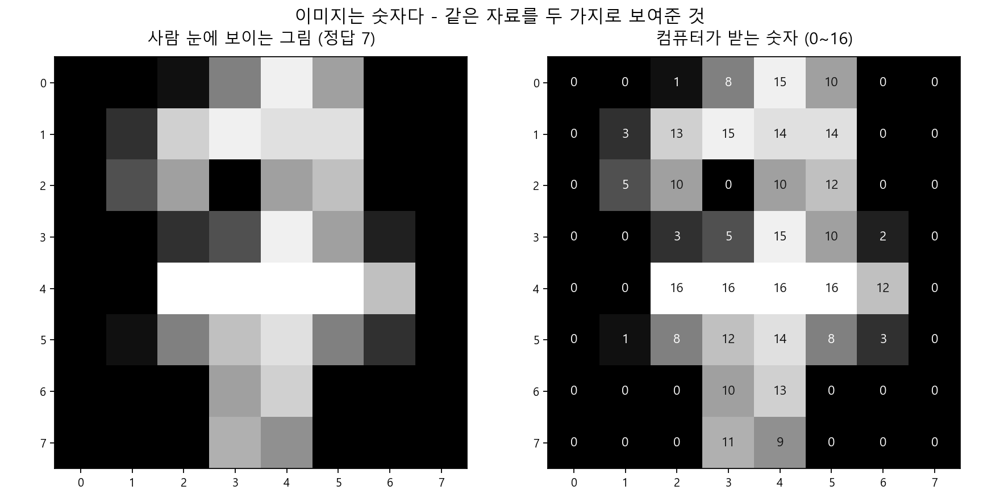
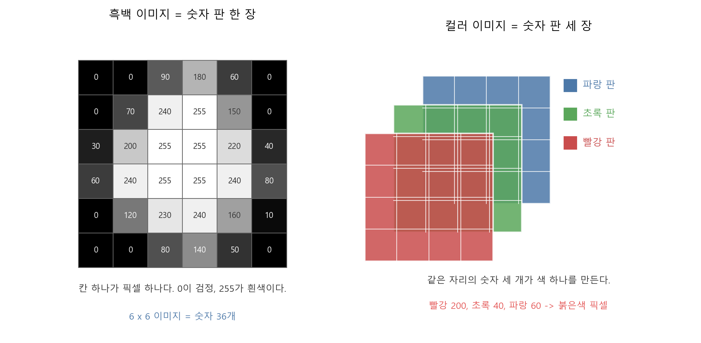
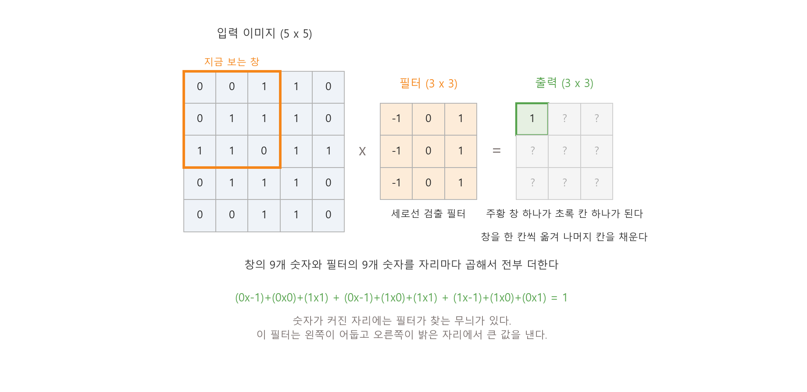
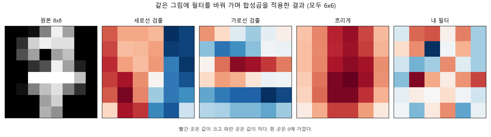
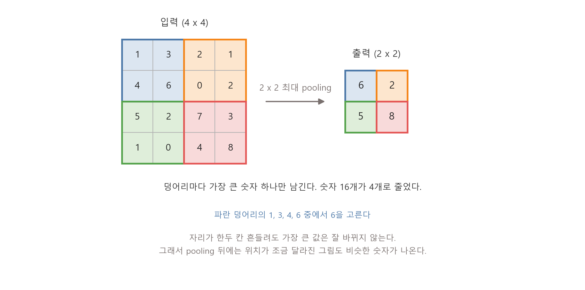

# 제9장 이미지 인식과 CNN — 컴퓨터가 이미지를 보는 방식

---

## [전반부] 이론 강의
---

### 학습 목표

- 이미지 한 장이 컴퓨터에게 어떤 숫자 덩어리인지 설명한다
- 픽셀과 채널을 구분하고, 흑백 이미지와 컬러 이미지가 숫자 판 몇 장인지 말한다
- 이미지를 한 줄로 펴서 넣으면 무엇이 사라지는지 설명한다
- 3x3 필터로 합성곱을 손으로 한 칸 계산한다
- pooling이 크기를 줄이면서 무엇을 남기는지 설명한다

지금까지 다룬 데이터는 표였다. 가로줄 하나가 학생 한 명이었고, 세로줄 하나가 공부 시간이나 수면 시간 같은 특징이었다. 이번 장에서는 이미지를 다룬다. 이미지도 결국 숫자지만, 표와 달리 숫자가 놓인 **자리**에 뜻이 있다. 그 자리를 살려서 계산하는 방법이 합성곱이고, 합성곱을 층으로 쌓은 것이 CNN이다.

○ **이 장에서 하지 않는 것을 먼저 밝힌다**
  - 이 수업에서 CNN을 직접 학습시키지 않는다. `torch`나 `tensorflow`를 쓰지 않는다
  - CNN의 전체 구조는 6절에서 개념으로만 그린다
  - 이 장의 목표는 **합성곱이 무엇을 하는지 손으로 확인하는 것**이다. 필터의 3x3 숫자를 직접 바꿔 결과가 달라지는 것을 보는 데까지 간다

---

### 1. 이미지는 숫자다

이미지 파일을 열면 사람은 그림을 본다. 컴퓨터는 숫자를 받는다. 이 말은 비유가 아니라 그대로 사실이다.

실습 9.1에서 쓰는 데이터는 손글씨 숫자 이미지다. 한 장의 크기는 8 x 8 픽셀이다.

```text
scikit-learn load_digits() - 실제 손글씨를 스캔해 만든 공개 데이터
이미지 장수: 1797장
이미지 한 장의 크기: 8 x 8 픽셀
채널 수: 1 (흑백이므로 숫자 판이 한 장이다)
픽셀값 범위: 0 ~ 16
이미지 한 장이 숫자 64개다
```

_출처: `practice/chapter9/results/9-1-image-is-numbers.log`_

이 데이터는 합성 데이터가 아니다. 실제로 사람이 쓴 숫자를 스캔해 만든 공개 데이터이고, scikit-learn 안에 들어 있어서 따로 내려받지 않는다.

17번 이미지를 골라 픽셀값을 그대로 찍으면 이렇게 나온다.

```text
         0    1    2    3    4    5    6    7
     ----------------------------------------
  0 |    0    0    1    8   15   10    0    0
  1 |    0    3   13   15   14   14    0    0
  2 |    0    5   10    0   10   12    0    0
  3 |    0    0    3    5   15   10    2    0
  4 |    0    0   16   16   16   16   12    0
  5 |    0    1    8   12   14    8    3    0
  6 |    0    0    0   10   13    0    0    0
  7 |    0    0    0   11    9    0    0    0
```

_출처: `practice/chapter9/results/9-1-image-is-numbers.log`_

이 숫자 64개가 이미지의 전부다. 더 있는 것이 없다. 0이 검정이고 16이 흰색이다. 가운데 4번 줄에 16이 넷 이어져 있는데, 그 줄이 밝은 가로획이다. 이 이미지의 정답은 7이다.



**그림 9.1** 왼쪽과 오른쪽은 같은 자료다. 사람은 왼쪽을 보고, 컴퓨터는 오른쪽을 받는다

○ **여기서 확인할 것**
  - 사람이 "7처럼 생겼다"고 느끼는 것과 컴퓨터가 받는 숫자 64개는 같은 대상이다
  - 밝기 차이가 곧 숫자 차이다. 획이 지나간 자리는 값이 크고, 배경은 0이다

---

### 2. 픽셀과 채널

○ **픽셀(pixel)** — 이미지를 이루는 가장 작은 칸 하나
  - 8 x 8 이미지에는 픽셀이 64개 있다
  - 흑백 이미지에서 픽셀 하나는 숫자 하나다. 밝기를 뜻한다

○ **채널(channel)** — 같은 크기의 숫자 판이 몇 장 겹쳐 있는가
  - 흑백은 판이 한 장이다. 채널 수 1
  - 컬러는 판이 세 장이다. 빨강·초록·파랑 각각 한 장씩이고, 채널 수 3



**그림 9.2** 같은 자리에 있는 세 판의 숫자 세 개가 색 하나를 만든다

컬러 이미지에서 어떤 픽셀의 색을 알려면 숫자를 세 개 봐야 한다. 빨강 판에서 200, 초록 판에서 40, 파랑 판에서 60이면 그 자리는 붉은색이다.

크기가 커지면 숫자가 빠르게 늘어난다.

**표 9.1** 이미지 크기와 숫자 개수

| 이미지 | 채널 | 숫자 개수 |
|---|---:|---:|
| 8 x 8 흑백 (실습 데이터) | 1 | 64 |
| 28 x 28 흑백 | 1 | 784 |
| 200 x 200 컬러 | 3 | 120,000 |
| 1000 x 1000 컬러 | 3 | 3,000,000 |

이 표의 숫자는 곱셈 결과일 뿐이다. 그런데 다음 절의 문제가 이 곱셈에서 나온다.

---

### 3. 왜 표로 펴서 넣으면 안 되는가

5장에서 만든 신경망은 입력을 한 줄로 받았다. 이미지를 그 신경망에 넣으려면 8 x 8을 한 줄로 펴야 한다. 위에서부터 줄을 이어 붙이면 숫자 64개짜리 한 줄이 된다.

이렇게 펴는 것을 **평탄화(flatten)**라고 부른다. 실습 9.2가 정확히 이 방식이다. 이 방식으로도 테스트 정확도가 0.933까지 나온다. 그래서 무엇이 빠져 있는지를 먼저 확인한다.

○ **문제 1: 옆칸 관계가 사라진다**
  - 1절의 표에서 4번 줄 2열의 값은 16이다. 그 오른쪽 칸도 16이다. 붙어 있는 두 칸이다
  - 한 줄로 펴면 이 둘은 줄에서도 옆자리에 남는다. 가로 이웃은 살아남는다
  - 그런데 바로 **아래** 칸(5번 줄 2열, 값 8)은 줄에서 8칸 떨어진 자리로 간다. 한 줄이 8칸이기 때문이다. 그림에서는 붙어 있었는데 줄에서는 멀어진다
  - 신경망은 어느 자리와 어느 자리가 이웃인지 알지 못한다. 64개의 순서를 통째로 섞어서 넣어도 신경망은 똑같이 학습한다

○ **문제 2: 위치가 한 칸만 밀려도 입력이 전부 달라진다**
  - 같은 7을 오른쪽으로 한 칸 옮겨 쓰면, 사람 눈에는 같은 7이다
  - 그런데 64개 숫자는 거의 전부 다른 자리로 옮겨간다. 신경망 입장에서는 처음 보는 입력이다
  - 그래서 위치가 조금씩 다른 이미지를 다 보여줘야 배운다

○ **문제 3: 커지면 감당이 안 된다**
  - 200 x 200 컬러 이미지는 숫자 120,000개다
  - 첫 은닉층에 뉴런을 100개만 두어도 가중치가 1,200만 개 필요하다
  - 뉴런 하나가 이미지의 모든 픽셀과 연결되기 때문이다

합성곱을 쓰면 이 셋이 한꺼번에 달라진다. 작은 창으로 **가까운 칸끼리만** 묶어서 계산하고, 같은 창을 이미지 전체에 **똑같이** 옮겨 가며 쓴다. 그래서 옆칸 관계가 살아 있고, 위치가 밀려도 같은 무늬면 같은 반응이 나오고, 숫자 몇 개짜리 작은 필터 하나로 이미지 전체를 훑는다.

---

### 4. 합성곱과 필터

**필터(filter)**는 작은 숫자 판이다. 보통 3 x 3이나 5 x 5를 쓴다. **합성곱(convolution)**은 그 필터를 이미지 위에서 한 칸씩 옮기며, 겹친 숫자끼리 곱해서 전부 더하는 계산이다.



**그림 9.3** 주황 창 안의 숫자 아홉 개와 필터의 숫자 아홉 개를 자리마다 곱해 더하면, 출력의 칸 하나가 채워진다

계산 순서는 세 단계뿐이다.

1. 이미지 왼쪽 위에서 3 x 3 창을 하나 떼어 낸다
2. 창의 아홉 개 숫자와 필터의 아홉 개 숫자를 **자리마다** 곱한 뒤 전부 더한다
3. 그 결과 하나를 출력의 한 칸에 적고, 창을 오른쪽으로 한 칸 옮겨 반복한다

실습 9.1은 이 계산을 로그에 그대로 풀어 찍는다. 아래는 1절의 이미지에서 2행 2열부터 시작하는 창에 세로선 검출 필터를 씌운 결과다.

```text
  이미지 창          필터            곱한 값
    10    0   10   x    -1.0   0.0   1.0   =    -10.0    0.0   10.0
     3    5   15   x    -1.0   0.0   1.0   =     -3.0    0.0   15.0
    16   16   16   x    -1.0   0.0   1.0   =    -16.0    0.0   16.0

  더하기: (10x-1) + (0x0) + (10x1) + (3x-1) + (5x0) + (15x1) + (16x-1) + (16x0) + (16x1)
        = 12.0
```

_출처: `practice/chapter9/results/9-1-image-is-numbers.log`_

#### 4-1. 필터가 무늬를 찾는다

위에서 쓴 필터는 왼쪽 열이 -1, 오른쪽 열이 +1이다. 이 필터에서 큰 값이 나오려면 창의 오른쪽이 밝고 왼쪽이 어두워야 한다. 즉 **세로 방향 경계**가 있는 자리에서 값이 커진다.

필터를 바꾸면 도드라지는 무늬가 바뀐다. 실습 9.1은 네 가지를 적용한다.

**표 9.2** 필터 네 개를 8x8 이미지에 적용한 결과

| 필터 | 3x3 숫자 | 출력 크기 | 최솟값 | 최댓값 |
|---|---|---:|---:|---:|
| 세로선 검출 | 왼쪽 열 -1, 오른쪽 열 +1 | 6x6 | -39.0 | 37.0 |
| 가로선 검출 | 위 줄 -1, 아래 줄 +1 | 6x6 | -31.0 | 28.0 |
| 흐리게 | 아홉 칸 전부 1/9 | 6x6 | 1.0 | 12.4 |
| 내 필터(기본값) | 가운데 4, 상하좌우 -1 | 6x6 | -40.0 | 37.0 |

_출처: `practice/chapter9/results/9-1-image-is-numbers.log`_



**그림 9.4** 같은 그림에 필터만 바꿔 합성곱을 적용한 결과. 빨간 곳은 값이 크고 파란 곳은 값이 작다

○ **흐리게 필터만 최솟값이 양수다**
  - 아홉 칸이 전부 1/9라서 결과는 주변 아홉 칸의 평균이다. 평균은 원래 값의 범위를 벗어나지 않는다
  - 나머지 세 필터는 뺄셈이 들어 있어서 음수가 나온다. 음수는 "필터가 찾는 무늬의 반대"라는 뜻이다

#### 4-2. 왜 8x8이 6x6이 되는가

창이 이미지 밖으로 나갈 수 없기 때문이다. 3 x 3 창의 왼쪽 위 모서리가 놓일 수 있는 자리는 가로로 6개, 세로로 6개다. 그래서 출력은 6 x 6이 된다.

일반화하면 이렇다.

```
출력 크기 = 입력 크기 - 필터 크기 + 1
```

가장자리를 0으로 채워 크기를 유지하는 방법(padding)도 있다. 이 장에서는 쓰지 않는다.

---

### 5. pooling — 줄이면서 강한 신호만 남긴다

합성곱을 한 번 하면 출력이 조금 작아지지만, 여전히 숫자가 많다. **pooling**은 크기를 크게 줄이는 단계다. 가장 흔한 방식은 2 x 2 덩어리에서 가장 큰 값 하나만 남기는 **최대 pooling(max pooling)**이다.



**그림 9.5** 2 x 2 덩어리마다 최댓값 하나만 남긴다. 숫자 16개가 4개로 줄었다

○ **크기가 4분의 1로 줄어든다**
  - 4 x 4가 2 x 2가 된다. 가로 절반, 세로 절반이니 넓이는 4분의 1이다
  - 뒤에 오는 층이 다룰 숫자가 그만큼 줄어든다

○ **자리가 흔들려도 결과가 잘 안 바뀐다**
  - 덩어리 안에서 가장 큰 값이 어느 칸에 있었는지는 결과에 남지 않는다
  - 그래서 무늬가 한 칸 옮겨져도 pooling 뒤의 숫자는 비슷하다. 3절의 문제 2를 줄이는 장치다

○ **대신 잃는 것도 있다**
  - "얼마나 강한 신호였는가"는 남고, "정확히 어디였는가"는 흐려진다
  - 위치를 정밀하게 알아야 하는 문제에서는 이 손실이 문제가 된다

이 장의 실습 코드는 pooling을 구현하지 않는다. 그림 9.5는 개념 도식이고, 그림 안의 숫자는 설명을 위해 손으로 고른 값이다.

---

### 6. CNN의 전체 모양

CNN(Convolutional Neural Network, 합성곱 신경망)은 지금까지 본 조각을 층으로 쌓은 것이다.

```
입력 이미지
  -> 합성곱 (필터 여러 개)
  -> 활성화 함수 (ReLU)
  -> pooling
  -> 합성곱 -> ReLU -> pooling      (여러 번 반복)
  -> 평탄화
  -> 완전연결층
  -> 분류 결과
```

읽는 방법은 두 가지만 기억하면 된다.

○ **앞쪽 층은 단순한 무늬를 찾고, 뒤쪽 층은 그 무늬의 조합을 찾는다**
  - 첫 합성곱 층의 필터는 4절에서 본 것처럼 선과 경계에 반응한다
  - 그 결과 위에 다시 합성곱을 걸면, "선이 이렇게 모인 모양"에 반응하는 층이 된다
  - pooling으로 크기를 줄여 가며 이 과정을 반복한다

○ **필터의 숫자를 사람이 정하지 않는다**
  - 4절에서 우리는 필터의 아홉 개 숫자를 손으로 적었다. 세로선 필터도, 흐리게 필터도 사람이 고른 값이다
  - CNN에서는 그 아홉 개 숫자가 **가중치**다. 6장의 경사하강법으로 데이터에서 찾는다
  - 즉 CNN이 배우는 것은 "어떤 무늬를 찾을지"다

**표 9.3** 3절의 문제를 CNN이 어떻게 다루는가

| 평탄화 방식의 문제 | 합성곱이 하는 일 |
|---|---|
| 옆칸 관계가 사라진다 | 3x3 창으로 가까운 칸끼리만 묶어 계산한다 |
| 위치가 밀리면 입력이 전부 달라진다 | 같은 필터를 이미지 전체에 옮겨 가며 쓰고, pooling으로 자리 흔들림을 줄인다 |
| 커지면 가중치가 폭증한다 | 필터 하나의 숫자는 9개뿐이고, 이미지가 커져도 그대로다 |

**이 수업에서 CNN을 직접 학습시키지 않는다.** 위 구조는 개념으로만 남기고, 실습 9.2는 합성곱 없이 평탄화한 64개 숫자를 그대로 신경망에 넣는다. 합성곱을 넣었을 때 얼마나 좋아지는지는 이 장에서 재지 않는다. 이 장에서 확인하는 것은 **필터 하나가 이미지에서 무엇을 끄집어내는가**까지다.

---

### 7. 직접 움직여 보는 웹 자료

수업에서 다 보여줄 수 없는 그림은 아래 자료로 보충한다. 모두 무료이고, 아래 설명은 각 페이지를 열어 확인한 내용이다.

| 자료 | 무엇을 볼 수 있는가 | 주소 |
|---|---|---|
| Setosa, Image Kernels | 얼굴 사진 위에서 커널을 고르거나 3x3 숫자를 직접 넣으면 결과가 바로 바뀐다. 픽셀에 마우스를 올리면 그 칸의 계산식이 나온다 | https://setosa.io/ev/image-kernels/ |
| Google ML 실습(한국어), 컨볼루셔널 신경망 | 5x5 위를 3x3 창이 훑는 애니메이션과 2x2 최대 풀링 애니메이션을 나란히 본다 | https://developers.google.com/machine-learning/practica/image-classification/convolutional-neural-networks?hl=ko |
| vdumoulin, conv_arithmetic | 창을 옮기는 폭(stride)과 가장자리 채우기(padding)를 바꿨을 때 출력 크기가 어떻게 달라지는지 애니메이션 15개 이상으로 비교한다 | https://github.com/vdumoulin/conv_arithmetic |
| scikit-learn, Recognizing hand-written digits | 실습 9.2와 같은 8x8 손글씨 1797장을 SVM으로 분류하고 혼동행렬을 그린다 | https://scikit-learn.org/stable/auto_examples/classification/plot_digits_classification.html |

○ Setosa의 커널 실습은 실습 9.1과 짝이 된다. `MY_FILTER`를 바꾸기 전에 이 페이지에서 먼저 숫자를 바꿔 보면, 어떤 값이 무엇을 도드라지게 하는지 감이 잡힌다

○ Google ML 실습 페이지에는 "2025년 12월 15일에 삭제될 예정"이라는 지원 중단 공지가 붙어 있다. **그 날짜는 이미 지났는데 확인 시점(2026년 8월)에는 아직 열린다.** 언제 닫혀도 이상하지 않으니, 안 열리면 conv_arithmetic의 첫 번째 애니메이션으로 대신한다

○ conv_arithmetic에는 전치 합성곱(transposed convolution)처럼 이 수업 범위를 넘는 그림도 함께 있다. 첫 묶음의 "no padding, no strides" 하나만 보면 된다. MIT 라이선스다

---

## [후반부] 실습
---

두 가지를 한다. 첫 번째는 이미지가 숫자라는 것을 픽셀 표로 확인하고 필터를 직접 만들어 보는 실습이고, 두 번째는 손글씨 분류기를 만들어 틀린 이미지를 모으는 실습이다.

#### 실행 환경

```bash
cd practice/chapter9
python -m pip install -r ../requirements.txt
```

필요한 패키지는 numpy, pandas, matplotlib, scikit-learn이다. GPU는 필요 없다. 두 실습 모두 노트북에서 몇 초 안에 끝난다.

두 실습의 데이터는 모두 `sklearn.datasets.load_digits()`다. 합성 데이터가 아니라 실제 손글씨를 스캔해 만든 공개 데이터이고, scikit-learn 안에 들어 있어서 따로 내려받지 않는다.

합성곱은 라이브러리를 쓰지 않고 `9-1-image-is-numbers.py`의 `convolve2d()`에 직접 구현했다. 반복문 두 개가 전부다.

---

### 실습 9.1: 이미지가 숫자라는 것을 눈으로 확인한다

#### 실습 목표

- 손글씨 한 장의 픽셀값 64개를 표로 보고, 같은 값의 그림과 맞춰 본다
- 3x3 창 하나의 합성곱을 곱셈 아홉 개까지 풀어서 확인한다
- 필터의 숫자를 직접 바꿔 결과가 달라지는 것을 본다

#### 데이터

`load_digits()`의 8x8 손글씨 1797장 중 한 장을 고른다. 픽셀값은 0(검정)부터 16(흰색)까지다.

#### 실행 명령

```bash
cd practice/chapter9/code
python 9-1-image-is-numbers.py
```

#### 핵심 코드

파일 맨 위에 학생이 바꿀 자리가 두 군데 있다.

```python
# 몇 번째 손글씨를 볼 것인가. 0부터 1796까지 넣을 수 있다.
SAMPLE_INDEX = 17

# 내가 만드는 필터. 3x3 숫자를 마음대로 바꿔 본다.
MY_FILTER = np.array([
    [0.0, -1.0, 0.0],
    [-1.0, 4.0, -1.0],
    [0.0, -1.0, 0.0],
])
```

합성곱 자체는 이것뿐이다.

```python
for r in range(out_h):
    for c in range(out_w):
        window = image[r:r + kh, c:c + kw]
        out[r, c] = float(np.sum(window * kernel))
```

_전체 코드는 `practice/chapter9/code/9-1-image-is-numbers.py` 참고_

#### 실행 결과

기본값(`SAMPLE_INDEX = 17`)으로 실행하면 17번 이미지가 나온다. 정답은 7이다. 픽셀 표와 합성곱 한 칸 계산은 1절과 4절에 옮겨 두었다.

세로선 검출 필터를 8x8 전체에 적용한 6x6 결과는 다음과 같다.

```text
         0    1    2    3    4    5
     ------------------------------
  0 |   24   15   15   13  -39  -36
  1 |   26   12   13   16  -37  -36
  2 |   29   16   12   17  -27  -38
  3 |   27   32   18    1  -28  -34
  4 |   24   37   19  -14  -28  -24
  5 |    8   32   28  -25  -33   -8
```

_출처: `practice/chapter9/results/9-1-image-is-numbers.log`_

#### 결과 읽기

○ **왼쪽 세로줄이 전부 양수다**
  - 위에서부터 24, 26, 29, 27, 24, 8이다. 마지막 줄만 빼면 모두 20을 넘는다
  - 값이 크다는 것은 그 자리에서 왼쪽이 어둡고 오른쪽이 밝다는 뜻이다
  - 1절의 픽셀 표를 보면 1열은 대부분 0이고 2~3열부터 값이 커진다. 획이 시작되는 경계다

○ **오른쪽 두 줄이 전부 음수다**
  - -39, -37, -38처럼 크기가 큰 음수가 모여 있다. 밝은 획이 끝나고 배경으로 돌아가는 자리다
  - 부호가 반대일 뿐, 경계를 찾았다는 점은 왼쪽과 같다

○ **가운데는 값이 작다**
  - 3행 3열의 1처럼 0에 가까운 값이 있다. 좌우가 비슷하게 밝은 자리, 즉 경계가 아닌 자리다

○ **필터 하나를 씌우면 이미지가 다른 숫자로 다시 적힌다**
  - 입력은 밝기 64개였다. 출력은 "세로 경계가 얼마나 뚜렷한가" 36개다
  - 필터를 여러 개 쓰면 같은 이미지에서 서로 다른 숫자 판이 여러 장 나온다

#### 해 보기

1. `SAMPLE_INDEX`를 0, 1, 2로 바꿔 다른 숫자를 본다. 0과 1은 필터 결과 모양이 어떻게 다른가
2. `MY_FILTER`의 아홉 개 숫자를 바꾼다. 전부 0으로 두면 어떻게 되는가
3. 세로선 필터를 90도 돌린 값(위 줄 -1, 아래 줄 +1)을 넣으면 가로선 검출 필터가 된다. 넣어서 확인한다
4. 가운데만 1이고 나머지가 0인 필터를 넣으면 원본이 그대로 나온다. 왜 그런지 계산 과정으로 설명한다

○ 확인할 것은 정확도가 아니다. **숫자 아홉 개를 바꾸면 그림이 달라진다**는 것만 눈으로 잡으면 된다

---

### 실습 9.2: 손글씨 분류기와 실패 갤러리

#### 실습 목표

- 8x8을 한 줄로 편 64개 숫자로 숫자 0~9를 분류한다
- 기준선과 비교해 모델이 실제로 배웠는지 확인한다
- 틀린 이미지를 모아 실패 갤러리를 만들고, 어떤 짝이 자주 헷갈리는지 찾는다

#### 데이터와 모델

같은 `load_digits()` 1797장이다. 3절에서 말한 평탄화 방식을 그대로 쓴다. 8 x 8을 한 줄로 펴서 숫자 64개를 입력으로 넣는다.

모델은 scikit-learn의 `MLPClassifier`다. 은닉층이 하나인 신경망이고, **CNN이 아니다.** 합성곱 층이 없다.

#### 실행 명령

```bash
cd practice/chapter9/code
python 9-2-digit-classifier.py
```

#### 핵심 코드

파일 맨 위에 바꿀 값이 네 개 있다.

```python
HIDDEN_SIZE = 32       # 은닉층 뉴런 수. 크게 하면 정확도가 오르지만 느려진다.
MAX_ITER = 60          # 학습을 몇 바퀴 돌 것인가.
TEST_RATIO = 0.3       # 테스트로 떼어 둘 비율
GALLERY_SIZE = 12      # 실패 갤러리에 넣을 이미지 장수
```

_전체 코드는 `practice/chapter9/code/9-2-digit-classifier.py` 참고_

#### 실행 결과

```text
전체 1797장 = 훈련 1257장 + 테스트 540장
입력: 8x8 이미지를 한 줄로 펴서 숫자 64개
정답 종류: 10가지 (숫자 0~9)

기준선(가장 많은 숫자로만 답하기)            0.102
훈련 데이터                         0.960
테스트 데이터                        0.933
학습 반복 실제 횟수: 60회

테스트 540장 중 틀린 것 36장
```

_출처: `practice/chapter9/results/9-2-digit-classifier.log`_


**그림 9.6** 세로가 정답, 가로가 예측이다. 대각선은 맞힌 것이고 나머지 칸은 틀린 것이다

**표 9.4** 자주 헷갈린 짝 (테스트 540장 기준)

| 정답 | 모델 예측 | 건수 |
|---:|---:|---:|
| 8 | 1 | 8 |
| 9 | 7 | 4 |
| 1 | 9 | 4 |
| 1 | 8 | 4 |
| 5 | 9 | 3 |
| 2 | 1 | 2 |

_출처: `practice/chapter9/results/9-2-digit-classifier.log`_


**그림 9.7** 실패 갤러리. 각 그림 위에 정답과 모델의 예측을 적었다

#### 결과 읽기

○ **기준선 0.102** — 정답이 열 가지이고 개수가 고른 데이터다. 가장 많은 숫자로만 찍으면 10분의 1쯤 맞는다. 여기가 출발선이다

○ **테스트 0.933** — 기준선의 아홉 배가 넘는다. 합성곱 없이 평탄화한 64개 숫자만으로도 이만큼 된다. 3절의 문제가 "아무것도 안 된다"는 뜻이 아니라는 것을 여기서 확인한다

○ **훈련 0.960, 테스트 0.933** — 훈련 쪽이 조금 높다. 7장에서 다룬 과적합의 흔한 모습이다. 차이가 크지 않으니 이 정도는 정상 범위로 본다

○ **8을 1로 본 것이 8건으로 가장 많다** — 8과 1은 사람 눈에는 전혀 다르다. 그런데 8x8까지 줄이고 나면 가운데 세로 획이 굵게 남아 1처럼 보이는 경우가 생긴다. 그림 9.7의 두 번째 줄에서 그 예를 볼 수 있다

○ **1, 8, 9, 7이 서로 섞인다** — 1을 9로 4건, 1을 8로 4건, 9를 7로 4건 틀렸다. 네 숫자 모두 가운데에 긴 획이 있다. 8x8까지 줄이면 그 획 말고 남는 정보가 얼마 없다

○ **틀린 자리에 규칙이 있다** — 혼동행렬의 틀린 칸이 고르게 흩어져 있지 않다. 특정 짝에 몰려 있다. 정확도 0.933이라는 한 숫자로는 이 사실이 안 보인다. 4장에서 혼동행렬을 배운 이유가 여기서 다시 나온다

#### 학습 중 나온 경고

로그에 경고가 하나 찍힌다. 지우지 않고 그대로 뒀다.

```text
[ConvergenceWarning] Stochastic Optimizer: Maximum iterations (60) reached and the optimization hasn't converged yet.
```

_출처: `practice/chapter9/results/9-2-digit-classifier.log`_

`MAX_ITER = 60`으로 작게 잡아서 나온 경고다. 학습이 아직 끝나지 않았는데 반복 횟수를 다 썼다는 뜻이다. 더 돌리면 정확도가 조금 더 오른다. 수업 시간에 바로 끝나는 것을 우선해 이 값을 작게 뒀다.

#### 해 보기

값을 바꿔 다시 실행한다.

1. `MAX_ITER`를 300으로 올린다. 경고가 사라지는가. 테스트 정확도는 얼마가 되는가
2. `HIDDEN_SIZE`를 4로 줄인다. 기준선은 여전히 넘는가
3. `HIDDEN_SIZE`를 128로 올린다. 훈련 정확도와 테스트 정확도의 차이가 어떻게 되는가
4. `GALLERY_SIZE`를 20으로 올려 실패 갤러리를 넓게 본다. 8을 1로 본 이미지가 몇 장 들어오는가

○ 세 번째 항목은 7장의 과적합과 이어진다. 모델을 키우면 훈련 성적이 먼저 오르고, 테스트 성적은 따라오다가 멈춘다

---

### 책임 있는 AI 체크

이미지는 결과가 그림으로 나와서 잘된 것만 고르기 쉽다. 틀린 것을 함께 낸다.

**표 9.5** 제출 전 점검

| 점검 항목 | 확인 질문 |
|---|---|
| 정확도 과장 | 정확도 하나만 보고 모델이 좋다고 적지 않았는가 |
| 실패 갤러리 | 틀린 이미지를 세 장 이상 직접 확인했는가 |
| 오류 방향 | 어떤 숫자를 어떤 숫자로 자주 틀리는지 적었는가 |
| 데이터 한계 | 8x8 손글씨가 실제 상황과 다르다는 점을 적었는가 |
| 경고 기록 | 학습 중 나온 경고를 지우지 않고 기록했는가 |
| AI 답변 검증 | AI 설명이 실행 로그와 맞는지 대조했는가 |

---

### 과제 (LMS 제출)

수업 시간에 실습을 실행했는지만 확인한다. 따로 보고서를 쓰지 않는다.

#### 제출물

두 실습을 실행하면 만들어지는 그림 파일 두 장을 LMS에 올린다.

1. `practice/chapter9/results/filter_gallery.png`
2. `practice/chapter9/results/failure_gallery.png`

#### 평가 기준

- 두 파일을 올리면 완료로 인정한다. 정확도가 얼마인지는 채점하지 않는다
- 실습 9.1에서 `SAMPLE_INDEX`나 `MY_FILTER`를 바꿨다면 바뀐 그림이 올라온다. 기본값 그대로여도 인정한다

#### 마감

- 실습 수업일 포함 7일 이내

---

### 핵심 정리

| 개념 | 한 줄 정리 |
|---|---|
| 픽셀 | 이미지의 가장 작은 칸 하나. 흑백에서는 숫자 하나가 밝기를 뜻한다 |
| 채널 | 같은 크기의 숫자 판이 몇 장 겹쳤는가. 흑백은 1장, 컬러는 3장이다 |
| 평탄화 | 이미지를 한 줄로 펴는 것. 옆칸 관계가 사라지고, 위치가 밀리면 입력이 전부 달라진다 |
| 합성곱 | 작은 창을 옮기며 겹친 숫자끼리 곱해 더하는 계산. 8x8에 3x3을 쓰면 6x6이 나온다 |
| 필터 | 합성곱에 쓰는 작은 숫자 판. 숫자를 바꾸면 찾는 무늬가 바뀐다 |
| pooling | 덩어리마다 최댓값 하나만 남긴다. 크기를 줄이고 자리 흔들림을 견딘다 |
| CNN | 합성곱과 pooling을 층으로 쌓은 신경망. 필터의 숫자를 데이터에서 찾는다 |

다음 장에서는 이미지 대신 문장을 다룬다. 문장을 숫자로 바꾸는 방법이 이미지와 어떻게 다른지가 드러난다.
