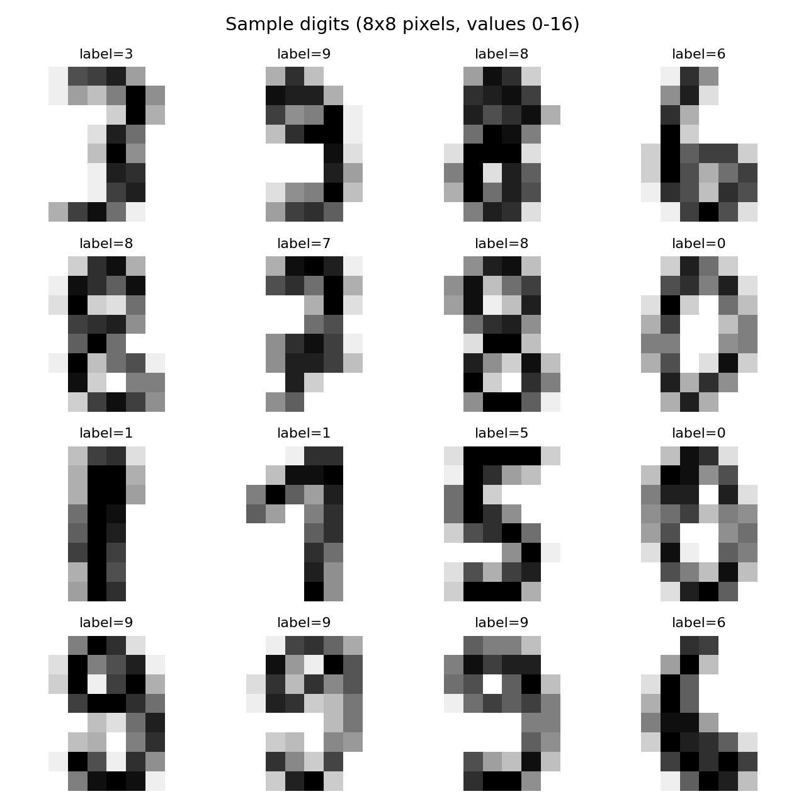
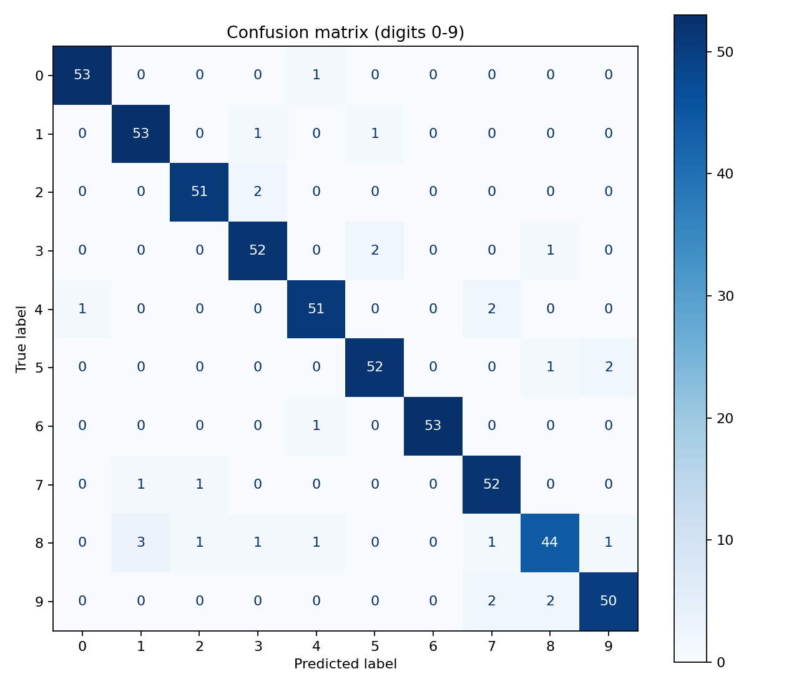
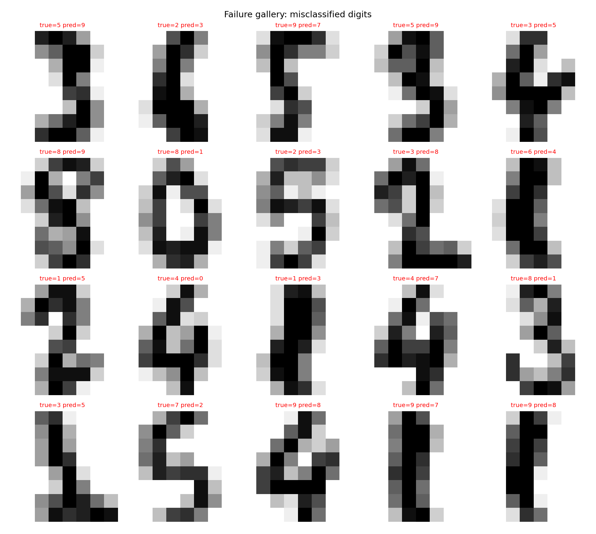

# 9강. 이미지 인식과 CNN: 컴퓨터가 이미지를 보는 방식

## Part A — 강의 (1교시, 90분)

### 강의 목표

이번 강의의 목표는 **컴퓨터가 이미지를 숫자 배열로 다루는 방식**을 이해하고, **합성곱 신경망(CNN)이 이미지에서 특징을 찾는 원리**를 직관적으로 파악하는 것이다. 딥러닝이 이미지 인식에 강한 이유는 CNN이 픽셀의 공간적 구조를 활용하기 때문이다. 이번 시간에는 그 구조를 수식보다 그림과 예시로 먼저 이해한다.

학생은 이번 시간 후 다음을 할 수 있어야 한다.

1. 이미지가 픽셀값의 숫자 배열이라는 것을 설명한다.
2. 채널의 의미를 설명한다 (흑백 1채널, 컬러 3채널).
3. 합성곱 연산이 필터로 이미지에서 특징을 찾는 과정이라고 설명한다.
4. 풀링이 특징 맵의 크기를 줄이는 역할을 한다고 설명한다.
5. CNN의 기본 구조(합성곱-풀링-완전연결)를 말한다.
6. 작은 이미지 분류기를 실행하고 결과를 해석한다.
7. 모델이 틀린 이미지를 실패 갤러리로 만들어 분석한다.

이번 강의의 실습은 8x8 크기의 손글씨 숫자 이미지 분류기다. 이미지 한 장은 64개의 숫자로 이루어진 배열이다. 모델은 이 숫자 배열을 보고 0부터 9까지 어떤 숫자인지 판단한다.

### 핵심 개념

| 용어 | 뜻 |
|---|---|
| 픽셀(pixel) | 이미지를 이루는 가장 작은 점. 하나의 숫자값을 가진다 |
| 채널(channel) | 이미지의 색 정보 층. 흑백은 1채널, 컬러(RGB)는 3채널이다 |
| 합성곱(convolution) | 작은 필터를 이미지 위에 밀어가며 곱하고 더하는 연산 |
| 필터(filter/kernel) | 이미지에서 특정 특징(가장자리, 모서리 등)을 찾는 작은 숫자 격자 |
| 특징 맵(feature map) | 합성곱 연산의 결과. 필터가 찾은 특징의 위치와 강도를 보여준다 |
| 풀링(pooling) | 특징 맵의 크기를 줄여 계산량을 낮추고 핵심만 남기는 연산 |
| CNN(Convolutional Neural Network) | 합성곱 층, 풀링 층, 완전연결 층을 쌓아 이미지에서 특징을 단계적으로 추출하는 신경망 |
| 이미지 분류(image classification) | 이미지를 보고 어떤 범주인지 판단하는 문제 |

### 9.1 이미지는 숫자다

사람에게 이미지는 "그림"이다. 그러나 컴퓨터에게 이미지는 **숫자가 격자 모양으로 배열된 표**다.

흑백 이미지의 경우, 각 칸에 밝기를 나타내는 숫자 하나가 들어간다.

- 0에 가까우면 어두운 점(검은색)
- 값이 크면 밝은 점(흰색)

예를 들어 이번 실습에서 사용하는 데이터는 8x8 픽셀 이미지다. 이미지 한 장은 8행 x 8열 = 64개의 숫자로 이루어져 있다. 실행 로그 기준으로 픽셀값의 범위는 0.0에서 16.0이다.

```text
이미지 크기: 8x8 픽셀, 흑백 1채널
픽셀값 범위: 0.0 ~ 16.0
```

이 수치는 `practice/chapter9/results/9-1-image-classifier.log`에서 확인한 실제 실행 결과다.

이미지를 숫자 배열로 바꾸면 다음이 가능해진다.

- 각 픽셀값을 특성(feature)으로 사용할 수 있다.
- 8x8 이미지를 64개의 숫자로 펼치면 4주차에서 배운 분류기에 바로 넣을 수 있다.
- 더 큰 이미지(예: 28x28, 224x224)도 원리는 같다. 숫자의 개수만 늘어난다.

핵심은 이것이다: **이미지 인식의 출발점은 이미지를 숫자 배열로 보는 것**이다.

### 9.2 채널: 흑백과 컬러

이미지에는 색 정보를 담는 **채널(channel)**이 있다.

- **흑백 이미지**: 채널이 1개다. 각 픽셀에 밝기 값 하나만 있다.
  - 예: 이번 실습의 8x8 이미지는 (8, 8, 1)로 표현할 수 있다.
  - sklearn의 load_digits는 채널 차원을 생략하고 (8, 8)로 저장한다.

- **컬러 이미지**: 채널이 3개다. 빨강(R), 초록(G), 파랑(B) 채널이 겹쳐 있다.
  - 예: 32x32 컬러 이미지는 (32, 32, 3)이다.
  - 같은 위치에 세 개의 숫자가 있다. 세 숫자를 섞으면 색이 된다.
  - R=255, G=0, B=0이면 빨간색이다.
  - R=0, G=0, B=255이면 파란색이다.

| 이미지 종류 | 채널 수 | 픽셀당 숫자 수 | 예시 크기 |
|---|---|---|---|
| 흑백 | 1 | 1 | (8, 8) 또는 (28, 28) |
| 컬러 (RGB) | 3 | 3 | (32, 32, 3) 또는 (224, 224, 3) |

이미지 크기가 커지고 채널이 늘어나면 숫자 배열의 크기도 커진다. 224x224 컬러 이미지 하나에는 224 x 224 x 3 = 150,528개의 숫자가 들어 있다. 이 숫자들을 그냥 펼쳐서 분류기에 넣으면 특성이 15만 개가 넘는다.

여기서 문제가 생긴다. 이미지를 단순히 펼치면 **픽셀의 위치 관계**(어떤 픽셀이 옆에 있는지, 어떤 픽셀이 모서리를 이루는지)를 잃어버린다. 이 문제를 해결하는 것이 합성곱이다.

### 9.3 합성곱: 필터가 특징을 찾는다

**합성곱(convolution)**은 이미지 위에 작은 격자(필터)를 올려놓고, 겹치는 부분끼리 곱한 뒤 더하는 연산이다.

합성곱의 과정을 단계별로 설명하면 다음과 같다.

1. 작은 숫자 격자를 준비한다. 이것이 **필터(filter)**다. 보통 3x3 또는 5x5 크기다.
2. 필터를 이미지의 왼쪽 위 모서리에 올린다.
3. 필터의 숫자와 이미지의 숫자를 같은 위치끼리 곱한다.
4. 곱한 결과를 전부 더해 숫자 하나를 만든다.
5. 필터를 한 칸 옆으로 밀고 같은 과정을 반복한다.
6. 끝까지 밀면 새로운 숫자 배열이 만들어진다. 이것이 **특징 맵(feature map)**이다.

필터의 숫자값에 따라 찾는 특징이 달라진다.

| 필터 이름 | 하는 일 | 예시 |
|---|---|---|
| 가로 가장자리 필터 | 밝기가 위아래로 바뀌는 경계를 찾는다 | 숫자 "7"의 가로획 |
| 세로 가장자리 필터 | 밝기가 좌우로 바뀌는 경계를 찾는다 | 숫자 "1"의 세로획 |
| 모서리 필터 | 밝기가 대각선으로 바뀌는 모서리를 찾는다 | 숫자 "4"의 꺾이는 부분 |

CNN에서 중요한 점은 **필터의 숫자값을 사람이 정하지 않는다**는 것이다. 학습 과정에서 모델이 데이터를 보고 어떤 필터가 좋은지 스스로 찾는다. 이것이 4주차에서 배운 "모델이 데이터에서 규칙을 배운다"는 원리와 같다.

합성곱이 이미지에 강한 이유는 두 가지다.

1. **공간 구조를 유지한다**: 이미지를 펼치지 않고 격자 그대로 사용하므로, 옆에 있는 픽셀끼리의 관계를 본다.
2. **같은 필터를 이미지 전체에 적용한다**: 숫자 "3"이 이미지의 왼쪽에 있든 오른쪽에 있든, 같은 필터가 같은 특징을 찾는다. 이 성질을 가중치 공유(weight sharing)라 한다.

### 9.4 풀링: 크기를 줄이고 핵심만 남기기

합성곱으로 특징 맵을 만들면, **풀링(pooling)**으로 크기를 줄인다.

가장 많이 쓰는 풀링은 **최대 풀링(max pooling)**이다.

1. 특징 맵 위에 작은 영역(보통 2x2)을 잡는다.
2. 그 영역에서 가장 큰 값 하나만 남긴다.
3. 영역을 옮겨가며 반복한다.

예를 들어 4x4 특징 맵에 2x2 최대 풀링을 적용하면 2x2가 된다. 크기가 4분의 1로 줄어든다.

풀링이 하는 일을 정리하면 다음과 같다.

- **크기를 줄인다**: 계산량이 줄어든다. 모델이 빨라진다.
- **핵심만 남긴다**: 작은 위치 이동에 덜 민감해진다. 숫자가 살짝 기울어져 있어도 같은 특징으로 인식할 수 있다.
- **정보를 잃는다**: 정확한 위치 정보는 사라진다. 이것은 단점이기도 하다.

### 9.5 CNN의 전체 구조

CNN은 합성곱 층, 풀링 층, 완전연결 층을 쌓아 만든다.

전형적인 CNN의 흐름은 다음과 같다.

```text
입력 이미지
    ↓
[합성곱 층] → 필터로 특징 맵을 만든다
    ↓
[활성화 함수] → 음수를 0으로 바꾸는 등 비선형성을 넣는다 (주로 ReLU)
    ↓
[풀링 층] → 특징 맵의 크기를 줄인다
    ↓
(위 과정을 여러 번 반복)
    ↓
[펼치기 (Flatten)] → 2차원 특징 맵을 1차원 벡터로 펼친다
    ↓
[완전연결 층] → 5주차에서 배운 일반 신경망 층. 특징을 종합해 판단한다
    ↓
출력 → 클래스별 점수 (예: 숫자 0~9 중 어느 것인지)
```

각 단계의 역할을 표로 정리하면 다음과 같다.

| 단계 | 하는 일 | 비유 |
|---|---|---|
| 합성곱 | 작은 패턴(가장자리, 모서리, 질감)을 찾는다 | 돋보기로 부분을 살핀다 |
| 풀링 | 크기를 줄이고 핵심만 남긴다 | 요약 노트를 만든다 |
| 완전연결 | 찾은 특징을 종합해 최종 판단을 내린다 | 종합 판단을 한다 |

CNN은 앞쪽 층에서 단순한 특징(가장자리, 선)을 찾고, 뒤쪽 층으로 갈수록 복잡한 특징(모양, 물체의 일부)을 조합한다. 학습이 진행되면 필터의 숫자값이 바뀌면서 데이터에 맞는 특징을 찾게 된다.

**이번 실습에서는 왜 MLP를 사용하는가?**

CNN을 직접 학습시키려면 PyTorch나 TensorFlow 같은 딥러닝 프레임워크가 필요하다. 이번 수업의 실습 환경에는 이 프레임워크가 설치되어 있지 않으므로, sklearn의 MLPClassifier(다층 퍼셉트론)를 사용한다.

8x8 크기의 작은 이미지는 64개의 숫자로 펼쳐도 충분히 분류할 수 있다. 실습의 핵심 목표는 CNN을 직접 코딩하는 것이 아니라, **이미지를 숫자 배열로 바꾸고 분류기에 넣는 과정을 경험하는 것**이다.

CNN의 원리는 강의에서 설명하고, 실습에서는 이미지 분류의 전체 흐름을 체험한다.

### 핵심 정리

- 이미지는 컴퓨터에게 픽셀값의 숫자 배열이다.
- 흑백 이미지는 채널 1개, 컬러(RGB) 이미지는 채널 3개다.
- 합성곱은 작은 필터를 이미지 위에 밀어가며 특징을 찾는 연산이다.
- 필터의 숫자값은 학습 과정에서 모델이 데이터를 보고 찾는다.
- 풀링은 특징 맵의 크기를 줄이고 핵심만 남긴다.
- CNN은 합성곱 층, 풀링 층, 완전연결 층을 쌓아 이미지에서 단계적으로 특징을 추출한다.

---

## Part B — 실습 (2교시, 90분)

### 실습 목표

이번 실습의 목표는 작은 이미지 분류기를 직접 실행하고, 모델이 틀린 이미지를 모아 **실패 갤러리**를 만들어 분석하는 것이다.

학생은 이번 실습 후 다음을 할 수 있어야 한다.

1. 8x8 숫자 이미지를 불러와 픽셀값을 확인한다.
2. 이미지를 숫자 배열로 바꿔 분류기에 넣는다.
3. 모델이 틀린 이미지를 모아 실패 갤러리로 만든다.
4. 어떤 숫자를 어떤 숫자로 자주 혼동하는지 분석한다.

### 실습 절차

#### 9.6 이미지 분류기 만들기

이번 실습의 전체 코드는 다음 위치에 있다.

```text
practice/chapter9/code/9-1-image-classifier.py
```

실습 코드는 다음 순서로 실행된다.

1. sklearn의 load_digits 데이터(8x8 흑백 숫자 이미지, 1,797장)를 불러온다.
2. 샘플 이미지 16개를 격자로 그려 저장한다.
3. 데이터를 훈련 데이터 1,257개와 테스트 데이터 540개로 나눈다.
4. 기준선 모델(최빈 클래스)을 만든다.
5. MLP 분류기(은닉층 64, 32)를 학습시킨다.
6. 테스트 정확도와 혼동행렬을 출력한다.
7. 틀린 이미지를 모아 실패 갤러리 PNG로 저장한다.
8. 틀린 사례를 CSV로 저장한다.

실행 명령은 다음과 같다.

```bash
python3 scripts/run_and_capture.py 9
```

실행 후 다음 파일이 생성되었다.

| 파일 | 역할 |
|---|---|
| `practice/chapter9/results/9-1-image-classifier.log` | 실행 로그 |
| `practice/chapter9/results/9-1-image-classifier.evidence.json` | 실행 증거 JSON |
| `practice/chapter9/results/sample_digits.png` | 샘플 숫자 이미지 |
| `practice/chapter9/results/confusion_matrix.png` | 혼동행렬 그림 |
| `practice/chapter9/results/failure_gallery.png` | 실패 갤러리 (틀린 이미지 모음) |
| `practice/chapter9/results/misclassified_examples.csv` | 틀린 사례 표 |

##### 데이터 확인

실행 로그 기준으로 데이터의 기본 정보는 다음과 같다.

```text
데이터셋: sklearn load_digits
이미지 크기: 8x8 픽셀, 흑백 1채널
픽셀값 범위: 0.0 ~ 16.0
전체 이미지 수: 1797
클래스 수: 10 (숫자 0~9)
```

클래스별 이미지 수는 174장(숫자 8)에서 183장(숫자 3) 사이로, 10개 클래스가 거의 고르게 분포되어 있다.

```text
훈련 데이터 수: 1257
테스트 데이터 수: 540
```

이 수치는 `practice/chapter9/results/9-1-image-classifier.log`에서 확인한 실제 실행 결과다.

##### 샘플 이미지

샘플 이미지 그림은 8x8 픽셀 숫자 이미지가 어떻게 생겼는지 보여준다.



8x8 이미지는 해상도가 낮아 사람이 보기에도 헷갈리는 경우가 있다. 모델이 틀리는 이미지 중 일부는 사람도 판단하기 어렵다.

##### 기준선 모델

기준선 모델은 모든 이미지를 훈련 데이터에서 가장 많은 숫자로 예측하는 전략이다. 10개 클래스가 거의 고르게 분포되어 있으므로, 기준선 정확도는 매우 낮다.

```text
기준선 정확도: 0.102
```

이 값은 540개 테스트 이미지 중 약 55개만 맞힌 수준이다. 10개 클래스가 고르면 무작위로 찍어도 약 10%를 맞힌다. 기준선 0.102는 그 수준이다.

##### MLP 분류기 결과

MLP 분류기의 구조와 결과는 다음과 같다.

```text
구조: 입력 64 → 은닉층(64, 32) → 출력 10
학습 epoch 수: 39
테스트 정확도: 0.946
```

기준선 0.102와 비교하면 MLP 분류기의 정확도 0.946은 크게 높다. 모델이 이미지의 픽셀값 패턴을 보고 숫자를 구분하는 법을 배웠다고 볼 수 있다. 그러나 여기서 멈추면 안 된다. 0.946이라는 숫자는 "540개 중 약 511개를 맞혔다"는 뜻이지만, 나머지 29개를 어떻게 틀렸는지는 알려주지 않는다.

##### 혼동행렬

혼동행렬 그림은 10개 숫자에 대해 어떤 숫자를 어떤 숫자로 예측했는지 보여준다.



실행 로그의 혼동행렬은 다음과 같다.

```text
[[53  0  0  0  1  0  0  0  0  0]
 [ 0 53  0  1  0  1  0  0  0  0]
 [ 0  0 51  2  0  0  0  0  0  0]
 [ 0  0  0 52  0  2  0  0  1  0]
 [ 1  0  0  0 51  0  0  2  0  0]
 [ 0  0  0  0  0 52  0  0  1  2]
 [ 0  0  0  0  1  0 53  0  0  0]
 [ 0  1  1  0  0  0  0 52  0  0]
 [ 0  3  1  1  1  0  0  1 44  1]
 [ 0  0  0  0  0  0  0  2  2 50]]
```

이 행렬을 읽는 법은 다음과 같다.

- 행은 실제 정답이고, 열은 모델의 예측이다.
- 대각선 숫자가 맞힌 개수다. 대각선이 클수록 좋다.
- 대각선 바깥 숫자가 틀린 개수다.

혼동행렬에서 눈에 띄는 점은 **숫자 8의 대각선 값이 44로 가장 낮다**는 것이다. 숫자 8은 52개 중 8개를 틀렸다. 다른 숫자는 대부분 0~2개만 틀렸다. 즉, 이 모델은 숫자 8을 구분하는 데 가장 약하다.

#### 9.7 실패 갤러리: 모델이 틀린 이미지 분석

실패 갤러리는 모델이 틀린 이미지를 모아 시각화한 것이다.



실행 로그 기준으로 총 29개 이미지를 틀렸다. 자주 혼동하는 숫자 쌍은 다음과 같다.

```text
실제 8 → 예측 1: 3건
실제 5 → 예측 9: 2건
실제 2 → 예측 3: 2건
실제 9 → 예측 7: 2건
실제 3 → 예측 5: 2건
```

이 결과에서 알 수 있는 것은 다음과 같다.

- 숫자 8을 1로 틀린 경우가 3건으로 가장 많다. 8x8 해상도에서 8과 1의 획이 비슷하게 보일 수 있다.
- 5와 9, 2와 3, 9와 7, 3과 5처럼 모양이 비슷한 숫자 쌍에서 혼동이 발생했다.
- 실패 갤러리를 보면 사람이 보기에도 헷갈리는 이미지가 포함되어 있다.

틀린 사례 일부를 표로 보면 다음과 같다.

| 순번 | 테스트 인덱스 | 실제 정답 | 모델 예측 |
|---:|---:|---:|---:|
| 1 | 22 | 5 | 9 |
| 2 | 28 | 2 | 3 |
| 3 | 48 | 9 | 7 |
| 4 | 75 | 5 | 9 |
| 5 | 97 | 3 | 5 |

이 표는 `practice/chapter9/results/misclassified_examples.csv`에서 가져온 것이다.

틀린 사례를 볼 때는 다음 질문을 한다.

- 이 이미지는 사람이 보기에도 헷갈리는가?
- 특정 숫자가 유독 많이 틀리는가? (이 경우 숫자 8)
- 틀린 방향에 패턴이 있는가? (비슷한 모양의 숫자끼리 혼동)
- 데이터의 해상도(8x8)가 원인일 수 있는가?

### AI 활용 가이드

#### 9.8 AI에게 CNN 구조를 제안받고 줄이기

이번 장에서는 AI에게 CNN 구조를 제안받을 수 있다. 그러나 AI가 제안하는 구조는 대개 수업용으로 사용하기에 너무 무거울 수 있다.

다음 프롬프트를 사용한다.

```text
8x8 흑백 숫자 이미지(0~9)를 분류하는 CNN 구조를 제안해줘.
학부 2학년 수업용이니까 가능한 한 단순한 구조로 만들어줘.
GPU 없이 CPU에서 1분 안에 학습이 끝나야 해.
사용 프레임워크는 PyTorch 또는 Keras.

데이터:
- sklearn load_digits (1797장, 8x8, 흑백)
- 훈련 1257장, 테스트 540장

현재 MLP로 정확도 0.946을 달성했어.
CNN으로 이 정확도를 넘길 수 있는지, 넘기지 못한다면 그 이유도 설명해줘.
```

AI 답변을 받은 뒤에는 다음 표를 채운다.

| 확인 항목 | 내 판단 |
|---|---|
| AI가 제안한 CNN 층 수는 몇 개인가 |  |
| 파라미터 수가 너무 많지 않은가 (8x8 이미지에 수십만 파라미터는 과도하다) |  |
| CPU에서 1분 안에 학습이 끝나는 구조인가 |  |
| AI가 MLP와 CNN의 차이를 8x8 데이터 맥락에서 설명했는가 |  |
| AI가 "CNN이 항상 낫다"고 단정하지 않았는가 |  |
| AI가 8x8처럼 매우 작은 이미지에서는 CNN의 이점이 제한적일 수 있다고 언급했는가 |  |

8x8 이미지는 매우 작다. 이 크기에서는 합성곱으로 공간 구조를 활용할 여지가 적다. 따라서 CNN이 MLP보다 반드시 낫다고 단정할 수 없다. AI가 "CNN이 항상 이미지에 강하다"고만 말하면 답변이 부족하다.

### 결과 해석

이번 실습의 결과를 해석할 때 중요한 점은 다음과 같다.

- 기준선 정확도 0.102는 10개 클래스가 고르게 분포된 상황에서 가장 많은 클래스로 찍는 전략의 결과다.
- MLP 분류기의 테스트 정확도 0.946은 기준선보다 크게 높다. 모델이 픽셀값의 패턴을 보고 숫자를 구분하는 법을 배웠다.
- 그러나 29개 이미지를 틀렸다. 특히 숫자 8을 다른 숫자로 틀리는 경우가 많았다.
- 혼동행렬을 보면 숫자 8의 정답률이 가장 낮다 (52개 중 44개만 맞힘).
- 실패 갤러리를 보면 사람이 보기에도 헷갈리는 이미지가 포함되어 있다.
- 정확도 0.946만 보고 "좋은 모델"이라고 단정하면 숫자 8의 약점을 놓친다.

### 책임 있는 AI 체크

이미지 분류 모델을 사용할 때 가장 흔한 위험은 두 가지다. 첫째, 높은 정확도를 보고 모델이 완벽하다고 착각하는 것이다. 둘째, 학습 데이터에 포함되지 않은 유형의 이미지에서 모델이 어떻게 동작하는지 확인하지 않는 것이다.

이번 장의 책임 있는 AI 체크는 다음과 같다.

| 점검 항목 | 확인 질문 |
|---|---|
| 정확도 과장 | 정확도 0.946 하나만 보고 모델을 좋다고 단정하지 않았는가 |
| 실패 갤러리 확인 | 모델이 틀린 이미지를 최소 3개 이상 직접 확인했는가 |
| 혼동행렬 해석 | 어떤 숫자를 어떤 숫자로 자주 틀리는지 설명했는가 |
| 데이터 한계 인식 | 8x8 해상도의 이미지가 실제 상황과 다르다는 점을 인식했는가 |
| CNN 구조 검토 | AI가 제안한 CNN 구조가 수업용으로 적절한지 따져보았는가 |
| AI 답변 검증 | AI의 설명이 실행 로그와 일치하는지 확인했는가 |

학생은 제출물에 다음 문장을 반드시 포함한다.

```text
이 모델은 기준선보다 성능이 높았지만, 틀린 이미지가 있었다.
특히 숫자 8을 자주 틀렸다.
따라서 정확도만으로 모델을 평가하지 않고 혼동행렬과 실패 갤러리를 함께 확인했다.
```

### 제출물

이번 주 제출물은 다음과 같다.

| 제출물 | 설명 |
|---|---|
| 실행 로그 또는 화면 | 코드가 실제로 실행되었음을 보여준다 |
| 샘플 이미지 그림 | 이미지가 숫자 배열이라는 것을 보여준다 |
| 혼동행렬 그림 | 어떤 숫자를 어떤 숫자로 틀렸는지 보여준다 |
| 실패 갤러리 | 모델이 틀린 이미지 모음 |
| 틀린 이미지 3개 분석 | 왜 틀렸는지 설명한다 (해상도, 모양 유사성 등) |
| AI 답변 검증표 | AI가 제안한 CNN 구조를 검토한다 |

## 핵심 정리

- 이미지는 컴퓨터에게 픽셀값의 숫자 배열이다. 8x8 흑백 이미지 한 장은 64개의 숫자다.
- 흑백 이미지는 채널 1개, 컬러(RGB) 이미지는 채널 3개다.
- 합성곱은 작은 필터를 이미지 위에 밀어가며 특징을 찾는 연산이다. 필터 값은 학습 과정에서 모델이 찾는다.
- 풀링은 특징 맵의 크기를 줄이고 핵심만 남긴다.
- CNN은 합성곱 층, 풀링 층, 완전연결 층을 쌓아 이미지에서 단계적으로 특징을 추출한다.
- 이번 실습에서 MLP 분류기는 테스트 정확도 0.946을 달성했지만, 29개 이미지를 틀렸고 특히 숫자 8을 자주 혼동했다.
- 모델이 틀린 이미지를 숨기지 않고 실패 갤러리로 분석하는 것이 책임 있는 AI 활용이다.
